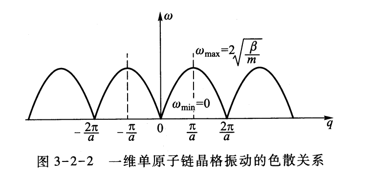
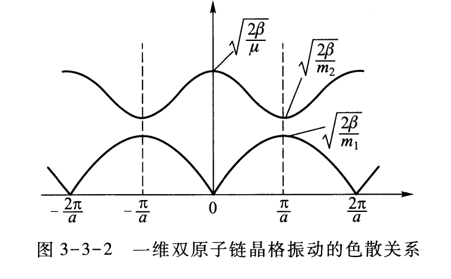
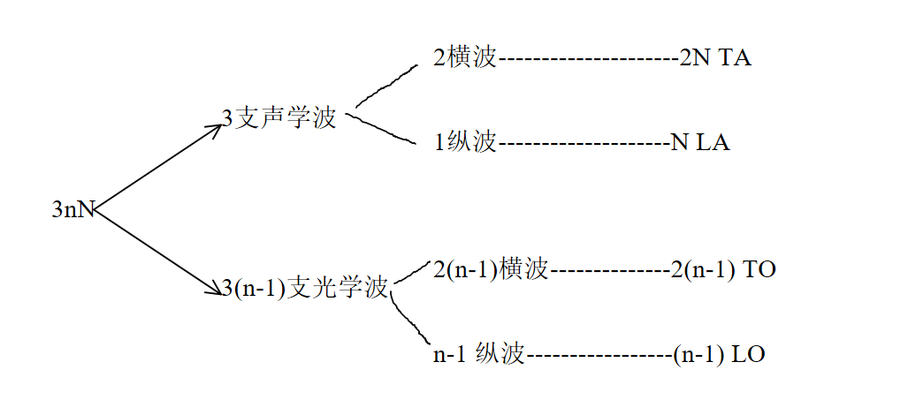
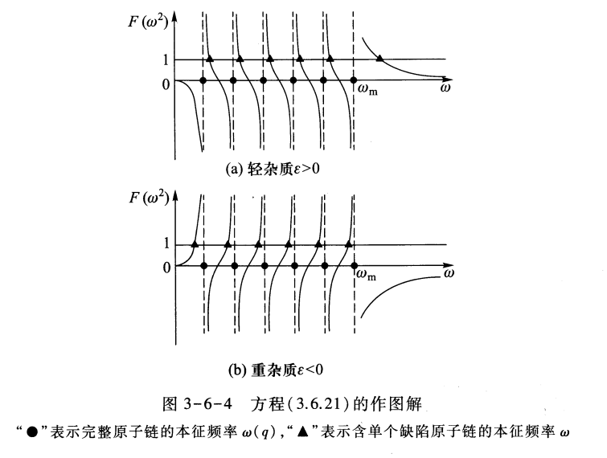

# 第三章：晶格动力学和晶体的热学性质

晶格动力学：在一定温度下晶体中的原子振动，从晶体原子振动出发去讨论晶体的宏观物性，就是晶格动力学。

## 3.1 简正模和格波

### 1 简正模

这里要解决的是大量粒子组成的，具有复杂相互作用的微振动问题。我们运用简谐近似，引入简正坐标，把耦合到一起的振动方程分成独立的好解的振动方程。

每一个简正坐标描写的振动，是一个集体的振动，代表了系统的一个振动模，于是系统的一般振动为振动模的线性组合 -- 本征值问题

- 假设：

（1）N个原子作微振动，有3N个自由度 

（2）**简谐近似**，势能保留二次项

（3）**量子理论**，简正坐标代入薛定谔方程

- 推导：

系统H，并保留到2次项：

$$
\begin{aligned}\text{H}&=T + V( q_{1} ,q_{2} ,\cdots,q_{3N} )\\&=\frac{1}{2}\sum_{i=1}^{3N}\dot{q}_{i}^{2} + V( 0 ) + \sum_{i}\left(\frac{\partial V}{\partial q_{i}}\right)_{0}q_{i} + \frac{1}{2}\sum_{i} \sum_{j}\left(\frac{\partial^{2}V}{\partial q_{i}\partial q_{j}}\right)_{0}q_{i}q_{j} + \text{高次项}\\&=\frac{1}{2}\sum_{i}\dot{q}_{i}^{2} + \frac{1}{2}\sum_{ij}\lambda_{ij}q_{i}q_{j}\end{aligned}
$$

用理论力学正则方程：

$$
p_i=\frac{\partial L}{\partial\dot{q}_i}=\dot{q}_i
$$

$$
\ddot{q}_{i} + \sum_{i} \lambda_{ij}q_{j} = 0 ,\quad i = 1 ,2 ,\cdots,3N
$$

- 结果：

**1.用矩阵表示**

$$
H=\frac12\dot{q}^\mathrm{T}\dot{q}+\frac12q^\mathrm{T}\lambda q
$$

**2.引用正交变换，采用简正坐标**

$$
A^{-1}\lambda A=\text{对角方阵 }\omega^{2}
$$

$$
\begin{aligned}q&=AQ\\\dot{q}&=A\dot{Q}\end{aligned}
$$

变换H：

$$
\begin{aligned}\text{H}&=\frac{1}{2}\dot{\vec{Q}}^{\mathrm{T}}\vec{A}^{-1}\vec{A}\dot{\vec{Q}} +\frac{1}{2}\vec{Q}^{\mathrm{T}}\vec{A}^{-1}\vec{\lambda}\vec{A}\vec{Q}=\frac{1}{2}\dot{\vec{Q}}^{\mathrm{T}}\dot{\vec{Q}} +\frac{1}{2}\vec{Q}^{\mathrm{T}}\vec{\omega}^{2}\vec{Q}\\&=\frac12\sum_j ( \dot{Q}_j^2 + \omega_j^2Q_j^2 )=\frac12\sum_j ( P_j^2 + \omega_j^2Q_j^2 )\end{aligned}
$$

$$
\ddot{Q}_j+\omega_j^2Q_j=0 ,\quad j=1 ,2 ,\cdots,3N
$$

过渡到量子：

$$
P_j=- \mathrm{i}\hbar \frac{\partial}{\partial Q_j},\quad Q_j=Q_j
$$

$$
H \Phi = E \Phi
$$

$$
\frac12\sum_j\left(-\hbar^2\frac{\partial^2}{\partial Q_j^2}+\omega_j^2Q_j^2\right)\psi(Q_1,Q_2,\cdots,Q_{3N})=E\psi(Q_1,Q_2,\cdots,Q_{3N})
$$

分离变量:

$$
\frac{1}{2}\Big(-\hbar^2 \frac{\partial^2}{\partial Q_j^2} + \omega_j^2Q_j^2\Big) \varphi(Q_j)=\varepsilon_j\varphi(Q_j)
$$

本征解为

$$
\varepsilon_{j} = \left( n_{j} + \frac{1}{2}\right) \hbar\omega_{j}
$$

$$
\varphi_{n_{j}}( Q_{j} )=\frac{1}{\sqrt{\sqrt{\pi} 2^{n_{j}}n_{j} !}} \sqrt[4]{\frac{\omega_{j}}{\hbar}}\exp\biggl( - \frac{\xi^{2}}{2}\biggr) \mathrm{H}_{n_{j}}( \xi )
$$

系统能量和波函数
$$
E = \sum_{j} \varepsilon_{j} = \sum_{j} \left( n_{j} + \frac{1}{2}\right) \hbar\omega_{j}
$$

$$
\varphi (Q_{1},Q_{2},\cdots,Q_{3N}) = \prod_{j=1}^{3N}\varphi_{n_{j}}( Q_{j})
$$

- 讨论:

（1）简谐近似，将3N个耦合的方程变成3N个独立的方程

（2）$\omega$描述集体振动。它描述体系的集体振动称为体系的一个**简正模**

2 格波

简正模写为 $Q_j=u_i( t ) = u( r_i ) \mathrm{e}^{-\mathrm{i}w_jt}$ ,这个 $u( r_i )$

- 假设：

（1）简单晶格，一个格点上一个原子。$r_{i}=R_{l}=l_{1}a_{1}+l_{2}a_{2}+l_{3}a_{3}$

（2）限制系统本征振动振幅，$A_{j\sigma}\mathrm{e}^{-\mathrm{i}\omega_{j}t},\quad u(0)=A_{j\sigma}$

- 推导：

利用晶体的平移对称性：

$u(\vec{a}_1)=\dot{\lambda}(\vec{a}_1)u(0)$ ,得到 $u(l_1\vec{a}_1)=\lambda^{l_1}(\vec{a}_1)\dot{u}(0)$ 

$u(a_2)=\lambda(a_2)u(0)$ ,得到 $u(l_2\vec{a}_2)=\lambda^{l_2}(\vec{a}_2)u(0)$ 

$u(\vec{a}_3)=\lambda(\vec{a}_3)u(0)$ ,得到 $u(l_3\vec{a}_3)=\lambda^{l_3}(\vec{a}_3)u(0)$

任意一点原子振幅

$$
u(R_l)=\lambda^{l_1}(a_1)\lambda^{l_2}(a_2)\lambda^{l_3}(a_3)u(0)
$$

$$
\mid\lambda(a_1)\mid=\mid\lambda(a_2)\mid=\mid\lambda(a_3)\mid\equiv1
$$

写出相位因子

$$
\lambda\left(a_i\right)=\mathrm{e}^{\mathrm{i}q\cdot a_i}
$$

- 结果：

$$
u\left(R_{l}\right)=A_{j\sigma}\mathrm{e}^{\mathrm{i}q\cdot(l_{1}a_{1}+l_{2}a_{2}+l_{3}a_{3})}=A_{j\sigma}\mathrm{e}^{\mathrm{i}q\cdot R_{l}}
$$

$$
Q_j=u_i( t ) = u( r_i ) \mathrm{e}^{-\mathrm{i}w_jt}=A_{j\sigma}\mathrm{e}^{\mathrm{i}(\vec{q}\cdot\vec{R}_{l}-\omega_{j}t)}=A_{\vec{q}\sigma}\mathrm{e}^{\mathrm{i}[\vec{q}\cdot\vec{R}_{l}-\vec{\omega}(\vec{q})t]},\quad j\to\vec{q}
$$

- 讨论：$q$就是物理意义上的波矢。这样3N个独立的简正模，等价于3N个独立的波，叫做格波。

## 3.2 一维单原子链振动

这是对3.1的普遍理论的一个具体例子。

1 假设与结果：运动方程和解

- 假设：

（1）一维简单晶格，每个初基元胞只包含一个原子

（2）简谐近似，可写出相互作用力,第l个原子受力：$F_{l} = \sum_{p}\beta_{p}( u_{l+p} - u_{l} )$

（3）只考虑最邻近原子之间的相互作用

（4）原子链无限长，平移对称性 $\beta_{+1}=\beta_{-1}=\beta$

- 结果：

结合以上3个假设，第l个原子运动方程：

$$
m\frac{\mathrm{d}^2u_l}{\mathrm{d}t^2}=\beta(u_{l+1}+u_{l-1}-2u_l),\quad l=0,\pm1,\pm2,\cdots,\pm\infty 
$$

令格波解

$$
u_l=A\mathrm{e}^{\mathrm{i}(qla-\omega t)}
$$

解得

$$
\omega(q)=2\sqrt{\frac\beta m}\left|\sin(\frac12qa)\right|
$$

2 讨论：格波特性

- 色散关系

色散：波在介质中能量传播的速度（群速度）依赖于波矢、频率。色散关系就是频率$\omega$-波矢$p$函数关系，宏观是能量-动量函数关系。

群速度：

$$
v(q)=\frac{\mathrm{d}\vec{\omega}(q)}{\mathrm{d}q}=\sqrt{\frac\beta m}a\cos\!\left(\frac12qa\right)
$$

周期性：

$$
\omega(q)=\omega{\left(q+\frac{2\pi}ah\right)}=\omega(q+K_h)
$$

色散关系：

看图说话 - 在什么波矢取得频率多少最大值，q趋于0时近似连续。

- 简正模的确定

$$
a_{lq}=\frac1{\sqrt{N}}\mathrm{e}^{\mathrm{i}qla}
$$

- $q\text{ 与 }q+K_h\text{ 代表同一振动模}$

意义：求值时将波矢取值限制在一个布里渊区之内

$$
-\frac\pi a{<}q{\leqslant}\frac\pi a
$$

3 B-F 边界条件

出现原因：之前平移对称性假设-原子链无限长-现实有限。

- 假设： 首尾相连

- 结果： 

$$
A\mathrm{e}^{\mathrm{i}( qla-\omega t)}=A\mathrm{e}^{\mathrm{i}[ q( l+N) a-\omega t ]}
$$

$$
\mathrm{e}^{\mathrm{i}qNa}=1,\quad qNa=2\pi h
$$

独立波矢数= N(元胞数)

波矢密度 =$\frac{N}{\Omega^*}=\frac{Na}{2\pi}$

独立模式数=N（自由度数）

色散关系数 = 1 （元胞自由度）

- 讨论：

（1）波矢取分立值，量子化

$$
q=\frac{2\pi h}{Na},-\frac\pi a<q\leqslant\frac\pi a,-\frac N2<h\leqslant\frac N2
$$

（2）所有独立模式构成正交、完备集

4 简正坐标

- 简正坐标：

$$
Q_{q}(t)=\sqrt{Nm}A_{q}\mathrm{e}^{-\mathrm{i}\omega(q)t}
$$

变换矩阵:

$$
a_{lq}=\frac1{\sqrt{N}}\mathrm{e}^{\mathrm{i}qla}
$$

- 哈密顿量：(只考虑近邻相互作用)

$$
H=T+V=\frac12\sum_l\left[m\dot{u}_l^2+\beta(u_{l+1}-u_l)^2\right]
$$

$$
H=\frac12\sum_{q\in1BZ}[\begin{array}{c}\dot{Q}_q\dot{Q}_q^*+\omega^2(q)Q_qQ_q^*\end{array}]
$$

是对角化的

- 讨论

>因为这些简正模都是相互独立的，它的本征值就是 $\hbar$ $\omega$，一份份的量子，不同的本征值他是线性无关的，于是经过正交变换之后，这些"准粒子"就可以叫做“声子”。这些声子是完全没有相互作用的，原来这个系统的粒子之间，在坐标空间中原子与原子的的相互作用复杂的不得了，现在变成准粒子系统在低激发态下这些准粒子没有相互作用，是独立粒子，用统计物理可以非常非常简单地解决。这种正交化的思想，就是晶格动力学的核心。

## 3.3 一维双原子链振动

1 假设与结果：运动方程和解

- 假设：

（1）一维复式晶格，每个初基元胞含2个原子，N个元胞2N个自由度

（2）简谐近似

（3）只考虑最邻近原子之间的相互作用

（4）原子链无限长，平移对称性。

- 解：

运动方程：

$$
m_1\frac{\mathrm{d}^2u_l}{\mathrm{d}t^2}=\beta(v_l+v_{l-1}-2u_l)\\m_2\frac{\mathrm{d}^2v_l}{\mathrm{d}t^2}=\beta(u_{l+1}+u_l-2v_l)
$$

格波解：

$$
\begin{aligned}&u_{l}=A\mathrm{e}^{\mathrm{i}(qla-\omega t)}\\&v_{l}=B\mathrm{e}^{\mathrm{i}(qla-\omega t)}\end{aligned}
$$

结果：

$$
\omega_{\pm}^{2}(q)=\beta\frac{m_{2}+m_{1}}{m_{2}m_{1}}\biggl[1\pm\biggl[1-\frac{4m_{2}m_{1}}{\left(m_{2}+m_{1}\right)^{2}}\mathrm{sin}^{2}\biggl(\frac{1}{2}qa\biggr)\biggr]^{1/2}\biggr]
$$

$$
\alpha_{\pm}=\left(\frac BA\right)_{\pm}=-\frac{m_{1}\omega_{\pm}^{2}(q)-2\beta}{\beta(1+\mathrm{e}^{-\mathrm{i}qa})}
$$

2 讨论：两支色散曲线

- 色散关系

周期函数：

$$
\omega_\pm(q)=\omega_\pm\left(q+\frac{2\pi h}a\right)=\omega_\pm(q+K_h)
$$

图像：

形成两个带

- 声学波

两个极值，在哪取得；

q -> 0 时的色散关系和振幅之比：

$\omega = cq$

$B/A = 1$

- 光学波

两个极值，在哪取得；

q -> 0 时：

小m振动更厉害、质心不振动、离子晶体可以与红外电磁场耦合

- 极限情况

q -> 0时： 见上

q -> $\pi/a$ 时：

声学波 重原子振动

光学波 轻原子振动

- 滤波器

3 B-F 边界条件

- 假设：原子链有限，包含N个元胞

- 结果 边界条件：

$$
u_{l}=u_{l+N},\quad v_{l}=v_{l+N
$$

$$
\mathrm{e}^{\mathrm{i}qNa}=1,\quad q=\frac{2\pi h}{Na}
$$

独立波矢数 = N = 元胞数

波矢密度

独立模式数 = 2N = 自由度数 （因为一个波矢对应两个色散关系）

色散关系数 = 2 （单元胞自由度数）

## 3.4 三维晶格振动

### 1 三维晶格振动一般理论 色散关系
- 假设：

（1）N个元胞，每个元胞n个原子。

位置矢 $u_{lj\sigma}$ 为第l个元胞，第j个原子在 $\sigma$ 方向的偏振。

自由度: $3nN$

（2）简谐近似

（3）只考虑最邻近原子之间的相互作用

（4）原子链无限长，平移对称性。

- 推导：

运动方程：

$$
m_j\ddot{u}_{lj\sigma}=-\sum_{l^{\prime}j^{\prime}\sigma^{\prime}}\lambda_{j\sigma j^{\prime}\sigma^{\prime}}(R_l-R_{l^{\prime}})\cdot u_{l^{\prime}j^{\prime}\sigma^{\prime}}
$$

格波解：

$$
u_{lj\sigma}=A_{j\sigma\vec{q}}\mathrm{e}^{\mathrm{i}(\vec{q}\cdot\vec{R}_l-\vec{\omega}t)}
$$

得到方程组：

$$
m_{j}\vec{\omega}^{2}A_{{j\vec{\sigma}\vec{q}}}=\sum_{{j^{\prime}\vec{\sigma}^{\prime}}}\left[\sum_{{l-l^{\prime}}}\vec{\lambda}_{{j\vec{\sigma}j^{\prime}\vec{\sigma}^{\prime}}}(\vec{R}_{\iota}-\vec{R}_{{\iota^{\prime}}})\operatorname{e}^{{-\mathrm{i}\vec{q}\cdot\vec{R}_{{l-l^{\prime}}}}}\right]A_{{j^{\prime}\vec{\sigma}^{\prime}\vec{q}}}=\sum_{{j^{\prime}\vec{\sigma}^{\prime}}}\vec{\lambda}_{{j\vec{\sigma}j^{\prime}\vec{\sigma}^{\prime}}}(\vec{q})A_{{j^{\prime}\vec{\sigma}^{\prime}\vec{q}}}
$$

系数行列式=0，得到3n个色散关系：

$$
\mid\lambda_{j\sigma j^{\prime}\sigma^{\prime}}(\vec{q})-\vec{\omega}^2m_j\delta_{jj^{\prime}}\delta_{\sigma\sigma^{\prime}}\mid_{3n\times3n}=0
$$

- 讨论：

（1）声学波代表质心的运动（单原子链是声学波）。有3支 声学波。2支横波，1支纵波；

（2）光学波代表原子相对运动。有3n-3支 光学波。2(n-1)支横波，n-1支纵波

（3）倒空间周期性： $\omega_s(q)=\omega_s(q+K_h)$ ，q限制在第一布里渊区里

### B-K 边界条件

- 假设：晶体有限长，设晶体是一个规则平行六面体 $N=N_1N_2N_3$

- 推导：

B-K 边界条件：

$$
u_{_{l,j\sigma}}=u_{_{l+N_{i},j\sigma}}
$$

- 结果：

$$
\vec{q}=\frac{h_1}{N_1}\vec{b}_1+\frac{h_2}{N_2}\vec{b}_2+\frac{h_3}{N_3}\vec{b}_3=\sum_i\frac{h_i}{N_i}\vec{b}_i
$$

- 讨论：

独立波矢数 = N（元胞数）

波矢密度 $=\frac N{\Omega^*}=\frac V{\left(2\pi\right)^3}$

独立模式数 = 3nN (总自由度数)

色散关系数 = 3n （元胞自由度数）

### 声子

> 分布性质

对振子 $\hbar \omega$ ,具有 $n_{qs}$的概率：

$$
P_{n_{\vec{q}s}}=\mathrm{e}^{-\beta n_{\vec{q}s}\hbar\omega_s(\vec{q})}/\sum_{n_{\vec{q}s}}\mathrm{e}^{-\beta n_{\vec{q}s}\hbar\omega_s(\vec{q})}
$$

振子 $\hbar \omega$ 的平均声子占有数：

$$
n_{\vec{q}s}(T)=\frac1{\mathrm{e}^{\beta\hbar\omega_s(q)}-1}
$$

> 热学性质

平均激发能量：

$$
\varepsilon_{qs}(T)=\langle\varepsilon_{qs}\rangle=\left[n_{qs}(T)+\frac12\right]\hbar\omega_s(\vec{q}),\quad s=1,2,3,\cdots,3n
$$

总的声子数：（对所有模式数求和）

$$
n(T)=\sum_{q,s}n_{qs}(T)
$$

总能量：（对所有模式数求和）

$$
U^V(T)=\sum_{q,s}\left[n_{qs}(T)+\frac12\right]\hbar\omega_s(q)
$$

- 讨论：

（1）玻色分布的**准粒子**，化学势为0。这是一个粒子数不守恒的**玻色子**。

> 化学势：这个系统增加/减少一个粒子所改变的能量。化学势为0，代表这个系统可以随意增减粒子数，粒子数不守恒

（2）这样的准粒子近似只可以在低激发态可以。低激发态都可以看成准粒子系统。

（3）集体激发出来的准粒子，与其原来的状态没有关系。原来是费米子，集体激发出来的自旋波量子可能是玻色子。唯一判断准则是它满足什么分布。

### 声子的准动量

声子能量很清晰，但是动量是多少？

区分：光子波矢k和声子波矢q

动量守恒与能量守恒：

$$
\begin{aligned}k^{\prime}-k&=\pm q^2+K_h\\E(k^{\prime})-E(k)&=\pm\hbar\omega_s(q)\end{aligned}
$$

无论是弹性/非弹性散射，都会激发q=0的声子，这个用于体现动量守恒，没有能量；q不为0的声子不携带物理动量，但有能量。

### 总结

## 3.5 离子晶体中的长光学波

光学波代表粒子间相对振动。离子晶体的离子相对振动产生极化，极化波生成电磁场。光子色散关系： $E=\hbar\omega=\hbar ck$

声子光学支在0附近的色散关系：一条水平直线。可以与光子相交而耦合

### 1 振动产生的内场

- 假设：离子晶体，正负离子相对振动

- 推导

极化波产生宏观内场：

$$
\frac{\omega^2}{c^2}\vec{P}-\vec{q}(\vec{q}\cdot\vec{P})\\\vec{E}=\frac{c^2}{\vec{\varepsilon}_0(q^2-\vec{\omega}^2/c^2)}
$$

- 讨论

（1）纵振动 $P\parallel q$：

$$
E_{_\mathrm{L}}=-\frac{P}{\varepsilon_{_0}}
$$

无旋内电场

（2）横振动 $P\perp q$

$$
E_{\mathrm{T}}=\frac{\omega^{2}}{\varepsilon_{0}(c^{2}q^{2}-\omega^{2})}P
$$

有旋场，与外电磁场发生耦合

> 外电磁场对色散关系影响的定性分析：

>- $\omega = cq$ 共振，耦合最强 

>- $\omega > cq$ ,增加恢复力

>- $q=0$，与纵振动场一样

>- $\omega < cq$，减少恢复力

>- $\omega << cq$ ，趋于本征频率，没有外电场

### 2 长光学波 黄昆方程

- 假设：

（1）一个元胞只含有一对正负离子

（2）弹性势能密度：简谐近似

（3）极化势能密度：线性近似

- 推导：

引入新矢量描述位移：

$$
W=\left(\frac{\mu}{\Omega}\right)^{1/2}(u_+-u_-)=\rho^{1/2}(u_+-u_-)
$$

动能密度：

$$
T=\frac12\dot{\vec{W}}^2
$$

势能密度：

$$
\begin{aligned}
V&=V_\text{弹性}+V_\text{极化}\\
&=-\int_0^W\vec{F}\cdot\mathrm{d}\vec{W}-\int_0^E\vec{P}\cdot\mathrm{d}\vec{E}\\
& F=b_{11}\vec{W}, P=P_{_\text{位移}}+P_{_\text{电子}}=b_{_{12}}\vec{W}+b_{_{22}}\vec{E}\\
&=-\left(\frac{1}{2}b_{11}\vec{W}^{2}+b_{12}\vec{W}\cdot\vec{E}+\frac{1}{2}b_{22}\vec{E}^{2}\right)
\end{aligned}
$$

带入正则方程 $p=\frac{\partial L}{\partial\dot{\vec{W}}}$,$\dot{p}=-\frac{\partial H}{\partial W}$：

$$
\ddot{\vec{W}}=b_{_{11}}\vec{W}+b_{_{12}}\vec{E}
$$

- 结果：黄昆方程

$$
\ddot{\vec{W}}=b_{_{11}}\vec{W}+b_{_{12}}\vec{E}
$$

$$
\vec{P}=b_{_{21}}\vec{W}+b_{_{22}}\vec{E}
$$

- 讨论

（1）物理意义：振动与位移有关系，与电场有关系；极化与位移有关系，与电场有关系。$b_{21}=b_{12}$

### 3 由极端情况确定动力学系数

- E 为静电场

- 

### 不考虑横场耦合时，离子晶体的 $\omega_TO$ $ \omega_LO$

$\omega_TO$ $ \omega_LO$的物理意义：

直接看下面的推导

### 4 极化激元

- 假设

- 推导

- 结果1

- 结果2

- 讨论

## 3.6 非完整晶格的振动 局域模

对于之前所有讨论，都是基于对称性的完美晶格。对于不是无限大的有缺陷的晶体如何处理？

### 1 一维单原子链的拓展模式

拓展态

局域模

### 2 含单个缺陷的一维原子链

- 假设：

- 推导：

$$
T=\frac{1}{2}m\sum_{l}\dot{u}_{l}^{2}+\frac{1}{2}(m'-m)\dot{u}_{0}^{2}
$$

$$
V=\frac{1}{2}\beta\sum_{l}(u_{l+1}-u_{l})^{2}
$$

变换波解：

$$
u_l=\frac{1}{\sqrt{N}}\sum_qQ_q\mathrm{e}^{\mathrm{i}qla}
$$

正则方程：

$$
m\ddot{Q}_q+\frac{m^{\prime}-m}N\sum_{q^{\prime}}\ddot{Q}_{q^{\prime}}=-m\omega^2(q)Q_q
$$

- 结果

超越方程

$$
F(\omega^2)=\frac{\varepsilon\omega^2}{N}\sum_q\frac{1}{\omega^2-\omega^2(q)}\equiv1
$$

作图法求解：

- 讨论-包含缺陷的影响

轻杂志：对于每一个振动模，都相对原来完整晶体的频率向高频方向移动了，大部分保留拓展态，一个模式成为以杂质原子为中心的局域模。

重杂志：向低频移动，无局域模。但复式晶格的光频支会产生。

### 3 由运动方程求局域模

- 假设

（）轻杂质

- 推导

- 结果

（1）$\omega<\omega_m$：

$$
\omega^2(q)=\omega_m^2\sin^2\!\left(\frac{1}{2}qa\right)
$$

色散关系没有改变

$$
u_{_l}=C\cos(\begin{array}{c|c}qa&l&-\delta\end{array})
$$

还是一个格波

$$
\tan\delta=\varepsilon\tan\!\left(\frac{1}{2}qa\right)
$$

（2）$\omega>\omega_m$：

$$
\omega^2=\frac{\omega_\mathrm{m}^2}{1-\varepsilon^2}
$$

$$
u_{l}=A\left(-1\right)^{|l|}\left(\frac{1-\varepsilon}{1+\varepsilon}\right)^{|l|}\mathrm{e}^{-\mathrm{i}\omega t}
$$

### 总结

1. 为什么局域化重要？ -- 一个扩展态转变为局域态，可以表现为金属向绝缘体的转变。在这个过程中，局域性越强，表现为导电率越差。拓展到声子，表现为热导率越差。扩展态向局域态的转变，是解释凝聚态物理物态的重要理论观点。

2. 如何造成局域化：

Anderson局域化 - 无序（破坏对称性）造成局域化

Mott局域化 - 强关联（也是破坏对称性）造成局域化

### 4 晶格比热

