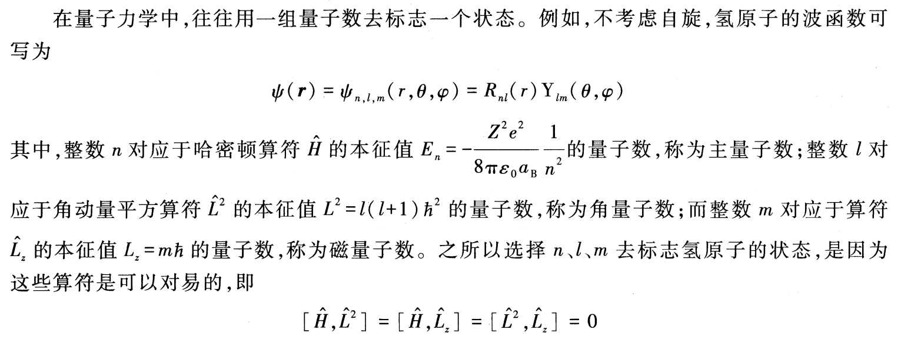
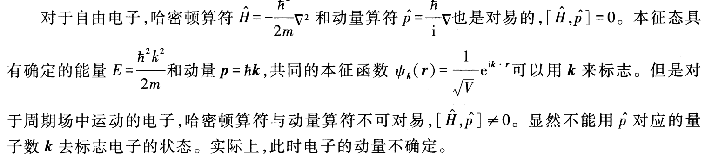
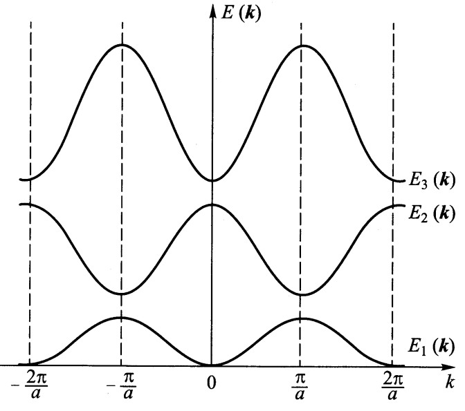
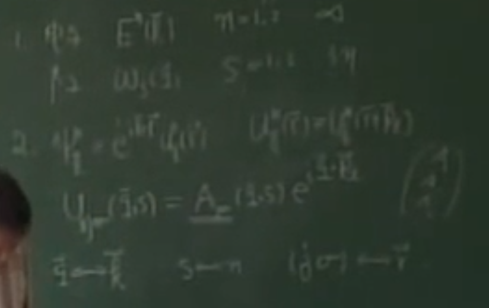
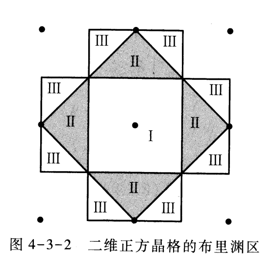
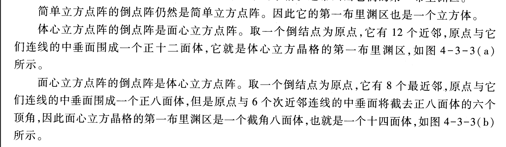
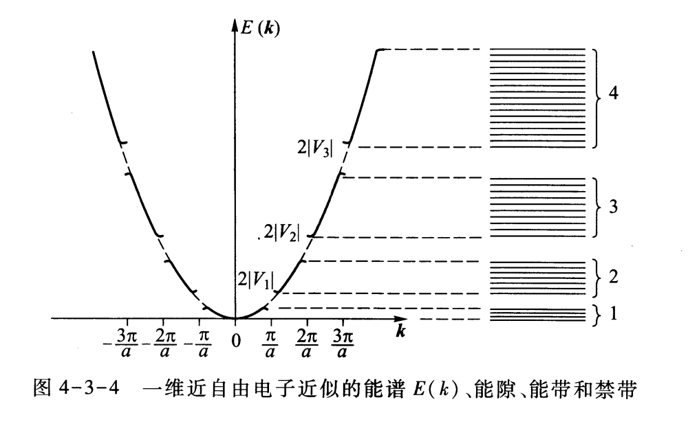
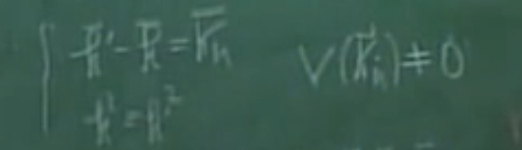
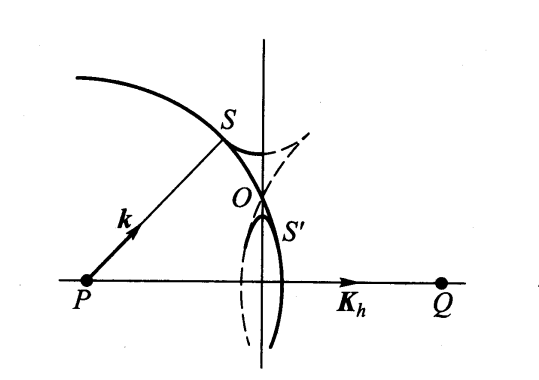
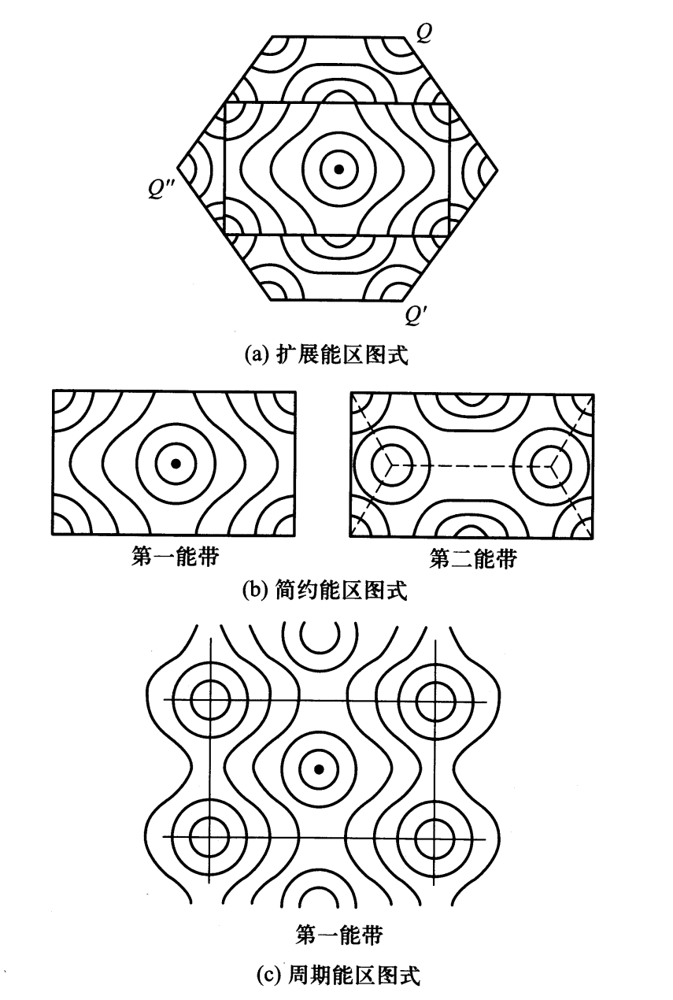

# 第四章：能带论（1）

**能带论解决问题**：金属的电导问题。经典-自由电子论在解释电导率等规律遇到问题。

**能带论基本假设**：

1. 绝热近似。把自由度砍掉一半，认为离子固定在晶格上不动。实质是忽略了电子-声子相互作用

2. 单电子近似。用平均场描述电子-电子相互作用。多电子问题 -> 单电子问题。

3. 严格周期势。离子实产生的势和电子平均场产生的势是一个严格的周期势。

**能带论简化问题**：将问题简化为一个在周期势场中的单电子问题。-》 周期势场中波的传播问题。相比晶格动力学：格波（张量方程） -> 德布罗意波（标量方程）

**基本方程**：

$$
\begin{aligned}&\left[-\frac{\hbar^{2}}{2m}\nabla^{2}+V(\vec{r})\right]\psi(\vec{r})=E\psi(\vec{r})\\\\&V(\vec{r}+\vec{R}_{l})=V(\vec{r}),\quad\vec{R}_{l}=\sum_{i}l_{i}\vec{a}_{i}\end{aligned}
$$

**问题简化后问题的解决**：学完后解答

## 4.1 布洛赫定理和布洛赫波

一般情况，从晶格的平移对称性讨论，周期结构中的波的一些性质。

### 1 平移算符 周期场中单电子的状态标志

- 量子力学标定状态：

因为这三个算符具有共同本征函数，所以可以标定同一状态。

- 自由电子：

- 周期场电子

平移算符：

$$
\hat{T}(\vec{a}_1)\mathrm{~、}\hat{T}(\vec{a}_2)\mathrm{~、}\hat{T}(\vec{a}_3)\mathrm{~,}\text{其中 }\vec{a}_1\mathrm{~、}\vec{a}_2\mathrm{~、}\vec{a}_3\text{ 为正点阵的三个基矢}
$$

$$
\hat{T}(\vec{a}_i)\vec{\varphi}(\vec{r})=\varphi(\vec{r}+\vec{a}_i)\\\hat{T}^{N_i}(\vec{a}_i)\vec{\varphi}(\vec{r})=\varphi(\vec{r}+N_i\vec{a}_i)
$$

#### 平移算符相互对易

$$
[\hat{T}(\vec{a}_i),\hat{T}(\vec{a}_j)]=0
$$

#### 平移算符与H对易

$$
[\hat{H},\hat{T}(a_i)]=0
$$

故有共同本征函数。写出本征方程，得到本征值的表示：

$$
\hat{H}\varphi(r)=E_n\varphi(r)
$$

$$
\hat{T}(\vec{a}_i)\vec{\varphi}(\vec{r})=\lambda(\vec{a}_i)\vec{\varphi}(\vec{r})
$$

#### 平移算符本征值形式

(1) 模为1

$$
\begin{aligned}&\left|\hat{T}(\vec{a}_{i})\vec{\varphi}(\vec{r})\right|^{2}=\left|\vec{\lambda}(\vec{a}_{i})\vec{\varphi}(\vec{r})\right|^{2}=\left|\vec{\varphi}(\vec{r})\right|^{2}\\\text{只能有}\\\\&\left|\vec{\lambda}(\vec{a}_{i})\right|=1\end{aligned}
$$

（2）满足乘法内积

$$
\begin{aligned}
&\text{另一方面,由于} \\
&&\hat{T}(\vec{a}_i)\hat{T}(\vec{a}_j)\vec{\varphi}(\vec{r})& =\lambda\left(a_i\right)\lambda\left(a_j\right)\varphi\left(r\right)=\varphi\left(r+a_i+a_j\right)  \\
&&\hat{T}(\vec{a}_i+\vec{a}_j)\vec{\varphi}(\vec{r})& =\lambda(a_i+a_j)\varphi(r)=\varphi(r+a_i+a_j)  \\
&\text{可得到} \\
&&&\lambda\left(a_i+a_j\right) =\lambda\left(a_i\right)\lambda\left(a_j\right)  \\
\end{aligned}
$$

得到平移算符本征值

$$
\lambda\left(\vec{a}_i\right)=\mathrm{e}^{\mathrm{i}\vec{k}\cdot\vec{a}_i}\Rightarrow\begin{cases}\mathrm{e}^{\mathrm{i}\vec{k}\cdot\vec{a}_1}=\lambda\left(\vec{a}_1\right)\\\\\mathrm{e}^{\mathrm{i}\vec{k}\cdot\vec{a}_2}=\lambda\left(\vec{a}_2\right)\\\\\mathrm{e}^{\mathrm{i}\vec{k}\cdot\vec{a}_3}=\lambda\left(\vec{a}_3\right)&\end{cases}
$$

k1 k2 k3 为平移算符本征值对应的量子数

#### 波恩-冯卡门边界条件

$$
\varphi(\vec{r}+N_i\vec{a}_i)=\hat{T}^{N_i}(\vec{a}_i)\vec{\varphi}(\vec{r})=\lambda^{N_i}(\vec{a}_i)\varphi(\vec{r})=\varphi(\vec{r})
$$

得到量子数:

$$
k_1=\frac{h_1}{N_1}b_1+\frac{h_2}{N_2}b_2+\frac{h_3}{N_3}b_3
$$

### 2 布洛赫定理

布洛赫定理：当平移晶格矢量$R_l$时，同一能量本征值的波函数只增加相位因子 $\mathrm{e}^{\mathrm{i}\vec{k}\cdot\vec{R}_l}$

$$
\begin{aligned}
\psi_{k}^{n}(r+R_{l})& =\hat{T}(R_{\iota})\psi_{k}^{n}(r)  \\
&=\hat{T}^{l_1}(\vec{a}_1)\hat{T}^{l_2}(\vec{a}_2)\hat{T}^{l_3}(\vec{a}_3)\vec{\psi}_k^n(\vec{r}) \\
&=\mathrm{e}^{\mathrm{i}\vec{k}\cdot(l_1\vec{a}_1+l_2\vec{a}_2+l_3\vec{a}_3)}\vec{\psi}_k^n(\vec{r})=\mathrm{e}^{\mathrm{i}\vec{k}\cdot\vec{R}_l}\vec{\psi}_k^n(\vec{r})
\end{aligned}
$$

### 3 布洛赫波

周期场中单电子波函数是一个调幅平面波，也就是布洛赫波：

$$
\psi_k^n(r)=\mathrm{e}^{\mathrm{i}k\cdot r}u_k^n(r)
$$

$$
u_k^n(r+R_l)=u_k^n(r)
$$

### 4 布洛赫波的能谱一般特性

#### 一个k对应无穷多个n和$\psi_k^n(\vec{r})$

对于一个确定的 $\vec{k}$,有无穷多个分立的能量本征值 $E_n(\vec{k})$和相应的本征函数 $\psi_k^n(\vec{r}),n=\\1,2,\cdotp\cdotp\cdotp,\infty\mathrm{~。}$

也就是有无穷多个“色散关系”。

#### 一个n对应频谱和波函数是倒空间的周期函数

可以限制在一个倒点阵元胞内描述能谱和波函数：

$$
\psi_k^n(r)=\psi_{k+K_h}^n(r) 
$$

$$
E_n(\vec{k})=E_n(\vec{k}+\vec{K}_h)
$$

#### 能谱成带结构

什么是能谱：

#### 能谱的对称性

若不考虑自旋-轨道相互作用，在布里渊区中，晶体能谱具有与晶体点阵相同的宏观对称性。

#### 等能面垂直于布里渊区界面。

### 5 声子谱与电子谱的区别

- 能带数量无限

- 波的形式

 

## 4.2 平面波法计算能带

这是计算能带的方法之一。后面还有：紧束缚近似、近自由电子近似。

优点：平面波法是最严格的一种解法。

缺点：收敛性差。

- 平面波展开：

$$
\psi_k(r)=\frac1{\sqrt{N\Omega}}\sum_ha(k+K_h)\mathrm{e}^{\mathrm{i}(k+K_h)\cdot r} = \sum_ha(k+K_h)\mid k+K_h\rangle 
$$

- 波动方程：

$$
\sum_{h}a(\vec{k}+\vec{K}_{h})(T+V-\vec{E})|\vec{k}+\vec{K}_{h}\rangle=0
$$

=>

$$
\sum_{h^{\prime}}\left\{\left[\frac{\hbar^2}{2m}(\vec{k}+\vec{K}_h)^2-E(\vec{k})\right]\delta_{\vec{K}_h,\vec{K}_{h^{\prime}}}+\langle\vec{k}+\vec{K}_h|V|\vec{k}+\vec{K}_{h^{\prime}}\rangle\right\}a(\vec{k}+\vec{K}_{h^{\prime}})=0
$$

- 能量本征方程

$$
\det\left|\left[\frac{\hbar^{2}}{2m}(k+K_{h})^{2}-E(k)\right]\delta_{{\vec{K}_{h},\vec{K}_{{h^{\prime}}}}}+V(\vec{K}_{h}-\vec{K}_{{h^{\prime}}})\right|=0
$$

其中，

$$
V(\vec{K}_h-\vec{K}_{h^{\prime}})=\frac1{N\vec{\Omega}}\int V(\vec{r})\mathrm{e}^{-\mathrm{i}(\vec{K}_h-\vec{K}_{h^{\prime}})\cdot\vec{r}}\mathrm{d}\vec{r}
$$

需要会写这个行列式的每一项。

## 4.3 近自由电子近似（NFE）

### 1 零阶近似

#### 无限晶格

$$
\begin{cases}\psi_k^0(r)=\frac1{\sqrt{N\Omega}}\mathrm{e}^{\mathrm{i}\vec{k}\cdot\vec{r}}\\\\E^0(\vec{k})=\frac{\hbar^2}{2m}\vec{k}^2\end{cases}
$$

#### 有限晶格

对于有限晶格，假定晶体是规则的平行六面体，沿三个基矢$a_1,a_2,a_3$方向的三条棱的边长分别为$N_1\vec{a}_1、N_2\vec{a}_2、N_3\vec{a}_3,N=N_1N_2N_3$为元胞数。应用玻恩-冯卡门边界条件$,\psi_k^0(\vec{r})=\psi_k^0(\vec{r}+$ $N_i\vec{a}_i$),容易得到

$$N_i\vec{k}\cdot\vec{a}_i=2\pi h_i,\quad i=1,2,3$$

其中$h_i$取整数。因此，可取波矢

$$\vec{k}=\frac{h_1}{N_1}\vec{b}_1+\frac{h_2}{N_2}\vec{b}_2+\frac{h_3}{N_3}\vec{b}_3=\sum_i\frac{h_i}{N_i}\vec{b}_i$$

其中$\vec{b}_i$ 为倒格子基矢。于是$k$ 只能取分立值，每一个$k$ 状态在动量空间所占的体积为

$$\frac{\vec{b}_1}{N_1}\cdot\left(\frac{\vec{b}_2}{N_2}\times\frac{\vec{b}_3}{N_3}\right)=\frac{\vec{\Omega}^*}{N_1N_2N_3}=\frac{(2\pi)^3}{N\vec{\Omega}}$$

由于$N\Omega$是一个大数 ,$k$在动量空间准连续 ,均匀分布 ,其波矢密度为$\frac{N\Omega}{\left(2\pi\right)^3}$

### 2 非简并微扰

#### 一阶微扰波函数

一阶微扰能量：

$$
E^0(k)=\frac{\hbar^2}{2m}k^2
$$

一阶微扰波函数：

$$
a(k+K_h)=\frac{V(K_h)}{\frac{\hbar^2}{2m}[k^2-(k+K_h)^2]}
$$

$$
\begin{aligned}
\psi_{k}(r)& =\frac1{\sqrt{N\Omega}}\mathrm{e}^{\mathrm{i}\vec{k}\cdot\vec{r}}+\frac1{\sqrt{N\Omega}}\sum_{h\neq0}\frac{V(\vec{K}_h)}{\frac\hbar{2m}[\vec{k}^2-(\vec{k}+\vec{K}_h)^2]}\mathrm{e}^{\mathrm{i}(\vec{k}+\vec{K}_h)\cdot\vec{r}}  \\
&=\mathrm{e}^{\mathrm{i}\vec{k}\cdot\vec{r}}u_{\vec{k}}(\vec{r}) \\
u_{k}(r)& =\frac{1}{\sqrt{N\vec{\Omega}}}{\left\{1+\sum_{h\neq0}\frac{V(\vec{K}_{h})}{\frac{\hbar^{2}}{2m}[\vec{k}^{2}-(\vec{k}+\vec{K}_{h})^{2}]}\mathrm{e}^{{\mathrm{i}\vec{K}_{h}\cdot\vec{r}}}\right\}} 
\end{aligned}
$$

其中，

$$
V(\vec{K}_{h})=\langle\vec{k}+\vec{K}_{h}|V|\vec{k}\rangle=\frac{1}{N\vec{\Omega}}\int V(\vec{r})\mathrm{e}^{{-\mathrm{i}\vec{K}_{h}\cdot\vec{r}}}\mathrm{d}\vec{r}
$$

#### 二阶能量本征值

$$
E(k)=\frac{\hbar^2}{2m}k^2+\sum_{h\neq0}\frac{|V(K_h)|^2}{\frac{\hbar^2}{2m}[k^2-(k+K_h)^2]}
$$

### 3 简并微扰

- 条件

$$
k^2-(2k+K_h)^2=0
$$

- 能量本征值（简并）

$$
E_{\pm}(k)=\frac{\hbar^2}{2m}k^2\pm|V(K_h)|
$$

### 4 布里渊区

$$
k^2-(2k+K_h)^2=0
$$

所谓布里渊区就是，在$k$空间，所有倒格矢$K_h$的垂直平分面将$k$空间分割成若干区域。其中包含原点的最小闭合空间称为第一布里渊区，完全包围第一布里渊区的若干小区域的全体称为第二布里渊区......依此类推。每个布里渊区的体积恰好等于倒格子元胞的体积，而第一布里渊区就是倒点阵的 W-S 元胞。

#### 一维晶格的布里渊区

例如，对于晶格常量为$a$ 的一维晶格，

第一布里渊区的边界位于 $k=\pm\frac\pi a$处，它包含了$k$ 空间 $-\frac\pi a<k\leqslant\frac\pi a$ 整个区域。

第二布里渊区包含 $-\frac{2\pi}a<k\leq-\frac{\pi}a,\frac{\pi}a<k\leqslant\frac{2\pi}a$ 两个区域。

第三布里渊区包含 $-\frac{3\pi}a<k\leq-\frac{2\pi}a,\frac{2\pi}a<k\leqslant\frac{3\pi}a$ 两个区域。

每个布里渊区的宽度都是$\frac{2\pi}a$,等于倒点阵元胞的宽度。

#### 二维晶格的布里渊区

#### 三维

### 5 能带，能隙，禁带

#### 能隙

如图，能隙宽度为: 

$$
2\mid V(K_h)\mid 
$$

能隙的成因：布拉格反射

产生能隙的充要条件：

对复式晶格，能隙等于几何结构因子

$$
\begin{aligned}V(\vec{K}_{h})&=\frac1{N\vec{\Omega}}\sum_l\sum_i\mathrm{e}^{-\mathrm{i}\vec{K}_h\cdot\vec{R}_l}\mathrm{e}^{-\mathrm{i}\vec{K}_h\cdot\vec{r}_i}\int U(\vec{\xi})\mathrm{e}^{-\mathrm{i}\vec{K}_h\cdot\vec{\xi}}\mathrm{d}\vec{\xi}\\&=\sum_i\mathrm{e}^{-\mathrm{i}\vec{K}_h\cdot\vec{r}_i}\frac1\Omega\int U(\vec{\xi})\mathrm{e}^{-\mathrm{i}\vec{K}_h\cdot\vec{\xi}}\mathrm{d}\vec{\xi}=F(\vec{K}_h)\end{aligned}
$$

#### 能带

每个能带所能容纳的状态数为

$$2\times\frac{N\Omega}{\left(2\pi\right)^3}\times\Omega^*=2N$$

其中$\Omega$、$\Omega^*$分别是正、倒点阵初基元胞的体积，$N$ 为元胞数，因子 2 是考虑到电子自旋简并的结果。

注意：从波矢轴来看（横着）

#### 禁带

从能量轴来看（竖着），不存在一些能量对应的量子态

#### 能带交叠

值得注意的是，对于一维情况，由于方向的单一性，能隙和禁带一一对应。但是对于二维和三维情况，可能出现不同$k$ 方向能带的重叠，能隙和禁带可能不一一对应。

### 6 NFE的问题与布洛赫修正

#### NFE的问题

NFE用$k$，对应动量算符的量子数，来标志电子的状态。

不满足布洛赫定理，虽然波函数为调谐平面波，但波函数和能谱不是倒空间周期函数。

#### 布洛赫修正

应用简约波矢 $\bar{k}$ 来标志电子的状态。$\bar{k}$ 限制在第一布里渊区内。

### 能带的能区图示

#### 扩展

就是原来的能谱

#### 简约

把能带全部移到第一布里渊区里去

#### 周期

简约能区+每一支都周期

#### 二维能区图示

- 自由电子近似，等能面是一个球

- 当等能面和布里渊区边界相交时，要发生突变。（能隙的成因）

二维正方晶格的能区图示：

> 为什么近自由电子近似对于描述金属是一个好的方法？ 赝势说明

