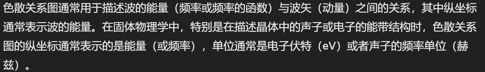

## 基态 激发态

基态： 只考虑系统中粒子的相互作用，不考虑外场，解出的材料状态

e.g. 电子气的基态，铁磁/反铁磁材料的基态（电子平行排列），超导体的基态

激发态： 加上一定外场，有n激发态。用准粒子近似解决。

## 准粒子

## 凝聚态物质

凝聚态物质：液体、固体、软物质

固体：晶体、非晶体、准晶体

晶体：组成粒子周期性排列，**对称性破缺**

非晶体：具有高度对称性，物理性质各向同性

准晶体：拥有晶体不允许的部分旋转对称性（5次旋转对称）

## 色散关系：

1 横坐标是 - 波矢 也就是 动量 $p = \hbar k$ 

纵坐标是 - 频率 也就是 能量 $E = \hbar \omega$

2 声子

声子的波矢q

声子的频率 $\omega$