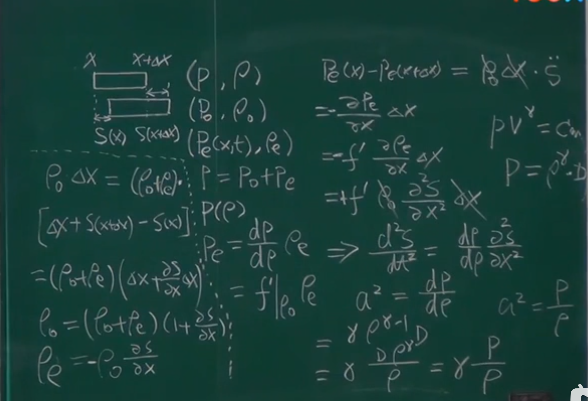
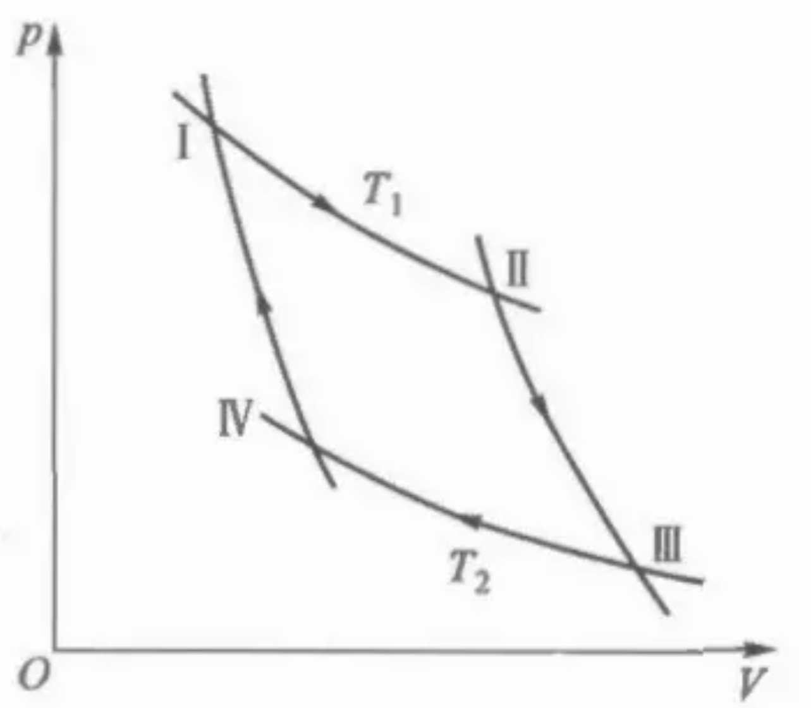
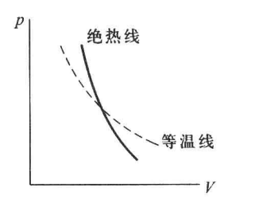
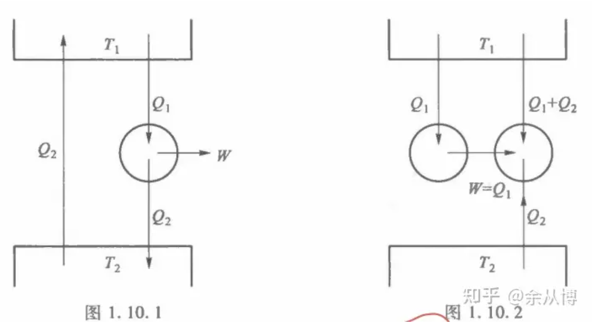
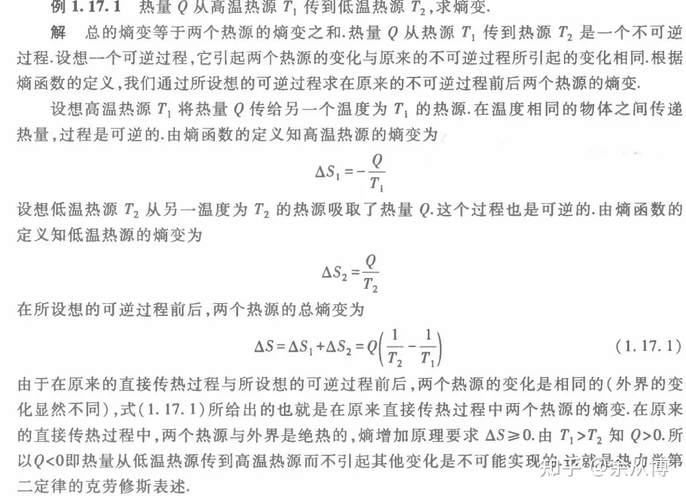

# 第一章 热力学的基本规律

两个问题：

如何用一个方程描述一个系统的状态 - 状态方程

这个方程的参量 - 状态参量·热力学参量·功 内能 热量·热容 焓·熵

## 1.1 热力学系统的平衡状态及其描述

### 0 三种系统

孤立系统(isolated)： 无物质、能量交换

封闭系统(closed)： 无物质交换

开放系统(open)： 物质、能量任意交换

### 1 热力学平衡态

孤立系统的各种宏观性质在长时间内不发生任何变化，这样的状态称为热力学平衡态。（对于处在各种条件下的非孤立系，热力学用相应的热力学函数作为判据判定系统是否处在平衡状态，并导出两系统的热动平衡条件。）（p2）

### 2 状态参量(State Parameter) 热力学参量

状态参量：几何参量（$V$）、力学参量（$p$）、电磁参量($E,P,H,M$)、化学参量($n_i$)四类参量(p3)

热力学参量：$T$

### 3 状态函数

描述热力学系统平衡状态的函数，自变量为状态参量

### 4 单相系和复相系

如果一个系统各部分的性质是完全一样的，该系统称为均匀系，一个均匀的部分被称为一个相，因此均匀系也被称为单相系；如果整个系统不是均匀的，但可以被分为若干个均匀的部分，则该系统被称为复相系。（p4）

### 5 准静态过程

准静态过程是进行得非常缓慢的过程，系统在过程中经历的每一个状态都可以看作平衡态。(p11)

## 1.2 热平衡定律和温度

### 1 热平衡定律/热力学第零定律

经验表明，如果物体A和物体B各自与处在同一状态的物体C达到热平衡，若令A与B进行热接触，它们也将处在热平衡。这个经验事实称为热平衡定律，也叫热力学第零定律。(p5)

### 2 温度

处于平衡态下的系统的态函数----温度。(p5)

### 3 理想气体温标

规定纯水的三相点温度为273.16,以压强线性关系规定温度。取极限后得：

$$
T=273.16K\times\lim_{p_t\to0}\frac p{p_t}
$$

其中$p_t$表示纯水三相点下温度计中气体的压强。(p6)

### 4 热力学温标

$$
\frac t{\mathbb{C}}=\frac TK-273.15
$$

## 1.3 物态方程

### 1 定义

忽略化学参量和电磁参量，考虑状态参量和热力学参量之间关系的方程

### 2 一般形式

$$
f(p,V,T)=0
$$

### 3 两种常见形式

方法一：宏观-宏观：宏观实验，控制变量总结

方法二：微观-宏观：统计方法

>> 由统计方法得到物态方程（下半学期回来推导）

- 理想气体状态方程

$$
pV=nRT=NkT
$$

- 范德瓦尔斯方程:简单修正

$$
(p+\frac{an^2}{V^2})(V-nb)=nRT
$$

- Onnes 方法：展开

$$
p=\left(\frac{nRT}{V}\right)[1+\frac{n}{V}B(T)+\left(\frac{n}{V}\right)^2C(T)+...].
$$

- 各项同性固体/液体：

$$
\begin{aligned}V(T,p)=V_0(T_0,0)[1+\alpha(T-T_0)-\kappa_Tp].\end{aligned}
$$

- 磁介质：

$$
f(M,H,T)=0\text{ (general)}
$$

顺磁体： $M=\frac CTH$

### 4 重要参数

- 体胀系数：压强不变，体积与温度
- 压强系数：体积不变，压强与温度
- 等温压缩系数：温度不变，体积与压强

\begin{aligned}
&\text{Coefficient of cubical expansion: }\alpha=\frac1V\left(\frac{\partial V}{\partial T}\right)_p; \\
&\text{Pressure coefficient: }\beta=\frac1p\left(\frac{\partial p}{\partial T}\right)_V; \\
&\text{Isothermal compressibility: }\kappa_T=-\frac1V\left(\frac{\partial V}{\partial p}\right)_T.
\end{aligned}

> 偏导关系：$\left(\frac{\partial V}{\partial p}\right)_T\left(\frac{\partial p}{\partial T}\right)_V\left(\frac{\partial T}{\partial V}\right)_p=-1$

- 三系数关系

$$
\alpha=\kappa_T\beta p
$$

压强系数很难测量，故 $\beta$ 一般由其他三项计算而来

>> 推导：$\alpha=\kappa_T\beta p$

>> 例题：导出理想气体物态方程的体胀系数、压强系数和等温压缩系数。

### 5 广延量和强度量

- 广延量：越多，越大。线性增长

- 强度量：值不随系统中物质的数量或大小的增加而改变

$$
\begin{aligned}&\text{Extensive quantity: }m,n,V,\Sigma M.\\&\text{Intensive quantity: }p,T,H,\frac{\text{extensive quantity}}{n(\text{or}m,V)}\text{ like }\rho=\frac mV.\end{aligned}
$$

## 1.4 热力学第一定律

### 1 功 Work

- 液体表面薄膜

$$
\mathsf{d}W=\sigma\mathrm{d}A.
$$

- 电介质

- 磁介质

$$
\mathsf{d}W=V\mathrm{d}(\frac{\mu_0H^2}2)+\mu_0VH\mathrm{d}M.
$$

- 广义力

$$
\mathsf{d}W=\sum Y_i\mathrm{d}y_i,
$$

### 2 热力学第一定律

- 数学表达式：

$$
U_B-U_A=W+Q
$$

- 微分形式

$$
dU=dQ+dW
$$

- 另一种表述

第一类永动机是不可能造成的。(p17)

## 1.5 热容 焓

### 1 热容

- 定义：升高单位温度吸收的热量。

- 数学表达式：

$$
C=\lim_{\Delta T\to0}\frac{\Delta Q}{\Delta T}
$$

- 具体表现

$$
\begin{aligned}&\text{定容热容:}\quad C_V=(\frac{\partial U}{\partial T})_V=T(\frac{\partial S}{\partial T})_V\\&\textbf{定压热容:}\quad C_P=(\frac{\partial H}{\partial T})_V=T(\frac{\partial S}{\partial T})_P\\&\text{多方热容:}\quad C_n=T(\frac{\partial S}{\partial T})_n\end{aligned}
$$

### 2 焓

引进一新的状态函数 H=U+pV 称其为焓 (p17)

微分形式：dH=TdS+Vdp （？）

## 1.6 理想气体

### 1 理想气体的内能

- 焦耳定律：理想气体内能只是温度的函数

数学表达：

$$
\left(\frac{\partial U}{\partial V}\right)_T=0
$$

$$
C_{V}\equiv\left(\frac{\partial U}{\partial T}\right)_{V}=\frac{dU}{dT}.
$$

- 焓H也是温度的函数（理想气体）

$$
H=U+pV=U(T)+nRT\rightarrow H(T).
$$

- $C_{p}$ 和 $C_{V}$ 关系
$$
C_{p}=\frac{\mathrm{d}H}{\mathrm{d}T}=\frac{\mathrm{d}U}{\mathrm{d}T}+nR.
$$

$$
\boxed{C_{p}-C_{V}=nR}
$$

> 推导：焦耳定律

- 绝热指数

定义： $\gamma=\frac{C_p}{C_V}$

关系：

$$
C_{V}=\frac{nR}{\gamma-1}
$$

$$
C_{p}=\gamma\frac{nR}{\gamma-1}=\gamma C_{V}.
$$

- 理想气体的内能

对理想气体，$U$ ,$H$ ,$C_{p}$ 和 $C_{V} 都是温度的函数。

$$
U = C_V T + U_0
$$

$$
H = C_p T + H_0
$$

### 2 理想气体绝热过程

- 绝热过程

$$
\mathsf{d}Q=0,\mathsf{d}W=-p\mathrm{d}V
$$

- 绝热方程

$$
pV^\gamma=C
$$

$$
\begin{aligned}&TV^{\gamma-1}=C^{\prime}\\&\frac{P^{\gamma-1}}{T^\gamma}=C^{\prime\prime}\end{aligned}
$$

> 推导：绝热方程

- 绝热指数的确定

$$
a^2=\gamma pV=\gamma\frac p\rho 
$$

其中a为声速， $\rho$为气体密度。（p21）

推导：

### 3 卡诺循环 卡诺定理

- 卡诺循环4个过程：

等温膨胀过程、绝热膨胀过程，等温压缩过程，绝热压缩过程。

- 吸收热量Q

$$
Q = -RT\ln\frac{V_{B}}{V_{A}}.
$$

- 卡诺定理

**所有工作于两个确定温度之间的热机中，可逆热机的效率最高。**（p27）

> 证明：卡诺定理

- 最高热机效率

$$
\eta=\frac{W}{Q_{1}}=1-\frac{T_{2}}{T_{1}}
$$

- 推论

所有工作于两个确定温度之间的可逆热机，其效率相等

### 4 气体图像 绝热线 等值（PVT）线

以P-V图为例：

绝热线： $pV^\gamma=C$

等压线

等体积线

等温线：$PV = nRT$

## 1.7 热力学第二定律

### 1 两种常见的表述

$$
\begin{aligned}&\textbf{克劳修斯表述:不可能把热量从低温物体传递到高温物体而不引起其他变化。}\\\\&\textbf{开尔文表述:不可能从单一热源吸热使之完全变成有用的功而不引起其他变化。}\\\\&\text{其中开尔文表述还可表述成:第二类永动机是不可能造成的。(p25)}\end{aligned}
$$

### 2 热力学第二定律两种表述等价性的证明

### 3 数学表达

$$
dS\geq\frac{dQ}T\text{,这里的T是系统外界的温度。可逆过程取等号。}
$$

## 1.9 熵 热力学基本方程

### 1 熵的定义

- 定义：

对于可逆过程

$$
S_{B}-S_{A}\equiv\int_{A}^{B}\frac{\mathrm{d}Q_{R}}{T}\mathrm{~or~d}S\equiv\frac{\mathrm{d}Q}{T}.
$$

### 2 熵的计算

结合热力学第一定律：

$$
dS=\frac{dU+pdV}T
$$

热力学基本方程：

$$
dU=TdS-pdV
$$

### 理想气体的熵

理想气体：

$$
PV = nRT
$$

- 在定体热容可视为常量时：

$$
S=nC_{V,m}lnT+nRlnV+S_0
$$

- 在定压热容可视为常量时：

$$
S=nC_{p,m}lnT-nRlnp+S_0
$$

> 理想气体，等温过程，$V_A$ 到 $V_B$，求熵的变化

## 1.10 熵增加原理

### 概念

系统经可逆绝热过程后熵不变，经不可逆绝热过程后熵增加，在绝热条件下，熵减少的过程是不可能实现的。这个结论称为熵增加原理。（p35）

### 应用

## 1.11 自由能 吉布斯函数

（1）自由能：F=U-TS （也被称为亥姆霍兹函数或亥姆霍兹自由能）（p38）

（2）自由焓：G=H-TS (也被称为吉布斯函数或吉布斯自由能） (p39)

在第三章和第四章中，我们将利用自由能、自由焓研究复相系、多元系的相变和化学变化问题。（p39）