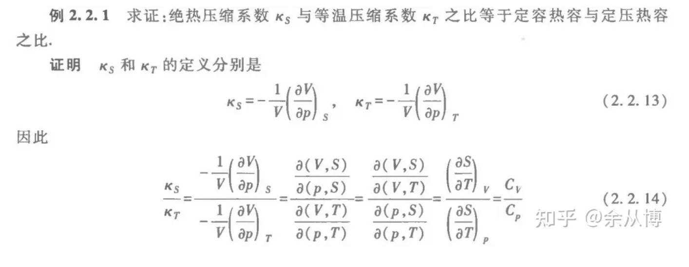
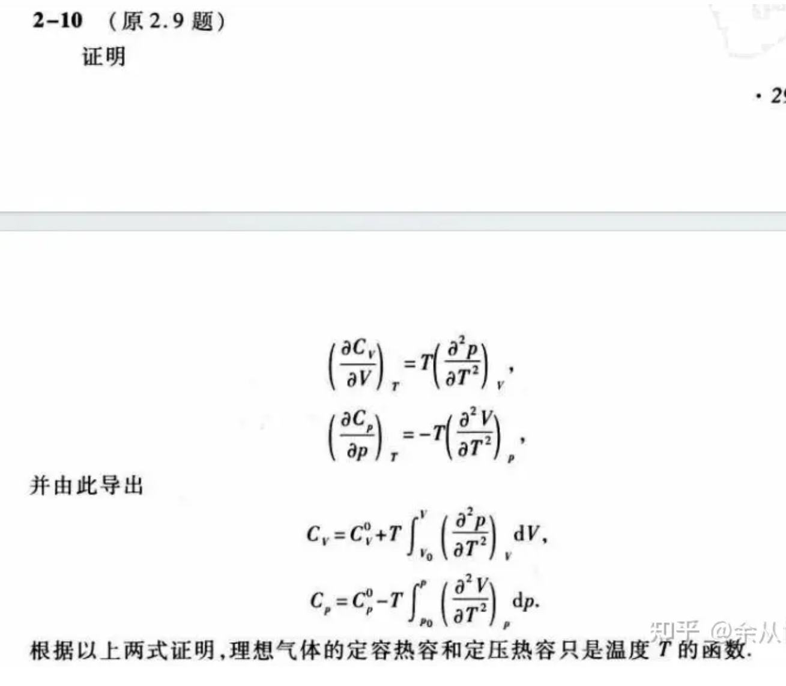
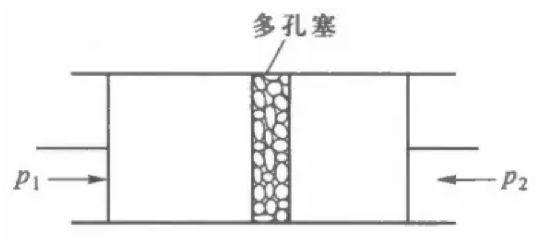
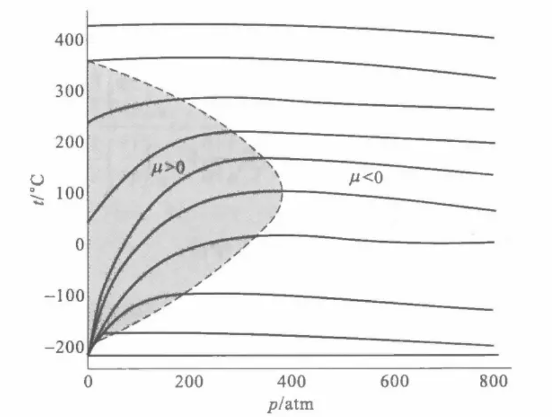
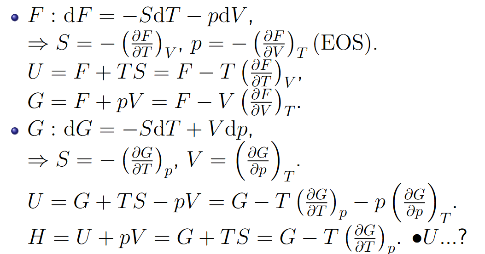

# 第二章 均匀物质的热力学性质

## 2.1 内能、焓、自由能和吉布斯函数的全微分

系统量 $(U,H,F,G)$

状态参量 $(p,V,T,S)$

由其中两个状态参量作为自由变量，另外两个作为恒定量，可以得到系统量的全微分

### 1 四个基本微分形式 U H F G(能量量纲)

定义式：

$$
\begin{gathered}
dU=TdS-pdV \\
H\equiv U+pV \\
F\equiv U-TS \\
G\equiv U-TS+pV
\end{gathered}
$$

全微分式：

$$
\begin{gathered}
dU=TdS-pdV \\
dF=-SdT-pdV \\
dH=TdS+Vdp \\
dG=-SdT+Vdp 
\end{gathered}
$$

### 2 记忆方法

四式中第一式为热力学第一定律，应早就熟练记忆。剩余三个按照F H G依次排列，等号后面有两项，相较于第一式，第一次换第一项，第二次换第二项，第三次两项都换。换项时，无论是第一项换变元还是第二项换变元，都仅是将项内的两个物理量交换顺序加负号。

## 2.2 麦克斯韦关系及其简单应用

### 1 麦克斯韦关系的四个式子

$$
\begin{gathered}
\text{由}dU=TdS-pdV\to\left(\frac{\partial T}{\partial V}\right)_{S}=-\left(\frac{\partial p}{\partial S}\right)_{V}; \\
\text{由}dH=TdS+Vdp\to\left(\frac{\partial T}{\partial p}\right)_{S}=\left(\frac{\partial V}{\partial S}\right)_{p}; \\
\text{由}dA=-SdT-pdV\to\left({\frac{\partial S}{\partial V}}\right)_{T}=\left({\frac{\partial p}{\partial T}}\right)_{V}; \\
\text{由} dG=-SdT+Vdp\rightarrow\left({\frac{\partial S}{\partial p}}\right)_{T}=-\left({\frac{\partial V}{\partial T}}\right)_{p}; 
\end{gathered}
$$

### 2 记忆方法

记忆时：竖着比，第一列的偏微商等于第二列的偏微商；横着比，第一行的偏微商等于第二行的负偏微商。自己照着上面的表观察比对一下很容易就能记住。这个表也好记，横着看刚好是ps，TV，都具备英文含义。

### 3 作用

熵不好测量，可以将式子中有有关S的表达式全部替换。

于是：我们可以选择 $(p,V,T,S)$ 中的任意两个量作为自由变量，将 $(p,V,T,S)$ 或者其他量表示出来

### 4 麦克斯韦关系的推论

#### 以T,V作为状态参量

$$
\mathrm{d}U=\begin{pmatrix}\frac{\partial U}{\partial T}\end{pmatrix}_V\mathrm{d}T+\begin{pmatrix}\frac{\partial U}{\partial V}\end{pmatrix}_T\mathrm{d}V
$$

$$
\text{定容热容:}\quad C_V=(\frac{\partial U}{\partial T})_V=T(\frac{\partial S}{\partial T})_V
$$

$$
\left(\frac{\partial U}{\partial V}\right)_T=T\left(\frac{\partial S}{\partial V}\right)_T-p
$$

$$
\left(\frac{\partial U}{\partial V}\right)_T=T\left(\frac{\partial p}{\partial T}\right)_V-p
$$

#### 以T,p作为状态参量

$$
\mathrm{d}H=\begin{pmatrix}\frac{\partial H}{\partial T}\end{pmatrix}_p\mathrm{d}T+\begin{pmatrix}\frac{\partial H}{\partial p}\end{pmatrix}_T\mathrm{d}p
$$

$$
\textbf{定压热容:}\quad C_P=(\frac{\partial H}{\partial T})_V=T(\frac{\partial S}{\partial T})_P
$$

>> 例：取 $(T,V)$ 表示 $U$ 的全微分  

>> 例：取 $(T,p)$ 表示 $H$ 的全微分

热容关系：

$$
C_V=(\frac{\partial U}{\partial T})_V
$$

$$
C_P=(\frac{\partial H}{\partial T})_V
$$

推导上面两例

$$
\begin{aligned}&\text{定容热容:}\quad C_V=(\frac{\partial U}{\partial T})_V=T(\frac{\partial S}{\partial T})_V\\&\textbf{定压热容:}\quad C_P=(\frac{\partial H}{\partial T})_V=T(\frac{\partial S}{\partial T})_P
\end{aligned}
$$

相减

$$
C_P-C_V=T(\frac{\partial p}{\partial T})_V(\frac{\partial V}{\partial T})_P
$$

引入理想气体

$$
C_p - C_V = nR
$$

一般情况，引入体胀系数和等温压缩系数

$$
\begin{aligned}&\alpha=\kappa_{T}\beta p.\\&C_{p}-C_{V}=T\cdot\beta p\cdot\alpha V=\alpha\beta pVT,or=\frac{\alpha^{2}VT}{\kappa_{T}}.\end{aligned}
$$

- 总结

$$
C_P=T(\frac{\partial S}{\partial T})_p,C_V=T(\frac{\partial S}{\partial T})_V
$$

$$
C_P-C_V=T(\frac{\partial p}{\partial T})_V(\frac{\partial V}{\partial T})_P
$$

### 理解

MW关系将不可测量量由可测量量表示出来。

可测量量： $C_P,C_V,\alpha,\beta,\kappa_T$

不可测量量：

## 2.3 气体的节流过程 绝热过程

对MW关系的两个应用

### 1 描述

管子用不导热的材料包着，管子中间有一个多孔塞或节流阀，多孔塞两边各维持着较高的压强p1和较低的压强p2，于是气体从高压的一边经多孔塞不断地流到低压的一边，并达到定常状态。这个过程称为节流过程。

### 2 数学描述

- 研究对象：通过多孔塞的气体

- 外界做功：$p_1V_1-p_2V_2$

- 热力学第一定律：

$$
U_2-U_1=p_1V_1-p_2V_2
$$

- 等焓过程：

$$
U_2+p_2V_2=U_1+p_1V_1
$$

### 3 焦汤系数

- 定义：$\mu=(\frac{\partial T}{\partial p})_H$

- 计算：

$$
\begin{aligned}
&\bullet Choose(T,p)as state parameter,H=H(T,p) \\
&\bullet\left(\frac{\partial T}{\partial p}\right)_{H}\left(\frac{\partial p}{\partial H}\right)_{T}\left(\frac{\partial H}{\partial T}\right)_{p}=-1. \\
&\bullet\Rightarrow\left(\frac{\partial T}{\partial p}\right)_{H}=-\frac{1}{\left(\frac{\partial p}{\partial H}\right)_{T}\left(\frac{\partial H}{\partial T}\right)_{p}}=-\frac{\left(\frac{\partial H}{\partial p}\right)_{T}}{\left(\frac{\partial H}{\partial T}\right)_{p}}. \\
&\bullet\because C_{P}=\left(\frac{\partial H}{\partial T}\right)_{p},\left(\frac{\partial H}{\partial p}\right)_{T}=V-T\left(\frac{\partial V}{\partial T}\right)_{p}(2.2.10), \\
&\bullet\therefore\mu=\frac{1}{C_{p}}\left[T\left(\frac{\partial V}{\partial T}\right)_{p}-V\right]
\end{aligned}
$$

- 结果：

$$
\mu=(\frac{\partial T}{\partial p})_H=\frac{V}{C_p}(T\alpha-1)
$$

- 理解

$\mu > 0 $，表示由p1到p2的降压过程，气体温度降低。

$\mu < 0$，表示温度增加

可以作出节流过程气体的t-p图像：

其中的$\mu=0$线，可以由之得到t-p曲线作出。

- 理想气体

$$
pV=nRT
$$

$$
V = nRT/p
$$

$$
\begin{aligned}&\alpha=\frac{1}{V}\left(\frac{\partial V}{\partial T}\right)_{p}=\frac{1}{V}\left(\frac{\partial(nRT/p)}{\partial T}\right)_{p}=\frac{1}{V}\frac{nR}{p}=\frac{1}{T},\\&\therefore\mu\equiv\left(\frac{\partial T}{\partial p}\right)_{H}=\frac{V}{C_{P}}(T\cdot\frac{1}{T}-1)=0,T\text{ doesn't change.}\end{aligned}
$$

理想气体在节流前后温度不变

- 实际气体

$$
p=\left(\frac{nRT}V\right)[1+\frac nVB(T)]
$$

$$
V\simeq\frac{nRT}{p}\left[1+\frac{p}{RT}B\left(T\right)\right]=n\left(\frac{RT}{p}+B\right)
$$

$$
\begin{aligned}
&\alpha=\frac{1}{V}\left(\frac{\partial V}{\partial T}\right)_{p}=\frac{1}{V}\left.\frac{\partial\left[n\left(\frac{RT}{p}+B\right)\right]}{\partial T}\right|_{p} \\
&=\frac{nR}{V}\frac{V}{nRT\left[1+pB/\left(RT\right)\right]}+\frac{n}{V}\frac{dB}{dT} \\
&\simeq\frac{1}{T}\left(1-\frac{p}{RT}B\right)+\frac{n}{V}\frac{dB}{dT}.
\end{aligned}
$$

$$
\begin{gathered}
\therefore\mu=\frac{V}{C_{p}}\left(T\alpha-1\right)=\frac{V}{C_{p}}\left(1-\frac{p}{RT}B+\frac{nT}{V}\frac{\mathrm{d}B}{\mathrm{d}T}-1\right) \\
=\frac{V}{C_{p}}\left(-\frac{p}{RT}B+\frac{nT}{V}\frac{dB}{dT}\right)=\frac{n}{C_{p}}\left(T\frac{dB}{dT}-B\right). 
\end{gathered}
$$

可以进行讨论。

### 4 绝热膨胀过程

- 绝热过程：熵不变

- 焦汤系数：$\left(\frac{\partial T}{\partial p}\right)_{s}$

- 计算：

$$
\begin{aligned}&dS=\left(\frac{\partial S}{\partial T}\right)_{p}dT+\left(\frac{\partial S}{\partial p}\right)_{T}dp=0;\\&\bullet or\left(\frac{\partial T}{\partial p}\right)_{S}\left(\frac{\partial p}{\partial S}\right)_{T}\left(\frac{\partial S}{\partial T}\right)_{p}=-1.\\&\left(\frac{\partial T}{\partial p}\right)_{S}=-\frac{\left(\frac{\partial S}{\partial p}\right)_{T}}{\left(\frac{\partial S}{\partial T}\right)_{p}}\frac{\left(\frac{\partial S}{\partial p}\right)_{T}=-\left(\frac{\partial V}{\partial T}\right)_{p}}{\text{Maxwell relation}}=-\frac{-\left(\frac{\partial V}{\partial T}\right)_{p}}{\left(\frac{\partial S}{\partial T}\right)_{p}}\\&\frac{C_{p}=T\left(\frac{\partial S}{\partial T}\right)_{p}}{\longrightarrow}=\frac{T}{C_{p}}\left(\frac{\partial V}{\partial T}\right)_{p}=\frac{VT\alpha}{C_{p}}.\end{aligned}
$$

- 讨论：T>0, $\mu$>0。故绝热膨胀过程都是降温过程。

## 2.4 基本热力学函数

自下而上，由状态参量 $(p,V,T,S)$关系，得到系统量 $(U,H,F,G)$关系

### 1 T,V 为状态参量

- 物态方程

$p = p(T,V)$

由实验测定

- 内能U

$$
\begin{aligned}\mathrm{d}U&=\left(\frac{\partial U}{\partial T}\right)_{V}\mathrm{d}T+\left(\frac{\partial U}{\partial V}\right)_{T}\mathrm{d}V\xrightarrow{(2.2.7)}\\&=C_{V}\mathrm{d}T+\left[T\left(\frac{\partial p}{\partial T}\right)_{V}-p\right]\mathrm{d}V,\\U&=\int\left\{C_{V}\mathrm{d}T+\left[T\left(\frac{\partial p}{\partial T}\right)_{V}-p\right]\mathrm{d}V\right\}+U_{0};\end{aligned}
$$

- 熵S

$$
\begin{aligned}&\mathrm{d}S=\left(\frac{\partial S}{\partial T}\right)_{V}\mathrm{d}T+\left(\frac{\partial S}{\partial V}\right)_{T}\mathrm{d}V=\frac{C_{V}}{T}\mathrm{d}T+\left(\frac{\partial p}{\partial T}\right)_{V}\mathrm{d}V,\\&S=\int\left[\frac{C_{V}}{T}\mathrm{d}T+\left(\frac{\partial p}{\partial T}\right)_{V}\mathrm{d}V\right]+S_{0}...\end{aligned}
$$

- UHFGS

### 2 T,p 为状态参量

- 物态方程

$V = V(T,p)$

- 关系

$$
C_{p}=\left(\frac{\partial H}{\partial T}\right)_{p^{\prime}},\left(\frac{\partial H}{\partial p}\right)_{T}=V-T\left(\frac{\partial V}{\partial T}\right)_{p}\left(2.2.10\right).
$$

- 焓H

$$
\mathrm{d}H=C_{p}\mathrm{d}T+\left[V-T\left(\frac{\partial V}{\partial T}\right)_{p}\right]\mathrm{d}p
$$

- 熵S

$$
\mathrm{d}S=\frac{C_{p}}{T}\mathrm{d}T-\left(\frac{\partial V}{\partial T}\right)_{p}\mathrm{d}p.
$$

- UHFGS

## 2.5 特性函数

自上而下，知道某个系统量函数$U(S,V),H(S,p),F(T,V),G(T,p)$，能求其他量。

## 2.6 热辐射的热力学理论

第一个应用

### 1 热辐射

受热固体会辐射电磁波，称为热辐射。（p54）

### 2 平衡辐射

如果辐射体对电磁波的吸收和辐射达到平衡，热辐射的特性将只取决于温度，与辐射体的其他特性无关，称为平衡辐射。

平衡辐射时空间均匀和各向同性的，其内能密度和内能密度频率的分布只取决于温度。（证明）

### 3 平衡辐射系统的热力学函数

- 状态参量：p V T

- 状态方程：$\mathsf{EOS:~}p=u/3$，u：能量密度

- 内能：

$$
\begin{aligned}
&\mathsf{uniform}\to U(T,V)=u(T)V. \\
&\begin{aligned}\textsf{As }\left(\frac{\partial U}{\partial V}\right)_T=T\left(\frac{\partial p}{\partial T}\right)_V-p,\Rightarrow u=\frac{T}{3}\frac{\mathrm du}{\mathrm dT}-\frac{u}{3},\end{aligned} \\
&\begin{aligned}\Rightarrow T\frac{\mathrm{d}u}{\mathrm{d}T}=4u\Rightarrow u=aT^4,\text{ where }a\text{ is the integration}\end{aligned} \\
&\text{constant.}
\end{aligned}
$$

- 熵：

$$
\begin{aligned}
&\begin{aligned}\text{Entropy }S\colon\text{ d}S=\frac{\text{d}U+p\text{d}V}{T}=\frac{1}{T}[\text{d}(aT^4V)+\frac{1}{3}aT^4\text{d}V]\end{aligned} \\
&\begin{aligned}&=\frac{a}{T}(T^4\text{d}V+4VT^3\text{d}T+\frac{1}{3}T^4\text{d}V)\end{aligned} \\
&\begin{aligned}&=a(\frac{4}{3}T^3\mathrm dV+4VT^2\mathrm dT)=a(\frac{4}{3}T^3\mathrm dV+\frac{4}{3}V\mathrm dT^3)\end{aligned} \\
&\begin{aligned}&=\frac{4}{3}a\mathrm d(VT^3)\Rightarrow S=\frac{4}{3}aT^3V+S_0.\end{aligned}
\end{aligned}
$$

- G

$$
\begin{array}{l}\text{Gibbs function }G\colon G=U-TS+pV\\=aT^4V-T\frac{4}{3}aT^3V+\frac{1}{3}aT^4V=0.\end{array}
$$

- 辐射通量密度（特殊系统特殊量）

单位时间单位面积辐射出来的能量

$$
J_u=\frac{1}{4}cu=\frac{1}{4}caT^4=\sigma T^4
$$

### 4 基尔霍夫定律

- 吸收：

$$
\begin{aligned}&\textsf{For the range of frequency }(\omega,\omega+\mathrm d\omega),\\&\textsf{the received energy }\frac{1}{4}cu_{\omega}\mathrm d\omega.\\&\textsf{A fraction of }\alpha_{\omega}\text{ will be absorbed: }\frac{\alpha_{\omega}}{4}cu_{\omega}\mathrm d\omega,\textsf{the}\\&\textsf{others will be reflected.}\end{aligned}
$$

- 发射：

$$
e_\omega\mathrm{d}\omega 
$$

- 基尔霍夫定律：

$$
\frac{e_\omega}{\alpha_\omega}=\frac c4u_\omega(T)
$$

- 黑体：

吸收系数$\alpha_\omega = 1$，表示完全反射。但是黑体也会有辐射

$$
e_\omega=\frac{1}{4}cu_\omega\alpha_\omega \text{, and } \alpha_\omega\leq1
$$

## 2.7 磁介质的热力学

第二个应用

### 1 微功

- 一般化

$$
\mathsf{d}W=V\mathrm{d}(\frac{\mu_0}{2}\mathscr{H}^2)+\mu_0V\mathscr{H}\mathrm{d}M-p\mathrm{d}V
$$

- 简化

$$
\mathsf{d}W=\mu_0\mathscr{H}\mathrm{d}m
$$

- 映射关系

$$
-p\to\mu_0\mathscr{H},V\to m
$$

### 2 G

$$
\begin{aligned}
&\begin{aligned}G=U-TS-\mu_0\mathscr{H}m,\mathrm{d}G=-S\mathrm{d}T-\mu_0m\mathrm{d}\mathscr{H},\end{aligned} \\
&-S=\left(\frac{\partial G}{\partial T}\right)_{\mathscr{H}},-\mu_{0}m=\left(\frac{\partial G}{\partial\mathscr{H}}\right)_{T},\frac{\partial^{2}G}{\partial T\partial\mathscr{H}}=\frac{\partial^{2}G}{\partial\mathscr{H}\partial T}, \\
&\begin{aligned}&\Rightarrow\left(\frac{\partial S}{\partial\mathscr{H}}\right)_T=\mu_0\left(\frac{\partial m}{\partial T}\right)_{\mathscr{H}},\text{ Maxwell's relation for}\end{aligned} \\
&\text{magnetic medium.}
\end{aligned}
$$

### 3 热容

$$
\begin{aligned}
&\mathsf{For~}S(T,\mathscr{H}),\left(\frac{\partial\mathscr{H}}{\partial T}\right)_{S}\left(\frac{\partial T}{\partial S}\right)_{\mathscr{H}}\left(\frac{\partial S}{\partial\mathscr{H}}\right)_{T}=-1, \\
&\Rightarrow\left(\frac{\partial T}{\partial\mathscr{H}}\right)_{S}=-\left(\frac{\partial T}{\partial S}\right)_{\mathscr{H}}\left(\frac{\partial S}{\partial\mathscr{H}}\right)_{T}, \\
&\mathsf{reminding~}C_{V}=T\left(\frac{\partial S}{\partial T}\right)_{V},C_{p}=T\left(\frac{\partial S}{\partial T}\right)_{p}, \\
&\begin{aligned}\therefore C_{\mathscr{H}}=T\left(\frac{\partial S}{\partial T}\right)_{\mathscr{H}}.\end{aligned}
\end{aligned}
$$

同理，还有 $C_m$

### 4 磁介质的麦克斯韦关系

可以写出4个麦克斯韦关系。

### 5 绝热去磁制冷

$\textbf{For }S( T, \mathscr{H} )$, $\left ( \frac {\partial \mathscr{H} }{\partial T}\right ) _{S}\left ( \frac {\partial T}{\partial S}\right ) _{\mathscr{H} }\left ( \frac {\partial S}{\partial \mathscr{H} }\right ) _{T}= - 1$,

$\implies\left(\frac{\partial T}{\partial.\mathscr{H}}\right)_{S}=-\left(\frac{\partial T}{\partial S}\right)_{\mathscr{H}}\left(\frac{\partial S}{\partial.\mathscr{H}}\right)_{T}$

$\begin{array}{c}\text{reminding }C_V=T\left(\frac{\partial S}{\partial T}\right)_V,C_p=T\left(\frac{\partial S}{\partial T}\right)_p,\end{array}$

$$\begin{aligned}&\therefore C_{\mathscr{H}}=T\left(\frac{\partial S}{\partial T}\right)_{\mathscr{H}}.\\&\Rightarrow\left(\frac{\partial T}{\partial\mathscr{H}}\right)_S=-\mu_0\left(\frac{\partial m}{\partial T}\right)_{\mathscr{H}}\frac{T}{C_{\mathscr{H}}}.\end{aligned}$$

Curie's law (not generally suitable$):m=\frac{CV}T\mathscr{H}$
(EOS),

$$\begin{aligned}&\Rightarrow\left(\frac{\partial T}{\partial\mathscr{H}}\right)_S=-\frac{\mu_0T}{C_{\mathscr{H}}}\left(\frac{\partial\frac{CV\mathscr{H}}{T}}{\partial T}\right)_{\mathscr{H}}=\frac{\mu_0CV\mathscr{H}}{C_{\mathscr{H}}T}.\\&\text{Cooling by decreasing H .}\end{aligned}
$$

### 6 热力学基本方程

$$
\begin{aligned}
&2^\circ.\text{ Considering the volume change:} \\
&\mathsf{d}W=\mu_0\mathscr{H}\mathrm{d}m-p\mathrm{d}V. \\
&\begin{aligned}\mathrm{d}U=T\mathrm{d}S-p\mathrm{d}V+\mu_0\mathscr{H}\mathrm{d}m,\end{aligned} \\
&\begin{aligned}G=U-TS+pV-\mu_0\mathscr{H}m,\end{aligned} \\
&\begin{aligned}\mathrm{d}G=-S\mathrm{d}T+V\mathrm{d}p-\mu_{0}m\mathrm{d}\mathscr{H},\end{aligned} \\
&V=\left(\frac{\partial G}{\partial p}\right)_{T,\mathscr{H}},-\mu_0m=\left(\frac{\partial G}{\partial\mathscr{H}}\right)_{T,p},\frac{\partial^2G}{\partial\mathscr{H}\partial p}=\frac{\partial^2G}{\partial p\partial\mathscr{H}} \\
&\Rightarrow\left(\frac{\partial V}{\partial\mathscr{H}}\right)_{T,p}=-\mu_0\left(\frac{\partial m}{\partial p}\right)_{T,\mathscr{H}}.
\end{aligned}
$$

磁致伸缩效应和压磁效应

### 7 非均匀磁场

