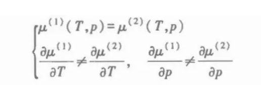

# 第三章 单元系的相变

## 3.1 热动平衡的判据

如何判断系统的平衡状态，对相变讨论的准备

### 1 孤立系统 平衡判据

$$
\Delta S=\delta S+\frac12\delta^2S
$$

#### 平衡条件

$$
\delta S = 0
$$

#### 稳定平衡条件

$$
\delta^2 S < 0
$$

### 2 等温等容系统

$$
\Delta F=\delta F+\frac{1}{2}\delta^{2}F>0
$$

### 3 等温等压系统

$$
\Delta G=\delta G+\frac12\delta^2G>0
$$

### 4 等熵等容系统

$$
\Delta U=\delta U+\frac12\delta^2U>0
$$

### 5 均匀系统平衡的稳定性条件

$\bullet$ The isolated system's small part $(T,p)$,
and the other (almost whole) part $(T_0,p_0)$,
a virtual variation $\delta U,\delta V$ and $\delta U_0,\delta V_0.$

$\bullet$ The whole system does not change (constraint):

$\delta U+\delta U_0=0$, 

$\delta V+\delta V_0=0.$ 

$\bullet$ Total change of the entropy: 

$\Delta\tilde{S}=\Delta S+\Delta S_0.$

$\bullet$ Condition for equilibrium: 

$\Delta\tilde{S}<0$, i.e.,
$\Delta S+\Delta S_0<0$,or $\delta\tilde{S}=0,\delta^2\tilde{S}<0.$

- 平衡条件

$$
\begin{aligned}
&\text{Basic equation: d}S=\frac{\mathrm{d}U+p\mathrm{d}V}T\text{,then} \\
&\delta\tilde{S}=\frac{\delta U+p\delta V}{T}+\frac{\delta U_{0}+p_{0}\delta V_{0}}{T_{0}}=\frac{\delta U+p\delta V}{T}+\frac{-\delta U-p_{0}\delta V}{T_{0}} \\
&=\delta U\left(\frac{1}{T}-\frac{1}{T_0}\right)+\delta V\left(\frac{p}{T}-\frac{p_0}{T_0}\right)
\end{aligned}
$$

$$
\because\delta U\text{ and }\delta V\text{ are independent,}\therefore T=T_0,p=p_0
$$

- 稳定平衡条件

$$
\delta^2S_0\ll\delta^2S
$$

$$
\begin{gathered}
\bullet\delta^{2}\tilde{S}\simeq\delta^{2}S=\frac{\partial^{2}S}{\partial U^{2}}(\delta U)^{2}+2\frac{\partial^{2}S}{\partial U\partial V}\delta U\delta V+\frac{\partial^{2}S}{\partial V^{2}}(\delta V)^{2}. \\
=\begin{bmatrix}\frac{\partial}{\partial U}\frac{\partial S}{\partial U}\delta U+\frac{\partial}{\partial V}\frac{\partial S}{\partial U}\delta V\end{bmatrix}\delta U \\
+\begin{bmatrix}\frac{\partial}{\partial U}\frac{\partial S}{\partial V}\delta U+\frac{\partial}{\partial V}\frac{\partial S}{\partial V}\delta V\end{bmatrix}\delta V, \\
\begin{pmatrix}\mathrm{d}S=\frac{\mathrm{d}U+p\mathrm{d}V}{T}\Rightarrow\begin{pmatrix}\frac{\partial S}{\partial U}\end{pmatrix}_V=\frac{1}{T},\begin{pmatrix}\frac{\partial S}{\partial V}\end{pmatrix}_U=\frac{p}{T}.\end{pmatrix} \\
\begin{array}{l}{\delta^{2}\mathcal{S}=\left\lfloor\frac{\partial}{\partial U}\left(\frac{1}{T}\right)\delta U+\frac{\partial}{\partial V}\left(\frac{1}{T}\right)\delta V\right\rfloor\delta U}\\{+\left[\frac{\partial}{\partial U}\left(\frac{p}{T}\right)\delta U+\frac{\partial}{\partial V}\left(\frac{p}{T}\right)\delta V\right]\delta V}\\\end{array} \\
=\delta\left(\frac{1}{T}\right)\delta U+\delta\left(\frac{p}{T}\right)\delta V.
\end{gathered}
$$

Convert to (T,V)：

$$
\bullet\delta U=\left(\frac{\partial U}{\partial T}\right)_{V}\delta T+\left(\frac{\partial U}{\partial V}\right)_{T}\delta V
=C_V\delta T+\left\lfloor T\left(\frac{\partial p}{\partial T}\right)_V-p\right\rfloor\delta V. 
$$

$$
\begin{aligned}\delta\frac{1}{T}=\left(\frac{\partial}{\partial T}\frac{1}{T}\right)_V\delta T+\left(\frac{\partial}{\partial V}\frac{1}{T}\right)_T\delta V=-\frac{1}{T^2}\delta T\end{aligned}
$$

$$
\begin{aligned}
\delta\frac{p}{T}& =\left(\frac{\partial}{\partial T}\frac{p}{T}\right)_{V}\delta T+\left(\frac{\partial}{\partial V}\frac{p}{T}\right)_{T}\delta V  \\
&=\begin{bmatrix}p\left(\frac{\partial}{\partial T}\frac{1}{T}\right)_{V}+\frac{1}{T}\left(\frac{\partial p}{\partial T}\right)_{V}\end{bmatrix}\delta T \\
&+\left[p\left(\frac{\partial}{\partial V}\frac{1}{T}\right)_T+\frac{1}{T}\left(\frac{\partial p}{\partial V}\right)_T\right]\delta V \\
&=\begin{bmatrix}-\frac{p}{T^{2}}+\frac{1}{T}\left(\frac{\partial p}{\partial T}\right)_{V}\end{bmatrix}\delta T+\frac{1}{T}\left(\frac{\partial p}{\partial V}\right)_{T}\delta V \\
&=\frac{1}{T^2}\left|T\left(\frac{\partial p}{\partial T}\right)_V-p\right|\delta T+\frac{1}{T}\left(\frac{\partial p}{\partial V}\right)_T\delta V.
\end{aligned}
$$

整理：

$$
\begin{gathered}
\delta^{2}\tilde{S}\simeq\delta^{2}S=-\frac{1}{T^{2}}\delta T\left\{C_{V}\delta T+\left[T\left(\frac{\partial p}{\partial T}\right)_{V}-p\right]\delta V\right\} \\
+\left\{\frac{1}{T^{2}}\left[T\left(\frac{\partial p}{\partial T}\right)_{V}-p\right]\delta T+\frac{1}{T}\left(\frac{\partial p}{\partial V}\right)_{T}\delta V\right\}\delta V \\
=-\frac{C_V}{T^2}(\delta T)^2+\frac1T\left(\frac{\partial p}{\partial V}\right)_T(\delta V)^2<0. 
\end{gathered}
$$

- 结果

$$
C_V>0,\left(\frac{\partial p}{\partial V}\right)_T<0.
$$

## 3.2 开系的热力学基本方程

物质不守恒了，对相变讨论的准备。

开系的四个热力学基本方程是基于第二章第一节的四个方程变换过来的，每一个都加一个化学势项。

### 1 化学势

$$
\begin{aligned}\mu&\equiv\frac{G}{n}=G_m=u-Ts+pv.\\\mathrm{d}\mu&=V_m\mathrm{d}p-S_m\mathrm{d}T\text{ or }v\mathrm{d}p-s\mathrm{d}T.\end{aligned}
$$

### 2 内能

$$
\begin{aligned}
&\text{The internal energy }U=nu\text{,and d}u=T\mathrm{d}s-p\mathrm{d}v. \\
&\begin{aligned}\mathrm{d}U=\mathrm{d}(nu)=n(T\mathrm{d}s-p\mathrm{d}v)+u\mathrm{d}n\end{aligned} \\
&\begin{aligned}=n(T\text{d}s-p\text{d}v)+(\mu+Ts-pv)\text{d}n\end{aligned} \\
&\begin{aligned}=T[\mathrm{d}(ns)-s\mathrm{d}n]-p[\mathrm{d}(nv)-v\mathrm{d}n]+(\mu+Ts-pv)\mathrm{d}n\end{aligned} \\
&=T\mathrm{d}S-Ts\mathrm{d}n-p\mathrm{d}V+pv\mathrm{d}n+\mu\mathrm{d}n+Ts\mathrm{d}n-pv\mathrm{d}n \\
&\begin{aligned}=T\mathrm{d}S-p\mathrm{d}V+\mu\mathrm{d}n.\end{aligned}
\end{aligned}
$$

### 3 U H F G

$$
\begin{gathered}
\begin{aligned}\mathrm{d}U=T\mathrm{d}S-p\mathrm{d}V+\mu\mathrm{d}n \end{aligned}\\
\begin{aligned}\mathrm{d}H=T\mathrm{d}S+V\mathrm{d}p+\mu\mathrm{d}n,\end{aligned} \\
\begin{aligned}\mathrm{d}F=-S\mathrm{d}T-p\mathrm{d}V+\mu\mathrm{d}n\end{aligned} \\
\begin{aligned}\mathrm{d}G=-S\mathrm{d}T+V\mathrm{d}p+\mu\mathrm{d}n\end{aligned} 
\end{gathered}
$$

### 4 巨热力学势 J

$$
\begin{aligned}J\equiv F-\mu n=F-G=-pV\end{aligned}
$$

$$
\begin{aligned}\mathrm{d}J=-S\mathrm{d}T-p\mathrm{d}V-n\mathrm{d}\mu.\end{aligned}
$$

## 3.3 单元系的复相平衡条件

### 1 复相系统的描述

$$
\text{State parameter }(U^\alpha,V^\alpha,n^\alpha,T^\alpha)\text{,}(U^\beta,V^\beta,n^\beta,T^\beta)
$$

$$
\text{Constraints:}\\\left\{\begin{array}{l}U^\alpha+U^\beta=\text{Const.}\\V^\alpha+V^\beta=\text{Const.}\\n^\alpha+n^\beta=\text{Const.}\end{array}\right.\Rightarrow\left\{\begin{array}{l}\delta U^\alpha+\delta U^\beta=0\\\delta V^\alpha+\delta V^\beta=0\\\delta n^\alpha+\delta n^\beta=0\end{array}\right..
$$

### 2 熵

$$
\delta S^\alpha=\frac{\delta U^\alpha+p^\alpha\delta V^\alpha-\mu^\alpha\delta n^\alpha}{T^\alpha},\delta S^\beta=\frac{\delta U^\beta+p^\beta\delta V^\beta-\mu^\beta\delta n^\beta}{T^\beta}.
$$

### 3 平衡条件

$$
\begin{array}{l}{\delta S=\delta S^{\alpha}+\delta S^{\beta}=}\\{\delta U^{\alpha}(\frac{1}{T\alpha}-\frac{1}{T\beta})+\delta V^{\alpha}(\frac{p^{\alpha}}{T\alpha}-\frac{p^{\beta}}{T^{\beta}})-\delta n^{\alpha}(\frac{\mu^{\alpha}}{T^{\alpha}}-\frac{\mu^{\beta}}{T^{\beta}})=0.}\\\end{array}
$$

$$
\begin{cases}\frac{1}{T^\alpha}-\frac{1}{T^\beta}=0\\\\p^\alpha-p^\beta\frac{1}{T^\beta}=0\\\\\mu^\alpha-\mu\frac{1}{T^\beta}=0\end{cases}
$$

$$
\begin{cases}T^\alpha=T^\beta&\text{(热平衡条件)}\\p^\alpha=p^\beta&\text{(力学平衡条件)}\\\mu^\alpha=\mu^\beta&\text{(利变平衡条件)}\end{cases}
$$

### 稳定平衡条件

理论上可算

## 3.4 单元复相系的平衡性质

### 1 单元两相系平衡条件

$$
\left.\left\{\begin{array}{c}T^\alpha=T^\beta=T\\p^\alpha=p^\beta=p\\\mu^\alpha(T,p)=\mu^\beta(T,p)\end{array}\right.\right.
$$

### 2 单元三相系平衡条件

$$
\left.\left\{\begin{array}{c}T^\alpha=T^\beta=T^\gamma=T\\p^\alpha=p^\beta=p^\gamma=p\\\mu^\alpha(T,p)=\mu^\beta(T,p)=\mu^\gamma(T,p)\end{array}\right.\right.
$$

### 3 克拉珀龙方程

$$
\frac{dp}{dT}=\frac L{T(V_m^\beta-V_m^\alpha)}=\frac{S_m^\beta-S_m^\alpha}{V_m^\beta-V_m^\alpha}
$$

描述了两相共存相变曲线的斜率。L：1mol物质相转变时的吸收潜热.$\begin{aligned}L=T(S_m^\beta-S_m^\alpha)\end{aligned}$

$$
\begin{aligned}
&\bullet\mu^{\alpha}(T,p)=\mu^{\beta}(T,p), \\
&\Rightarrow\mathrm{d}\mu^\alpha=\mathrm{d}\mu^\beta. \\
&\begin{aligned}\bullet\because\mathrm{d}\mu=\frac{V}{n}\mathrm{d}p-\frac{S}{n}\mathrm{d}T=V_m\mathrm{d}p-S_m\mathrm{d}T,\end{aligned} \\
&\bullet\therefore V_{m}^{\alpha}\mathrm{d}p-S_{m}^{\alpha}\mathrm{d}T=V_{m}^{\beta}\mathrm{d}p-S_{m}^{\beta}\mathrm{d}T\Rightarrow\frac{\mathrm{d}p}{\mathrm{d}T}=\frac{S_{m}^{\beta}-S_{m}^{\alpha}}{V_{m}^{\beta}-V_{m}^{\alpha}}.
\end{aligned}
$$

### 4 蒸汽压方程

做一定的简化，并引入理想气体状态方程

$$
\frac1p\frac{dp}{dT}=\frac L{RT^2}
$$

## 3.5 临界点和气液两相的转变

### 1 临界点的计算

$$
(\frac{\partial p}{\partial V_m})_T=0\\(\frac{\partial^2p}{\partial V_m^2})_T=0
$$

将范德瓦尔斯方程代入可得：

$$
T_c=\frac{8a}{27Rb},p_c=\frac a{27b^2},V_{mc}=3b
$$

临界系数：

$$
\frac{RT_c}{p_cV_{mc}}=\frac83=2.667
$$

### 2 液气流体系统临界态的平衡稳定条件

$$
(\frac{\partial p}{\partial V_m})_T=0,(\frac{\partial^2p}{\partial V_m^2})_T=0,(\frac{\partial^3p}{\partial V_m^3})_T<0
$$

## 3.7 相变的分类

### 1 一级相变

在相变点，两相的化学势连续，但化学势的一级偏导数存在突变

表达式：

物理意义：

$$
\begin{array}{l}\mathrm{d}\mu=-S_m\mathrm{d}T+V_m\mathrm{d}p\\\Rightarrow S_m=-\left(\frac{\partial\mu}{\partial T}\right)_p,V_m=\left(\frac{\partial\mu}{\partial p}\right)_T.\end{array}
$$

### 2 二级相变

如果在相变点两相的化学势和化学势的一级偏导数连续，但化学势的二级偏导数存在突变，称为二级相变

$$
\begin{aligned}2\text{nd order: }c_p&=T\left(\frac{\partial s}{\partial T}\right)_p=-T\frac{\partial^2\mu}{\partial T^2},\\\alpha&=\frac1v\left(\frac{\partial v}{\partial T}\right)_p=\frac1v\frac{\partial^2\mu}{\partial T\partial p},\kappa_T=-\frac1v\left(\frac{\partial v}{\partial p}\right)_T=-\frac1v\frac{\partial^2\mu}{\partial p^2}\end{aligned}
$$

### 3 n级相变和连续相变

n级相变：根据埃伦菲斯特的分类，如果在相变点两相的化学势和化学势的一级、二级......直到n-1级偏导数连续，但化学势的n级偏导数存在突变，则称为n级相变。

连续相变：后来，人们发现热容、等温压缩系数、磁化率等在趋近相变点时往往趋于无穷，因此现在人们习惯上只把相变分为一级相变和连续相变两类，把非一级相变统称为连续相变。（p81）

## 3.9 朗道连续相变理论

### 1 核心观点

连续相变的特征是物质有序程度的改变及与之相伴随的物质对称性质的变化。

### 2 序参量

描述物质有序程度的物理量

### 3 单轴铁磁体

- 序参量：M

- 朗道自由能

$$
\begin{aligned}F(T,M)=F_0(T)+\frac{1}{2}a(T)M^2+\frac{1}{4}b(T)M^4+...\end{aligned}
$$

- 稳定平衡判据

$$
\delta F=0,\delta^2F>0{:}
$$

$$
\begin{array}{l}\frac{\partial F}{\partial M}=M(a+bM^2)=0,\\\frac{\partial^2F}{\partial M^2}=a+3bM^2>0.\end{array}
$$
