# 第六章 近独立粒子的最概然分布

## 6.1 粒子运动状态的经典描述

量子描述的铺垫

### 1 广义坐标

广义坐标，广义动量描述。

有广义能量

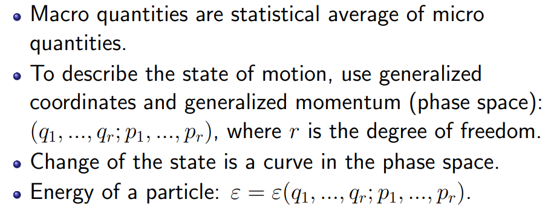

### 2 自由粒子

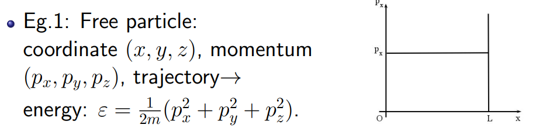

### 3 线性谐振子

$$
\begin{aligned}
&Eg.2.Linearoscillator: \\
&\begin{aligned}F=-Ax=m\ddot{x}\Rightarrow\omega=\sqrt{A/m},\end{aligned} \\
&x=C_1\operatorname{sin}(\omega t+\phi_0), \\
&p=m\dot{x}=m\omega C_{1}\operatorname{cos}(\omega t+\phi_{0}), \\
&\text{energy: }\varepsilon=\frac{p^2}{2m}+\frac12m\omega^2x^2=\text{Const.} \\
&\Rightarrow\frac{p^2}{2m\varepsilon}+\frac{x^2}{2\varepsilon/(m\omega^2)}=1\text{ (trajectory in phase space)}
\end{aligned}
$$

### 4 转子

$$
\begin{aligned}&\text{Eg.3. Rotator: Rotating with fixed radius:}\\&\text{Kinetic energy: }\varepsilon=\frac12m(\dot{x}^2+\dot{y}^2+\dot{z}^2).\\&\text{To polar coordinate: }x=r\sin\theta\cos\varphi,\\&y=r\sin\theta\sin\varphi,z=r\cos\theta.\\&\text{Kinetic energy: }\varepsilon=\frac12m(\dot{r}^2+r^2\dot{\theta}^2+r^2\sin^2\theta\dot{\varphi}^2).\end{aligned}
$$

$$
\begin{aligned}
&\because\dot{r}=0,\therefore\varepsilon=\frac{1}{2}m(r^2\dot{\theta}^2+r^2\sin^2\theta\dot{\varphi}^2). \\
&\text{Conjugate momentum of }\theta,\varphi\colon p_\theta=mr^2\dot{\theta}, \\
&p_{\varphi}=mr^{2}\operatorname{sin}^{2}\theta\dot{\varphi}. \\
&\therefore\varepsilon=\frac12\left[\frac{(mr^{2}\dot{\theta})^{2}}{mr^{2}}+\frac{(mr^{2}\operatorname{sin}^{2}\theta\dot{\varphi})^{2}}{mr^{2}\operatorname{sin}^{2}\theta}\right] \\
=\frac{1}{2I}(p_{\theta}^{2}+\frac{1}{\sin^{2}\theta}p_{\varphi}^{2}).
\end{aligned}
$$

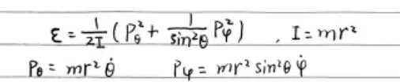

## 6.2 粒子运动状态的量子描述

之后分布会运用到的关系铺垫

德布罗意波、不确定关系：

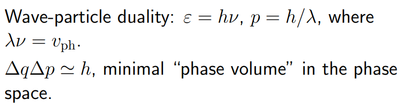

### 1 线性谐振子

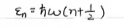

### 2 转子

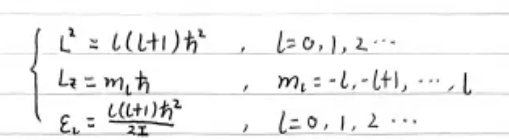

### 3 自旋角动量

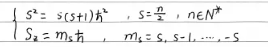

电子、磁矩、磁场能量：

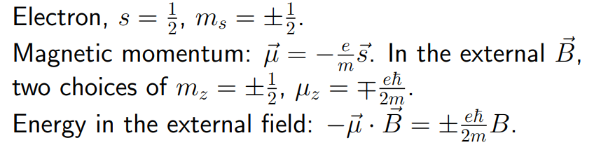

### 4 自由粒子

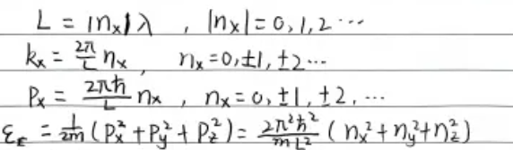

### 5 微观量子数和态密度

- 在 $dp$ 里面包含的状态数：

$$
\begin{aligned}
&\textsf{The number of state }(p_{x},p_{x}+\mathrm dp_{x})\colon(n_{x}+\Delta n_{x})-n_{x}, \\
&\begin{aligned}\text{where }p_x+\text{d}p_x=h\frac{n_x+\Delta n_x}{L}\end{aligned} \\
&\Delta n_{x}=\frac{L}{h}\mathrm{d}p_{x}\text{,also }\Delta n_{y}=\frac{L}{h}\mathrm{d}p_{y}\text{,}\Delta n_{z}=\frac{L}{h}\mathrm{d}p_{z}.
\end{aligned}
$$

- 总的状态数，微观量子数：

$$
\Delta n_x\Delta n_y\Delta n_z=\frac{V}{h^3}\mathrm{d}p_x\mathrm{d}p_y\mathrm{d}p_z.
$$

- 态密度

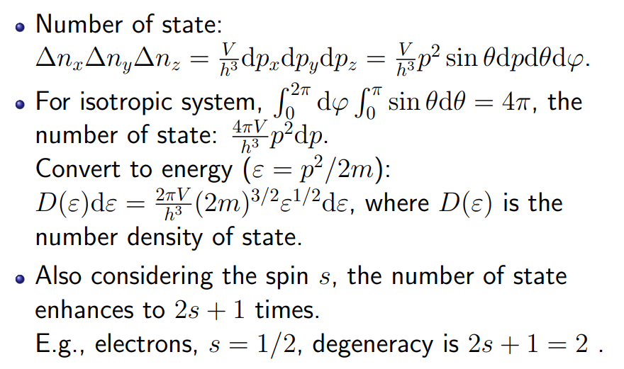

$$
D(\varepsilon)\mathrm{d}\varepsilon=\frac{2\pi V}{h^3}(2m)^{3/2}\varepsilon^{1/2}\mathrm{d}\varepsilon 
$$

## 6.3 系统微观运动状态的描述

将不同粒子组成的系统进行分类，对不同分类有不同的描述（概率分布）

### 1 全同粒子和近独立粒子

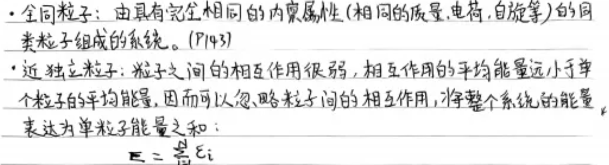

### 2 经典系统 玻色系统 费米系统

分类：全同粒子是否可区分，是否可以占据同样的状态（泡利不相容）

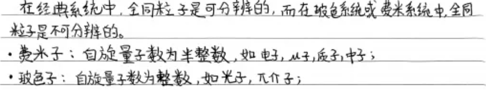

玻尔兹曼系统：由可分辨的全同近独立粒子组成，且处在一个个体量子态上的离子束不受限制的系统。分布满足玻尔兹曼分布

费米系统：由不可分辨的全同近独立费米子组成，遵从泡利不相容原理的系统。分布满足费米分布

玻色系统：由玻色子组成的系统，即全同粒子不可分辨，不受泡利不相容原理束缚

> 2个粒子，3个状态，系统状态数

- 经典（玻尔兹曼系统）：

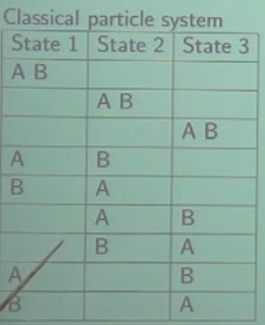

- 玻色系统：

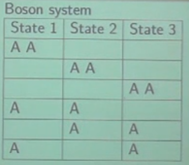

- 费米系统：

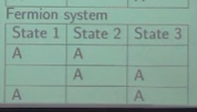

## 6.4 等概率原理

导出三系统概率分布的工具之一

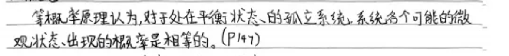

## 6.5 分布和微观状态

我们如何描述分布？用什么标志？这章给出

### 1 分布

描述对象：近独立的全同粒子

参量：确定粒子数N，能量E，体积V

目标：数对于一种分布的数目（e.g. 粒子具有某一种能量对应的微观状态数）

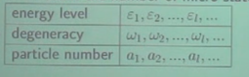
(能级-简并度-粒子数)

$$
\sum a_l=N,\sum a_l\varepsilon_l=E.
$$

意义：可以用粒子数取最大值的那个分布来代替整个系统（最概然分布）

### 2 三种系统的微观状态数

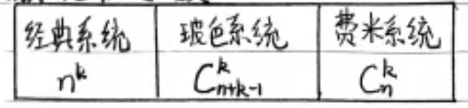

- 玻尔兹曼系统

$$
\Omega_{\mathrm{M.B.}}=\frac{N!}{\prod a_{l}!}\prod\omega_{l}^{a_{l}}
$$

- 玻色分布

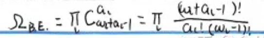

- 费米系统

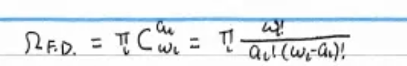

### 3 经典极限条件

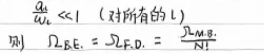

量子退化为经典

### 4 经典统计中的分布和微观状态数

经典统计：$\mathsf{State:}(q_1,q_2,...,q_r;p_1,p_2,...,p_r)\text{,continuous, uncountable.}$

$$
\Delta w=\Delta q_1...\Delta q_r\Delta p_1...\Delta p_r.\text{ Number of states: }\frac{\Delta w}{h_0^r}
$$

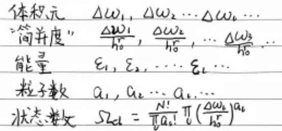

## 6.6 玻尔兹曼分布 玻色分布 和 费米分布

### 1 玻尔兹曼分布

- 最概然

$$
\boxed{a_l=\omega_le^{-\alpha-\beta\varepsilon_l}}.
$$

$$
N=\sum\omega_le^{-\alpha-\beta\varepsilon_l},E=\sum\omega_le^{-\alpha-\beta\varepsilon_l}\varepsilon_l
$$

- 任意态

处在量子态l上的平均量子数f表示为：

$$
f=\frac{a_l}{\omega_l}=e^{-\alpha-\beta\varepsilon_l}.
$$

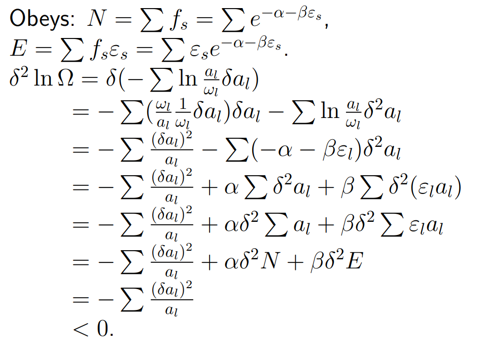

说明：

符合条件： 1.为了能够让最概然分布能够代表系统状态，需要$N~10^{23}$，也就是大数系统

2.引入了6.6.1的近似，需要使$a_l >> 1$。这个条件很苛刻，故在巨正则系综有更普适的推导。

3.对于多元系（系统含有多种粒子），仍然成立 

4.经典统计：

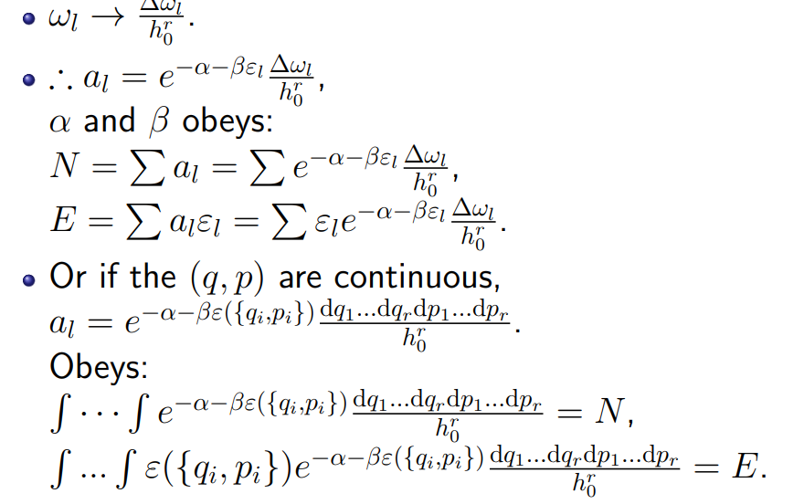

### 2 玻色爱因斯斯坦分布

$$
a_l=\frac{\omega_l}{e^{\alpha+\beta\varepsilon_l}-1}
$$

### 3 费米狄拉克分布

$$
a_l=\frac{\omega_l}{e^{\alpha+\beta\varepsilon_l}+1}
$$

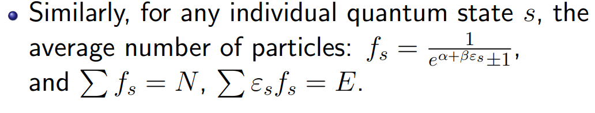

### 4 三种分布的关系

$$
\begin{aligned}&\text{Boltzmann distribution: }a_l=\frac{\omega_l}{e^{\alpha+\beta\varepsilon_l}}.\\&\text{Bose distribution: }a_l=\frac{\omega_l}{e^{\alpha+\beta\varepsilon_l}-1}.\\&\text{Fermi distribution: }a_l=\frac{\omega_l}{e^{\alpha+\beta\varepsilon_l}+1}.\end{aligned}
$$

当满足经典极限时，玻色分布和费米分布过渡到玻尔兹曼分布。

