# 第七章 玻尔兹曼统计

## 7.1 热力学量的统计表达式

给出系统的配分函数，则系统的热力学量也就确定了

### 1 配分函数和热力学量

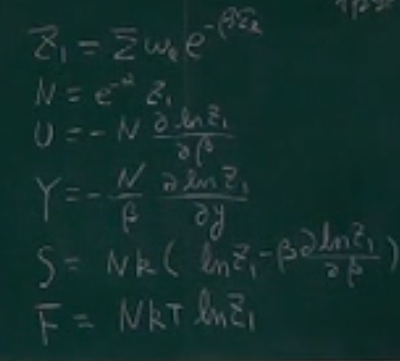

- 配分函数

$$
Z_{1}=\sum\omega_{l}e^{-\beta\varepsilon_{l}}
$$

- 总粒子数

$$
N=e^{-\alpha}z_{1}
$$

- 内能

$$
\begin{aligned}&U=e^{-\alpha}\sum\varepsilon_l\omega_le^{-\beta\varepsilon_l}=e^{-\alpha}\sum-\frac{\partial}{\partial\beta}(\omega_le^{-\beta\varepsilon_l})\\&=e^{-\alpha}(-\frac{\partial}{\partial\beta})\sum(\omega_le^{-\beta\varepsilon_l})=\frac{N}{Z_1}(-\frac{\partial}{\partial\beta})Z_1=-N\frac{\partial}{\partial\beta}\ln Z_1\end{aligned}
$$

- 广义力

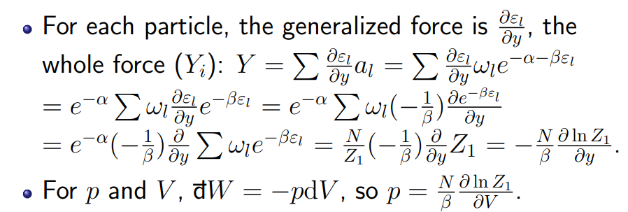

理解热力学第一定律：dW改变能级e，dQ改变分布$a_l$

### 2 $\beta 因子$

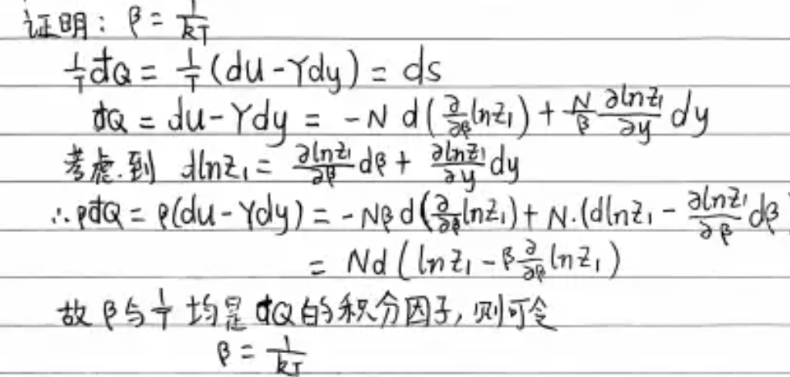

### 3 熵

- 数学式

$$
\begin{aligned}&\mathrm{d}S=\frac1T\mathsf{d}Q=k\beta\mathsf{d}Q=kN\mathsf{d}(\ln Z_1-\beta\frac{\partial\ln Z_1}{\partial\beta})\\&\Rightarrow S=Nk(\ln Z_1-\beta\frac{\partial\ln Z_1}{\partial\beta}).\end{aligned}
$$

- 物理式

$$
S=k[N\ln N+\sum\ln\frac{\omega_l}{a_l}a_l]=k\ln\Omega_\mathrm{M}.
$$

表示熵是系统的状态数的体现，表征了系统的混乱程度

### 4 自由能

$$
\begin{array}{l}F=U-TS=-N\frac{\partial\ln Z_1}{\partial\beta}-TNk(\ln Z_1-\beta\frac{\partial\ln Z_1}{\partial\beta})\\=-NkT\ln Z_1.\end{array}
$$

### 5 经典系统

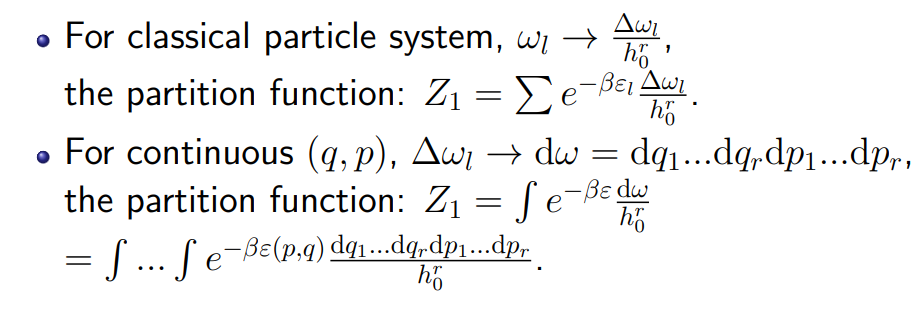

## 7.2-7.6 理想气体

### 1 理想气体系统配分函数

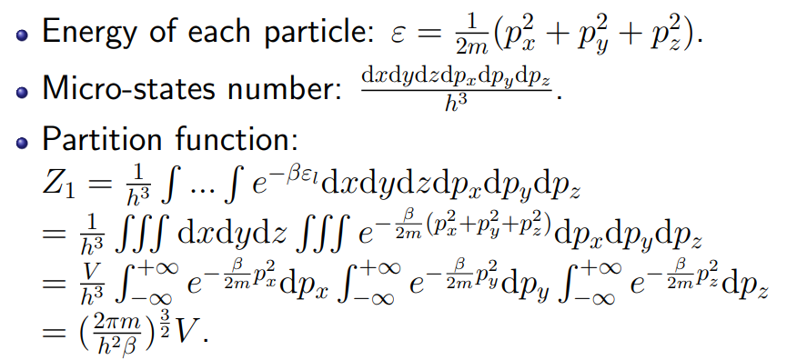

$$
Z_1 = (\frac{2\pi m}{h^2\beta})^{\frac32}V
$$

### 2 理想气体状态方程

$$
p=\frac{N}{\beta}\frac{\partial\operatorname{ln}Z_{1}}{\partial y}=\frac{N}{\beta}\frac{\partial\operatorname{ln}Z_{1}}{\partial V}=\frac{N}{\beta}\frac{\partial\operatorname{ln}[(\frac{2\pi m}{h^{2}\beta})^{\frac{3}{2}}V]}{\partial V}=\frac{N}{\beta}\frac{1}{V}=\frac{NkT}{V}
$$

### 3 经典极限条件

$$
\text{Classical limit condition: }\frac{\omega_l}{a_l}\gg1\text{,or }e^\alpha\gg1
$$

$$
e^\alpha=\frac{Z_1}N=\frac VN(\frac{2\pi m}{h^2\beta})^{\frac32}=\frac VN(\frac{2\pi mkT}{h^2})^{\frac32}\gg1.
$$

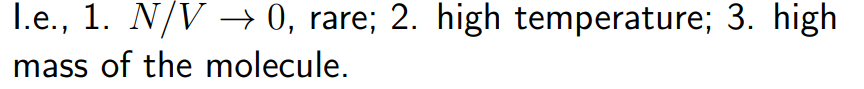

或：气体的德布罗意波长远远小于分子的平均间距

### 4 理想气体分子的速度平均律

- 推导

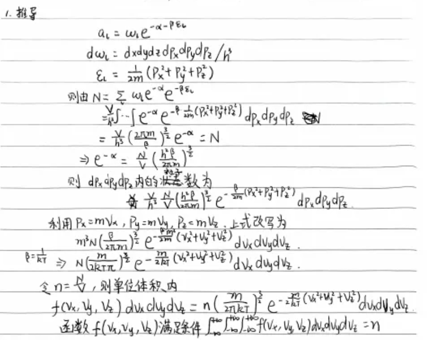

- 常用结论

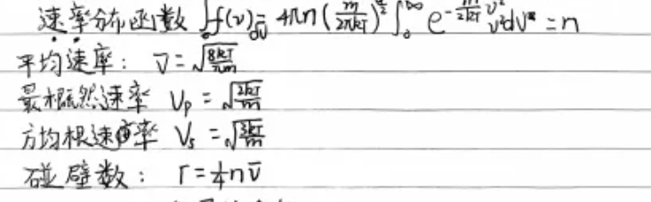

### 5 能均分定理

- 能均分定律

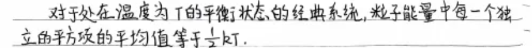

### 6 理想气体的热容（经典统计）

### 7 理想气体的热容（量子统计）

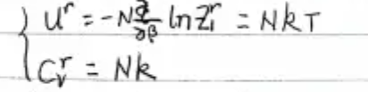

### 8 理想气体的熵（量子统计）

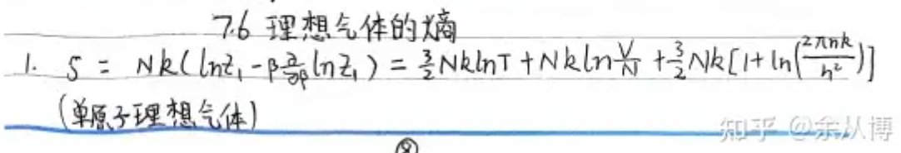

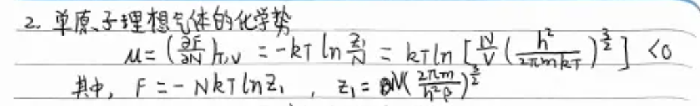

## 7.7 固体热容

### 1 爱因斯坦理论

### 2 顺磁性固体

