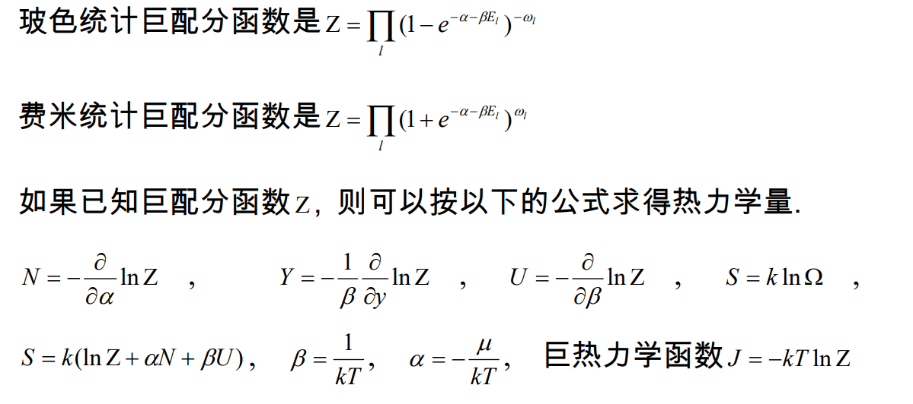
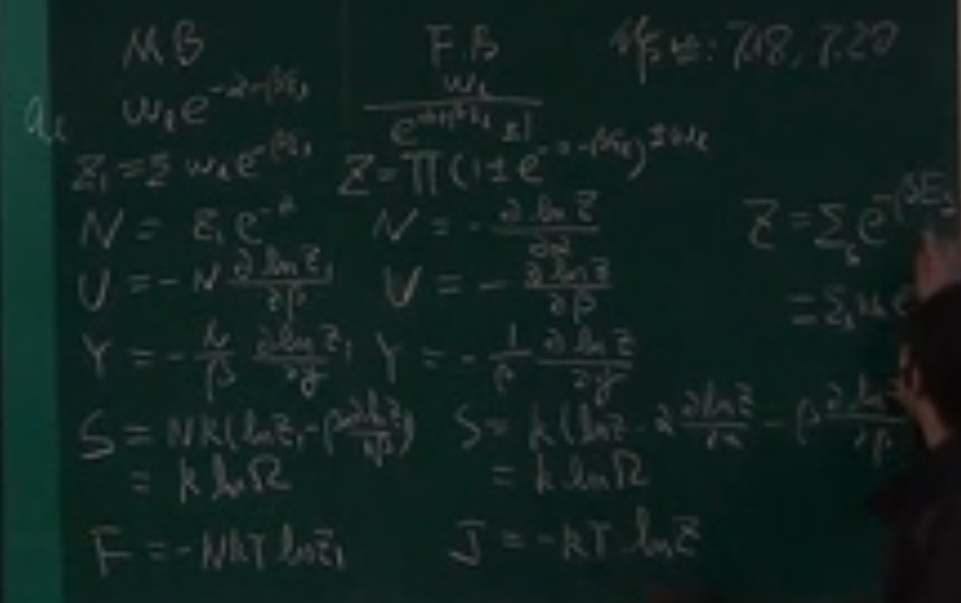
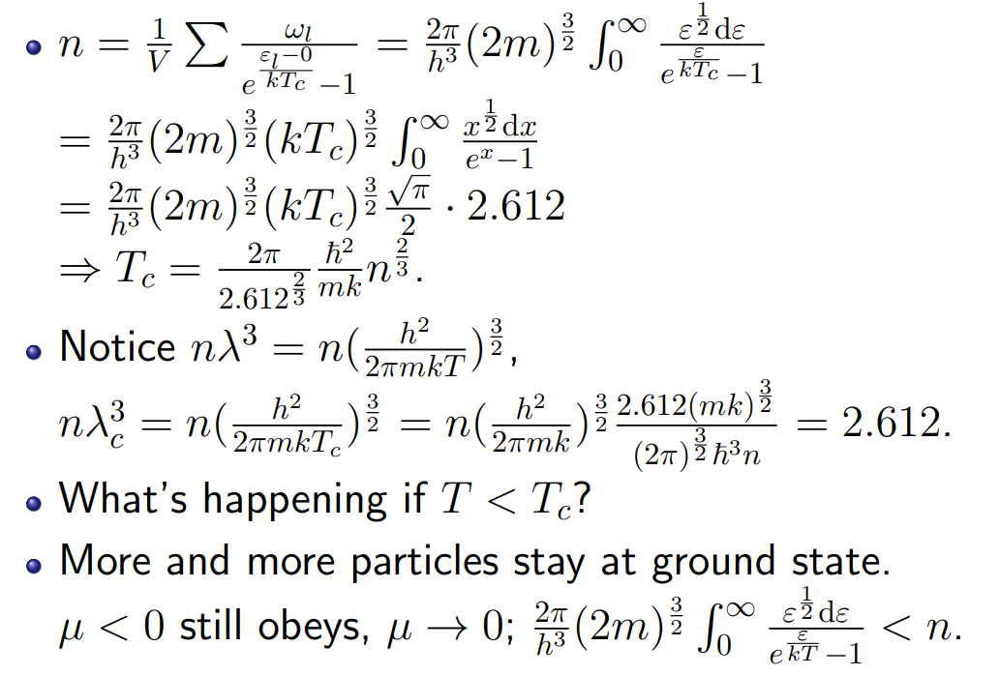
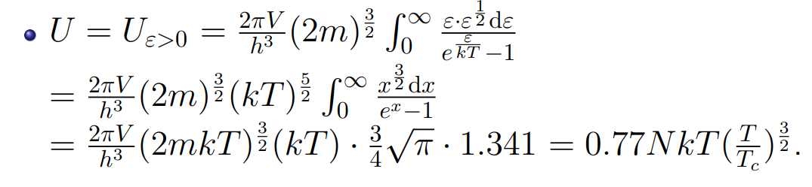
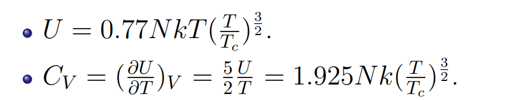
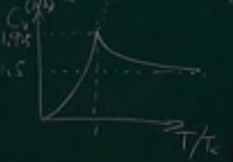

# 第八章 玻色统计和费米统计（简并气体）

## 1 热力学量的统计表达式

## 2 玻色系统

### 玻色-爱因斯坦凝聚

- 玻色-爱因斯坦凝聚

- 临界温度Tc

经典气体成为玻色气体，集合成为玻色凝聚体，凝聚体能量、动量为零，熵也为零，对压强没有贡献

- 玻色凝聚体的粒子数密度

$$
\begin{aligned}n_0(T)=n[1-(\frac{T}{T_c})^{\frac{3}{2}}].\end{aligned}
$$

$$
\text{The condensed part: }E=0,U=0,S=0,p=0.
$$

- 理想玻色气体的内能

- 定容热容

热容曲线：

- 玻色凝聚体出现条件：

T < Tc

或者：

$n\lambda ^ 3 > 2.612$

### 光子气体

## 3 费米系统

### 自由电子气体

