# Ascent

## 防守

### 常规

螃蟹：

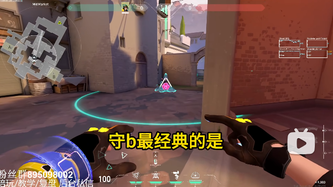

小鸡：

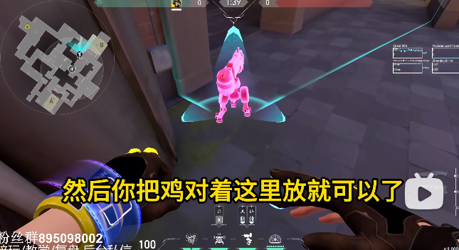

火：

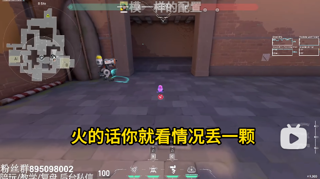

### 敌人喜欢走1道

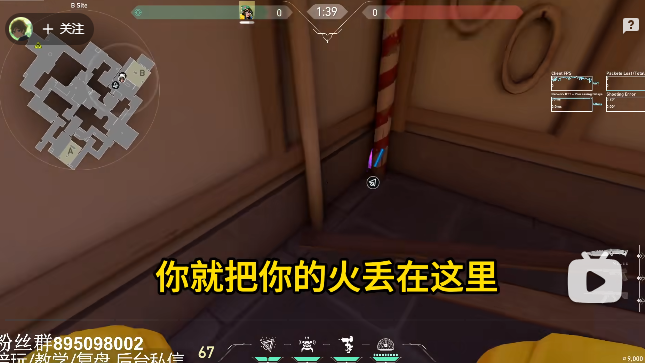

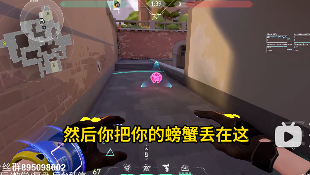

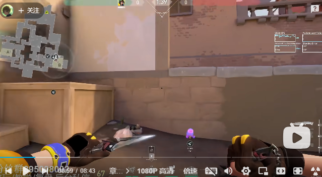

中路放小鸡：

### 喜欢来开关

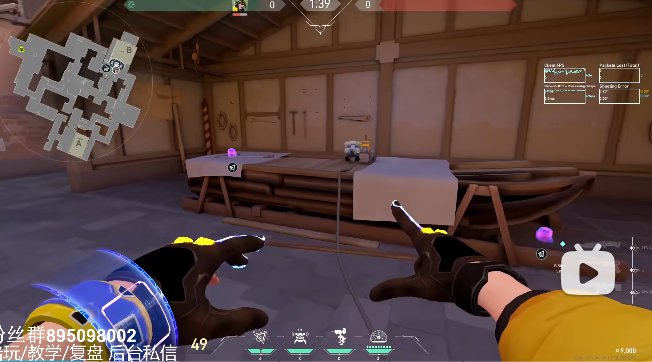

中路放小鸡：

### A点

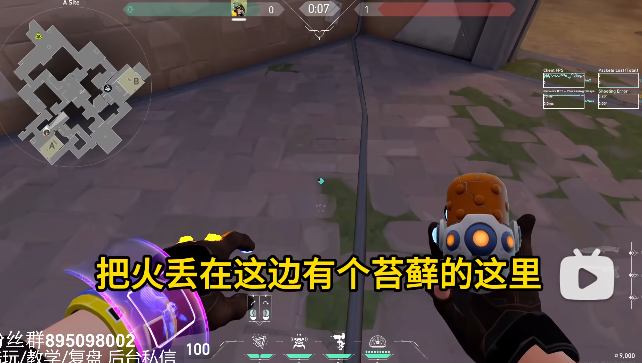

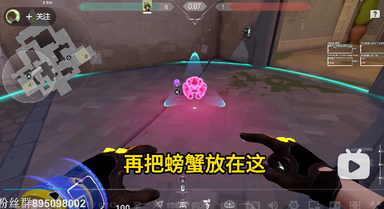

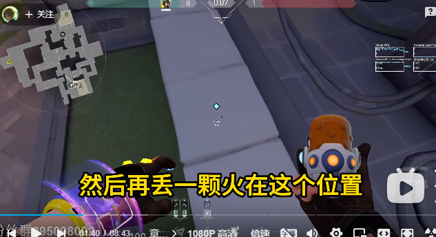

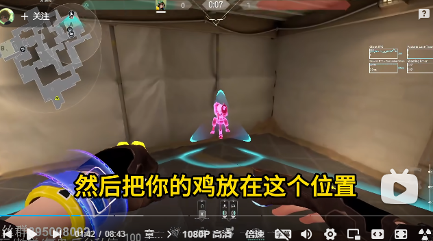

### A小

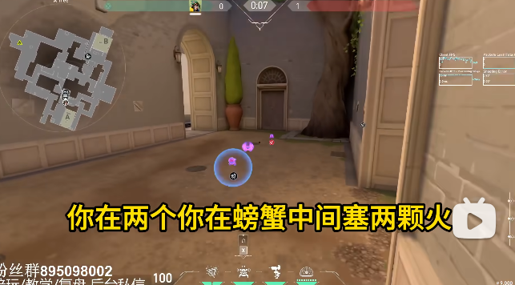

## 进攻

### A小火

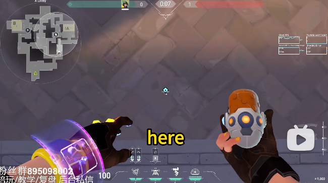

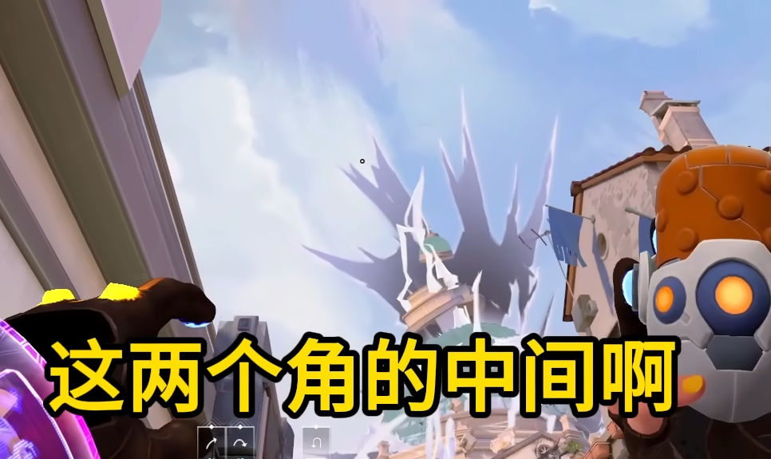

直接投

### Rua A 两颗火

来到箱子前

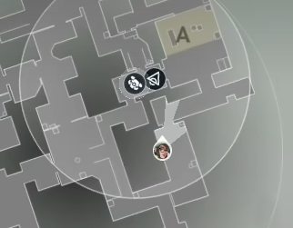

第一颗二楼火（跳投）

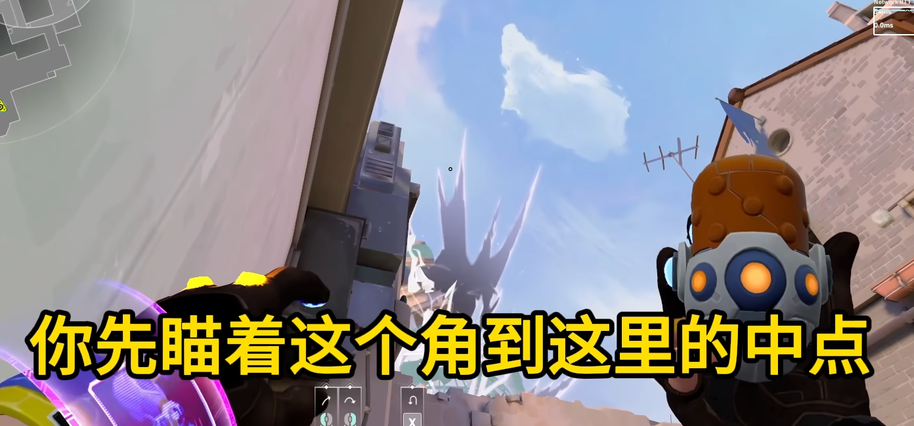

第二颗A小火（直接投）

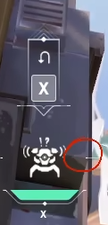

### 打B火

- 1道火

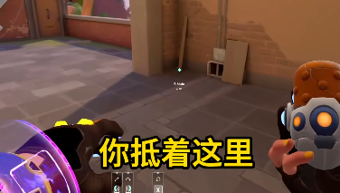

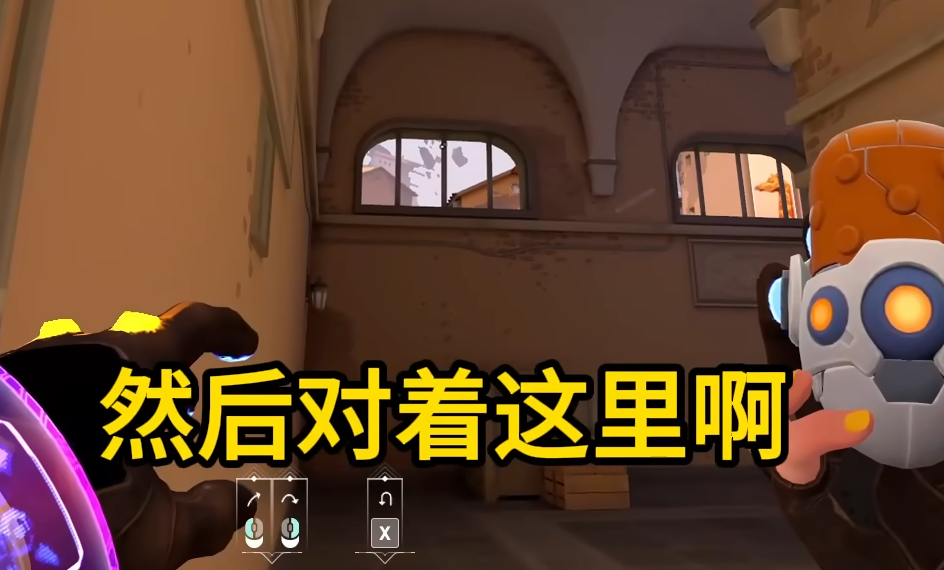

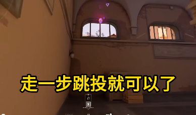

注意是走一步直接投，不是跳投

- 市场火

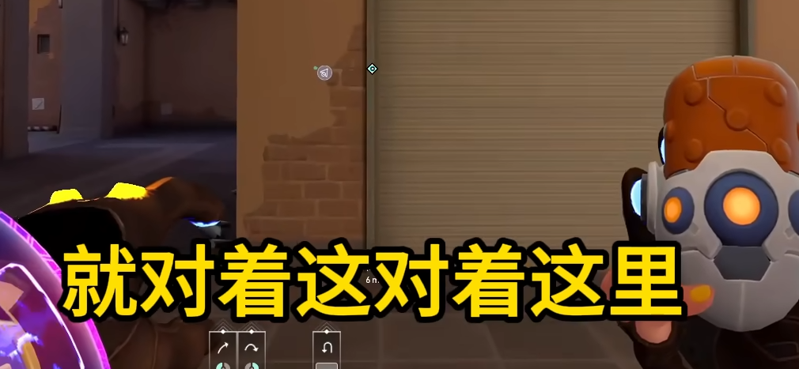

直接丢

- CT火

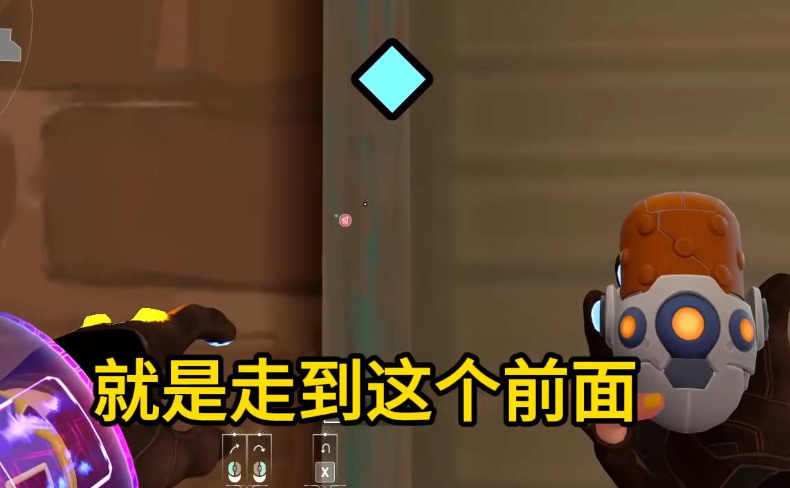

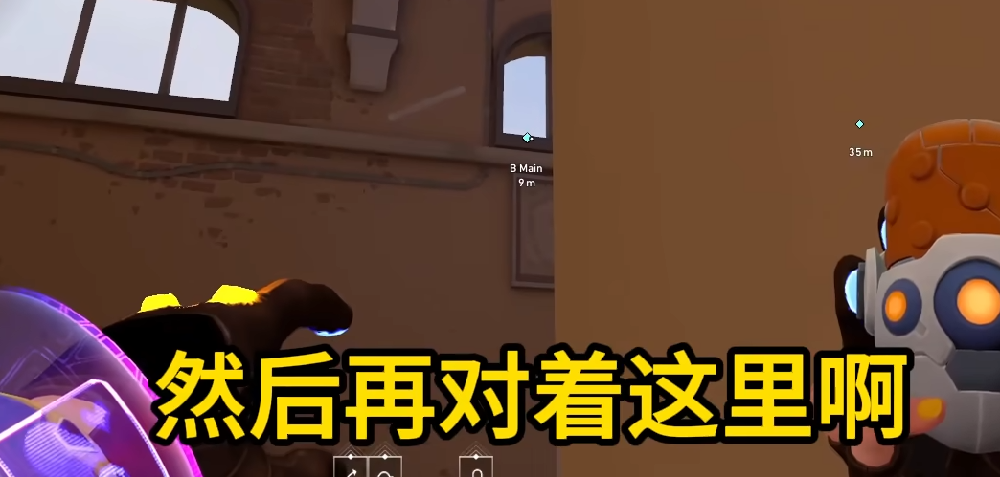

直接丢

