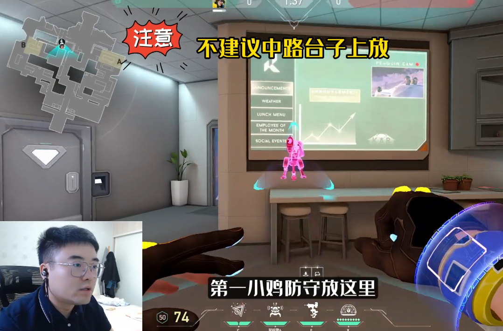
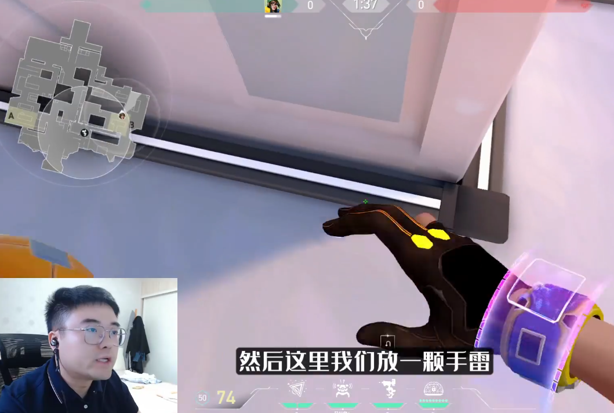
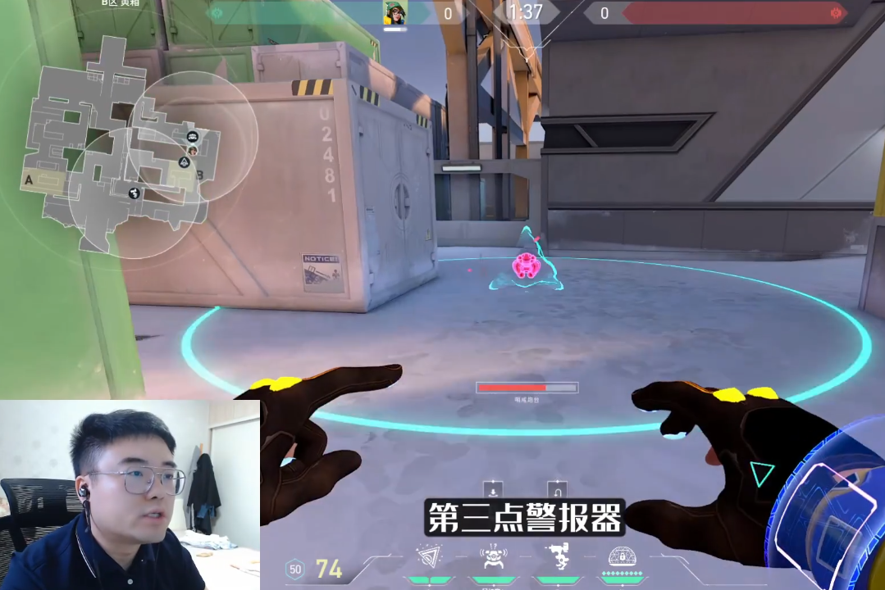
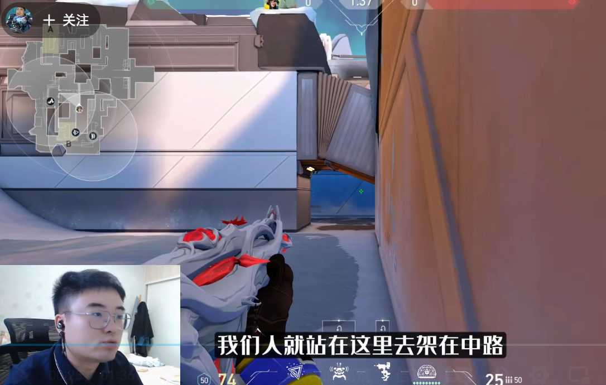
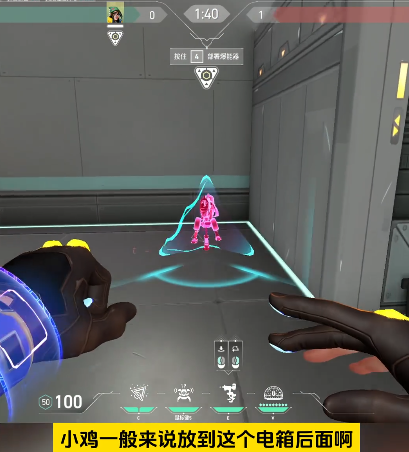
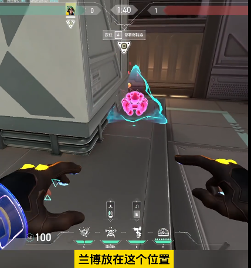
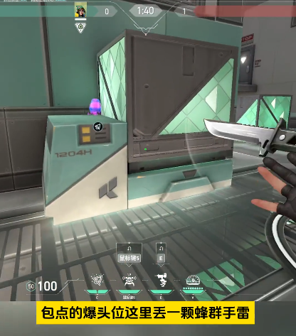
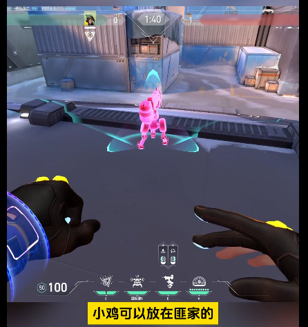
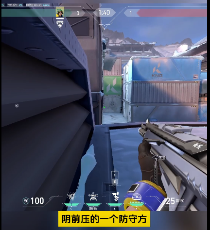
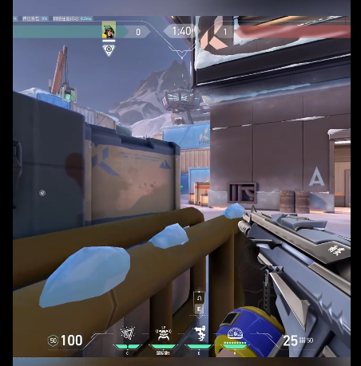

# Icebox

## 奇乐

### 防守

#### 1 小鸡

#### 2 手雷

#### 3 警报器

#### 4 站位

B中路、B包点后、B二楼

#### 5 大招

反制对面关键大招就行

#### 6 对面打A

让队友4A

#### 7 对面打B

战术目的为拖时间

#### 特殊：守A

小鸡：

报警器：

手雷：

站位：包点后、A后二楼、A包二楼、A包箱子上

### 进攻

两种思路：断后\跟随队伍补枪

#### 1 小鸡

#### 2 报警器

#### 3 站位

自己常用对枪位：中路箱子上

