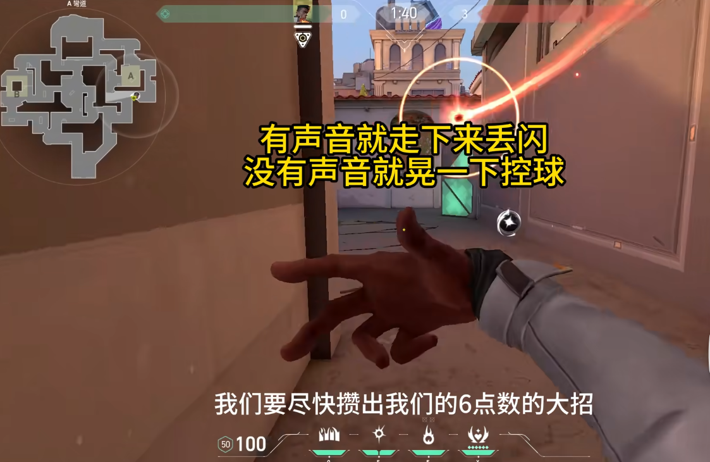
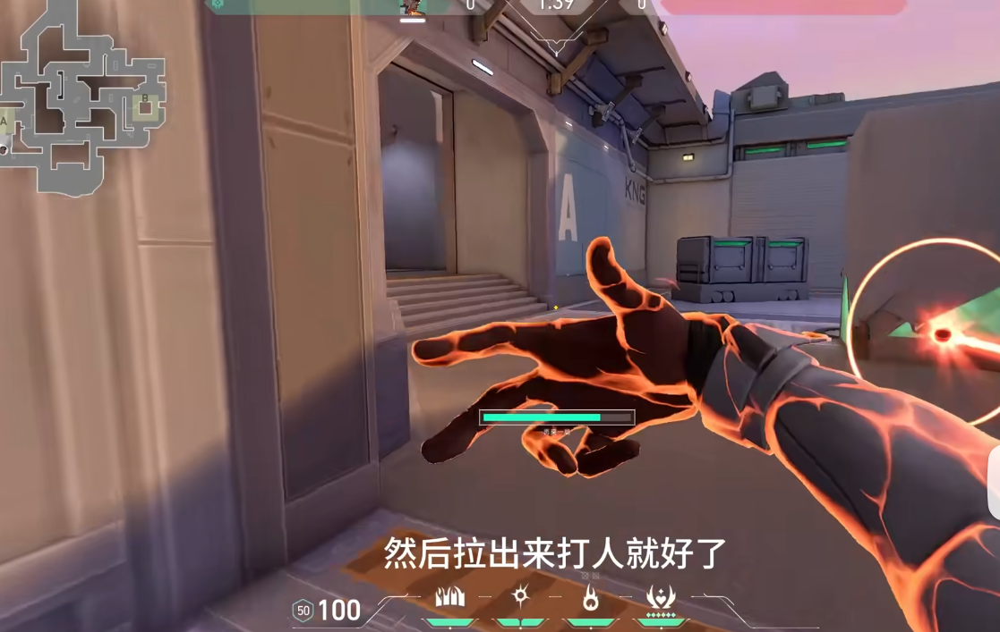
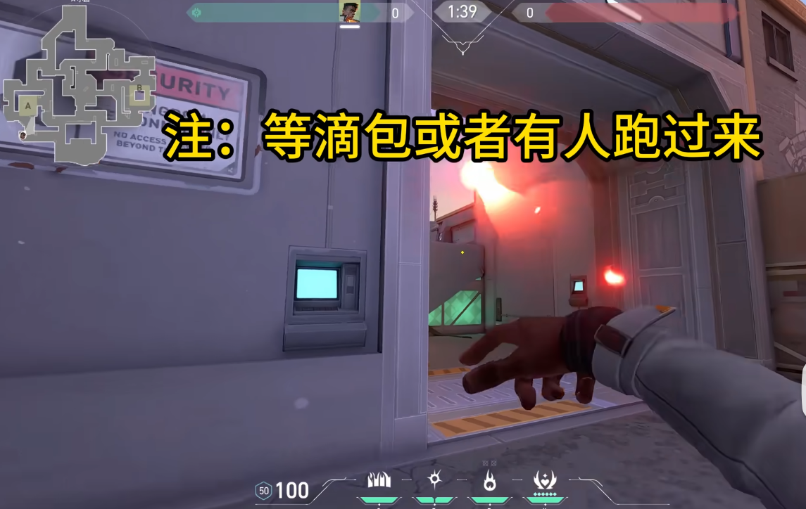
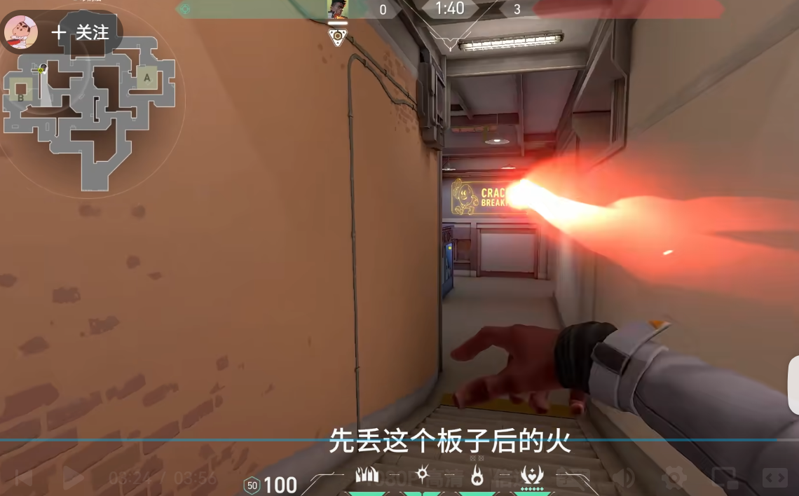
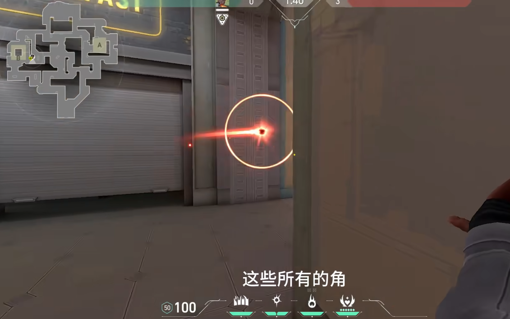
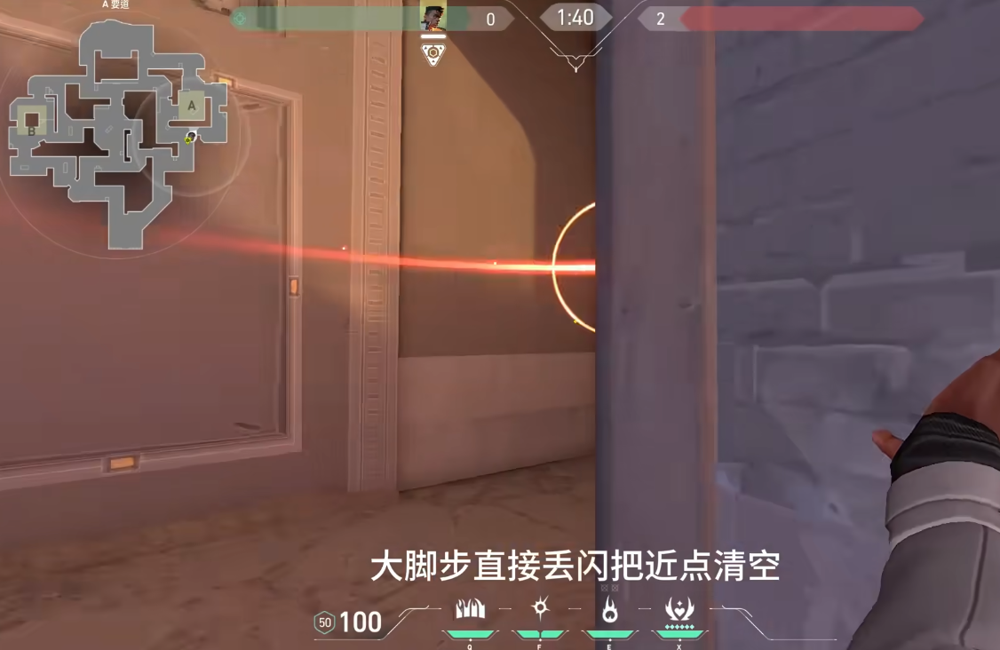
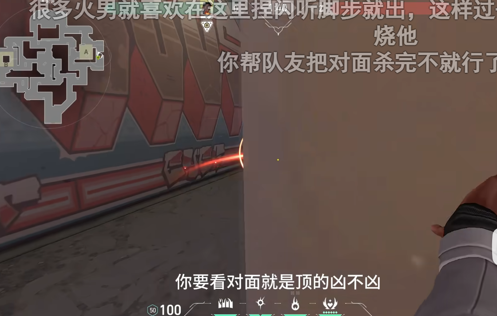
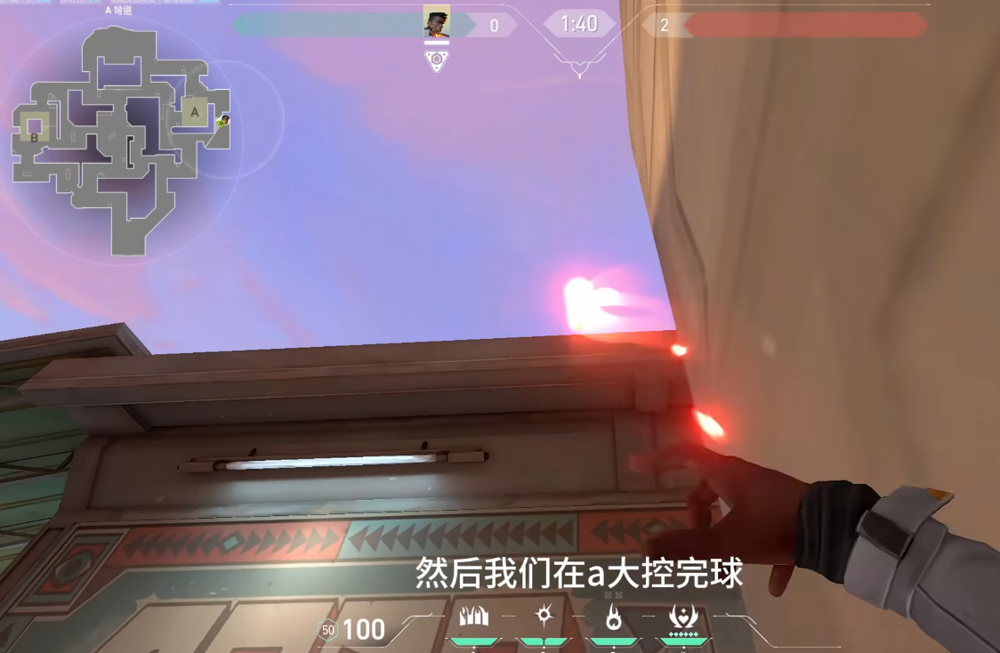
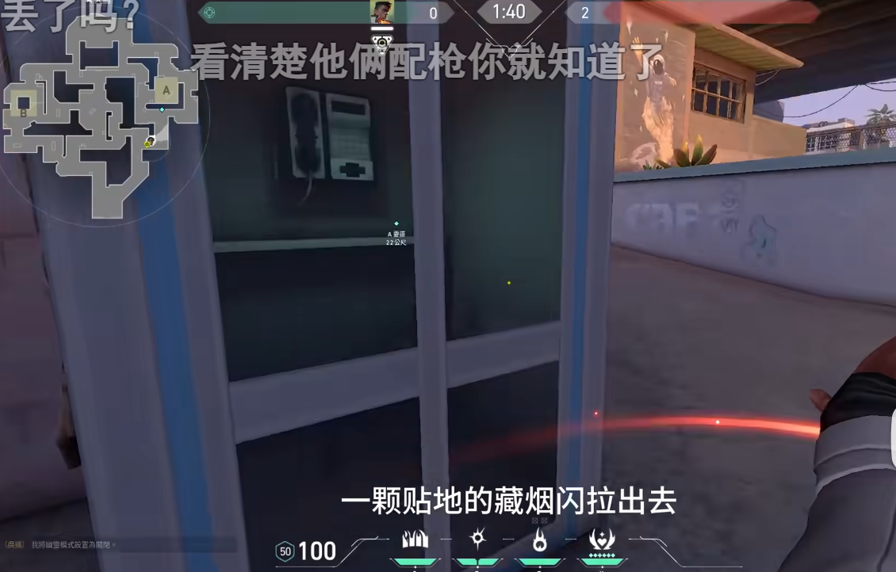

# Sunset

## 火男

### 防守

#### 1 守A ： 单向烟，控A球

对面人多反清闪：

对面人多，退警家打闪出烟

> 套路：等滴包，扔火混墙

#### 2 回防 ： 走超市，两颗闪清包点

丢火清死点：

包点闪：

### 进攻

#### 1 进攻A ： 侧道两颗闪近点，e清死点，烟隔绝警家

第一颗闪：

第二颗闪：

死点火：

#### 2 对面抢A大：等吸球，打闪出

贴地藏烟闪：

 