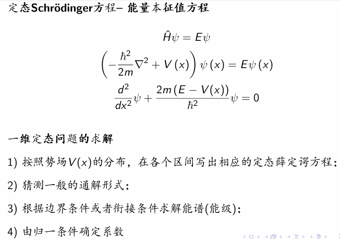

# 2 一维定态问题 薛定谔的代数解法

一些简单的例子，之后的形式讨论中如果陷入虚无，就用这里的具体波函数带入来找一点线索。

<!-- ### 考点：一维定态问题

#### 自由粒子

在一维定态问题中，**自由粒子**指的是在无势场作用下运动的粒子，即势能 \( V(x) = 0 \)。在量子力学中，解决自由粒子的定态问题的核心方法主要基于求解**自由粒子的薛定谔方程**，并分析其解的性质。

1. 核心方法

    1. **求解薛定谔方程**：

        自由粒子的一维定态薛定谔方程为：

        $$
        -\frac{\hbar^2}{2m} \frac{d^2 \psi(x)}{dx^2} = E \psi(x)
        $$

        其中 \( E \) 为粒子的能量，\( \psi(x) \) 为对应的波函数。

    2. **解的形式**：

        方程的通解为平面波：

        $$
        \psi(x) = A e^{i k x} + B e^{-i k x}
        $$

        其中 \( k = \frac{\sqrt{2mE}}{\hbar} \) 是波数，\( A \) 和 \( B \) 是待定系数。这个解表示自由粒子的波函数是由两个平面波组成的，分别表示沿正方向和负方向传播的波。

    3. **动量和能量的关系**：

        在自由粒子情况下，能量 \( E \) 与动量 \( p \) 有如下关系：

        $$
        E = \frac{p^2}{2m}
        $$

        对应的波数与动量的关系为 \( p = \hbar k \)。因此，波数 \( k \) 和能量 \( E \) 都是连续可取的。

2. 核心结果

    1. **归一化问题**：

    自由粒子的波函数 \( \psi(x) = e^{i k x} \) 并不满足平方可积条件，通常需要使用**散射态的归一化**方法，即用**Dirac归一化**。在此情况下，粒子的波函数归一化条件为：

    $$
    \langle \psi_{k'} | \psi_k \rangle = \delta(k - k')
    $$

    这反映了自由粒子在不同波数状态下是正交的。

    2. **概率流密度和动量期望值**：

    对于平面波解，概率流密度 \( J = \frac{\hbar k}{m} |\psi|^2 \) 表示粒子的定向流动。自由粒子的动量具有确定值 \( p = \hbar k \)，而其位置不确定。

3. 核心结论

    1. **连续谱**：由于自由粒子的波数 \( k \) 和能量 \( E \) 是连续的，其能级为**连续谱**。这意味着自由粒子没有量子化的能量值。

    2. **动量和位置的不确定性**：对于自由粒子，动量是确定的，但位置完全不确定（波函数在空间上是均匀分布的）。这种不确定性反映了**位置和动量的对易关系**。

    3. **无束缚态**：自由粒子不受任何束缚，波函数描述的是一种**散射态**或**行波态**，这与束缚态（如粒子在有限势阱中）的解有所不同。

    4. **平面波解的物理意义**：平面波 \( e^{i k x} \) 表示具有确定动量的粒子，运动方向由 \( k \) 的正负决定。

势阱势垒

δ势

---

## 0 定态

## 1 自由粒子

## 2 有限深方势阱

## 3 无限深方势阱

## 4 Delta函数势

## 5 组合势 任意势（可解） -->

## 考点10：自由粒子

1. 知道自由粒子坐标向量表达式，求动量

2. 知道t=0时刻自由粒子表达式，求时间演化

## 考点11：无限深方势阱

1. 对于无限深方势阱，E<0 的情况？会不会出现？是束缚态还是散射态？ - 不存在解 - 证明

