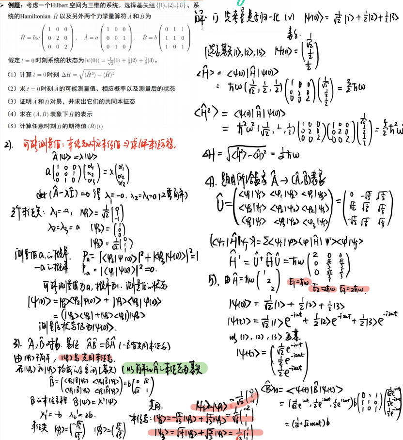

# 4 数学工具 理论基础

这一章是完全抽象的数学层面上的讨论。

对波函数（态矢量）的三种表示方法：具体波函数 Dirac左矢、右矢 矩阵表示。相互灵活转变。

数学工具：脱离了之前用一系列的基矢表示波函数，之后的部分采用左矢来表示波函数，右矢表示波函数的共轭函数。脱离之前用具体的表达式表示力学量，之后用算符来表示力学量。

理论基础：一些观测量，表象，时间演化 用一条逻辑线来统一？

## 4.1 左矢、右矢 Hilbert空间

波函数和算符是量子理论的两块基石。体系的状态用波函数表示，可观察量用算符表示。数学上讲，波函数满足抽象矢量的定义条件，算符作为线性变换作用于矢量之上。因此，量子力学的自然语言是线性代数。

采用了Dirac符号，用右矢来表示一个量子态。

### 0 Dirac表示与矩阵表示

右矢：

$$
|\alpha\rangle\to\mathbf{a}=\begin{pmatrix}a_1\\\\a_2\\\vdots\\\\a_N\end{pmatrix}.
$$

左矢则是行矩阵

内积：

$$
\left\langle\alpha\right|\beta\rangle=a_{1}^{*}b_{1}+a_{2}^{*}b_{2}+\cdots a_{N}^{*}b_{N}.
$$

算符：

$$
\big|\beta\big>=T\big|\alpha\big>\to\mathbf{b}=\mathbf{Ta}=\begin{pmatrix}\begin{array}{cccc}t_{11}&t_{12}&\cdots&t_{1N}\\t_{21}&t_{22}&\cdots&t_{2N}\\\vdots&\vdots&&\vdots\\t_{N1}&t_{N2}&\cdots&t_{NN}\end{array}\end{pmatrix}\begin{pmatrix}\begin{array}{c}a_{1}\\a_{2}\\\vdots\\a_{N}\end{array}\end{pmatrix}.
$$

### 1 左矢、右矢的性质

（1）两个右矢可以相加

$$
|\alpha\rangle+|\beta\rangle=|\gamma\rangle
$$

（2）加法满足交换律和结合律

$$
\begin{array}{c}|\alpha\rangle+|\beta\rangle=|\beta\rangle+|\alpha\rangle,\\\\(|\alpha\rangle+|\beta\rangle)+|\gamma\rangle=|\alpha\rangle+(|\beta\rangle+|\gamma\rangle).\end{array}
$$

(3)存在空矢量，满足

$$
|\alpha\rangle+|\text{null}\rangle=|\alpha\rangle.
$$

存在相反矢，满足

$$
|\alpha\rangle+|\alpha^{\prime}\rangle=|\mathrm{null}\rangle 
$$

(4)数乘与0乘

$$
c \cdot \alpha = c|\alpha\rangle
$$

$$
0 \cdot \alpha = |\mathrm{null}\rangle
$$

(5)数乘交换律、结合律：

$$
\begin{gathered}
(cd)|\alpha\rangle=c(d|\alpha\rangle), \\
(c+d)|\alpha\rangle=c|\alpha\rangle+d|\alpha\rangle, \\
c(|\alpha\rangle+|\beta\rangle)=c|\alpha\rangle+c|\beta\rangle, \\
1|\alpha\rangle=|\alpha\rangle. 
\end{gathered}
$$

(6)对偶(共轭)与内积

$$
|\alpha\rangle\stackrel{\mathrm{DC}}{\longleftrightarrow}\langle\alpha|.
$$

$$
c|\alpha\rangle\stackrel{\mathrm{DC}}{\longleftrightarrow}c^*\langle\alpha|.
$$

$$
(|\alpha\rangle)^\dagger = \langle\alpha|
$$

$$
(c_\alpha|\alpha\rangle+c_\beta|\beta\rangle)^\dagger=c_\alpha^*\langle\alpha|+c_\beta^*\langle\beta|.
$$

内积：

$$
\langle\beta|\alpha\rangle=\begin{pmatrix}\langle\beta|\end{pmatrix}\cdot(|\alpha\rangle)=c
$$

> 注：在此处以及之前的c都表示复数

(7)内积的性质

$$
\langle\beta|\alpha\rangle=\langle\alpha|\beta\rangle^{*}
$$

$$
\langle\alpha|\alpha\rangle\geq0
$$

$$
\langle\gamma|\cdot(c_\alpha|\alpha\rangle+c_\beta|\beta\rangle)=c_\alpha\langle\gamma|\alpha\rangle+c_\beta\langle\gamma|\beta\rangle
$$

(8)态矢量的模

$$
\|\alpha\|=\sqrt{\langle\alpha|\alpha\rangle}
$$

### 2 Hilbert空间

我们要求右矢空间包含所研究系统的所有量子态，因此这个内积空间在模$\|\alpha\|=\sqrt{\langle\alpha|\alpha\rangle}$下是完备的，于是我们称这个右矢空间为Hilbert空间。相应的，左矢空间也是一个Hilbert空间。

以上是文字的模糊表述。数学上的具体表述：

所有x的函数的集合构成了一个矢量空间，而可以证明，全体平方可积函数构成了一个矢量空间（矢量空间的定义参考线性代数）。所有在(a,b)的平方可积函数的集合，也就是：

$$
f(x)\quad\text{满足}\quad\int_{a}^{b}\Bigl|f(x)\Bigr|^{2}\:dx<\infty
$$

构成了一个非常小的矢量空间，数学家称为 $L_2(a,b)$ ，在物理，这就是 Hilbert 空间。因此，在量子力学中：

!!! note
    波函数是处于Hilbert空间中的

## 4.2 线性算符

### 1 线性算符 共轭算符 厄米算符

- 线性算符：满足下面两个条件的是算符称为线性算符：

$$
\begin{aligned}\hat A(|\alpha\rangle+|\beta\rangle)&=\hat A|\alpha\rangle+\hat A|\beta\rangle,\\\\\hat A(c|\alpha\rangle)&=c\hat A|\alpha\rangle.\end{aligned}
$$

- 共轭算符：算符 $\hat A^\dagger$ 称为 $\hat A$ 的厄米共轭算符：

$$
(\hat A|\alpha\rangle)^\dagger=|\alpha\rangle^\dagger\hat A^\dagger=\langle\alpha|\hat A^\dagger
$$

- 厄米(Hermitian)算符：如果 $\hat A^\dagger=\hat A$，算符 $\hat A$ 称为厄米算符

### 2 算符的基本运算

算符有三种基本运算：加法、数乘和乘法

(1)算符的加法

$$
(\hat A+\hat B)|\alpha\rangle=\hat A|\alpha\rangle+\hat B|\alpha\rangle 
$$

(2)算符的数乘

$$
(c\hat{A})|\alpha\rangle=c\hat{A}|\alpha\rangle.
$$

$$
\begin{matrix}(c_a\hat A+c_b\hat B)^\dagger=c_a^*\hat A^\dagger+c_b^*\hat B^\dagger.\end{matrix}
$$

(3)算符的乘积

$$
(\hat A\hat B)|\alpha\rangle=\hat A(\hat B|\alpha\rangle).
$$

且

$$
\hat{A}\hat{B}\neq\hat{B}\hat{A}.
$$

结合律

$$
\hat A(\hat B\hat C)=(\hat A\hat B)\hat C=\hat A\hat B\hat C.
$$

共轭

$$
(\hat A\hat B)^\dagger=\hat B^\dagger\hat A^\dagger.
$$

(4)算符的外积：$|\alpha\rangle\langle\beta|$

$$
(|\alpha\rangle\langle\beta|)|\gamma\rangle = |\alpha\rangle(\langle\beta||\gamma\rangle)
$$

故外积作用到一个右矢上得到另一个右矢，所以其可以被看做一个算符。

$$
(|\alpha\rangle\langle\beta|)^{\dagger}=|\beta\rangle\langle\alpha|
$$

(5)投影算符：$\hat{P}_\alpha=|\alpha\rangle\langle\alpha|$

投影算符可以将任意的 $|\gamma\rangle$ 投影到 $|\alpha\rangle$上。投影系数为 $\langle\alpha|\gamma\rangle$

(6)对于厄米算符，有：

$$
\langle\alpha|\hat A|\beta\rangle=\langle\beta|\hat A|\alpha\rangle^{*}.
$$

### 3 算符的本征值和本征矢量

- 本征方程

- 本征值与本征矢量

!!! note "定理"
    厄米算符的本征值都是实数，对应于不同本征值的本征矢量相互正交。

## 4.3 测量与可观测量

注意：对于可观测量，第一个应该想到的就是位置x与动量p；然后才是能量E。

### 1 观测与本征态

量子力学关于测量理论的假设：如果一个系统处在力学量$\hat{A}$的本征态，则对$\hat{A}$的测量一定给出确定的值，其值为该本征态对应的本征值。相反的，如果对一个系统的某个量子态做$\hat{A}$的测量一定给出确定的值，那么该量子态为$\hat{A}$的本征态，该测量值为相应的本征值。这一假设限制了力学量算符的具体形式，即力学量的可能测量值必须为算符的本征值，同时给出了力学量算符本征值的物理意义。

对任意一个系统，力学量$\hat{A}$的任何一次测量结果一定是它的某个本征值(相反地，每个本征值都是它的可能测量结果),测量后系统坍缩到该本征值所对应的本征态。这也意味着系统原来的状态依赖于该本征态。如果原来的状态是任意态，那么任何态都依赖于$\hat{A}$的本征态。于是，$\hat{A}$的所有本征态形成一个完备集。

### 2 厄米算符

由于物理量的观测值都是实数，所以可观测量对应的力学量都是厄米算符 -- 厄米算符的物理意义

!!! note
    可观测量由厄米算符表示

    厄米算符 = 可测量量 ！

> 验证：动量算符就是厄米算符

### 3 定值态 简并

当对一个全同体系（具有完全相同的内禀属性的同类粒子）构成的系综观测一个可观测量$Q$，每个体系都处于相同的状态，每次测量并不能得到相同的结果。如果制备一个状态，使得每一次观测$Q$都获得同样的值$q$，则这样的态称作可观测量$Q$的定值态。

!!! note
    定值态是$\hat Q$的本征函数，在定值态上测量$Q$一定能够得到本征值$q$。

一个算符所有的本征值的集合称为这个算符的谱，有时候多个线性独立的本征函数具有相同的本征值，这种情况就称作谱的**简并**。

### 4 厄米算符的本征函数

我们的注意力从而指向**厄密算符的本征函数**（**物理上：可观测量的定值态**）。分成两类情况：如
果谱是分立的（即，本征值是分开的）则本征函数处于希耳伯特空间中并且构成物理上可实现
的态。如果谱是连续的（即，本征值充满一个范围）那么本征函数是不可归一化的，并且它们
不能代表可能的波函数（尽管它们的线性迭加 — 这必定包括本征值的一个分布 — 可能是可
归一化的）。某些算符仅有分立谱（例如，谐振子的哈密顿），某些仅有连续谱（例如，自由粒
子的哈密顿），还有一些既具有分立谱也有连续谱（例如，有限深方势阱的哈密顿）。分立谱情
况较易处理，因为相关的内积一定存在 — 实际上，这和有限维理论相似（厄密矩阵的本征矢
量）。我们将首先处理分立谱，然后再考虑连续谱。

- 分立谱

!!! note

    1. 实数性：厄米算符的本征值是实数。

    2. 正交性：厄米算符属于不同本征值的本征函数是相互正交的；
        简并态下，不同本征函数对应了一个相同的本征值，这些本征函数（本征矢量）不一定保持正交，但是可以用Gram–Schmidt等正交化方法实现其正交化。

    3. 完备性：厄米算符（可观测量算符）的本征函数是完备的：（在Hilbert空间中）任何函数都可以用它们的线性叠加来表达。

- 连续谱

如果一个厄密算符的谱是连续的，由于内积可能不存在，其本征函数是不可归一化的，定理 1
和2的证明就不成立。然而，在某种意义上三个基本的性质（实数性、正交性、完备性）依然
成立。

> 求动量算符的本征值与本征函数

> 求坐标算符的本征值与本征函数

### 5 广义统计诠释 - 可观测量的几率

由波函数，我们知道如何求一个粒子在某一特定位置出现的概率，以及如何确定任意一个可观测量的期待值；由薛定谔方程，我们知道如何求出能量测量的可能结果，以及其出现的概率。广义统计诠释：包含了上述内容，并且可以计算出任何测量的可能结果，以及出现这些结果的概率。

广义统计诠释：如果测量一个处于$\Psi(x,t)$ 态的粒子的可观测量$Q(x,p)$,那么，其结果一定是厄密算符$\hat{Q}(x,-idt/dx)$的一个本征值。如果$\hat{Q}$的谱是分立的，得到与正交归一本征函数$f_n(x)$相应的本征值$q_n$的几率是

$$\begin{vmatrix}c_n\end{vmatrix}^2,\quad\text{其中}\quad c_n=\Big\langle\begin{array}{c}f_n|\Psi\Big\rangle.\end{array}$$

如果$\hat{Q}$的谱是连续的，具有实数本征值 $q(z)$ 及狄拉克-正交归一的本征函数 $f_{_x}(x)$,则得到
结果在范围$dz$的几率是

$$\left|c(z)\right|^2dz\quad\text{其中}\quad c(z)=\Big\langle f_z\Big|\Psi\Big\rangle.$$

测量之后，波函数“坍塌”于相应的本征态。

### 6 可观测量的均值

一个可观测量的本征函数是完备的，所以波函数可以写作它们的线性叠加：（以分立谱为例）

$$
\Psi(x,t)=\sum_{n}c_{n}\:f_{n}(x).
$$

由于本征函数正交归一。展开系数可由傅里叶技巧得到：

$$
c_{n}=\Big\langle\:f_{n}\Big|\Psi\Big\rangle=\int\:f_{n}(x)^{*}\Psi(x,t)\:dx.
$$

当然，总的几率一定是 1 ：

$$
\sum_n\lvert c_n\rvert^2=1,
$$

$Q$的期望值则是任何可能性的本征值与本征值出现的几率求和：

$$
\left\langle Q\right\rangle=\sum_{n}q_{n}\left|c_{n}\right|^{2}.
$$

另一种求法，但结果相同：

$$
\left\langle Q\right\rangle=\left\langle\Psi\left|\hat{Q}\Psi\right\rangle=\left\langle\left(\sum_{n^{\prime}}c_{n^{\prime}}f_{n^{\prime}}\right)\right|\left(\hat{Q}\sum_{n}c_{n}f_{n}\right)\right\rangle,\\\text{但是 }\hat{Q}f_{n}=q_{n} f_{n} , \text{所以}\\\left\langle Q\right\rangle=\sum_{n^{\prime}}\sum_{n}c_{n^{\prime}}^{*}c_{n}q_{n}\left\langle f_{n^{\prime}}\left| f_{n}\right\rangle=\sum_{n^{\prime}}\sum_{n}c_{n^{\prime}}^{*}c_{n}q_{n}\delta_{n^{\prime}n}=\sum_{n}q_{n}\left|c_{n}\right|^{2}.\right\rangle 
$$

> 由统计诠释来检验位置测量的概率与期待值

由动量的本征函数：

$$
f_p(x)=(1/\sqrt{2\pi\hbar})\int_{-\infty}^{\infty}\exp(ipx/\hbar)
$$

$$
c(p)=\Big\langle\begin{array}{c}f_p\big|\Psi\Big\rangle=\frac{1}{\sqrt{2\pi\hbar}}\Big]_{-\infty}^{\infty}e^{-ipx/\hbar}\Psi(x,t) dx.\end{array}
$$

这就是动量空间波函数:

$$
\Phi(p,t)=\frac{1}{\sqrt{2\pi\hbar}}\int_{-\infty}^{\infty}e^{-ipx/\hbar}\Psi(x,t) dx;\\\Psi(x,t)=\frac{1}{\sqrt{2\pi\hbar}}\int_{-\infty}^{\infty}e^{-ipx/\hbar}\Phi(p,t) dp.
$$

由广义统计诠释，对动量的测量得到结果在$dp$的几率是：

$$
\begin{vmatrix}\Phi(p,t)\end{vmatrix}^{2}dp.
$$

## 4.4 共同本征态 对易 不确定关系 量子化条件

由共同本征态引入对易，再由对易关系引出不确定关系。

### 1 共同本征态 对易

一个态 $|\alpha\rangle$ 可以同时是两个可观测量 $\hat A$ $\hat B$ 的本征态，即

$$
\hat A|\alpha\rangle=a|\alpha\rangle,\quad\hat B|\alpha\rangle=b|\alpha\rangle.
$$

进行一些演化，

$$
\hat{A}\hat{B}|\alpha\rangle=\hat{A}b|\alpha\rangle=ab|\alpha\rangle=\hat{B}a|\alpha\rangle=\hat{B}\hat{A}|\alpha\rangle\quad\Rightarrow\quad(\hat{A}\hat{B}-\hat{B}\hat{A})|\alpha\rangle=0.
$$

引出对易关系，称为 $\hat A 和\hat B$ 可对易：

$$
\hat A\hat B=\hat B\hat A.
$$

定义对易子：

$$
[\hat{A},\hat{B}]=\hat{A}\hat{B}-\hat{B}\hat{A}.
$$

### 2 不确定关系

$$
\boxed{\begin{array}{c}\sigma_A^2\sigma_B^2\geq\left(\frac{1}{2i}\Big\langle\Big[ \hat{A},\hat{B}\Big]\Big\rangle\right)^2.\end{array}}
$$

其中，

$$
\sigma_{A}^{2}=\left\langle(\hat{A}-\left\langle A\right\rangle\right)\Psi\left|\left(\hat{A}-\left\langle A\right\rangle\right)\Psi\right\rangle= \langle f|f \rangle.
$$

- 位置-动量不确定关系

$$\begin{bmatrix}\hat{x},\hat{p}\end{bmatrix}=i\hbar $$

所以

$$\sigma_{x}^{2}\sigma_{p}^{2}\geq\left(\frac{1}{2i}i\hbar\right)^{2}=\left(\frac{\hbar}{2}\right)^{2},$$

或者，因为标准差由其本质是正值，

$$\sigma_{_x}\sigma_{_p}\geq\frac{\hbar}{2}.$$

- 最小不确定波包

- 能量-时间不确定关系

### 3 量子化条件

基本对易关系：

$$
[\hat{q}_\alpha,\hat{q}_\beta]=0,\quad[\hat{p}_\alpha,\hat{p}_\beta]=0,\quad[\hat{q}_\alpha,\hat{p}_\beta]=i\hbar\delta_{\alpha\beta},
$$

对易计算关系：

$$
\begin{aligned}对易计算关系\\
[\hat{A},\hat{B}+\hat{C}]&=[\hat{A},\hat{B}]+[\hat{A},\hat{C}], \\
[\hat{A}+\hat{B},\hat{C}]&=[\hat{A},\hat{C}]+[\hat{B},\hat{C}], \\
[\hat{A},\hat{B}\hat{C}]&=\hat{B}[\hat{A},\hat{C}]+[\hat{A},\hat{B}]\hat{C}, \\
[\hat{A}\hat{B},\hat{C}]&=\hat{A}[\hat{B},\hat{C}]+[\hat{A},\hat{C}]\hat{B}. \end{aligned}
$$

角动量对易关系：

$$
[\hat{L}_x,\hat{L}_y]=i\hbar\hat{L}_z,\quad[\hat{L}_y,\hat{L}_z]=i\hbar\hat{L}_x,\quad[\hat{L}_z,\hat{L}_x]=i\hbar\hat{L}_y.
$$

## 4.5 表象和表象变换 矩阵表示

前面提到，态矢的表示有两种情况：分立谱以及连续谱。对于分立谱，可以采用额外的矩阵表示。我们先介绍分立谱的表象和表象变换，再介绍连续谱的表象和表象变换。

### 1 态矢量的表示 表象变换矩阵

- 基矢 态矢量

选择可观测量 $\hat A$的本征态 $\{|n\rangle\}$ 作为 Hilbert 空间的基矢，可以将任意态矢量 $|\psi\rangle$ 表示基矢的线性组合：

$$
|\psi\rangle=\sum_{n}\psi_{n}|n\rangle,
$$

- 表象变换

假定两个表象 $\hat A$ 和 $\hat A'$，基矢分别为 $\{|n\rangle\}$ 和 $\{|n'\rangle\}$，则可以用两套基矢表示态矢量。

基矢n'在基矢n的表示为：

$$
|n'\rangle=\sum_{n}|n\rangle\langle n|n'\rangle.
$$

$$
(|1'\rangle,|2'\rangle,\cdots,|N'\rangle)=(|1\rangle,|2\rangle,\cdots,|N\rangle)\begin{pmatrix}\langle1|1'\rangle&\langle1|2'\rangle&\cdots&\langle1|N'\rangle\\\langle2|1'\rangle&\langle2|2'\rangle&\cdots&\langle2|N'\rangle\\\vdots&\vdots&\ddots&\vdots\\\langle N|1'\rangle&\langle N|2'\rangle&\cdots&\langle N|N'\rangle\end{pmatrix}.
$$

得到表象变换矩阵：

$$
\hat{U}=\left(\begin{array}{cccc}\langle1|1'\rangle&\langle1|2'\rangle&\cdots&\langle1|N'\rangle\\\langle2|1'\rangle&\langle2|2'\rangle&\cdots&\langle2|N'\rangle\\\vdots&\vdots&\ddots&\vdots\\\langle N|1'\rangle&\langle N|2'\rangle&\cdots&\langle N|N'\rangle\end{array}\right).
$$

### 2 算符矩阵表示 算符表象变换

用矩阵表示算符：

$$
\hat{F}=\left(\begin{array}{cccc}\langle1|\hat{F}|1\rangle&\langle1|\hat{F}|2\rangle&\cdots&\langle1|\hat{F}|N\rangle\\\langle2|\hat{F}|1\rangle&\langle2|\hat{F}|1\rangle&\cdots&\langle2|\hat{F}|N\rangle\\\vdots&\vdots&\cdots&\vdots\\\langle N|\hat{F}|1\rangle&\langle N|\hat{F}|2\rangle&\cdots&\langle N|\hat{F}|N\rangle\end{array}\right).
$$

算符的表象变化：

$$
\hat{F}'=\hat{U}^{\dagger}\hat{F}\hat{U}.
$$

### 3 坐标和动量表象

## 4.6 时间演化 运动方程 守恒量与对称性

如果知道t=0系统的状态，需要用时间演化来推演任意t时刻的状态。这个思路下，推导出能够描述波矢随时间变化的方程：运动方程，也就是薛定谔方程。随时间不变的量叫做守恒量，而随时间演化相同的变换叫做对称性，我们发现守恒量与对称性之间有函数关系。

### 1 时间演化算符 运动方程 薛定谔方程

**定义：** 时间演化算符

$$
|\psi(t')\rangle=\hat{U}(t',t)|\psi(t)\rangle.
$$

1. 时间演化算符是线性算符

2. 时间演化算符是幺正算符: $\langle\psi(t)|\hat{U}^\dagger(t',t)\hat{U}(t',t)|\psi(t)\rangle=1.$

**证明：** 由时间演化算符可以推导出薛定谔方程

考虑微分：

$$
\hat{U}(t+\delta t,t)=1+\delta t\hat{\alpha}(t),
$$

$$
\begin{aligned}
\frac{\partial}{\partial t}|\psi(t)\rangle & =\lim_{\delta t\to0}\frac{|\psi(t+\delta t)\rangle-|\psi(t)\rangle}{\delta t} \\
&=\lim_{\delta t\to0}\frac{\hat{U}(t+\delta t,t)-1}{\delta t}|\psi(t)\rangle=\hat{\alpha}(t)|\psi(t)\rangle.
\end{aligned}
$$

**算符 $i\hbar\hat{\alpha}(t)$ 是Hermite算符且具有能量量纲** 。方程两边都乘 $i\hbar$ : 

$$
i\hbar\frac{\partial}{\partial t}|\psi(t)\rangle=\hat{H}|\psi(t)\rangle.
$$

得到一个运动方程，类似于牛顿第二定律。这就是 **薛定谔方程**。

可以写成矩阵形式：

$$
i\hbar\frac{\partial}{\partial t}\left(\begin{array}{c}c_1(t)\\c_2(t)\\\vdots\\c_n(t)\end{array}\right)=\left(\begin{array}{cccc}H_{11}&H_{12}&\cdots&H_{1n}\\H_{21}&H_{22}&\cdots&H_{2n}\\\vdots&\vdots&\cdots&\vdots\\H_{n1}&H_{n2}&\cdots&H_{nn}\end{array}\right)\left(\begin{array}{c}c_1(t)\\c_2(t)\\\vdots\\c_n(t)\end{array}\right)
$$

### 2 定态

不含时哈密顿算符的本征态（能量算符本征态）称为定态。**在定态下。所有不含时的可观测量（力学量）的期待值和可测量值的几率分布不随时间变化。**

注意两个条件：$\hat H$ 不含时 ； 需要处于 $\hat H$ 的本征态（我们求解最多的一个本征态）下，其能量确定，可观测量的期待值和几率不变。

举一个例子来说明：考虑一个简单的谐振子系统，其Hamiltonian为 $H = \frac{p^2}{2m} + \frac{1}{2}m\omega^2 x^2$，其中 $p$ 为动量，$m$ 为质量，$\omega$ 为振动频率。系统的能量本征态为谐振子的能级，每个能级对应一个确定的能量值。如果系统处于某个能级的能量本征态中，那么系统的能量将保持不变，不会随时间变化。因此，在这个能级上，谐振子的位置、动量等可观测量的期望值和测量结果的概率分布也将保持不变，不会随时间变化。

### 3 力学量期待值的时间演化

- 然而对于含时间的 $\hat H$，系统不处于定态。其时间演化算符可以推出：

含时Hamiltonian的时间演化算符可以通过薛定谔方程的解得到。假设系统的Hamiltonian是时间的函数$H(t)$，时间演化算符$U(t, t_0)$满足如下薛定谔方程：

\[i\hbar \frac{d}{dt}U(t, t_0) = H(t)U(t, t_0)\]

其中$t_0$是初始时间。上述方程的解可以写为：

\[U(t, t_0) = \mathcal{T} \exp\left(-\frac{i}{\hbar} \int_{t_0}^{t} H(t') dt'\right)\]

其中$\mathcal{T}$表示按时间有序排列，即时间演化算符的作用顺序与时间的先后顺序一致。这个时间演化算符描述了系统在含时Hamiltonian下的时间演化过程。

$$
|\psi(t)\rangle=\hat{U}(t,t_0)|\psi(t_0)\rangle.
$$

$$
|\psi(t)\rangle=\hat{U}(t,0)|\psi(0)\rangle.
$$

- 对于不含时的 $\hat H$，若系统处状态并不是 $\hat H$ 的本征态，任一算符的期待值和几率分布都会变化。

由定态薛定谔方程推导出了时间演化算符：

\[U(t, t_0) = e^{-\frac{i}{\hbar}H(t-t_0)}\]

带入 $H(t,0)$，得到波函数随时间演化：

$$
|\psi(t)\rangle = e^{-\frac{i}{\hbar}Ht} |\psi(0)\rangle
$$

$$
|\psi_n(t)\rangle = e^{-\frac{i}{\hbar}E_n t} |\psi(0)\rangle
$$

求出力学量A期待值随时间演化：

$$
\langle\hat A\rangle = \langle\psi(t)|\hat A |\psi(t)\rangle
$$

求出力学量A得到测量值a的机率分布随时间演化：

$$
P(a) = |\langle \psi | a \rangle|^2
$$

（参见4.3 广义统计诠释与可观测量的均值）

一道例题

### 4 守恒量

**推导**：力学量的期待值随时间的演化方程

在任意态下：

$$
\frac{d}{dt}\langle\psi|\hat{F}|\psi\rangle=\left(\frac{\partial}{\partial t}\langle\psi|\right)\hat{F}|\psi\rangle+\langle\psi|\hat{F}\left(\frac{\partial}{\partial t}|\psi\rangle\right)+\langle\psi|\left(\frac{\partial}{\partial t}\hat{F}\right)|\psi\rangle.
$$

假定$H$不含时

$$
\frac{d}{dt}\langle\psi|\hat{F}|\psi\rangle=\frac{1}{i\hbar}\langle\psi|[\hat{F},\hat{H}]|\psi\rangle+\langle\psi|\left(\frac{\partial}{\partial t}\hat{F}\right)|\psi\rangle 
$$

得到 **守恒量的定义**。如果满足：

$$
[\hat{F},\hat{H}]=0
$$

**则在任何状态下 $\hat F$的期待值不随时间变化**。即

$$
<\hat F> = \langle\psi|\hat{F}|\psi\rangle = Const.
$$

### 5 对称性 对称性与守恒量的关系

**对称性**：在对称变换 $\hat Q$ 下，系统的量子态 $|\psi\rangle$ 和 $|\psi'\rangle$ 遵从相同的时间演化规律。

满足 **$\hat Q$ 变换下具有对称性的条件**:

$$
\hat{Q}\hat{H}\hat{Q}^{-1}=\hat{H},\quad 即 \quad[\hat{Q},\hat{H}]=0
$$

 

**Wiagner定理:对称变换Q一定是一个幺正算符或反幺正算符**

 

---

**对称性与守恒量的关系：**

$\hat Q$ 是一个对称变换；$\hat F$是一个守恒量。它们满足：

$$
\boxed{
\hat{Q}=e^{i\eta\hat{F}}
}
$$

---

变换：时空的 **平移，旋转，反演**

- 空间平移对称性 动量守恒

$$
\hat{T}(x)=\lim\limits_{N\to\infty}\left[e^{-i\frac{x}{N}\frac{\hat{p}_{x}}{\hbar}}\right]^{N}=e^{-ix\hat{p}_{x}/\hbar}.
$$

- 空间旋转对称性 角动量守恒

$$
\hat{R}_n(\phi)=e^{-i\phi \vec L\cdot \vec n/\hbar}
$$

- 空间反演对称性 宇称守恒

$$
\mathcal{P} \Pi \mathcal{P}^{-1} = \Pi
$$

- 时间反演对称性 能量守恒

$$
\Theta H \Theta^{-1} = H
$$

