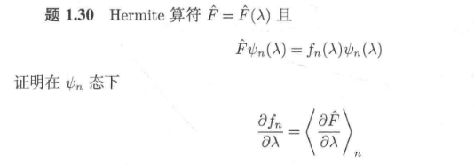
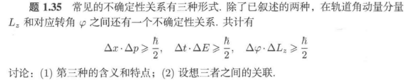
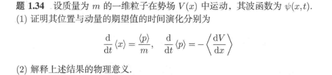
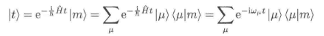

# 1 基本假设 数学工具 形式理论

4.1-4.2是完全抽象的数学层面上的讨论。（线性代数）

4.3-4.7是用形式符号表示粒子的理论讨论。也就是说，完全不给出系统的具体波函数，仅仅使用数学代号进行推演，得到一些普适的结论。

对波函数（态矢量）的三种表示方法：具体波函数 Dirac左矢、右矢 矩阵表示。相互灵活转变。

数学工具：脱离了之前用一系列的基矢表示波函数，之后的部分采用左矢来表示波函数，右矢表示波函数的共轭函数。脱离之前用具体的表达式表示力学量，之后用算符来表示力学量。

理论基础：一些观测量，表象，时间演化 用一条逻辑线来统一？

## 4.0 基本假设

### 考点1：波函数

1. **态叠加原理的考题**：

    - 题目：若粒子处于 \( \psi_1 \) 和 \( \psi_2 \) 的叠加态 \( \psi = a\psi_1 + b\psi_2 \)，求测量相应可观测量的概率分布。

    - 答案：计算态的模平方 \( |a|^2 \) 和 \( |b|^2 \) 分别代表测量得到相应结果的概率。

2. **归一化条件的考题**：

    - 题目：一粒子处于一维势阱中的波函数为 \( \psi(x) = A e^{-\alpha |x|} \)，其中 \( \alpha > 0 \)，求 \( A \) 以满足归一化条件。

    - 答案：计算 \( A \) 满足 \( \int_{-\infty}^{+\infty} |A e^{-\alpha |x|}|^2 dx = 1 \) 后，得到 \( A = \sqrt{\frac{\alpha}{2}} \)。

### 考点2：概率、期望预言

1. 散射态：表示为平面波的线性组合

    

    

    

2. 束缚态：直接运用概率统计诠释

### 考点3：散射态与束缚态的性质

### 1 波函数

在量子力学中，**波函数** 是描述系统状态的核心概念之一。它提供了粒子的位置、动量等物理属性的概率信息，而非精确的数值。波函数通常记作 \(\psi(x, t)\)，其中 \(x\) 代表位置，\(t\) 代表时间。下面是对波函数的详细解释：

1. **波函数的基本概念**

    波函数是描述量子系统的一个复数值函数，包含了系统所有的可观察信息。通过对波函数的平方取模，我们可以得到与该系统相关的各种物理量的概率分布。波函数的形式取决于所描述的物理系统的特性。

    - **概率密度**：对于一维系统，波函数的模方 \(|\psi(x, t)|^2\) 代表了粒子在位置 \(x\) 处的 **概率密度**。也就是说，粒子在某个位置出现的概率与波函数的平方成正比。
    
    $$
    P(x, t) = |\psi(x, t)|^2
    $$

    其中 \(P(x,t)\) 是粒子出现在 \(x\) 位置的概率密度。

    - **归一化条件**：波函数必须满足归一化条件，即：

    $$
    \int_{-\infty}^{\infty} |\psi(x, t)|^2 \, dx = 1
    $$

    这保证了粒子在所有位置出现的总概率为 1。

2. **波函数的物理含义**

    波函数不仅仅是数学上的一个对象，它具有具体的物理含义。根据量子力学的基本假设，波函数包含了系统的所有信息。对于一维系统，波函数的实部和虚部分别表示系统的 **空间分布** 和 **相位信息**。

    - **实部和虚部**：如果我们将波函数写为复数形式：

    $$
    \psi(x, t) = \psi_{\text{Re}}(x, t) + i \psi_{\text{Im}}(x, t)
    $$

    其中 \(\psi_{\text{Re}}\) 是实部，\(\psi_{\text{Im}}\) 是虚部，二者提供了系统在位置 \(x\) 和时间 \(t\) 时的完整描述。尽管波函数本身是复数，但我们通常通过其模方来得到概率。

    - **相位**：波函数中可能包含一个相位因子，表示系统的量子相位。这种相位信息对于干涉和波粒二象性等量子现象至关重要。

3. **薛定谔方程与波函数**

    波函数是薛定谔方程的解。薛定谔方程描述了量子系统随时间演化的方式。对于一个粒子在势能 \(V(x)\) 中的行为，时间依赖的薛定谔方程为：

    $$
    i \hbar \frac{\partial \psi(x,t)}{\partial t} = \hat{H} \psi(x,t)
    $$

    其中 \(\hat{H}\) 是哈密顿算符，表示粒子的总能量，\(\hbar\) 是约化普朗克常数。

    薛定谔方程可以分为两部分：

    - **定态薛定谔方程**：当系统的哈密顿量不随时间变化时，波函数的时间演化可以被忽略，此时得到的是定态波函数：

    $$
    \hat{H} \psi(x) = E \psi(x)
    $$

    其中 \(E\) 是系统的能量本征值，\(\psi(x)\) 是定态波函数。

    - **时间依赖薛定谔方程**：若系统随时间变化，波函数的演化则由时间依赖的薛定谔方程来描述。

4. **波函数的物理解读**

    波函数的平方模表示了粒子出现在某一位置的概率，但并不能告诉我们粒子在某一时刻的具体位置。量子力学中的不确定性原理表明，位置和动量等物理量不能同时具有精确的值。波函数提供的是关于物理量的概率分布，而非一个确定的结果。

    - **粒子的位置和动量**：量子力学中的粒子并不是像经典物理中那样具有确定的轨迹。粒子在某一时刻的位置是概率性的，表示为波函数的模方。
    
    - 对于位置算符 \(\hat{x}\)，粒子在位置 \(x\) 的概率密度是 \(|\psi(x,t)|^2\)。
    
    - 对于动量算符 \(\hat{p}\)，动量的概率分布可以通过对波函数进行傅里叶变换得到。

5. **波函数的展开**

    波函数可以展开成某个完整正交基底的线性组合，通常为能量本征态。比如在势阱问题中，波函数可以展开成一组能量本征态：

    $$
    \psi(x) = \sum_n c_n \psi_n(x)
    $$

    其中，\(\psi_n(x)\) 是能量本征态，\(c_n\) 是展开系数。

    这种展开形式使得波函数在量子态之间的转换、量子叠加等现象得以体现。不同的基态代表不同的能量水平和态。

6. **波函数的例子：量子谐振子**

    以量子谐振子为例，系统的波函数可以写作：

    $$
    \psi_n(x) = N_n H_n\left( \frac{x}{\sqrt{2\hbar/m\omega}} \right) \exp\left( -\frac{x^2}{2\hbar/m\omega} \right)
    $$

    其中，\(N_n\) 是归一化常数，\(H_n\) 是赫尔米特多项式，\(\omega\) 是谐振子的频率，\(\hbar\) 是普朗克常数，\(m\) 是粒子质量。

    这些波函数 \(\psi_n(x)\) 对应着不同的能量本征态，每个 \(n\) 对应着一个能量本征值：

    $$
    E_n = \left( n + \frac{1}{2} \right)\hbar \omega
    $$

7. **总结**

    波函数在量子力学中扮演着核心角色，它提供了对粒子行为的概率性描述。通过波函数的平方，我们能够得知粒子在某一位置的出现概率，进而描述粒子的量子状态。薛定谔方程则是描述波函数随时间演化的基础方程。而波函数的形式和其归一化条件为我们提供了解析和计算量子力学问题的重要工具。

### 2 薛定谔方程

薛定谔方程：

$$
\hat H\psi = \hat E\psi
$$

这本质上就是一个能量本征值方程，描述粒子运动状态。量子力学（一）的主要内容，就是用不同的方法求解这个方程。这些方法对不同的场景（不同的 $\hat H$ 算符）有效，比如代数法应用于一维定态问题。

2. **代数解法**

    代数解法是通过直接求解量子力学中的本征方程来得到系统的本征值和本征态。这种方法适用于一些简单的量子系统，像自由粒子、一维势阱等问题，可以得到精确的解析解。代数解法通常涉及到对哈密顿量的分析和求解本征方程。

    代数解法步骤：

    - **构造哈密顿量**：通过分析物理系统的势能、动能等，构造哈密顿量。

    - **解本征方程**：将哈密顿量代入本征方程并求解。

    优点：

    - 可以得到精确解，适用于简单量子系统。

    - 计算简单直观。

    缺点：

    - 对于复杂势能或多粒子系统，代数解法很难解决。

1. **升降算符法**

    升降算符法广泛应用于量子力学中的粒子模型，特别是在求解量子谐振子等问题时。这种方法通过引入 **升算符** (\(\hat{a}^\dagger\)) 和 **降算符** (\(\hat{a}\))，将哈密顿量表示为这两个算符的组合，并通过这些算符的作用来得到量子态的本征值和本征态。

    升降算符法的步骤：

    - **引入升降算符**：在量子谐振子模型中，哈密顿量可以写成：

    $$
    \hat{H} = \frac{\hat{p}^2}{2m} + \frac{m\omega^2 \hat{x}^2}{2}
    $$
    其中，\(\hat{p}\) 是动量算符，\(\hat{x}\) 是位置算符。可以定义升降算符为：

    $$
    \hat{a} = \sqrt{\frac{m\omega}{2\hbar}} (\hat{x} + \frac{i}{m\omega} \hat{p})
    $$

    $$
    \hat{a}^\dagger = \sqrt{\frac{m\omega}{2\hbar}} (\hat{x} - \frac{i}{m\omega} \hat{p})
    $$

    - **哈密顿量表达式**：哈密顿量 \(\hat{H}\) 可以通过升降算符重新表达：

    $$
    \hat{H} = \hbar \omega \left( \hat{a}^\dagger \hat{a} + \frac{1}{2} \right)
    $$

    - **本征值问题**：根据升降算符的对易关系：

    $$
    [\hat{a}, \hat{a}^\dagger] = 1
    $$

    可以得到量子态的能量本征值。在量子谐振子的情况下，哈密顿量的本征值为：

    $$
    E_n = \hbar \omega \left( n + \frac{1}{2} \right), \quad n = 0, 1, 2, \dots
    $$

    - **求解波函数**：通过不断应用升降算符 \(\hat{a}^\dagger\) 和 \(\hat{a}\) 于基态 \(|0\rangle\)，我们可以得到其他能级的波函数。

    优点：

    - 升降算符方法非常适用于解决一维谐振子、光学共振腔等问题。

    - 通过算符的方法可以直接得到能量本征值和波函数，而不需要直接解微分方程。

    - 对于涉及到对称性和简化问题的系统非常高效。

    缺点：

    - 该方法主要适用于具有简单对称性的量子系统，对于多粒子系统或复杂势能问题，可能需要引入更复杂的升降算符体系。

    示例：量子谐振子的升降算符法
    
    - 对于量子谐振子，哈密顿量是：

    $$
    \hat{H} = \frac{\hat{p}^2}{2m} + \frac{m\omega^2 \hat{x}^2}{2}
    $$

    使用升降算符得到能量本征值为：

    $$
    E_n = \hbar \omega \left( n + \frac{1}{2} \right)
    $$

    其中，基态 \(|0\rangle\) 的波函数可以通过求解本征方程得到。

3. **矩阵表示法**

    矩阵表示法是将量子态和算符表示为矩阵形式，特别适用于离散化的量子系统。这种方法通过将算符和态向量表示为矩阵，并通过线性代数方法（如矩阵对角化）来求解本征方程。

    矩阵表示法步骤：

    - **选择基底**：在合适的基底下，将波函数和算符表示为矩阵。

    - **对角化矩阵**：通过数值方法对矩阵进行对角化，得到本征值和本征态。

    优点：

    - 适用于较复杂的量子系统，能够处理多体系统等。

    - 数值方法能够解决解析方法难以解决的复杂问题。

    缺点：

    - 对于大系统，计算量大，资源消耗高。

    **总结对比**

    | 方法        | 适用场景                     | 优点                             | 缺点                           |
    |------------|------------------------------|----------------------------------|--------------------------------|
    | **升降算符法** | 量子谐振子、量子光学等简化系统 | 适合具有对称性的系统，能量本征值和波函数求解简便 | 适用于简单对称系统，复杂系统难以应用 |
    | **代数解法** | 简单的量子系统（如自由粒子、一维势阱等） | 直接求解，精确解                 | 复杂系统无法应用，解析解难以求得 |
    | **矩阵表示法** | 离散化量子系统，数值计算     | 适用于复杂系统，能够处理多体问题 | 计算量大，资源消耗高           |

1. **变分法（Variational Method）**

    变分法是一种常用的近似方法，尤其是在处理复杂系统时。基本思想是选择一个试探波函数（通常带有一些可调参数），然后通过最小化系统的能量期望值来找到本征值和本征态。

    步骤：

    1. 选择一个试探波函数 \( \psi_{\text{trial}} \)。

    2. 计算哈密顿量 \( \hat{H} \) 的期望值：

    $$
    E_{\text{trial}} = \frac{\langle \psi_{\text{trial}} | \hat{H} | \psi_{\text{trial}} \rangle}{\langle \psi_{\text{trial}} | \psi_{\text{trial}} \rangle}
    $$
    
    3. 通过改变试探波函数的参数来最小化 \( E_{\text{trial}} \)。

2. **微扰理论（Perturbation Theory）**

    微扰理论用于求解当系统的哈密顿量是一个已知系统的微小扰动时的本征值和本征态。适用于当扰动较小且容易处理的情况。

    步骤：

    1. 将哈密顿量写成两部分：

    $$
    \hat{H} = \hat{H}_0 + \lambda \hat{H}' 
    $$

    其中 \( \hat{H}_0 \) 是可解的哈密顿量，\( \hat{H}' \) 是微扰。

    2. 计算微扰引起的修正：

    - 本征值的修正：

        $$
        E_n^{(1)} = \langle n_0 | \hat{H}' | n_0 \rangle
        $$

        $$
        E_n^{(2)} = \sum_{m \neq n} \frac{|\langle n_0 | \hat{H}' | m_0 \rangle|^2}{E_n^{(0)} - E_m^{(0)}}
        $$

    - 本征态的修正：

        $$
        |\psi_n^{(1)}\rangle = \sum_{m \neq n} \frac{\langle m_0 | \hat{H}' | n_0 \rangle}{E_n^{(0)} - E_m^{(0)}} | m_0 \rangle
        $$

3. **数值方法**

    对于复杂的量子力学系统，解析解可能难以获得。这时可以使用数值方法，如：

    - **矩阵对角化**：将哈密顿量表示为矩阵形式，并求解特征值问题。

    - **有限差分法**：将连续问题离散化，形成一个可以计算的线性方程组。

    - **蒙特卡洛方法**：利用随机数生成的样本，估计期望值和概率分布。

4. **路径积分法（Path Integral Method）**

    路径积分法是另一种重要的量子力学工具，通过求解路径积分来获得量子系统的行为。这种方法特别适合处理粒子在时间演化过程中的本征态。

    步骤：

    1. 表达量子振幅为路径积分：

    $$
    K(x_f, t_f; x_i, t_i) = \int \mathcal{D}[x(t)] e^{\frac{i}{\hbar} S[x(t)]}
    $$

    其中 \( S[x(t)] \) 是作用量。

    2. 使用路径积分计算各种物理量，间接获取本征态。

5. **对称性和守恒量**

    通过利用物理系统的对称性和守恒量，可以简化本征方程的求解过程。例如，角动量的对称性可以用来简化原子系统的哈密顿量，从而容易找到其本征态。

6. **WKB 近似法**

    对于一维量子力学系统，WKB 近似是一种半经典方法，适用于势能变化缓慢的区域，通常用于寻找粒子的能量本征值。

7. **希尔伯特空间的表示**

    在某些情况下，通过将量子态表示为希尔伯特空间中的基态，可以利用线性代数的方法求解本征方程。例如，使用完备正交基展开态：

    $$
    |\psi\rangle = \sum_n c_n |n\rangle
    $$

### 3 量子力学基本假设

量子力学的几大基本假设是该理论的基石，它们为我们提供了对微观世界的描述。以下是量子力学的核心假设：

0. 波粒二象性

1. **物理系统的状态由波函数描述**

    - **假设**：任何物理系统的状态都可以由一个复数值的波函数 \( \psi(x,t) \) 完整描述，这个波函数包含了系统所有可能的物理信息。

    - **波函数的物理意义**：波函数的平方模 \( |\psi(x,t)|^2 \) 给出粒子在某一位置 \( x \) 和时间 \( t \) 处的概率密度，即粒子在某一位置出现的概率。

    - **注意**：波函数本身不一定是可观测的物理量，只有波函数的平方模 \( |\psi(x,t)|^2 \) 才能与实验结果相符合。

2. **量子叠加原理**

    - **假设**：如果一个系统可以处于状态 \( \psi_1 \) 或 \( \psi_2 \)，那么系统也可以处于这两个状态的叠加态，即 \( \psi = c_1 \psi_1 + c_2 \psi_2 \)，其中 \( c_1 \) 和 \( c_2 \) 为常数。

    - **物理意义**：量子系统的状态并不是仅仅一个确定的状态，而是多个状态的线性组合。通过叠加态，量子系统可以在多个可能的状态中同时存在，直到进行测量。

    - **测量的结果**：测量时，系统会“塌缩”到某个具体的本征态，且该本征态出现的概率由波函数的模平方给出。

3. **测量的概率解释（哥本哈根解释）**

    - **假设**：在量子力学中，物理量（如位置、动量、能量等）的测量结果是离散的，并且只能通过量子态的概率来预测。

    - **测量过程**：测量一个物理量时，系统的波函数会“塌缩”到该物理量对应的本征态，并且观测到的结果是该本征态的本征值。

    - **测量后的波函数**：测量后，波函数会变成与测量结果相对应的本征态，而系统的状态会变得确定。

4. **算符和物理量的关系**

    - **假设**：在量子力学中，所有可观测的物理量（如位置、动量、能量等）都对应于算符。物理量的测量值是该算符的本征值。

    - **算符作用**：量子力学中的算符是通过作用在波函数上来描述可观测量的。例如，动量算符 \( \hat{p} = -i\hbar \frac{d}{dx} \)，哈密顿算符 \( \hat{H} \) 代表能量。

    - **本征方程**：对于某个物理量 \( A \)，其本征方程为 \( \hat{A} \psi = a \psi \)，其中 \( \hat{A} \) 是对应的算符，\( a \) 是该物理量的本征值，\( \psi \) 是对应的本征函数。

5. **不确定性原理**

    - **假设**：某些物理量，如位置和动量，不能同时精确地被测量。具体来说，位置 \( x \) 和动量 \( p \) 之间存在不可同时确定的关系，称为不确定性原理。

    - **不确定性关系**：
        $$
        \Delta x \cdot \Delta p \geq \frac{\hbar}{2}
        $$
        其中 \( \Delta x \) 是位置的不确定性，\( \Delta p \) 是动量的不确定性，\( \hbar \) 是普朗克常数除以 \( 2\pi \)。

    - **物理意义**：不确定性原理意味着在量子世界中，我们无法同时精确地知道粒子的所有信息。测量一个物理量会影响另一个物理量的精确性。

6. **量子力学的时间演化（薛定谔方程）**

    - **假设**：系统随时间的演化遵循薛定谔方程，该方程描述了波函数随时间的变化。

    - **薛定谔方程**：
        $$
        i\hbar \frac{\partial}{\partial t} \psi(x,t) = \hat{H} \psi(x,t)
        $$
        其中 \( \hat{H} \) 是哈密顿算符，描述系统的总能量。
        
    - **物理意义**：波函数的时间演化由哈密顿算符决定，能够预测粒子在未来时刻的位置和动量的概率分布。

7. **量子纠缠**

    - **假设**：两个或多个量子系统可以处于一种纠缠态，其中各个部分的状态不能独立地描述，而是彼此相关。

    - **物理意义**：量子纠缠是量子力学特有的现象，即使两个粒子相隔遥远，测量其中一个粒子的状态会立刻影响到另一个粒子的状态。量子纠缠是量子计算和量子通信的重要基础。

这些假设构成了量子力学的基本框架。它们不仅仅是数学上的定义，还代表了我们对于微观世界的理解：系统状态的概率性质、物理量的量子化、测量过程的特殊性等。这些基本假设在实践中经受住了实验验证，并且是现代物理学中的基础原理。

## 4.1 左矢、右矢 Hilbert空间

波函数和算符是量子理论的两块基石。体系的状态用波函数表示，可观察量（力学量）用算符表示。数学上讲，波函数满足抽象矢量的定义条件，算符作为线性变换作用于矢量之上。因此，量子力学的自然语言是线性代数。

采用了Dirac符号，用右矢来表示一个量子态。

### 0 Dirac表示与矩阵表示

右矢：

$$
|\alpha\rangle\to\mathbf{a}=\begin{pmatrix}a_1\\\\a_2\\\vdots\\\\a_N\end{pmatrix}.
$$

左矢则是行矩阵

内积：

$$
\left\langle\alpha\right|\beta\rangle=a_{1}^{*}b_{1}+a_{2}^{*}b_{2}+\cdots a_{N}^{*}b_{N}.
$$

算符：

$$
\big|\beta\big>=T\big|\alpha\big>\to\mathbf{b}=\mathbf{Ta}=\begin{pmatrix}\begin{array}{cccc}t_{11}&t_{12}&\cdots&t_{1N}\\t_{21}&t_{22}&\cdots&t_{2N}\\\vdots&\vdots&&\vdots\\t_{N1}&t_{N2}&\cdots&t_{NN}\end{array}\end{pmatrix}\begin{pmatrix}\begin{array}{c}a_{1}\\a_{2}\\\vdots\\a_{N}\end{array}\end{pmatrix}.
$$

### 1 左矢、右矢的性质

（1）两个右矢可以相加

$$
|\alpha\rangle+|\beta\rangle=|\gamma\rangle
$$

（2）加法满足交换律和结合律

$$
\begin{array}{c}|\alpha\rangle+|\beta\rangle=|\beta\rangle+|\alpha\rangle,\\\\(|\alpha\rangle+|\beta\rangle)+|\gamma\rangle=|\alpha\rangle+(|\beta\rangle+|\gamma\rangle).\end{array}
$$

(3)存在空矢量，满足

$$
|\alpha\rangle+|\text{null}\rangle=|\alpha\rangle.
$$

存在相反矢，满足

$$
|\alpha\rangle+|\alpha^{\prime}\rangle=|\mathrm{null}\rangle 
$$

(4)数乘与0乘

$$
c \cdot \alpha = c|\alpha\rangle
$$

$$
0 \cdot \alpha = |\mathrm{null}\rangle
$$

(5)数乘交换律、结合律：

$$
\begin{gathered}
(cd)|\alpha\rangle=c(d|\alpha\rangle), \\
(c+d)|\alpha\rangle=c|\alpha\rangle+d|\alpha\rangle, \\
c(|\alpha\rangle+|\beta\rangle)=c|\alpha\rangle+c|\beta\rangle, \\
1|\alpha\rangle=|\alpha\rangle. 
\end{gathered}
$$

(6)对偶(共轭)与内积

$$
|\alpha\rangle\stackrel{\mathrm{DC}}{\longleftrightarrow}\langle\alpha|.
$$

$$
c|\alpha\rangle\stackrel{\mathrm{DC}}{\longleftrightarrow}c^*\langle\alpha|.
$$

$$
(|\alpha\rangle)^\dagger = \langle\alpha|
$$

$$
(c_\alpha|\alpha\rangle+c_\beta|\beta\rangle)^\dagger=c_\alpha^*\langle\alpha|+c_\beta^*\langle\beta|.
$$

内积：

$$
\langle\beta|\alpha\rangle=\begin{pmatrix}\langle\beta|\end{pmatrix}\cdot(|\alpha\rangle)=c
$$

> 注：在此处以及之前的c都表示复数

(7)内积的性质

$$
\langle\beta|\alpha\rangle=\langle\alpha|\beta\rangle^{*}
$$

$$
|\langle\beta|\alpha\rangle|^2=|\langle\alpha|\beta\rangle|^2
$$

$$
\langle\alpha|\alpha\rangle\geq0
$$

$$
\langle\gamma|\cdot(c_\alpha|\alpha\rangle+c_\beta|\beta\rangle)=c_\alpha\langle\gamma|\alpha\rangle+c_\beta\langle\gamma|\beta\rangle
$$

(8)态矢量的模

$$
\|\alpha\|=\sqrt{\langle\alpha|\alpha\rangle}
$$

### 2 Hilbert空间

我们要求右矢空间包含所研究系统的所有量子态，因此这个内积空间在模$\|\alpha\|=\sqrt{\langle\alpha|\alpha\rangle}$下是完备的，于是我们称这个右矢空间为Hilbert空间。相应的，左矢空间也是一个Hilbert空间。

以上是文字的模糊表述。数学上的具体表述：

所有x的函数的集合构成了一个矢量空间，而可以证明，全体平方可积函数构成了一个矢量空间（矢量空间的定义参考线性代数）。所有在(a,b)的平方可积函数的集合，也就是：

$$
f(x)\quad\text{满足}\quad\int_{a}^{b}\Bigl|f(x)\Bigr|^{2}\:dx<\infty
$$

构成了一个非常小的矢量空间，数学家称为 $L_2(a,b)$ ，在物理，这就是 Hilbert 空间。因此，在量子力学中：

!!! note
    波函数是处于Hilbert空间中的

## 4.2 算符

### 1 线性算符 共轭算符 厄米算符 幺正算符

- 线性算符：满足下面两个条件的是算符称为线性算符：

    $$
    \begin{aligned}\hat A(|\alpha\rangle+|\beta\rangle)&=\hat A|\alpha\rangle+\hat A|\beta\rangle,\\\\\hat A(c|\alpha\rangle)&=c\hat A|\alpha\rangle.\end{aligned}
    $$

- 逆算符、算符的复共轭、算符的转置

- 共轭转置算符：算符 $\hat A^\dagger$ 称为 $\hat A$ 的厄米共轭/共轭转置算符：

    $$
    (\hat A|\alpha\rangle)^\dagger=|\alpha\rangle^\dagger\hat A^\dagger=\langle\alpha|\hat A^\dagger
    $$

    共轭算符的矩阵表示：

    $$
    A = \begin{pmatrix} a_{11} & a_{12} & \cdots & a_{1n} \\ a_{21} & a_{22} & \cdots & a_{2n} \\ \vdots & \vdots & \ddots & \vdots \\ a_{n1} & a_{n2} & \cdots & a_{nn} \end{pmatrix}
    $$

    其中 \( a_{ij} \) 是复数。

    $$
    A^\dagger = \begin{pmatrix} a_{11}^* & a_{21}^* & \cdots & a_{n1}^* \\ a_{12}^* & a_{22}^* & \cdots & a_{n2}^* \\ \vdots & \vdots & \ddots & \vdots \\ a_{1n}^* & a_{2n}^* & \cdots & a_{nn}^* \end{pmatrix}
    $$

- 厄米(Hermitian)算符：如果 $\hat A^\dagger=\hat A$，算符 $\hat A$ 称为厄米算符

- 幺正算符：

### 2 算符的基本运算

算符有三种基本运算：加法、数乘和乘法

(1)算符的加法

$$
(\hat A+\hat B)|\alpha\rangle=\hat A|\alpha\rangle+\hat B|\alpha\rangle 
$$

(2)算符的数乘

$$
(c\hat{A})|\alpha\rangle=c\hat{A}|\alpha\rangle.
$$

$$
\begin{matrix}(c_a\hat A+c_b\hat B)^\dagger=c_a^*\hat A^\dagger+c_b^*\hat B^\dagger.\end{matrix}
$$

(3)算符的乘积

$$
(\hat A\hat B)|\alpha\rangle=\hat A(\hat B|\alpha\rangle).
$$

且

$$
\hat{A}\hat{B}\neq\hat{B}\hat{A}.
$$

结合律

$$
\hat A(\hat B\hat C)=(\hat A\hat B)\hat C=\hat A\hat B\hat C.
$$

共轭

$$
(\hat A\hat B)^\dagger=\hat B^\dagger\hat A^\dagger.
$$

(4)算符的外积：$|\alpha\rangle\langle\beta|$

$$
(|\alpha\rangle\langle\beta|)|\gamma\rangle = |\alpha\rangle(\langle\beta||\gamma\rangle)
$$

故外积作用到一个右矢上得到另一个右矢，所以其可以被看做一个算符。

$$
(|\alpha\rangle\langle\beta|)^{\dagger}=|\beta\rangle\langle\alpha|
$$

(5)投影算符：$\hat{P}_\alpha=|\alpha\rangle\langle\alpha|$

投影算符可以将任意的 $|\gamma\rangle$ 投影到 $|\alpha\rangle$上。投影系数为 $\langle\alpha|\gamma\rangle$

(6)对于厄米算符，有：

$$
\langle\alpha|\hat A|\beta\rangle=\langle\beta|\hat A|\alpha\rangle^{*}.
$$

### 3 力学量算符

在量子力学中，我们使用算符来描述经典力学中的物理量。以下是之后会讨论的重要物理量/厄米算符

1. **哈密顿算符 \( \hat{H} \)**

    - **物理意义**：描述系统的总能量，包括动能和势能。

    - **坐标表象**：

        在一维情况下，哈密顿算符 \( \hat{H} \) 的坐标表象通常表示为动能算符 \( \hat{T} \) 和势能算符 \( \hat{V} \) 的和：

        $$
        \hat{H} = \hat{T} + \hat{V} = -\frac{\hbar^2}{2m} \frac{d^2}{dx^2} + V(x)
        $$

    - **动量表象**：

        在动量表象中，哈密顿算符通常包含动能部分和势能部分。在一维情况下，动能项与动量 \( p \) 有直接关系，而势能项 \( V(x) \) 则需要进行傅里叶变换才能表示为动量的函数：

        $$
        \hat{H} = \frac{\hat{p}^2}{2m} + V(\hat{x})
        $$

        动能部分在动量表象下表示为 \( \frac{p^2}{2m} \)，而势能项 \( V(x) \) 在动量表象中则一般要通过傅里叶变换获得：

        $$
        \tilde{V}(p) = \int_{-\infty}^{+\infty} V(x) \, e^{-\frac{\mathrm{i}}{\hbar}px} \, dx
        $$

    - **本征值**：代表粒子能量的离散值（或连续值，具体情况取决于系统）。

    - **本征函数**：描述粒子在特定能量下的状态，通常是系统的定态，波函数的模方给出粒子在空间中的概率分布。

    - **本征方程**:

        $$\hat{H} \psi_E = E \psi_E$$

        其中 \( \hat{H} \) 是哈密顿算符，\( \psi_E \) 是能量本征函数，\( E \) 是对应的能量本征值。

3. **动能算符 \( \hat{T} \)**

    - **物理意义**：描述粒子的动能。

    - **坐标表象**：

        一维动能算符在坐标表象下表示为：

        $$
        \hat{T} = -\frac{\hbar^2}{2m} \frac{d^2}{dx^2}
        $$

    - **动量表象**：

        $$
        \hat{T} = \frac{\hat{p}^2}{2m}
        $$

2. **动量算符 \( \hat{p} \)**

    - **物理意义**：描述粒子的动量。

    - **坐标表象**：

        在一维情况下，动量算符的坐标表象表示为：

        $$
        \hat{p} = -\mathrm{i}\hbar \frac{d}{dx}
        $$

    - **动量表象**：

        $$
        \hat{p} = p
        $$

    - **本征值**：代表粒子的动量值，通常是连续的。

    - **本征函数**：平面波（例如 \( e^{ipx/\hbar} \)），表示粒子具有确定的动量，并且在空间中以恒定速率传播。

    - **本征方程**：  

        $$
        \hat{p} \phi_p = p \phi_p
        $$

        其中 \( \hat{p} \) 是动量算符，\( \phi_p \) 是动量本征函数，\( p \) 是对应的动量本征值。

3. **位置算符 \( \hat{x} \)**

    - **物理意义**：描述粒子的空间位置。

    - **动量表象**：

        位置算符在动量表象中表示为对动量的微分算符，具体形式为：

        $$
        \hat{x} = \mathrm{i}\hbar \frac{d}{dp}
        $$
        
        这一表达式源于傅里叶变换，使得位置算符作用在动量空间中相当于动量空间中的微分操作。

    - **本征值**：粒子在空间中的具体位置。

    - **本征函数**：狄拉克 \( \delta \) 函数，表示粒子位于某一特定位置。

    - **本征方程**：  

        $$
        \hat{x} \delta(x - x_0) = x_0 \delta(x - x_0)
        $$

        其中 \( \hat{x} \) 是位置算符，\( \delta(x - x_0) \) 是位置本征函数，\( x_0 \) 是对应的本征值，表示粒子在位置 \( x_0 \) 处。

4. **角动量算符 \( \hat{L}_z \)**

    - **物理意义**：描述粒子在某一方向上的角动量分量。

    - **坐标表象**：

        在极坐标中，角动量算符 \( \hat{L}_z \) 在 \( z \) 方向的表达式为：

        $$
        \hat{L}_z = -\mathrm{i}\hbar \frac{\partial}{\partial \phi}
        $$

      其中 \( \phi \) 是极坐标中的方位角。

    - **动量表象**：
        
        $$
        \hat{L}_z = -\mathrm{i}\hbar \frac{\partial}{\partial \phi}
        $$

    - **本征值**：量子化的角动量值，通常为 \( m\hbar \)，其中 \( m \) 为量子数。

    - **本征函数**：球面谐波函数 \( Y_{\ell}^{m}(\theta, \phi) \)，描述粒子在空间中旋转的对称性。

    - **本征方程**：  

        $$
        \hat{L}_z Y_{\ell}^{m}(\theta, \phi) = m\hbar Y_{\ell}^{m}(\theta, \phi)
        $$

        其中 \( \hat{L}_z \) 是角动量算符的 \( z \)-方向分量，\( Y_{\ell}^{m}(\theta, \phi) \) 是角动量本征函数，\( m \hbar \) 是对应的角动量本征值。

5. **自旋算符 \( \hat{S}_z \)**

    - **物理意义**：描述粒子的内禀自旋状态。

    - **坐标表象**：

        自旋算符通常表示为矩阵，且在坐标表象中没有明确的空间依赖关系。对于自旋 \( 1/2 \) 的粒子，自旋算符的 \( z \) 分量可以表示为：

        $$
        \hat{S}_z = \frac{\hbar}{2}
        \begin{pmatrix}
        1 & 0 \\
        0 & -1
        \end{pmatrix}
        $$

      这个矩阵表示在自旋空间中，而不是在通常的坐标空间。

    - **动量表象**：

        自旋算符的表示通常独立于位置和动量表象，它在动量表象下仍然是矩阵表示，对于自旋 \( 1/2 \) 粒子，其 \( z \)-分量的自旋算符为：

        $$
        \hat{S}_z = \frac{\hbar}{2}
        \begin{pmatrix}
        1 & 0 \\
        0 & -1
        \end{pmatrix}
        $$

        该表达式在动量表象中保持不变，因为自旋是内禀性质，不依赖于空间或动量坐标。

    - **本征值**：自旋的量子化值（例如，\( \pm \hbar/2 \) 对于自旋 1/2 粒子）。

    - **本征函数**：自旋态 \( | \uparrow \rangle \) 和 \( | \downarrow \rangle \)，分别代表自旋向上和自旋向下。

    - **本征方程**：  

        $$
        \hat{S}_z | \uparrow \rangle = +\frac{\hbar}{2} | \uparrow \rangle, \quad \hat{S}_z | \downarrow \rangle = -\frac{\hbar}{2} | \downarrow \rangle
        $$
        
        其中 \( \hat{S}_z \) 是自旋算符的 \( z \)-方向分量，\( | \uparrow \rangle \) 和 \( | \downarrow \rangle \) 是自旋向上和向下的本征函数，\( \pm \hbar/2 \) 是对应的自旋本征值。

6. **总结**：

    - **哈密顿算符**：描述粒子的能量，具有与空间分布、动能和势能相关的本征态，能量本征值通过本征方程给出。

    - **动量算符**：描述粒子的动量，动量本征态给出粒子在动量空间中的分布。

    - **位置算符**：描述粒子的空间位置，位置本征态用狄拉克 \( \delta \) 函数表示。

    - **角动量算符**：描述粒子的角动量，角动量本征态是球面谐波函数，角动量本征值是量子化的。

    - **自旋算符**：描述粒子的自旋状态，自旋本征态是向上或向下的自旋态。

    每个算符的本征方程对应于不同物理量的量子化描述，在量子力学中，求解这些本征方程帮助我们理解粒子的状态和可观测量。

!!! note "定理"
    厄米算符的本征值都是实数，对应于不同本征值的本征矢量相互正交。

### 4 细讲一下力学量算符

1. p算符的形式由基本对易关系得到

    动量算符 \( p \) 在量子力学中是通过对应的经典物理量与算符的关系得到的。在经典力学中，动量 \( p \) 与位置 \( x \) 和时间 \( t \) 的关系是通过动量定义的：

    $$
    p = m \frac{dx}{dt}
    $$

    在量子力学中，位置和动量被引入为算符，并且动量算符与位置算符之间有一个对易关系。具体来说，我们可以从量子力学的基本假设和波粒二象性的框架下推导出动量算符的形式。以下是推导过程：

    1. 经典动量与量子力学的关系

        在量子力学中，我们用算符代替经典物理中的物理量。经典中的动量 \( p = m \frac{dx}{dt} \) 被替换成量子力学中的动量算符 \( \hat{p} \)，它作用于波函数（位置空间波函数 \( \psi(x) \)）。具体来说，动量算符 \( \hat{p} \) 需要满足如下的对易关系：

        $$
        [\hat{x}, \hat{p}] = i\hbar
        $$

        其中，\( \hat{x} \) 是位置算符，\( [\hat{x}, \hat{p}] \) 是它们的对易子，\( \hbar \) 是普朗克常数。

    2. 位置算符的定义

        在量子力学中，位置算符 \( \hat{x} \) 在位置空间的作用方式是乘法操作，即：

        $$
        \hat{x} \psi(x) = x \psi(x)
        $$

        这意味着，位置算符在位置空间中是一个简单的乘法算符。

    3. 动量算符的推导

        由于动量算符 \( \hat{p} \) 和位置算符 \( \hat{x} \) 满足对易关系：

        $$
        [\hat{x}, \hat{p}] = i\hbar
        $$

        我们可以从这一对易关系推导出动量算符在位置空间中的具体形式。具体来说，假设动量算符作用于波函数 \( \psi(x) \) 的形式为：

        $$
        \hat{p} \psi(x) = -i \hbar \frac{\partial \psi(x)}{\partial x}
        $$

    4. 为什么选择这种形式？

        为了满足对易关系 \( [\hat{x}, \hat{p}] = i\hbar \)，我们可以验证当动量算符的作用形式是 \( -i\hbar \frac{\partial}{\partial x} \) 时，位置算符和动量算符确实满足这一对易关系。

        首先，位置算符作用于波函数 \( \psi(x) \) 为：

        $$
        \hat{x} \psi(x) = x \psi(x)
        $$

        然后，动量算符作用于波函数为：

        $$
        \hat{p} \psi(x) = -i \hbar \frac{\partial \psi(x)}{\partial x}
        $$

        计算这两个算符的对易关系：

        $$
        [\hat{x}, \hat{p}] \psi(x) = (\hat{x} \hat{p} - \hat{p} \hat{x}) \psi(x)
        $$

        我们来分别计算 \( \hat{x} \hat{p} \psi(x) \) 和 \( \hat{p} \hat{x} \psi(x) \)：

        - 先计算 \( \hat{x} \hat{p} \psi(x) \)：
        $$
        \hat{x} \hat{p} \psi(x) = x \left( -i \hbar \frac{\partial \psi(x)}{\partial x} \right) = -i \hbar x \frac{\partial \psi(x)}{\partial x}
        $$

        - 再计算 \( \hat{p} \hat{x} \psi(x) \)：
        $$
        \hat{p} \hat{x} \psi(x) = -i \hbar \frac{\partial}{\partial x} \left( x \psi(x) \right)
        $$
        使用乘积法则：
        $$
        \hat{p} \hat{x} \psi(x) = -i \hbar \left( \psi(x) + x \frac{\partial \psi(x)}{\partial x} \right)
        $$

        将两者相减得到：
        $$
        [\hat{x}, \hat{p}] \psi(x) = \left( -i \hbar x \frac{\partial \psi(x)}{\partial x} \right) - \left( -i \hbar \left( \psi(x) + x \frac{\partial \psi(x)}{\partial x} \right) \right)
        $$
        $$
        [\hat{x}, \hat{p}] \psi(x) = i \hbar \psi(x)
        $$

        这正是我们想要的对易关系：

        $$
        [\hat{x}, \hat{p}] = i\hbar
        $$

        因此，动量算符在位置空间中的形式确实是：

        $$
        \hat{p} = -i \hbar \frac{\partial}{\partial x}
        $$

    5. 总结

        动量算符 \( p_x = -i \hbar \frac{\partial}{\partial x} \) 是根据量子力学的基本对易关系推导出来的。这一形式表明，在位置空间中，动量算符通过对波函数进行空间导数来作用，即通过 \( \frac{\partial}{\partial x} \) 来描述粒子在空间中的运动。

2. 其他基本力学量算符的表达式可以由p的关系得到

    除了自旋、宇称、时间演化算符等

3. **动量算符 \( p_x \) 和 \( p_y \) 在极坐标下的推导过程**：

    - 在笛卡尔坐标下，动量算符是通过位置算符的导数定义的：  

        $$
        p_x = -i\hbar \frac{\partial}{\partial x}, \quad p_y = -i\hbar \frac{\partial}{\partial y}
        $$

    - 在极坐标系中，\( x \) 和 \( y \) 与 \( r \) 和 \( \varphi \) 的关系为：

        $$
        x = r \cos\varphi, \quad y = r \sin\varphi
        $$

        使用链式法则对导数进行转换，我们得到：

        $$
        p_x = -i\hbar \left( \cos\varphi \frac{\partial}{\partial r} - \frac{\sin\varphi}{r} \frac{\partial}{\partial \varphi} \right)
        $$

        $$
        p_y = -i\hbar \left( \sin\varphi \frac{\partial}{\partial r} + \frac{\cos\varphi}{r} \frac{\partial}{\partial \varphi} \right)
        $$

2. **角动量算符 \( J_z \) 的极坐标表达式**：

    - 角动量算符 \( J_z \) 在笛卡尔坐标系下表示为：

        $$
        J_z = x p_y - y p_x
        $$

    - 使用上述 \( p_x \) 和 \( p_y \) 的极坐标表达式，可以得到 \( J_z \) 在极坐标下的形式：

        $$
        J_z = -i\hbar \frac{\partial}{\partial \varphi}
        $$

    - 这表明 \( J_z \) 在极坐标下是与角度 \( \varphi \) 的导数相关的算符。

3. **动量算符在极坐标系下的表示**：

    通过链式法则，动量算符 \( p_x \) 和 \( p_y \) 在极坐标下被表示为：

    $$
    \frac{\partial}{\partial x} = \frac{\partial r}{\partial x} \frac{\partial}{\partial r} + \frac{\partial \varphi}{\partial x} \frac{\partial}{\partial \varphi}
    $$

    $$
    \frac{\partial}{\partial y} = \frac{\partial r}{\partial y} \frac{\partial}{\partial r} + \frac{\partial \varphi}{\partial y} \frac{\partial}{\partial \varphi}
    $$

### 5 其他重要算符

1. 算符的分类

    根据算符所对应的物理量或对称性，量子力学中的算符大致可以分为以下几类：

    1. **动力学算符 (Dynamical Operators)**

        - **物理量**：这些算符描述系统的物理量，如能量、动量、位置等。

        - **典型算符**：哈密顿算符 (\( \hat{H} \))、动量算符 (\( \hat{p} \))、位置算符 (\( \hat{x} \))、角动量算符 (\( \hat{L} \)) 等。
        
        - **特征**：这些算符通常是可观测量的直接表示，它们与系统的动力学特性直接相关。

    2. **对称性算符 (Symmetry Operators)**

        - **对应的对称性**：这些算符描述系统的对称性操作，如空间平移、旋转、宇称等。

        - **典型算符**：宇称算符 (\( \hat{P} \))、时间反演算符 (\( \hat{T} \))、平移算符 (\( \hat{T}_a \))、旋转算符 (\( \hat{R} \)) 等。

        - **特征**：这些算符的作用是将系统的状态变换到一个等价的状态，并且对应于系统的对称性。它们在描述物理系统的对称性、守恒定律以及简化问题时起着关键作用。

        **例子**：

        （1）宇称算符 \( \hat{P} \) 描述空间反演对称性。

        （2）平移算符 \( \hat{T}_a \) 描述空间平移对称性。

        （3）时间演化算符 \( \hat{U}(t) \) 描述随时间演化的量子态。

        （4）旋转算符 \( \hat{R} \) 描述系统在空间中的旋转对称性。

    3. **生成算符 (Generator Operators)**

        - **对应的物理过程**：这些算符是与对称性相关的生成算符，它们能够生成系统的对称性操作。

        - **典型算符**：角动量算符 (\( \hat{L} \))、位移算符、生成湮灭算符等。

        - **特征**：这些算符并不直接给出某种物理量，而是描述了系统如何从一个状态变化到另一个状态。它们通常是由某种对称性操作（如空间平移、旋转）生成的。

        **例子**：

        （1）角动量算符 \( \hat{L} \) 是旋转对称性的生成算符。

        （2）位置算符和动量算符之间的关系：在空间平移的生成算符框架下，动量算符可以看作是空间平移算符的生成算符。

    4. **守恒量算符 (Conserved Quantity Operators)**

    5. **测量算符 (Measurement Operators)**

        - **物理量**：这些算符对应于量子测量的结果。

        - **典型算符**：投影算符、特征值算符等。

        - **特征**：这些算符与量子测量过程密切相关，通过它们我们可以得到粒子的测量结果，通常这些算符是厄米算符。

    6. **交换算符 (Commutation Operators)**

        - **物理量**：这些算符不直接与任何物理量对应，而是用于描述不同算符之间的交换关系。

        - **典型算符**：动量和位置算符的对易关系 \( [\hat{x}, \hat{p}] = i\hbar \)。

        - **特征**：交换算符描述了不同物理量之间的关系，特别是在量子力学中的不确定性原理中，它们的交换关系是非常重要的。

        **例子**：

        位置和动量算符之间的对易关系 \( [\hat{x}, \hat{p}] = i\hbar \)。

2. 其他重要算符

    1. **宇称算符 \( \hat{P} \)**

        - **物理意义**：宇称算符用于描述空间反演对系统的作用。空间反演对应的操作是将空间坐标反向，即 \( \vec{r} \rightarrow -\vec{r} \)。

        - **坐标表象**：在坐标表象下，宇称算符作用在波函数上时，其作用是使波函数的空间坐标反转：
        
        $$ \hat{P} \psi(\vec{r}) = \psi(-\vec{r}) $$

        - **动量表象**：在动量表象下，宇称算符作用在动量本征态上时，动量反向：
        
        $$ \hat{P} \phi(p) = \phi(-p) $$

        - **重要性质**：
        - 宇称算符是厄米算符，其本征值为 \( \pm 1 \)，对应于正宇称和负宇称状态。
        - 宇称算符对本征态的作用可表示为 \( \hat{P}^2 = I \)，即宇称算符的平方为单位算符。

        ---

    2. **时间演化算符 \( \hat{U}(t) \)**

        - **物理意义**：描述量子态随时间演化的算符。根据薛定谔方程，时间演化算符定义为：

        $$ \hat{U}(t) = e^{-\frac{i}{\hbar} \hat{H} t} $$

        其中 \( \hat{H} \) 是哈密顿算符，\( t \) 是时间。

        - **重要性质**：
        - \( \hat{U}(t) \) 是单位算符，即 \( \hat{U}(t)^\dagger \hat{U}(t) = I \)。
        - 如果系统的哈密顿算符 \( \hat{H} \) 不显时依赖于时间，时间演化算符是厄米的。
        - 时间演化算符满足群运算性质： \( \hat{U}(t_1) \hat{U}(t_2) = \hat{U}(t_1 + t_2) \)。

        - **坐标表象**：在坐标表象下，时间演化算符的作用是：
        
        $$ \psi(\vec{r}, t) = \hat{U}(t) \psi(\vec{r}, 0) $$

        ---

    3. **平移算符 \( \hat{T}(\vec{a}) \)**

        - **物理意义**：描述粒子在空间中平移的算符，作用是将波函数从一个位置移动到另一个位置。

        - **坐标表象**：平移算符 \( \hat{T}(\vec{a}) \) 作用在位置空间波函数上时，将波函数平移一个位移 \( \vec{a} \)：
        
        $$ \hat{T}(\vec{a}) \psi(\vec{r}) = \psi(\vec{r} - \vec{a}) $$

        - **动量表象**：在动量表象下，平移算符的作用是相位因子的变化：
        
        $$ \hat{T}(\vec{a}) \phi(p) = e^{-\frac{i}{\hbar} \vec{p} \cdot \vec{a}} \phi(p) $$

        - **重要性质**：
        - 平移算符与哈密顿算符的对易关系决定了系统的动力学性质，特别是当哈密顿算符具有平移对称性时，动量算符与平移算符对易。
        - 平移算符是幺正算符： \( \hat{T}^\dagger(\vec{a}) \hat{T}(\vec{a}) = I \)。

        ---

    4. **缩放算符 \( \hat{S}(\lambda) \)**

        - **物理意义**：缩放算符表示空间坐标的缩放（或伸缩），其中 \( \lambda \) 是一个比例因子。这个算符可以描述系统的尺度对称性。

        - **坐标表象**：缩放算符作用在波函数上时，波函数会被缩放一个因子 \( \lambda \)：
        
        $$ \hat{S}(\lambda) \psi(\vec{r}) = \psi(\lambda \vec{r}) $$

        - **动量表象**：缩放算符在动量表象下的作用是将动量改变为相应的比例因子：
        
        $$ \hat{S}(\lambda) \phi(p) = \lambda^{-\frac{3}{2}} \phi(\lambda p) $$

        - **重要性质**：

            （1）缩放算符是幺正算符： \( \hat{S}^\dagger(\lambda) \hat{S}(\lambda) = I \)。

            （2）缩放算符与动量算符之间的对易关系可以用于分析尺度对称性的量子系统。

        ---

    5. **粒子数算符 \( \hat{N} \)**

        - **物理意义**：粒子数算符描述系统中粒子的数量。对于一个多粒子系统，粒子数算符对应的是粒子的存在状态。

        - **坐标表象**：在坐标表象下，粒子数算符 \( \hat{N} \) 作用于波函数 \( \psi(\vec{r}) \)，使其保持不变：
        
        $$ \hat{N} \psi(\vec{r}) = \psi(\vec{r}) $$

        - **动量表象**：在动量表象下，粒子数算符通常是恒定的，不依赖于动量：
        
        $$ \hat{N} \phi(p) = \phi(p) $$

        - **重要性质**：

            （1）粒子数算符通常与哈密顿算符对易，表示粒子数守恒。

            （2）在一些系统中，粒子数算符是厄米算符。

        ---

    6. **相对论性动量算符 \( \hat{p} = \sqrt{p^2c^2 + m^2c^4} \)**

        - **物理意义**：对于相对论性粒子，动量算符被改写为考虑相对论效应的形式，动量与粒子能量之间的关系也改变了。

        - **坐标表象**：在相对论性情形下，动量算符不再是简单的微分算符，而是与粒子的能量有关。

        - **重要性质**：

            相对论性动量算符不仅与哈密顿算符对易，而且也与广义协变性和洛伦兹对称性紧密相关。

## 4.3 测量与可观测量

### 考点4：观测公设

例题一

考点：厄米算符的本征函数完备性、观测广义统计诠释 如何使用

例题二

考点：广义统计诠释、时间演化（不对易）

例题三

考点：厄米算符的本征函数完备性、正交性、广义统计诠释

### 考点5：厄米算符

一道例题

考点：厄米算符

### 1 观测与本征态

量子力学关于测量理论的假设：如果一个系统处在力学量$\hat{A}$的本征态，则对$\hat{A}$的测量一定给出确定的值，其值为该本征态对应的本征值。相反的，如果对一个系统的某个量子态做$\hat{A}$的测量一定给出确定的值，那么该量子态为$\hat{A}$的本征态，该测量值为相应的本征值。这一假设限制了力学量算符的具体形式，即力学量的可能测量值必须为算符的本征值，同时给出了力学量算符本征值的物理意义。

对任意一个系统，力学量$\hat{A}$的任何一次测量结果一定是它的某个本征值(相反地，每个本征值都是它的可能测量结果),测量后系统坍缩到该本征值所对应的本征态。这也意味着系统原来的状态依赖于该本征态。如果原来的状态是任意态，那么任何态都依赖于$\hat{A}$的本征态。于是，$\hat{A}$的所有本征态形成一个完备集。

### 2 厄米算符

由于物理量的观测值都是实数，所以可观测量对应的力学量都是厄米算符 -- 厄米算符的物理意义

!!! note
    可观测量由厄米算符表示

    厄米算符 = 可测量量 ！

> 验证：动量算符就是厄米算符

### 3 定值态 简并

当对一个全同体系（具有完全相同的内禀属性的同类粒子）构成的系综观测一个可观测量$Q$，每个体系都处于相同的状态，每次测量并不能得到相同的结果。如果制备一个状态，使得每一次观测$Q$都获得同样的值$q$，则这样的态称作可观测量$Q$的定值态。

!!! note
    定值态是$\hat Q$的本征函数，在定值态上测量$Q$一定能够得到本征值$q$。

一个算符所有的本征值的集合称为这个算符的谱，有时候多个线性独立的本征函数具有相同的本征值，这种情况就称作谱的**简并**。

### 4 厄米算符的本征函数

我们的注意力从而指向**厄密算符的本征函数**（**物理上：可观测量的定值态**）。分成两类情况：如
果谱是分立的（即，本征值是分开的）则本征函数处于希耳伯特空间中并且构成物理上可实现
的态。如果谱是连续的（即，本征值充满一个范围）那么本征函数是不可归一化的，并且它们
不能代表可能的波函数（尽管它们的线性迭加 — 这必定包括本征值的一个分布 — 可能是可
归一化的）。某些算符仅有分立谱（例如，谐振子的哈密顿），某些仅有连续谱（例如，自由粒
子的哈密顿），还有一些既具有分立谱也有连续谱（例如，有限深方势阱的哈密顿）。分立谱情
况较易处理，因为相关的内积一定存在 — 实际上，这和有限维理论相似（厄密矩阵的本征矢
量）。我们将首先处理分立谱，然后再考虑连续谱。

对于厄米算符 \(\hat{A}\)，可以用以下数学表达式来描述它的实数性、正交性和完备性这三个性质。

1. 实数性（本征值为实数）

    若 \(\hat{A}\) 是厄米算符，定义 \(\hat{A} | \psi_n \rangle = a_n | \psi_n \rangle\)，其中 \(a_n\) 是本征值，\(| \psi_n \rangle\) 是对应的本征态。那么，由于 \(\hat{A}\) 的厄米性质，我们有：

    $$
    a_n = \langle \psi_n | \hat{A} | \psi_n \rangle \in \mathbb{R}.
    $$

    这说明所有本征值 \(a_n\) 都是实数。

2. 正交性（不同本征值的本征函数是正交的）

    若 \(\hat{A}\) 的本征态 \(| \psi_n \rangle\) 和 \(| \psi_m \rangle\) 分别对应不同的本征值 \(a_n\) 和 \(a_m\)，且 \(a_n \neq a_m\)，则本征态是正交的，即：

    $$
    \langle \psi_n | \psi_m \rangle = 0, \quad \text{当 } a_n \neq a_m.
    $$

    对于简并态（即多个本征态对应相同的本征值），这些本征态可以通过正交化方法（例如 Gram–Schmidt 正交化）使它们相互正交。

3. 完备性（本征态的完备性）

    厄米算符的本征态形成一组完备基，可以用于任意 Hilbert 空间中态的展开。也就是说，Hilbert 空间中的任意态 \(| \phi \rangle\) 都可以表示为这些本征态的线性叠加：

    $$
    | \phi \rangle = \sum_n c_n | \psi_n \rangle,
    $$

    其中，\(c_n = \langle \psi_n | \phi \rangle\) 是展开系数。

    在更一般的形式下，对于连续谱的情况，可以用积分来表示完备性：

    $$
    \int | \psi_a \rangle \langle \psi_a | \, da = \mathbb{I},
    $$

    其中，\(\mathbb{I}\) 是单位算符。

### 5 广义统计诠释

广义统计诠释的数学表达用于描述量子力学中任意可观测量的测量结果及其概率。对于给定的波函数状态，通过测量厄米算符（对应可观测量）的本征态展开，可以计算出任意测量结果的概率分布。

1. 分立谱

    假设可观测量 \(\hat{A}\) 是一个厄米算符，其本征态记为 \(\{ | \psi_n \rangle \}\)，对应的本征值为 \(\{ a_n \}\)。
    
    - 如果粒子处于态 \(|\phi\rangle\)，则 \(\hat{A}\) 的测量结果可能是 \(\{ a_n \}\)，其出现概率 \(P(a_n)\) 为：

        $$
        P(a_n) = |\langle \psi_n | \phi \rangle|^2.
        $$

    - 当然，有归一化条件：
    
        $$
        \sum_n |\langle \psi_n | \phi \rangle|^2 = 1. or \sum_n |P(a_n)|^2 = 1
        $$

    - 那么，\(\hat{A}\) 的期望值为：

        $$
        \langle \hat{A} \rangle = \sum_n a_n P(a_n) = \sum_n a_n |\langle \psi_n | \phi \rangle|^2.
        $$

        这里，\(|\langle \psi_n | \phi \rangle|^2\) 是在态 \(|\phi\rangle\) 下，测得 \(\hat{A} = a_n\) 的概率。这一公式适用于 \(\hat{A}\) 有离散的本征值的情况。

2. 连续谱

    假设可观测量 \(\hat{B}\) 对应一个连续谱，其本征态为 \(\{ | \psi_b \rangle \}\)，对应本征值为 \(b\)，其中 \(b\) 是连续变量。
    
    - 如果粒子处于态 \(|\phi\rangle\)，则测量结果可能为任意实数 \(b\)，其概率密度 \(P(b)\) 为：

        $$
        P(b) = |\langle \psi_b | \phi \rangle|^2.
        $$

    - 归一化条件表述为：
    
        $$
        \int_{-\infty}^{+\infty} |\langle \psi_b | \phi \rangle|^2 \, db = 1 or \int_{-\infty}^{+\infty} |P(b)|^2 \, db = 1
        $$

    - 此时，测得 \(\hat{B}\) 的概率分布函数为 \(P(b) \, db\)。\(\hat{B}\) 的期望值则为：

        $$
        \langle \hat{B} \rangle = \int_{-\infty}^{+\infty} b \, P(b) \, db = \int_{-\infty}^{+\infty} b \, |\langle \psi_b | \phi \rangle|^2 \, db.
        $$

        这里，\(|\langle \psi_b | \phi \rangle|^2\) 是在态 \(|\phi\rangle\) 下测得 \(\hat{B} = b\) 的概率密度。

3. 测量之后，波函数“坍塌”于相应的本征态：

    $$
    |\phi_{\text{after}}\rangle = |\psi_i\rangle.
    $$

## 4.4 共同本征态 对易 不确定关系 量子化条件

### 考点6：对易计算

### 考点7：不确定关系

一道例题

1. 由基本对易关系求其他对易关系

2. 对易关系的物理

    - 应用到时间演化

    - 应用到不确定关系

由共同本征态引入对易，再由对易关系引出不确定关系。

### 1 共同本征态 对易

一个态 $|\alpha\rangle$ 可以同时是两个可观测量 $\hat A$ $\hat B$ 的本征态，即

$$
\hat A|\alpha\rangle=a|\alpha\rangle,\quad\hat B|\alpha\rangle=b|\alpha\rangle.
$$

进行一些演化，

$$
\hat{A}\hat{B}|\alpha\rangle=\hat{A}b|\alpha\rangle=ab|\alpha\rangle=\hat{B}a|\alpha\rangle=\hat{B}\hat{A}|\alpha\rangle\quad\Rightarrow\quad(\hat{A}\hat{B}-\hat{B}\hat{A})|\alpha\rangle=0.
$$

引出对易关系，称为 $\hat A 和\hat B$ 可对易：

$$
\hat A\hat B=\hat B\hat A.
$$

定义对易子：

$$
[\hat{A},\hat{B}]=\hat{A}\hat{B}-\hat{B}\hat{A}.
$$

!!! note "如果两个力学量对易，物理意义是什么？"

    1. 如果两个力学量对易，意味着它们拥有共同本征态

    2. 当两个力学量对易时，意味着它们可以同时被精确测量，且测量结果不会相互影响（见下一节不确定关系的讨论）。这意味着这两个力学量之间存在一种特殊的关系，它们的测量结果可以同时确定，而不会产生不确定性。这种对易关系在量子力学中非常重要，因为它们可以帮助我们理解物理系统的性质和相互作用。例如，位置和动量是对易的，这意味着它们可以同时被准确测量，这是海森堡不确定性原理的基础。

### 2 不确定关系

$$
\boxed{\begin{array}{c}\sigma_A^2\sigma_B^2\geq\left(\frac{1}{2i}\Big\langle\Big[ \hat{A},\hat{B}\Big]\Big\rangle\right)^2.\end{array}}
$$

其中，

$$
\sigma_{A}^{2}=\left\langle(\hat{A}-\left\langle A\right\rangle\right)\Psi\left|\left(\hat{A}-\left\langle A\right\rangle\right)\Psi\right\rangle= \langle f|f \rangle.
$$

- 位置-动量不确定关系

$$\begin{bmatrix}\hat{x},\hat{p}\end{bmatrix}=i\hbar $$

所以

$$\sigma_{x}^{2}\sigma_{p}^{2}\geq\left(\frac{1}{2i}i\hbar\right)^{2}=\left(\frac{\hbar}{2}\right)^{2},$$

或者，因为标准差由其本质是正值，

$$\sigma_{_x}\sigma_{_p}\geq\frac{\hbar}{2}.$$

- 最小不确定波包

- 能量-时间不确定关系

### 3 量子化条件 对易计算

基本对易关系：

$$
[\hat{q}_\alpha,\hat{q}_\beta]=0,\quad[\hat{p}_\alpha,\hat{p}_\beta]=0,\quad[\hat{q}_\alpha,\hat{p}_\beta]=i\hbar\delta_{\alpha\beta},
$$

对易计算关系：

$$
\begin{aligned}对易计算关系\\
[\hat{A},\hat{B}+\hat{C}]&=[\hat{A},\hat{B}]+[\hat{A},\hat{C}], \\
[\hat{A}+\hat{B},\hat{C}]&=[\hat{A},\hat{C}]+[\hat{B},\hat{C}], \\
[\hat{A},\hat{B}\hat{C}]&=\hat{B}[\hat{A},\hat{C}]+[\hat{A},\hat{B}]\hat{C}, \\
[\hat{A}\hat{B},\hat{C}]&=\hat{A}[\hat{B},\hat{C}]+[\hat{A},\hat{C}]\hat{B}. \end{aligned}
$$

角动量对易关系：

$$
[\hat{L}_x,\hat{L}_y]=i\hbar\hat{L}_z,\quad[\hat{L}_y,\hat{L}_z]=i\hbar\hat{L}_x,\quad[\hat{L}_z,\hat{L}_x]=i\hbar\hat{L}_y.
$$

### 4 力学量完全集 对易与本征函数计算

力学量完全集是指一组力学量，它们彼此对易且能够完全描述一个物理系统的状态。这组力学量的本征函数构成了这个系统的一个完备基。当这组力学量对易时，它们之间存在共同的一组本征函数，这意味着这些力学量可以同时被精确测量，而且它们的本征函数可以用来描述系统的状态。

在量子力学中，力学量的本征函数对应于力学量的可测量值，而力学量的本征值对应于测量结果。当我们对一个力学量进行测量时，系统会坍缩到该力学量的一个本征态上，测量结果就是对应的本征值。因此，力学量完全集对易意味着我们可以同时确定这组力学量的值，而且它们的本征函数可以用来描述系统的状态。

总之，力学量完全集对易与本征函数计算之间的关系在量子力学中非常重要，它们帮助我们理解物理系统的性质和描述系统的状态。

!!! note "问题1 如果算符A与B对易，那么A的一个本征函数一定是B的本征函数吗？"
    如果算符A与B对易，即$[A, B] = 0$，那么A的一个本征函数不一定是B的本征函数。虽然对易算符之间共享一组共同的本征函数，但这并不意味着一个算符的本征函数一定是另一个算符的本征函数。

    对易算符之间共享一组共同的本征函数是指这组本征函数同时是这两个算符的本征函数，即满足$A\psi = a\psi$和$B\psi = b\psi$，其中$a$和$b$分别是A和B的本征值。但并不要求所有A的本征函数都是B的本征函数，或者反之。

    因此，对易算符之间的本征函数并不一定是彼此的本征函数，尽管它们共享一组共同的本征函数。这是因为本征函数是与具体算符相关联的，不同算符的本征函数通常是不同的。

!!! note "问题2 对于一个力学量完全集，我要如何确保我获得的一组本征函数是完备的？"
    要确保获得的一组本征函数是完备的，即能够构成一个完备基，可以按照以下步骤进行：

    1. **选择对易的力学量**：首先，选择一组已知对易的力学量，这些力学量应该能够完全描述系统的状态。

    2. **计算对易关系**：对所选的力学量计算对易关系，确保它们之间的对易关系为$[A, B] = 0$，其中$A$和$B$分别是所选力学量的算符。

    3. **求解本征值问题**：针对每个力学量，求解本征值问题，找到其对应的本征值和本征函数。

    4. **验证完备性**：验证所得到的一组本征函数是否构成一个完备基。这可以通过使用完备性关系来验证，即对于任意系统的状态$|\psi\rangle$，可以用这组本征函数展开：
    $$
    |\psi\rangle = \sum_i c_i |\psi_i\rangle
    $$
    其中$c_i$是展开系数，$|\psi_i\rangle$是所选力学量的本征函数。

    5. **正交性检验**：确保所得到的一组本征函数是正交的，即满足正交性条件$\langle \psi_i | \psi_j \rangle = \delta_{ij}$，其中$\delta_{ij}$是克罗内克δ符号。

    通过以上步骤，可以确保获得的一组本征函数是完备的，能够构成一个完备基，从而完全描述系统的状态。这样的力学量完全集对易且完备，有助于更好地理解和描述物理系统的性质。

## 4.5 表象和表象变换

### 考点7：算符表象变换

1. 由坐标分布求动量分布

2. 由动量分布求坐标分布

3. 由动量分布求能量分布

4. 动量表象下的薛定谔方程，算符计算

前面提到，态矢的表示有两种情况：分立谱以及连续谱。对于分立谱，可以采用额外的矩阵表示。我们先介绍分立谱的表象和表象变换，再介绍连续谱的表象和表象变换。

### 1 什么是表象

在量子力学中，表象通常可以分为两大类：**动力学表象** 和 **算符表象**。而在这两大类下，我们可以选择不同的组合方式来描述量子态和物理量。具体来说：

1. **坐标表象** 与 **动量表象** 是一组表示量子态的方式，属于 **算符表象**。您可以在这两种表象下描述量子态（波函数）：

    - **坐标表象（Position Representation）** 下，波函数 \(\psi(x,t)\) 是位置 \(x\) 的函数。

        （1）在坐标表象中，**位置算符** \(\hat{x}\) 和 **动量算符** \(\hat{p}\) 的表示分别为：

        $$
        \hat{x} = x
        $$

        $$
        \hat{p} = -i\hbar \frac{\partial}{\partial x}
        $$
    
        （1）量子态 \(|\psi\rangle\) 在坐标表象下由波函数表示：

        $$
        \psi(x,t) = \langle x | \psi \rangle
        $$

    - **动量表象（Momentum Representation）** 下，波函数 \(\phi(p,t)\) 是动量 \(p\) 的函数。

        （1）在动量表象中，**动量算符** \(\hat{p}\) 和 **位置算符** \(\hat{x}\) 的表示分别为：

        $$
        \hat{p} = p
        $$

        $$
        \hat{x} = i\hbar \frac{\partial}{\partial p}
        $$
    
        （2）量子态 \(|\psi\rangle\) 在动量表象下由波函数表示：

        $$
        \phi(p,t) = \langle p | \psi \rangle
        $$

    - **坐标与动量表象的关系**

        **Fourier变换** 可以用来将坐标表象和动量表象之间的波函数相互转换。具体地，坐标表象的波函数和动量表象的波函数之间的关系是：

        $$
        \psi(x,t) = \frac{1}{\sqrt{2\pi\hbar}} \int_{-\infty}^{\infty} \phi(p,t) e^{i \frac{p x}{\hbar}} \, dp
        $$

        $$
        \phi(p,t) = \frac{1}{\sqrt{2\pi\hbar}} \int_{-\infty}^{\infty} \psi(x,t) e^{-i \frac{p x}{\hbar}} \, dx
        $$

        这两种表象之间的转换反映了量子力学中位置和动量的对偶性。

2. **薛定谔表象** 和 **海森堡表象** 属于 **动力学表象**，它们描述的是量子态随时间的演化：

    - **薛定谔表象（Schrödinger Representation）** 下，量子态（波函数）随时间变化，而算符保持不变。

        （1）在薛定谔表象下，波函数 \(\psi(x, t)\) 由薛定谔方程给出：

        $$
        i\hbar \frac{\partial}{\partial t} \psi(x, t) = \hat{H} \psi(x,t)
        $$

        （2）量子态的时间演化通过哈密顿算符 \(\hat{H}\) 来控制，哈密顿算符通常包含粒子的动能和势能。

        （3）该表象的特征是量子态随时间变化，而物理量（如动量和位置）通过算符作用于波函数来计算。

    - **海森堡表象（Heisenberg Representation）** 下，量子态保持不变，而算符随时间变化。

        （1）在海森堡表象下，物理量（例如位置 \(\hat{x}(t)\) 和动量 \(\hat{p}(t)\)）随时间变化，而量子态不随时间变化。具体来说，海森堡表象下算符的时间演化由**海森堡方程**给出：

        $$
        \frac{d}{dt} \hat{A}(t) = \frac{i}{\hbar} [\hat{H}, \hat{A}(t)] + \left( \frac{\partial \hat{A}}{\partial t} \right)
        $$

        其中 \(\hat{A}(t)\) 是某个物理量的算符，\(\hat{H}\) 是哈密顿算符。

        （2）量子态在海森堡表象下通常保持不变，意味着如果在某个时刻的量子态为 \(|\psi(0)\rangle\)，则对于所有时间 \(t\)，量子态为 \(|\psi(t)\rangle = |\psi(0)\rangle\)。

        （3）海森堡表象的优点是，算符的时间演化通常较为简洁，特别是对于量子场论中的算符计算。

3. 定谔表象与坐标/动量表象的关系：

    - **薛定谔表象下的坐标表象**：量子态 \(\psi(x, t)\) 是位置 \(x\) 的函数，并且随时间变化。
    

    - **薛定谔表象下的动量表象**：量子态 \(\phi(p, t)\) 是动量 \(p\) 的函数，并且随时间变化。

所以，您可以在 **薛定谔表象** 下选择使用 **坐标表象**（波函数 \(\psi(x,t)\)）或 **动量表象**（波函数 \(\phi(p,t)\)），这取决于具体问题和所使用的方便性。两者都是在薛定谔表象框架下的不同方式来表示量子态。

### 2 态矢量的表示

#### 标准基

**标准基（Standard Basis）** 是一个在向量空间中用来表示任何向量的基底集合；具有正交性、完备性、归一性。

- 在 \(n\)-维空间中，有标准基：

    $$
    \{ \mathbf{e}_1, \mathbf{e}_2, \dots, \mathbf{e}_n \}
    $$

    具有正交归一性：

    $$
    \langle \mathbf{e}_i | \mathbf{e}_j \rangle = \delta_{ij}
    $$

    在 \( \mathbb{R}^n \) 或 \( \mathbb{C}^n \) 空间中，标准基的矩阵表示：

    $$
    \mathbf{e}_1 = \begin{pmatrix} 1 \\ 0 \\ 0 \end{pmatrix}, \quad
    \mathbf{e}_2 = \begin{pmatrix} 0 \\ 1 \\ 0 \end{pmatrix}, \quad
    \mathbf{e}_3 = \begin{pmatrix} 0 \\ 0 \\ 1 \end{pmatrix}
    $$

- 在 离散 Hilbert 空间中：

    可以选定厄米算符的本征态作为一组标准基（正交完备且归一）。选择可观测量 A 的本征态 $\{|n\rangle\}$ 作为标准基：

    $$
    |1\rangle\ = \begin{pmatrix} 1 \\ 0 \\ 0 \end{pmatrix}, \quad
    |2\rangle\ = \begin{pmatrix} 0 \\ 1 \\ 0 \end{pmatrix}, \quad
    |3\rangle\ = \begin{pmatrix} 0 \\ 0 \\ 1 \end{pmatrix}
    $$

- 在 连续 Hilbert 空间中：

    对于具有连续谱的厄米算符 $\hat{A}$，其本征态 $\{|a\rangle\}$ 满足本征方程：

    $$
    \hat{A} |a\rangle = a |a\rangle,
    $$

    其中 $a$ 是连续变量。此时，这些本征态构成了 Hilbert 空间的完备基矢，满足以下正交归一关系和完备性条件：

    1. **正交归一关系**：
    $$
    \langle a | a' \rangle = \delta(a - a'),
    $$

    其中 $\delta(a - a')$ 是狄拉克 $\delta$ 函数。

    2. **完备性条件**：
    $$
    \int_{-\infty}^\infty |a\rangle \langle a| \, da = \hat{I},
    $$

    这里 $\hat{I}$ 是单位算符。

    **补充：连续谱下的内积表示**

    在连续谱中，内积的定义是通过积分给出的：

    $$
    \langle \psi | \phi \rangle = \int_{-\infty}^\infty \psi^*(a) \phi(a) \, da.
    $$  

    这与离散谱中内积的求和形式相对应：

    $$
    \langle \psi | \phi \rangle = \sum_n \psi_n^* \phi_n.
    $$  

#### 离散谱

可以选择可观测量 $\hat A$ 的本征态 $\{|n\rangle\}$ 作为 Hilbert 空间的基矢（由厄米算符的完备性），可以将任意态矢量 $|\psi\rangle$ 表示基矢的线性组合：

$$
|\psi\rangle=\sum_{n}\psi_{n}|n\rangle,
$$

#### 连续谱

任意态矢量 $|\psi\rangle$ 可以用连续谱厄米算符的本征态作为基矢展开成线性组合（积分形式）：

$$
|\psi\rangle = \int_{-\infty}^\infty \psi(a) |a\rangle \, da,
$$

其中 $\psi(a) = \langle a | \psi \rangle$ 是态矢量 $|\psi\rangle$ 在基矢 $|a\rangle$ 上的投影（称为 $|\psi\rangle$ 在 $\hat{A}$ 的本征态表象下的波函数）。

### 3 算符的表示

在量子力学中，算符 $\hat{A}$ 的表示形式取决于所选基矢的性质，具体可分为 **离散谱** 和 **连续谱** 两种情况。

#### 离散谱

对于具有离散谱的算符 $\hat{A}$，其本征态 $\{|n\rangle\}$ 构成完备正交基，可以用这些基矢表示任意算符 $\hat{A}$。具体来说，算符的矩阵元定义为：

$$
A_{mn} = \langle m | \hat{A} | n \rangle,
$$

其中 $A_{mn}$ 是算符 $\hat{A}$ 在基矢 $\{|n\rangle\}$ 下的矩阵表示。

算符 $\hat{A}$ 可以用其矩阵元的形式写为：

$$
\hat{A} = \sum_{m,n} A_{mn} |m\rangle \langle n|.
$$

1. **厄米算符**：如果 $\hat{A}$ 是厄米算符，则有 $A_{mn} = A_{nm}^*$，即矩阵为厄米矩阵。

2. **对角化**：如果 $\hat{A}$ 可对角化，则在其本征态 $\{|n\rangle\}$ 下：

   $$
   A_{mn} = \langle m | \hat{A} | n \rangle = a_n \delta_{mn},
   $$

   其中 $a_n$ 是 $\hat{A}$ 的本征值。

3. **例子**

    - 在简谐振子的能量本征态 $\{|n\rangle\}$ 下，哈密顿算符 $\hat{H}$ 的矩阵表示为对角形式：

    $$
    H_{mn} = \langle m | \hat{H} | n \rangle = \hbar\omega \left(n + \frac{1}{2}\right) \delta_{mn}.
    $$

    - 算符 $\hat{x}$ 或 $\hat{p}$ 在离散基矢下通常是非对角的。

#### 连续谱

对于具有连续谱的算符 $\hat{A}$，其本征态 $\{|a\rangle\}$ 满足正交归一关系 $\langle a | a' \rangle = \delta(a - a')$。在这种情况下，算符 $\hat{A}$ 的表示形式由其在连续本征态下的矩阵元（核）决定：

$$
A(a, a') = \langle a | \hat{A} | a' \rangle.
$$

算符 $\hat{A}$ 的完整形式可以写为：

$$
\hat{A} = \int_{-\infty}^\infty \int_{-\infty}^\infty A(a, a') |a\rangle \langle a'| \, da \, da'.
$$

1. **厄米算符**：如果 $\hat{A}$ 是厄米的，则有 $A(a, a') = A^*(a', a)$。

2. **对角形式**：如果 $\hat{A}$ 可对角化，则在其本征态 $\{|a\rangle\}$ 下：

   $$
   A(a, a') = a \delta(a - a'),
   $$

   其中 $a$ 是 $\hat{A}$ 的本征值。

3. **例子**

    - 在坐标表象下，位置算符 $\hat{x}$ 的矩阵元为：

    $$
    \langle x | \hat{x} | x' \rangle = x \delta(x - x').
    $$

    - 动量算符 $\hat{p}$ 在坐标表象下的矩阵元为：

    $$
    \langle x | \hat{p} | x' \rangle = -i\hbar \frac{\partial}{\partial x} \delta(x - x').
    $$

### 4 表象变换

表象变换描述的是在不同基矢（表象）之间对量子态和算符的重新表达。在量子力学中，这种变换通常通过一个 **酉变换**（单位ary变换）来实现，保持量子力学的基本结构不变。

#### 态矢量

态矢量的表象变换通常指在不同基矢下重新表示同一个态矢量。设当前基为 \(\{|n\rangle\}\)，变换后的新基为 \(\{|\tilde{n}\rangle\}\)，且两组基之间通过酉变换 \(U\) 相关：

$$
|\tilde{n}\rangle = U |n\rangle.
$$

在这种情况下，态矢量 \(|\psi\rangle\) 的新表示为：

$$
|\tilde{\psi}\rangle = U |\psi\rangle.
$$

1. 离散谱

    对于离散谱中的态矢量 \(|\psi\rangle\)，原本在基 \(\{|n\rangle\}\) 下的表示为：

    $$
    |\psi\rangle = \sum_n \psi_n |n\rangle,
    $$

    其中 \(\psi_n = \langle n|\psi\rangle\) 是态矢量在基 \(\{|n\rangle\}\) 下的分量。

    表象变换后，在新基 \(\{|\tilde{n}\rangle\}\) 下的表示为：

    $$
    |\psi\rangle = \sum_n \tilde{\psi}_n |\tilde{n}\rangle,
    $$

    其中 \(\tilde{\psi}_n = \langle \tilde{n} | \psi \rangle\)。通过酉变换 \(U\)，分量之间的关系为：

    $$
    \tilde{\psi}_n = \sum_m U_{nm} \psi_m,
    $$

    其中 \(U_{nm} = \langle \tilde{n} | n \rangle\) 是变换矩阵的元素。

2. 连续谱

    对于具有连续谱的态矢量 \(|\psi\rangle\)，原本在基 \(\{|a\rangle\}\) 下的表示为：

    $$
    |\psi\rangle = \int \psi(a) |a\rangle \, da,
    $$

    其中 \(\psi(a) = \langle a|\psi\rangle\) 是态矢量在基 \(\{|a\rangle\}\) 下的分量。

    表象变换后，在新基 \(\{|\tilde{a}\rangle\}\) 下的表示为：

    $$
    |\psi\rangle = \int \tilde{\psi}(a) |\tilde{a}\rangle \, da,
    $$

    其中 \(\tilde{\psi}(a) = \langle \tilde{a}|\psi\rangle\)。通过酉变换 \(U\)，分量之间的关系为：

    $$
    \tilde{\psi}(a) = \int U(a, a') \psi(a') \, da',
    $$

    其中 \(U(a, a') = \langle \tilde{a} | a' \rangle\) 是变换核。

#### 算符

算符的表象变换涉及在新基下重新表示同一个算符。设原本的基为 \(\{|n\rangle\}\)，变换后的新基为 \(\{|\tilde{n}\rangle\}\)，两组基之间通过酉变换 \(U\) 相关：

$$
|\tilde{n}\rangle = U |n\rangle.
$$

算符 \(\hat{A}\) 在新基下的表示 \(\tilde{A}_{mn}\) 与旧基下的表示 \(A_{ij}\) 之间的关系为：

$$
\tilde{A}_{mn} = \sum_{i,j} U_{mi} A_{ij} U_{jn}^*,
$$

其中 \(U_{mi} = \langle \tilde{m} | i \rangle\) 是变换矩阵的元素。

1. 离散谱

    在离散谱中，算符 \(\hat{A}\) 原本在基 \(\{|n\rangle\}\) 下的表示为：

    $$
    \hat{A} = \sum_{m,n} A_{mn} |m\rangle \langle n|,
    $$

    经过表象变换后，在新基 \(\{|\tilde{n}\rangle\}\) 下的表示为：

    $$
    \hat{A} = \sum_{m,n} \tilde{A}_{mn} |\tilde{m}\rangle \langle \tilde{n}|,
    $$

    其中：

    $$
    \tilde{A}_{mn} = \sum_{i,j} U_{mi} A_{ij} U_{jn}^*.
    $$

2. 连续谱

    在连续谱中，算符 \(\hat{A}\) 原本在基 \(\{|a\rangle\}\) 下的表示为：

    $$
    \hat{A} = \int \int A(a, a') |a\rangle \langle a'| \, da \, da',
    $$

    经过表象变换后，在新基 \(\{|\tilde{a}\rangle\}\) 下的表示为：

    $$
    \hat{A} = \int \int \tilde{A}(a, a') |\tilde{a}\rangle \langle \tilde{a}'| \, da \, da',
    $$

    其中：

    $$
    \tilde{A}(a, a') = \int \int U(a, b) A(b, b') U^*(a', b') \, db \, db'.
    $$

## 4.6 矩阵力学

### 1 矩阵表示

1. 标准基

    - 离散谱

        选择可观测量 A 的本征态 $\{|n\rangle\}$ 作为标准基：

        $$
        |1\rangle\ = \begin{pmatrix} 1 \\ 0 \\ 0 \end{pmatrix}, \quad
        |2\rangle\ = \begin{pmatrix} 0 \\ 1 \\ 0 \end{pmatrix}, \quad
        |3\rangle\ = \begin{pmatrix} 0 \\ 0 \\ 1 \end{pmatrix}
        $$

    - 连续谱

        选择连续谱厄米算符 $\hat{A}$ 的本征态 $\{|a\rangle\}$ 作为标准基，这里无法写出矩阵形式

2. 态矢量的表示

    - 离散谱

        选择可观测量 A 的本征态 $\{|n\rangle\}$ 作为标准基，将任意态矢量 $|\psi\rangle$ 表示基矢的线性组合：

        $$
        |\psi\rangle=\sum_{n}\psi_{n}|n\rangle,
        $$

        矩阵形式：

        $$
        |\psi\rangle = \begin{pmatrix} \psi_1 \\ \psi_2 \\ \vdots \\ \psi_N \end{pmatrix}.
        $$

        其中：

        $$
        \psi_1 = \langle 1 | \psi \rangle, \quad
        \psi_2 = \langle 2 | \psi \rangle, \quad
        \psi_n = \langle n | \psi \rangle.
        $$

    - 连续谱

        选择连续谱厄米算符 $\hat{A}$ 的本征态 $\{|a\rangle\}$ 作为标准基，这里无法写出矩阵形式。

        将任意态矢量 $|\psi\rangle$ 表示基矢的线性组合：

        $$
        |\psi\rangle = \int_{-\infty}^\infty \psi(a) |a\rangle \, da,
        $$

        其中 \(\psi(a) = \langle a | \psi \rangle\) 是态矢量在本征态 \(|a\rangle\) 上的投影（对应于波函数）

        矩阵形式，态矢量在连续谱中的矩阵形式可以理解为一种泛函描述，它的表示类似于无穷维列向量

        $$
        |\psi\rangle = 
        \begin{pmatrix}
        \psi(a_1) \\
        \psi(a_2) \\
        \vdots \\
        \psi(a)
        \end{pmatrix}.
        $$

        或者，用分布函数的形式更加严格地表达为：  

        $$
        |\psi\rangle = 
        \begin{pmatrix}
        \psi(a) \, \text{(a continuous function of $a$)} 
        \end{pmatrix}.
        $$  

        在这种情况下，\(\psi(a)\) 类似于连续基矢 \(|a\rangle\) 的分量，包含了态矢量在每个连续本征值 \(a\) 上的分布信息。

3. 算符的表示

    - 离散谱

        $$
        \hat{A} = \sum_{m,n} A_{mn} |m\rangle \langle n|.
        $$

        矩阵元：

        $$
        A_{mn} = \langle m | \hat{A} | n \rangle,
        $$

        矩阵形式：

        $$
        \hat{A}=\left(\begin{array}{cccc}\langle1|\hat{A}|1\rangle&\langle1|\hat{A}|2\rangle&\cdots&\langle1|\hat{A}|N\rangle\\\langle2|\hat{A}|1\rangle&\langle2|\hat{A}|1\rangle&\cdots&\langle2|\hat{A}|N\rangle\\\vdots&\vdots&\cdots&\vdots\\\langle N|\hat{A}|1\rangle&\langle N|\hat{A}|2\rangle&\cdots&\langle N|\hat{A}|N\rangle\end{array}\right).
        $$

        补充说明：

        - **Hilbert空间**：对于一个有限维 \(N\)-维 Hilbert 空间，矩阵 \(\hat{A}\) 是一个 \(N \times N\) 的矩阵。

        - **厄米算符的矩阵性质**：

            （1）本征值为实数，本征态正交

            （2）厄米算符一定可对角化，且在其本征态构成的基底中是一个对角矩阵

            （3）共轭对称性：如果算符 \(\hat{A}\) 是厄米算符（如可观测量），则矩阵 \(\hat{A}\) 满足共轭对称性：

            $$
            A_{mn} = A_{nm}^*.
            $$

            因此厄米矩阵的复共轭等于自身的转置

            $$
            \hat A^* = \hat A^T.
            $$

            （4）迹为实数：

            $$
            \text{Tr}(M_A) = \sum_{i} (M_A)_{ii}.
            $$

            （5）特征值和矩阵的幺正变换不变性：厄米矩阵的本征值不因幺正变换改变。即如果对厄米矩阵 \( M_A \) 进行幺正变换：

            $$
            M_A' = U M_A U^\dagger,
            $$

            其中 \( U \) 为酉矩阵，则 \( M_A' \) 的特征值与 \( M_A \) 的特征值相同

        - **A表象下**：以 $\hat A$ 为表象的含义：选取 $\hat A$ 的特征向量 \( |n\rangle \) 作为标准基。若以 $\hat A$ 作为表象，$\hat A$ 的矩阵形式一定是一个对角矩阵：

            $$
            A = \begin{pmatrix}
            \lambda_1 & 0 & \cdots & 0 \\
            0 & \lambda_2 & \cdots & 0 \\
            \vdots & \vdots & \ddots & \vdots \\
            0 & 0 & \cdots & \lambda_n
            \end{pmatrix}
            $$

            每一个特征值 \( \lambda_i \) 对应着一个特征向量 \( |\psi_i\rangle \)

            本征方程

            $$
            \hat{A} |n\rangle = \lambda_n |n\rangle,
            $$

    - 连续谱

        $$
        \hat{A} = \int_{-\infty}^\infty \int_{-\infty}^\infty A(a, a') |a\rangle \langle a'| \, da \, da'.
        $$

        矩阵核：

        $$
        A(a, a') = \langle a | \hat{A} | a' \rangle.
        $$

        补充说明：

        1. **Hilbert空间**：

            对于无限维 Hilbert 空间，算符的矩阵形式不再是一个有限维的矩阵。相反，矩阵可以理解为一个连续的函数或者在连续谱的基下表示为积分形式。例如，连续谱的算符矩阵元是通过积分而非求和给出的。

        2. **厄米算符的矩阵性质**（对于连续谱）：

            - **本征值为实数**：与离散谱一样，连续谱的本征值也是实数，但是它们是连续分布的，而不是离散的。
            
            - **本征态正交**：连续谱的本征态是正交的，但在连续谱的情况下，正交性以“狄拉克 delta 函数”的形式给出：
                $$
                \langle a | a' \rangle = \delta(a - a').
                $$

            - **厄米算符的对角化**：对于连续谱，厄米算符依然是可对角化的，但其对角化形式是在无限维基中表现为积分。例如，算符 \(\hat{A}\) 可以表示为：
                $$
                \hat{A} = \int_{-\infty}^{\infty} a |a\rangle \langle a| \, da,
                $$
                其中 \(a\) 是本征值，\(|a\rangle\) 是对应的本征态。

            - **共轭对称性**：同样，若 \(\hat{A}\) 是厄米算符，矩阵元仍然满足：
                $$
                A(a,a') = A^*(a',a),
                $$
                即 \(\hat{A}\) 在连续谱下的矩阵元也满足复共轭对称性。

            - **迹为实数**：对于连续谱，由于迹是本征值的和，在连续谱下无法像离散谱那样直接计算。通常我们会通过积分的形式来表示期望值或矩阵元：
                $$
                \text{Tr}(\hat{A}) = \int_{-\infty}^\infty a \langle a | \hat{A} | a \rangle \, da.
                $$

            - **特征值和矩阵的幺正变换不变性**：对于连续谱，幺正变换的性质类似于离散谱，连续谱算符的特征值同样不受幺正变换的影响。

        3. **A表象下**：

            - **选择本征态作为标准基**：如果选择连续谱算符 \(\hat{A}\) 的本征态 \(\{|a\rangle\}\) 作为标准基，则任何态矢量都可以表示为这些本征态的线性组合。例如，任意态矢量 \(|\psi\rangle\) 可以表示为：

                $$
                |\psi\rangle = \int_{-\infty}^\infty \psi(a) |a\rangle \, da.
                $$
            
            - **矩阵形式**：在连续谱下，算符 \(\hat{A}\) 的矩阵形式通常不再是一个简单的矩阵，而是一个通过积分给出的算符。对于厄米算符，它的矩阵形式可以表示为：

                $$
                \hat{A} = \int_{-\infty}^\infty a |a\rangle \langle a| \, da,
                $$
                其中 \(a\) 是算符的本征值，\(|a\rangle\) 是本征态。

        这些补充说明的变化主要体现在如何处理连续谱的本征值和本征态，以及如何将算符的矩阵形式从离散谱转化为连续谱的形式。在连续谱中，算符的表示依赖于积分而非求和，且本征值是连续分布的。

### 2 表象变换

1. 态表象变换

    两组标准基的变换：

    $$
    |\tilde{n}\rangle = U |n\rangle.
    $$

    态矢量 \(|\psi\rangle\) 的变换：

    $$
    |\tilde{\psi}\rangle = U |\psi\rangle.
    $$

    酉变换 \(U\) 的矩阵表示：

    $$
    \hat{U}=\begin{pmatrix}&\langle1|1^{\prime}\rangle&\langle1|2^{\prime}\rangle&\cdots&\langle1|N^{\prime}\rangle\\&\langle2|1^{\prime}\rangle&\langle2|2^{\prime}\rangle&\cdots&\langle2|N^{\prime}\rangle\\&\vdots&\vdots&\ddots&\vdots\\&\langle N|1^{\prime}\rangle&\langle N|2^{\prime}\rangle&\cdots&\langle N|N^{\prime}\rangle\end{pmatrix}.
    $$

    ---

    补充说明：

    1. U是一个幺正矩阵

        $$
        U^\dagger U = U U^\dagger = I,
        $$

2. 算符表象变换

    对于算符的表象变换，若算符 \(\hat{A}\) 在标准基 \(\{|n\rangle\}\) 下有矩阵形式：

    $$
    \hat{A} = \sum_{m,n} A_{mn} |m\rangle \langle n|.
    $$

    $$
    A_{mn} = \langle m | \hat{A} | n \rangle,
    $$

    $$
    \hat{A}=\left(\begin{array}{cccc}\langle1|\hat{A}|1\rangle&\langle1|\hat{A}|2\rangle&\cdots&\langle1|\hat{A}|N\rangle\\\langle2|\hat{A}|1\rangle&\langle2|\hat{A}|1\rangle&\cdots&\langle2|\hat{A}|N\rangle\\\vdots&\vdots&\cdots&\vdots\\\langle N|\hat{A}|1\rangle&\langle N|\hat{A}|2\rangle&\cdots&\langle N|\hat{A}|N\rangle\end{array}\right).
    $$

    算符\(\hat{A}\) 在标准基 \(\{|n'\rangle\}\) 下有矩阵形式

    $$
    \tilde{\hat{A}} = \sum_{m',n'} A_{m'n'} |m'\rangle \langle n'|.
    $$

    $$
    \tilde{A}_{m'n'} = \langle m' | \tilde{\hat{A}} | n' \rangle = \sum_{m,n} \langle m' | U | m \rangle \langle m | \hat{A} | n \rangle \langle n | U^\dagger | n' \rangle. = \langle m' | \tilde{\hat{A}} | n' \rangle
    $$

    变换矩阵为：

    $$
    \tilde{\hat{A}} = U \hat{A} U^\dagger.
    $$

    $$
    \tilde{A}_{m'n'} = \sum_{m,n} \langle m' | U | m \rangle A_{mn} \langle n | U^\dagger | n' \rangle.
    $$

    例如，

    $$
    \tilde{A}_{11} = U_{11} A_{11} U_{11}^* + U_{12} A_{21} U_{12}^* + U_{13} A_{31} U_{13}^* + U_{11} A_{12} U_{21}^* + U_{12} A_{22} U_{22}^* + U_{13} A_{32} U_{32}^* + \cdots.
    $$

    因此，新表象下的矩阵元 \(\tilde{A}_{m'n'}\) 是通过原始算符矩阵元 \(A_{mn}\) 与变换矩阵 \(U\) 的元素之间的关系给出的。

    ---

    补充说明：

    1. 如果算符 \(\hat{A}\) 是厄米的，即 \(\hat{A}^\dagger = \hat{A}\)，则其在变换后的表象下依然是厄米的。

    2. 对于幺正变换，算符的本征值不变，但是本征态会发生变化。

## 4.6 时间演化 运动方程 守恒量与对称性

### 考点9：时间演化

1. 态随时间演化

    

    一道例题

    
    

2. 力学量期望值随时间演化

    

    一道例题

    
    

3. 测量值a的机率分布随时间演化

如果知道t=0系统的状态，需要用时间演化来推演任意t时刻的状态。这个思路下，推导出能够描述波矢随时间变化的方程：运动方程，也就是薛定谔方程。随时间不变的量叫做守恒量，而随时间演化相同的变换叫做对称性，我们发现守恒量与对称性之间有函数关系。

### 1 时间演化算符 运动方程 薛定谔方程

这一节不重要，只是介绍怎么提出的这个算符

**定义：** 时间演化算符

$$
|\psi(t')\rangle=\hat{U}(t',t)|\psi(t)\rangle.
$$

1. 时间演化算符是线性算符

2. 时间演化算符是幺正算符: $\langle\psi(t)|\hat{U}^\dagger(t',t)\hat{U}(t',t)|\psi(t)\rangle=1.$

**证明：** 由时间演化算符可以推导出薛定谔方程

考虑微分：

$$
\hat{U}(t+\delta t,t)=1+\delta t\hat{\alpha}(t),
$$

$$
\begin{aligned}
\frac{\partial}{\partial t}|\psi(t)\rangle & =\lim_{\delta t\to0}\frac{|\psi(t+\delta t)\rangle-|\psi(t)\rangle}{\delta t} \\
&=\lim_{\delta t\to0}\frac{\hat{U}(t+\delta t,t)-1}{\delta t}|\psi(t)\rangle=\hat{\alpha}(t)|\psi(t)\rangle.
\end{aligned}
$$

**算符 $i\hbar\hat{\alpha}(t)$ 是Hermite算符且具有能量量纲** 。方程两边都乘 $i\hbar$ : 

$$
i\hbar\frac{\partial}{\partial t}|\psi(t)\rangle=\hat{H}|\psi(t)\rangle.
$$

得到一个运动方程，类似于牛顿第二定律。这就是 **薛定谔方程**。

可以写成矩阵形式：

$$
i\hbar\frac{\partial}{\partial t}\left(\begin{array}{c}c_1(t)\\c_2(t)\\\vdots\\c_n(t)\end{array}\right)=\left(\begin{array}{cccc}H_{11}&H_{12}&\cdots&H_{1n}\\H_{21}&H_{22}&\cdots&H_{2n}\\\vdots&\vdots&\cdots&\vdots\\H_{n1}&H_{n2}&\cdots&H_{nn}\end{array}\right)\left(\begin{array}{c}c_1(t)\\c_2(t)\\\vdots\\c_n(t)\end{array}\right)
$$

### 2 定态

不含时哈密顿算符的本征态（能量算符本征态）称为定态。**在定态下。所有不含时的可观测量（力学量）的期待值和可测量值的几率分布不随时间变化。**

注意两个条件：$\hat H$ **不含时** ； 需要处于 $\hat H$ 的 **本征态** 下。

$$
|\psi(t)\rangle = e^{-\frac{i}{\hbar}\hat H t} |n\rangle = e^{-i h_n t / \hbar} |n\rangle
$$

其中 \(h_n\) 是 \(|n\rangle\) 对应的哈密顿量本征值，即 \(\hat{H} |n\rangle = h_n |n\rangle\)。这种情况下，将算符$\hat H$化为本征值，非常好算

举一个例子来说明：考虑一个简单的谐振子系统，其Hamiltonian为 $H = \frac{p^2}{2m} + \frac{1}{2}m\omega^2 x^2$，其中 $p$ 为动量，$m$ 为质量，$\omega$ 为振动频率。系统的能量本征态为谐振子的能级，每个能级对应一个确定的能量值。如果系统处于某个能级的能量本征态中，那么系统的能量将保持不变，不会随时间变化。因此，在这个能级上，谐振子的位置、动量等可观测量的期望值和测量结果的概率分布也将保持不变，不会随时间变化。

### 3 力学量期待值的时间演化

1. 第一种情况：H 不含时

    - 首先求t时刻的波函数嘛

        $$U(t, t_0) = e^{-\frac{i}{\hbar}H(t-t_0)}$$

        $$
        |\psi(t)\rangle = e^{-\frac{i}{\hbar}Ht} |\psi(0)\rangle
        $$
    
    - 然后再由统计诠释求期待值嘛，这里需要讨论：力学量 $A$ 与 $H$ 是否对易。A的期望值随时间的变化由以下公式给出：

        $$
        \langle \hat{A}(t) \rangle = \langle \psi(t) | \hat{A} | \psi(t) \rangle
        $$

        $$
        \langle \hat{A}(t) \rangle = \langle \psi(0) | e^{\frac{i}{\hbar} \hat{H} t} \hat{A} e^{-\frac{i}{\hbar} \hat{H} t} | \psi(0) \rangle
        $$

        为了进一步简化，定义算符的 **时间演化**：

        $$
        \hat{A}(t) = e^{\frac{i}{\hbar} \hat{H} t} \hat{A} e^{-\frac{i}{\hbar} \hat{H} t}
        $$

        因此，力学量的期望值随时间的变化可以写成：

        $$
        \langle \hat{A}(t) \rangle = \langle \psi(0) | \hat{A}(t) | \psi(0) \rangle
        $$

    - 费曼-普朗克公式

        有时候我们还需要用到一个叫做 **费曼-普朗克公式** 的公式，它通过计算可观测量的时间导数来进一步描述期望值的时间演化。费曼-普朗克公式给出时间演化的微分表达式：

        $$
        \left.\frac{d\left\langle A\right\rangle}{dt}=\left\{\begin{array}{ll}\frac{1}{i\hbar}\left\langle\left[\hat{A},\hat{H}\right]\right\rangle&\hat{A}\text{与时间无关}\\\frac{1}{i\hbar}\left\langle\left[\hat{A},\hat{H}\right]\right\rangle+\left\langle\frac{\partial\hat{A}}{\partial t}\right\rangle&\hat{A}\text{与时间有关}\end{array}\right.\right.
        $$

        其中 \([ \hat{H}, \hat{A} ] = \hat{H} \hat{A} - \hat{A} \hat{H}\) 是哈密顿量和可观测量算符的对易子。

    - 总结

        因此，力学量期望值随时间的变化可以通过以下步骤求解：

        1. 确定系统的状态 \(|\psi(t)\rangle\) 和可观测量算符 \(\hat{A}\)。
        2. 计算时间演化后的可观测量算符 \(\hat{A}(t) = e^{\frac{i}{\hbar} \hat{H} t} \hat{A} e^{-\frac{i}{\hbar} \hat{H} t}\)。
        3. 计算期望值 \(\langle \hat{A}(t) \rangle = \langle \psi(0) | \hat{A}(t) | \psi(0) \rangle\)。

        或者，也可以通过费曼-普朗克公式来求取期望值的时间导数（推荐）： 

        $$
        \frac{d}{dt} \langle \hat{A}(t) \rangle = \frac{i}{\hbar} \langle [\hat{H}, \hat{A}] \rangle
        $$

    - 再求一下力学量A得到测量值a的机率分布随时间演化

        如果我们测量 \(\hat{A}\)，则可以得到一组本征值 \(\{a_n\}\) 和对应的本征态 \(\{|\psi_n\rangle\}\)。那么，在任意时刻 \(t\)，测量 \(\hat{A}\) 得到本征值 \(a_n\) 的概率为：

        $$
        P(a_n, t) = |\langle \psi_n | \psi(t) \rangle|^2 = |\langle \psi_n | e^{-\frac{i}{\hbar} \hat{H} t} |\psi(0)\rangle |^2
        $$

        这个表达式给出了测量得到 \(a_n\) 的概率分布 \(P(a_n, t)\)，其随时间的演化反映了量子态的变化。

        - 如果 \(\hat{A}\) 和 \(\hat{H}\) 对易（即 \([\hat{A}, \hat{H}] = 0\)），那么系统的态在时间演化下保持在同一个本征子空间内。在这种情况下，测量 \(\hat{A}\) 的结果 \(a_m\) 的概率 \(P(a_m, t)\) 将是恒定的，不随时间变化。

        - 如果 \(\hat{A}\) 和 \(\hat{H}\) 不对易，那么系统的态将在不同的本征态之间混合，概率分布 \(P(a_m, t)\) 将随时间变化。可以通过计算系统的时间演化来得到这个概率分布随时间的演化。

            这个时候就可以投影到哈密顿算符的本征函数上进行运算了：

            

2. 第二种情况：H 含时

    $$U(t, t_0) = \mathcal{T} \exp\left(-\frac{i}{\hbar} \int_{t_0}^{t} H(t') dt'\right)$$

    $$
    |\psi(t)\rangle=\hat{U}(t,t_0)|\psi(t_0)\rangle.
    $$

    $$
    |\psi(t)\rangle=\hat{U}(t,0)|\psi(0)\rangle.
    $$

一道例题

### 4 守恒量

**推导**：力学量的期待值随时间的演化方程

在任意态下：

$$
\frac{d}{dt}\langle\psi|\hat{F}|\psi\rangle=\left(\frac{\partial}{\partial t}\langle\psi|\right)\hat{F}|\psi\rangle+\langle\psi|\hat{F}\left(\frac{\partial}{\partial t}|\psi\rangle\right)+\langle\psi|\left(\frac{\partial}{\partial t}\hat{F}\right)|\psi\rangle.
$$

假定$H$不含时

$$
\frac{d}{dt}\langle\psi|\hat{F}|\psi\rangle=\frac{1}{i\hbar}\langle\psi|[\hat{F},\hat{H}]|\psi\rangle+\langle\psi|\left(\frac{\partial}{\partial t}\hat{F}\right)|\psi\rangle 
$$

得到 **守恒量的定义**。如果满足：

$$
[\hat{F},\hat{H}]=0
$$

**则在任何状态下 $\hat F$的期待值不随时间变化**。即

$$
<\hat F> = \langle\psi|\hat{F}|\psi\rangle = Const.
$$

---

如果$\hat{A}$不显含时间，并且$[\hat{A},\hat{H}]=0$

$$\frac{d\left\langle A\right\rangle}{dt}=0,$$

$\langle A\rangle$不随时间变化

$$\frac d{dt}\left|c_n(t)\right|^2=0,$$

几率分布不随时间变化

力学量A是个守恒量

1. $\hat{A} = \hat{H}$, 且$\hat{H}$不显含时间，$d\langle H\rangle/dt=0,\rightarrow$能量守恒；

2. $\left [ \hat{p},\hat{H}\right ]=0$,且$\hat{\hat{p}}$不显含时间$,d\langle\vec{p}\rangle/dt=0,\to$动量守恒； 

3. $\left [ \hat{\vec{L} } , \hat{\vec{H} } \right ] = 0$, $\hat{\vec{L} }$不显含时间，$d\langle \vec{L} \rangle / dt= 0$, $\to$ 角动量守恒；

### 5 对称性 对称性与守恒量的关系

**对称性**：在对称变换 $\hat Q$ 下，系统的量子态 $|\psi\rangle$ 和 $|\psi'\rangle$ 遵从相同的时间演化规律。

满足 **$\hat Q$ 变换下具有对称性的条件**:

$$
\hat{Q}\hat{H}\hat{Q}^{-1}=\hat{H},\quad 即 \quad[\hat{Q},\hat{H}]=0
$$

 

**Wiagner定理:对称变换Q一定是一个幺正算符或反幺正算符**

 

---

**对称性与守恒量的关系：**

$\hat Q$ 是一个对称变换；$\hat F$是一个守恒量。它们满足：

$$
\boxed{
\hat{Q}=e^{i\eta\hat{F}}
}
$$

---

变换：时空的 **平移，旋转，反演**

- 空间平移对称性 动量守恒

$$
\hat{T}(x)=\lim\limits_{N\to\infty}\left[e^{-i\frac{x}{N}\frac{\hat{p}_{x}}{\hbar}}\right]^{N}=e^{-ix\hat{p}_{x}/\hbar}.
$$

- 空间旋转对称性 角动量守恒

$$
\hat{R}_n(\phi)=e^{-i\phi \vec L\cdot \vec n/\hbar}
$$

- 空间反演对称性 宇称守恒

$$
\mathcal{P} \Pi \mathcal{P}^{-1} = \Pi
$$

- 时间反演对称性 能量守恒

$$
\Theta H \Theta^{-1} = H
$$

## 4.7 薛定谔表象 海森堡表象 相互作用表象

我们以及不能满足于单独拿薛定谔表象来描述系统了。对于特定的系统，采用特殊的表象，能使问题简化很多。或许能产生新的物理？

### 1 薛定谔表象

### 2 海森堡表象

### 3 相互作用表象

## 4.8 全同粒子

之前研究的都是一个粒子的体系。如果体系中含有两个及以上的粒子，就需要构造新的粒子态来描述系统状态；对于这个构造出的粒子态，前面的形式理论仍然适用。

### 1 两粒子体系

**系统状态波函数：**

$$
\psi(\mathbf{r}_{1},\mathbf{r}_{2}, \mathrm{t})
$$

**哈密顿量：**

$$
H=-\frac{\hbar^{2}}{2m_{1}}\nabla_{1}^{2}-\frac{\hbar^{2}}{2m_{2}}\nabla_{2}^{2}+V(\mathbf{r}_{1},\mathbf{r}_{2},t)
$$

**薛定谔方程：**

$$
i\hbar\frac{\partial\psi}{\partial t}=H\psi 
$$

**统计诠释：**

$$
P = \left|\psi\left(\mathbf{r}_1,\mathbf{r}_2, \mathrm{t}\right)\right|^2\mathrm{d}^3\mathbf{r}_1\mathrm{d}^3\mathbf{r}_2
$$

**归一化：**

$$
\int\left|\psi\left(\mathbf{r}_1,\mathbf{r}_2, \mathbf{t}\right)\right|^2\mathrm{d}^3\mathbf{r}_1\mathrm{d}^3\mathbf{r}_2=1
$$

**力学量均值：**

$$
\langle A \rangle = \langle\psi|\hat{F}|\psi\rangle
$$

对于多粒子体系，可以类推

### 2 玻色子和费米子 泡利不相容原理

现在考虑如何构造系统状态 $\psi(\mathbf{r}_{1},\mathbf{r}_{2}, \mathrm{t})$。对于两粒子体系，假定粒子1处于单粒子态 $|k\rangle$，2处于单粒子态 $|k'\rangle$，两粒子态写为：

$$
|k\rangle|k^{\prime}\rangle.
$$

也可写为不等价的：

$$
|k'\rangle|k\rangle,
$$

写不出第三种。利用上面两态构造一个态满足粒子全同性的要求，定义 **交换算符**：

$$
\hat{P}|k\rangle|k'\rangle=|k'\rangle|k\rangle.
$$

全同粒子态是在$\hat P$作用下不变的态，即$\hat P$的本征态。显然，$\hat P^2=1$,因此，$\hat P$的实本征值为±1。根据$\hat{P}$的不同本征值，有两种方式构造这种满足全同性的两粒子态：

$$
|\psi_{\pm}\rangle=\frac{1}{\sqrt{2}}(|k\rangle|k'\rangle\pm|k'\rangle|k\rangle),
$$

它们在交换作用下分别满足对称(本征值+1)和反对称(本征值-1)。因此， 有两类全同粒子：Bose子(整数自旋),满足交换对称；Fermi子（半整数自旋），满足交换反对称。

    
<strong>所有自旋为 ℏ 的整数倍的粒子为玻色子</strong>：光子、介子

    
<strong>所有自旋为 ℏ 的半整数倍的粒子为费米子</strong>：质子、电子

可以直接推出 **泡利不相容原理**：对于费米子，如果 $|k\rangle = |k'\rangle$，那么 $|\psi_{\pm}\rangle=0$。

---

对于多粒子体系：根据泡利不相容原理，N个费米子必须占据N个单粒子态。$N$个Fermi子系统的波函数可以写为Slater行列式的形式，

$$
\Psi_{(x_1,x_2,\cdots,x_n)}=\frac{1}{\sqrt{N!}}\begin{vmatrix}\chi_{i(x_1)}&\chi_{j(x_1)}&\cdots&\chi_{k(x_1)}\\\chi_{i(x_2)}&\chi_{j(x_2)}&\cdots&\chi_{k(x_2)}\\\vdots&\vdots&\ddots&\vdots\\\chi_{i(x_n)}&\chi_{j(x_n)}&\cdots&\chi_{k(x_n)}\end{vmatrix}
$$

Bose子，可以任意多个占据同一个单粒子态。考虑$N$个Bose子占据$m$个单粒子态，单粒子态上的粒子数分别为$n_1,n_2,\cdots,n_m$,满足$n_1+n_2+\cdots+n_m=$ $N$, 因此多粒子态为

$$
|\psi\rangle=\sqrt{\frac{\prod_{i=1}^mn_i!}{N!}}\sum_{P}\hat{P}(|1\rangle\cdots|m\rangle)
$$

!!! note "区分粒子-经典与量子的区别(Griffth)"
    当然，这假定了我们可以把不同的粒子区分开来—否则粒子1 处于态$\psi_a(\mathbf{r})$,粒子2 处于$\psi_b(\mathbf{r})$的说法就没有任何意义；我们只能说一个粒子处于态$\psi_a(\mathbf{r})$,另一个粒子处于态$\psi_b(\mathbf{r})$,而并不知道到底哪个是哪个。如果我们此时所讨论的是经典力学，这将是一个很愚蠢的话题：原则上，你总可以将粒子区分开来一只要将一个涂成红色，另一个涂成蓝色，或者在粒子上贴上编码，再或者雇用私家侦探跟踪它们。但是，在量子力学中，情况将有本质上的不同：你不可能将某个电子涂成红色，或在它上面贴上标签，并且侦探的侦查将不可避免且无法预测地改变电子的状态，因而导致“两个电子会不会已经调换位置？”之类的疑问。事实是，所有的电子都是完全相同的，而这种性质也是经典物体绝对不会有的。这并不仅仅是我们恰巧不知道哪个电子是哪个；上帝也不会知道的，而因为根本就不存在“这个”电子或“那个”电子这样的说法；我们唯一合理的说法只有“一个”电子这样的话。

    量子力学巧妙地适应了在原则上不可分辨粒子的存在：我们可以简单的构造一个波函数，这个
    皮函数并不给出哪个粒子是处于哪个态。有两种不同的构造方法：

    $$
    \psi_{_+}(\mathbf{r}_{_1},\mathbf{r}_{_2})=A[\psi_{_a}(\mathbf{r}_{_1})\psi_{_b}(\mathbf{r}_{_2})\pm\psi_{_b}(\mathbf{r}_{_1})\psi_{_a}(\mathbf{r}_{_2})].
    $$

    于是
    
    $$
    \psi_{_a}(\mathbf{r}_{_1}) = |1\rangle，\psi_{_a}(\mathbf{r}_{_2}) = |1\rangle
    $$

    粒子的状态与$r_1 r_2$的选择无关

---

对于全同粒子，交换两个粒子Hamiltonian必须保持不变，

$$
[\hat{P},\hat{H}]=0
$$

$\hat{P}$和$\hat{H}$有共同本征态，即$\hat{H}$的本征态具有确定的交换对称性。

例题 5.1 假设我们有两个没有相互作用—它们相处在一起运动......不要深究这个在现实中到底会
不会发生一的粒子，质量都为 m,处于无限深方势阱。

如果粒子是可分辨的，#1 粒子在态 $n_{_1}$上，#2 在态 $n_{_2}$上，完整的波函数为简单积：

$$\psi_{n_1n_2}(x_1,x_2)=\psi_{n_1}(x_1)\psi_{n_2}(x_2),\quad E_{n_1n_2}=(n_1^2+n_2^2)K.$$

例如，基态为

$$\psi_{11}=\frac2a\sin(\frac{\pi x_1}a)\sin(\frac{\pi x_2}a),\quad E_{11}=2K;$$

第一激发态是双重简并：

$$\psi_{12}=\dfrac{2}{a}\sin(\dfrac{\pi\:x_1}{a})\sin(\dfrac{2\pi\:x_2}{a}),\quad E_{12}=5K,$$

$$\psi_{_{21}}=\frac{2}{a}\sin(\frac{2\pi\:x_1}{a})\sin(\frac{\pi\:x_2}{a}),\quad E_{_{21}}=5\:K;$$

等等，以此类推。

如果两粒子为全同波色子，基态保持不变，但第一激发态变成非简并的

$$\frac{\sqrt{2}}{a}[\sin(\frac{\pi x_{{_{1}}}}{a})\sin(\frac{2\pi x_{{_{2}}}}{a})+\frac{2}{a}\sin(\frac{2\pi x_{{_{1}}}}{a})\sin(\frac{\pi x_{{_{2}}}}{a})]$$

(能量仍然为 5K)。

如果两粒子为全同费米子，能量为 2K 的态不存在；基态为：

$$\frac{\sqrt{2}}{a}[\sin(\frac{\pi x_1}{a})\sin(\frac{2\pi x_2}{a})-\frac{2}{a}\sin(\frac{2\pi x_1}{a})\sin(\frac{\pi x_2}{a})]\:,$$

其能量为5K。

### 3 交换力

当波函数出现一定程度的重叠时将会出现一些有趣的现象。整个系统好像受到外力的作用：对全同波色子，这个力是吸引力，把粒子拉近；对全同费米子，这个力是排斥力，让粒子相互远离(再次提醒一下，我们此时的讨论都是不计及自旋的)。我们把这个力称为交换力，虽然事实上并不存在这样的一个力(因为并没有任何施力物存在并作用于粒子);它仅仅是对称性要求导致的一个几何结果。它也是一个严格的量子力学的现象，在经典力学当中并没有对应。然而，它却导致了一些意义深远的结果。比如：考虑氢分子(H_2)。粗略来说，它的基态由一个处于原子基态且以原子核 1 为中心的电子和一个同样处于原子基态但以原子核 2 为中心的电子组成。如果电子是波色子，对称性要求(或者说“交换力”)将趋向于聚拢电子到两质子连线的中心位置(图5.1(a)), 而这种负电荷的积累将导致质子受到向内的吸引力，这正是共价键的来源。$^{6}$可惜的是，电子并不是波色子，它们是费米子，这就意味着在现实中，负电荷不是向中间聚集而是向外分散开来，进而导致分子被撕裂。

但是等等，我们不是一直没有考虑自旋吗？完整的电子状态不仅包含它的空间位置波函数，还包括一个用来描述电子自旋指向的旋量：

$$\psi(\mathbf{r})\chi(\mathbf{s}).$$

当我们把它们都考虑在内时，就是这个整体决定系统的状态，而不仅仅是空间的部分。整个系统应满足交换反对称。现在，回顾之前提到的两电子的自旋合成态(方程 4.177 和 4.178)可以发现， 自旋单态是反对称的(因此它需要乘上一个对称的空间波函数),而自旋三态为对称态(因此需要乘上一个反对称的空间波函数)。很显然，自旋单态为成键态，自旋三态为反成键态。这样，我们就可以理解为什么化学家告诉我们共价键要求两个由子占据总自施为零的白旋单态。

### 4 原子 元素周期表

#### 氦原子

#### 元素周期表

### 5 固体

#### 自由电子气体

#### 价带结构

### 6 量子统计力学 黑体光谱

