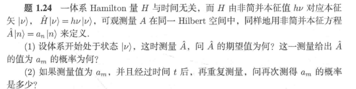
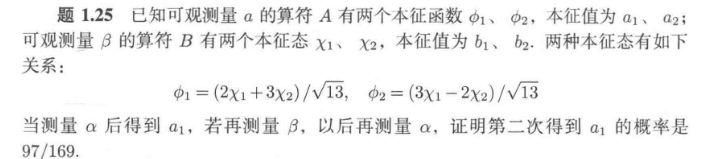

# 1 基本假设 数学工具 形式理论（2）

形式理论是量子力学的基础。首先，如果不了解形式理论，例如量子力学的三种波函数表现形式，根本无法看懂任何内容；其次，如果对形式理论掌握足够深刻，量子力学的其他所有内容都只是这套理论的具体应用，对用于不同的内容用一点点不同的方法进行解决而已。在授课中，形式理论的学习应该占用到量子力学（一）学习时间的50%，其他章节例如一维定态问题、谐振子、中心力场，在掌握形式理论后很容易看懂（不过是几个结论而已，甚至可以用几分钟概括清楚），然后由自己多做几道题就可以掌握的非常好。若不这样，初次学习量子力学，困难重重，难以自学。

我对形式理论的逻辑理解：

波函数 - 算符（抽象符号） - 观测统计与本征 - 对易 - 表象与表象变换（具体形式） - 矩阵力学（矩阵形式） - 运动方程与时间演化 - 守恒量与对称性 - 动力学表象（深入） - 全同粒子（多体）

通过全同粒子，可以很自然地过渡到固体物理 和 统计物理

## 4.0 基本假设

### 考点1：波函数

1. **态叠加原理的考题**：

    - 题目：若粒子处于 \( \psi_1 \) 和 \( \psi_2 \) 的叠加态 \( \psi = a\psi_1 + b\psi_2 \)，求测量相应可观测量的概率分布。

    - 答案：计算态的模平方 \( |a|^2 \) 和 \( |b|^2 \) 分别代表测量得到相应结果的概率。

2. **归一化条件的考题**：

    - 题目：一粒子处于一维势阱中的波函数为 \( \psi(x) = A e^{-\alpha |x|} \)，其中 \( \alpha > 0 \)，求 \( A \) 以满足归一化条件。

    - 答案：计算 \( A \) 满足 \( \int_{-\infty}^{+\infty} |A e^{-\alpha |x|}|^2 dx = 1 \) 后，得到 \( A = \sqrt{\frac{\alpha}{2}} \)。

### 考点2：概率、期望预言

1. 散射态：表示为平面波的线性组合

    

    

    

2. 束缚态：直接运用概率统计诠释

### 考点3：散射态与束缚态的性质

---

### 量子力学基本假设

??? tip "波粒二象性"

    一切物质同时具有波的特质和粒子的特质

    a. 光的粒子性：光电效应、普朗克散射

    光的波动性：光的干涉与衍射

    b. 电子的粒子性：碰撞动量守恒

    电子的波动性：电子干涉实验

    c. 波的波动性：显然

    波的粒子性：能量量子化

    d. 粒子的粒子性：显然
    粒子的波动性：德布罗意波

    

??? tip "波函数"

    - 概率密度：

        $$
        P(x, t) = |\psi(x, t)|^2
        $$

    - 概率流密度

        $$
        \mathbf{j} = \frac{\hbar}{2mi} \left( \psi^* \nabla \psi - \psi \nabla \psi^* \right),
        $$

        连续性方程：

        $$
        \frac{\partial \rho}{\partial t} + \nabla \cdot \mathbf{j} = 0,
        $$

        自由粒子：

        $$
        \frac{\partial \rho}{\partial t} + \nabla \cdot \mathbf{j} = 0,
        $$

        $$
        j = \frac{\hbar k}{m} |A|^2.
        $$

    - 归一化条件：

        $$
        \int_{-\infty}^{\infty} |\psi(x, t)|^2 \, dx = 1
        $$

    - 物理意义：

        波函数的实部和虚部分别表示系统的 **空间分布** 和 **相位信息**。

        空间分布对应概率密度；相位信息影响干涉和波粒二象性等量子现象

??? tip "薛定谔方程"

    $$
    \hat H\psi = \hat E\psi
    $$

    这本质上就是一个能量本征值方程，描述粒子运动状态。量子力学（一）的主要内容，就是用不同的方法求解不同场景下的这个方程。总结所有的方法为：

    - 代数解法：
    
        一维定态问题、中心力场问题。求解步骤：

        （1）构造哈密顿算符

        （2）解本征方程 - 偏微分方程

        （3）得到本征值、本征函数

    - 升降算符法

        谐振子、角动量、自旋问题

        1. 谐振子：

            升降算符表达式

            $$
            \hat{a} = \sqrt{\frac{m\omega}{2\hbar}} \left( \hat{x} + \frac{i\hat{p}}{m\omega} \right), \quad 
            \hat{a}^\dagger = \sqrt{\frac{m\omega}{2\hbar}} \left( \hat{x} - \frac{i\hat{p}}{m\omega} \right),
            $$

            重要物理量的表示

            $$
            \hat{H} = \hbar\omega \left( \hat{a}^\dagger \hat{a} + \frac{1}{2} \right),
            $$

            $$
            \hat{x} = \sqrt{\frac{\hbar}{2m\omega}} \left( \hat{a} + \hat{a}^\dagger \right),
            $$

            $$
            \hat{p} = i \sqrt{\frac{\hbar m \omega}{2}} \left( \hat{a}^\dagger - \hat{a} \right).
            $$

            与本征态的关系：

            $$
            \hat{a} |n\rangle = \sqrt{n} |n-1\rangle, \quad 
            \hat{a}^\dagger |n\rangle = \sqrt{n+1} |n+1\rangle.
            $$

            基态和 \( n \) 阶本征态表达式：

            $$
            \hat{a} |0\rangle = 0.
            $$

            $$
            \psi_0(x) = \left( \frac{m\omega}{\pi\hbar} \right)^{1/4} e^{-m\omega x^2 / 2\hbar}.
            $$

            $$
            |n\rangle = \frac{(\hat{a}^\dagger)^n}{\sqrt{n!}} |0\rangle.
            $$

            $$
            \psi_n(x) = \left( \frac{m\omega}{\pi\hbar} \right)^{1/4} \frac{1}{\sqrt{2^n n!}} H_n\left( \sqrt{\frac{m\omega}{\hbar}} x \right) e^{-m\omega x^2 / 2\hbar},
            $$

        2. 角动量：$\hat{H} = \frac{\hat{L}^2}{2I},$

            升降算符表达式

            $$
            \hat{L}_\pm = \hat{L}_x \pm i\hat{L}_y.
            $$

            重要物理量

            $$
            \hat{L}^2 = \hat{L}_z^2 + \frac{1}{2} (\hat{L}_+ \hat{L}_- + \hat{L}_- \hat{L}_+),
            $$

            $$
            \hat{L}_z = m \hbar.
            $$

            与本征态的关系

            $$
            \hat{L}_\pm |l, m\rangle = \hbar \sqrt{l(l+1) - m(m \pm 1)} |l, m \pm 1\rangle.
            $$

            基态和 \( n \) 阶本征态表达式：

            $$
            |l, l\rangle.
            $$

            $$
            |l, m\rangle = \frac{(\hat{L}_-)^{l-m}}{\sqrt{(l+m)!}} |l, l\rangle.
            $$

            与氢原子问题：

            $$
            \Psi_{1,0,0}(r, \theta, \phi) = \frac{1}{\sqrt{\pi a_0^3}} e^{-r/a_0}.
            $$

            $$
            Y_l^m(\theta, \phi) = \sqrt{\frac{(2l+1)(l-m)!}{4\pi(l+m)!}} P_l^m(\cos\theta) e^{im\phi},
            $$

        3. 自旋：

            升降算符表达式

            $$
            \hat{S}_\pm = \hat{S}_x \pm i\hat{S}_y.
            $$

            重要物理量的表示

            $$
            \hat{S}^2 = s(s+1)\hbar^2, \quad \hat{S}_z = m_s \hbar.
            $$

            与本征态的关系

            $$
            \hat{S}_\pm |s, m_s\rangle = \hbar \sqrt{s(s+1) - m_s(m_s \pm 1)} |s, m_s \pm 1\rangle.
            $$

            基态和 \( n \) 阶本征态表达式

            $$
            |s, s\rangle.
            $$

            $$
            |s, m_s\rangle = \frac{(\hat{S}_-)^{s-m_s}}{\sqrt{(2s)!}} |s, s\rangle.
            $$

    - 矩阵表示法

        离散谱量子系统。求解步骤：

        （1）选择基底

        （2）将波函数、算符表示为矩阵

        （3）求本征值与本征态，计算时间演化、统计量、其他量子现象

    - 变分法（Variational Method）

        步骤：

        1. 选择一个试探波函数 \( \psi_{\text{trial}} \)。

        2. 计算哈密顿量 \( \hat{H} \) 的期望值：

            $$
            E_{\text{trial}} = \frac{\langle \psi_{\text{trial}} | \hat{H} | \psi_{\text{trial}} \rangle}{\langle \psi_{\text{trial}} | \psi_{\text{trial}} \rangle}
            $$
        
        3. 通过改变试探波函数的参数来最小化 \( E_{\text{trial}} \)。

    - 微扰理论（Perturbation Theory）

        运用于已知系统的微小扰动。求解步骤：

        1. 将哈密顿量写成两部分：

            $$
            \hat{H} = \hat{H}_0 + \lambda \hat{H}' 
            $$

            其中 \( \hat{H}_0 \) 是可解的哈密顿量，\( \hat{H}' \) 是微扰。

        2. 计算微扰引起的修正：

            - 本征值的修正：

                $$
                E_n^{(1)} = \langle n_0 | \hat{H}' | n_0 \rangle
                $$

                $$
                E_n^{(2)} = \sum_{m \neq n} \frac{|\langle n_0 | \hat{H}' | m_0 \rangle|^2}{E_n^{(0)} - E_m^{(0)}}
                $$

            - 本征态的修正：

                $$
                |\psi_n^{(1)}\rangle = \sum_{m \neq n} \frac{\langle m_0 | \hat{H}' | n_0 \rangle}{E_n^{(0)} - E_m^{(0)}} | m_0 \rangle
                $$

    - 路径积分法

        粒子在时间演化过程中的本征态

        步骤：

        1. 表达量子振幅为路径积分：

            $$
            K(x_f, t_f; x_i, t_i) = \int \mathcal{D}[x(t)] e^{\frac{i}{\hbar} S[x(t)]}
            $$

            其中 \( S[x(t)] \) 是作用量。

        2. 使用路径积分计算各种物理量，间接获取本征态。

    - 对称性和守恒量

    - WKB 近似法

    - ...

??? tip "态叠加原理与测量"

    - 态叠加原理：如果一个系统可以处于状态 \( \psi_1 \) 或 \( \psi_2 \)，那么系统也可以处于这两个状态的叠加态，即 \( \psi = c_1 \psi_1 + c_2 \psi_2 \)
    
    - 推理：如果有两个可能的量子态 \( |\psi_1\rangle \) 和 \( |\psi_2\rangle \)，那么系统的总体状态 \( |\psi\rangle \) 可以写为：

        $$
        |\psi\rangle = c_1 |\psi_1\rangle + c_2 |\psi_2\rangle,
        $$

        其中 \( c_1 \) 和 \( c_2 \) 是复数系数，称为概率振幅，表示每个基态的“权重”。这些系数满足归一化条件：
        
        $$
        |c_1|^2 + |c_2|^2 = 1.
        $$

    - 测量原理：测量时，系统会“塌缩”到某个具体的本征态，且该本征态出现的概率由波函数的模平方给出。

??? tip "算符假设"

    假设：在量子力学中，所有可观测的物理量（如位置、动量、能量等）都对应于（厄米）算符。物理量的测量值是该算符的本征值

??? tip "不确定性原理"

    - 不确定性原理：某些物理量，如位置和动量，不能同时精确地被测量。这些物理量是不对易的物理量

        $$
        \begin{array}{c}\sigma_A^2\sigma_B^2\geq\left(\frac{1}{2i}\Big\langle\Big[ \hat{A},\hat{B}\Big]\Big\rangle\right)^2.\end{array}
        $$

    - 推论：如果有对易的物理量（算符），则可以将对易物理量的本征值（有共同本征态）作为系统的一组完备基来描述系统波函数。

## 4.1 波函数的表示 Hilbert空间

对波函数、算符的三种表示方法：具体波函数、Dirac右矢、矩阵表示。具体波函数在表象（4.5）讨论；Dirac右矢在本节讨论；矩阵形式在4.6讨论。

波函数和算符是量子理论的两块基石。体系的状态用波函数表示，可观察量（力学量）用算符表示。数学上讲，波函数满足抽象矢量的定义条件，算符作为线性变换作用于矢量之上。因此，量子力学的自然语言是线性代数。

采用了Dirac符号，用右矢来表示一个量子态。

### 1 Dirac表示与矩阵表示

1. 右矢描述一个波函数，称为波矢；在矩阵力学中，表示列向量

    $$
    |\alpha\rangle
    $$

2. 左矢则是右矢的共轭转置；在矩阵力学中表示行向量

3. 算符描述一个力学量（具体见4.2），在矩阵力学中，表示一个矩阵

$$
\big|\beta\big>=T\big|\alpha\big>
$$

矩阵力学线性代数基础，见4.6.0

### 2 左矢、右矢的性质

??? tip "加法"

    （1）可加性

    $$
    |\alpha\rangle+|\beta\rangle=|\gamma\rangle
    $$

    （2）加法交换律和结合律

    $$
    \begin{array}{c}|\alpha\rangle+|\beta\rangle=|\beta\rangle+|\alpha\rangle,\\\\(|\alpha\rangle+|\beta\rangle)+|\gamma\rangle=|\alpha\rangle+(|\beta\rangle+|\gamma\rangle).\end{array}
    $$

    (3)存在空矢量，满足

    $$
    |\alpha\rangle+|\text{null}\rangle=|\alpha\rangle.
    $$

    存在相反矢，满足

    $$
    |\alpha\rangle+|\alpha^{\prime}\rangle=|\mathrm{null}\rangle 
    $$

??? tip "数乘"

    (4)数乘与0乘

    $$
    c \cdot \alpha = c|\alpha\rangle
    $$

    $$
    0 \cdot \alpha = |\mathrm{null}\rangle
    $$

    (5)数乘交换律、结合律：

    $$
    \begin{gathered}
    (cd)|\alpha\rangle=c(d|\alpha\rangle), \\
    (c+d)|\alpha\rangle=c|\alpha\rangle+d|\alpha\rangle, \\
    c(|\alpha\rangle+|\beta\rangle)=c|\alpha\rangle+c|\beta\rangle, \\
    1|\alpha\rangle=|\alpha\rangle. 
    \end{gathered}
    $$

??? tip "转置、共轭、共轭转置、模 （一元运算）"

    (6)对偶(共轭)

    $$
    |\alpha\rangle\stackrel{\mathrm{DC}}{\longleftrightarrow}\langle\alpha|.
    $$

    $$
    c|\alpha\rangle\stackrel{\mathrm{DC}}{\longleftrightarrow}c^*\langle\alpha|.
    $$

    $$
    (|\alpha\rangle)^\dagger = \langle\alpha|
    $$

    $$
    (c_\alpha|\alpha\rangle+c_\beta|\beta\rangle)^\dagger=c_\alpha^*\langle\alpha|+c_\beta^*\langle\beta|.
    $$

    $$
    \|\alpha\|=\sqrt{\langle\alpha|\alpha\rangle}
    $$

??? tip "内积"

    内积：

    $$
    \left\langle\alpha\right|\beta\rangle=a_{1}^{*}b_{1}+a_{2}^{*}b_{2}+\cdots a_{N}^{*}b_{N}.
    $$

    简洁表示(对于向量 $\alpha, \beta$)

    $$
    \langle\beta| \alpha\rangle=\beta^\dagger \alpha,
    $$

    故有：

    $$
    \langle\beta|\hat{A}|\alpha\rangle=\beta^\dagger A\alpha,
    $$

    > 注：在此处以及之前的c都表示复数

    （8）内积的性质

    $$
    \langle\beta|\alpha\rangle=\langle\alpha|\beta\rangle^{*}
    $$

    $$
    |\langle\beta|\alpha\rangle|^2=|\langle\alpha|\beta\rangle|^2
    $$

    $$
    \langle\alpha|\alpha\rangle\geq0
    $$

    $$
    \langle\gamma|\cdot(c_\alpha|\alpha\rangle+c_\beta|\beta\rangle)=c_\alpha\langle\gamma|\alpha\rangle+c_\beta\langle\gamma|\beta\rangle
    $$

??? tip "外积、投影、投影算符"

    外积生成算符：

    $$
    |\psi\rangle \langle \phi| = \begin{pmatrix} \psi_1 \\ \psi_2 \\ \vdots \\ \psi_N \end{pmatrix}
    \begin{pmatrix} \phi_1^* & \phi_2^* & \cdots & \phi_N^* \end{pmatrix}.
    $$

    内积、外积的运用，与矩阵力学的关系，见 4.6.0

### 3 Hilbert空间

1. 量子力学解释

    我们要求右矢空间包含所研究系统的所有量子态，因此这个内积空间在模$\|\alpha\|=\sqrt{\langle\alpha|\alpha\rangle}$下是完备的，于是我们称这个右矢空间为Hilbert空间。相应的，左矢空间也是一个Hilbert空间。

2. 数学解释

    以上是文字的模糊表述。数学上的具体表述：

    所有x的函数的集合构成了一个矢量空间，而可以证明，全体平方可积函数构成了一个矢量空间（矢量空间的定义参考线性代数）。所有在(a,b)的平方可积函数的集合，也就是：

    $$
    f(x),\quad which has \quad\int_{a}^{b}\Bigl|f(x)\Bigr|^{2}\:dx<\infty
    $$

    构成了一个非常小的矢量空间，数学家称为 $L_2(a,b)$ ，在物理，这就是 Hilbert 空间。
    
3. 我的解释

    量子态的集合构成了一个希尔伯特空间（就是以上数学定义的一个函数集合），而通过内积定义的规范（范数）确保量子态的规范化，通常是：$\|\alpha\|=1$。完备性则确保了任何可能的量子态都可以通过这些基础状态的组合来表示，不会遗漏任何物理情况。

    因此，在量子力学中：

    **波函数是处于Hilbert空间中的**

## 4.2 算符

### 1 算符的数学解释

数学解释与运算规则运用于形式理论计算。

??? tip "线性算符 (Linear Operator)"

    满足以下两个条件的算符称为线性算符：

    $$
    \begin{aligned}
    \hat A(|\alpha\rangle + |\beta\rangle) &= \hat A|\alpha\rangle + \hat A|\beta\rangle, \\
    \hat A(c|\alpha\rangle) &= c\hat A|\alpha\rangle.
    \end{aligned}
    $$

??? tip "厄米算符 (Hermitian Operator)"

    满足关系：

    $$
    \hat A^\dagger = \hat A
    $$

    所有的动力学算符（力学量）都是厄米算符

??? tip "幺正算符 (Unitary Operator)"

    满足关系：

    $$
    \hat U^\dagger \hat U = \hat U \hat U^\dagger = I
    $$

    比如：

    $$
    \hat U(t) = e^{-\frac{i}{\hbar} \hat H t}
    $$

    幺正算符的作用是保持量子态的规范不变，即在幺正变换下，量子态的内积和概率分布保持不变。

??? tip "对易算符 (Commuting Operators)"

    如果两个算符\(\hat A\)和\(\hat B\)满足以下关系：

    $$
    [\hat A, \hat B] = \hat A\hat B - \hat B\hat A = 0,
    $$

    则称\(\hat A\)和\(\hat B\)为对易算符。这表示它们可以同时对量子态进行测量，即它们具有共同的本征态。

??? tip "投影算符 (Projection Operator)"

    $$
    \hat P^2 = \hat P
    $$

    投影算符是一个特殊的厄米算符

### 2 算符数学运算

- 一元运算

??? tip "转置（Transpose）"
    
    \(\hat{A}\)的转置算符\(\hat{A}^T\)在矩阵表示下满足：

    $$
    \hat{A}^T_{ij} = \hat{A}_{ji}.
    $$

??? tip "复共轭（Complex Conjugate）"

    复共轭算符是将算符中的所有复数元素取复共轭。对于复数值的算符\(\hat{A}\)，它的复共轭算符记作\(\hat{A}^*\)，表示对算符矩阵元素的复数部分取共轭。

??? tip "共轭转置（Hermitian Conjugate，或称厄米共轭）"

    \(\hat{A}^\dagger\)是先对算符进行转置，再对其中的每个元素取复共轭。对于算符\(\hat{A}\)，有：

    $$
    (\hat{A}|\alpha\rangle)^\dagger = \langle \alpha |\hat{A}^\dagger.
    $$

- 二元运算

??? tip "算符的加法"

    $$
    (\hat{A} + \hat{B})|\alpha\rangle = \hat{A}|\alpha\rangle + \hat{B}|\alpha\rangle.
    $$

??? tip "算符的数乘"

    $$
    (c\hat{A})|\alpha\rangle = c\hat{A}|\alpha\rangle.
    $$

    此外，共轭转置与数乘的关系为：

    $$
    (c_a \hat{A} + c_b \hat{B})^\dagger = c_a^* \hat{A}^\dagger + c_b^* \hat{B}^\dagger.
    $$

??? tip "算符的乘积"

    $$
    (\hat{A}\hat{B})|\alpha\rangle = \hat{A}(\hat{B}|\alpha\rangle).
    $$

    值得注意的是，算符的乘法通常不是交换的，即：

    $$
    \hat{A}\hat{B} \neq \hat{B}\hat{A}.
    $$

    结合律：算符乘法满足结合律：

    $$
    \hat{A}(\hat{B}\hat{C}) = (\hat{A}\hat{B})\hat{C} = \hat{A}\hat{B}\hat{C}.
    $$

    共轭转置(厄米共轭)的乘法规则：对于算符乘积的共轭转置有如下关系：

    $$
    (\hat{A}\hat{B})^\dagger = \hat{B}^\dagger \hat{A}^\dagger.
    $$

??? tip "算符的外积"

    对于量子态\(|\alpha\rangle\)和\(|\beta\rangle\)，它们的外积\(|\alpha\rangle\langle\beta|\)是一个算符，它的作用是将一个量子态\(|\gamma\rangle\)映射到另一个量子态\(|\alpha\rangle\)：

    $$
    (|\alpha\rangle\langle\beta|)|\gamma\rangle = |\alpha\rangle(\langle\beta|\gamma\rangle),
    $$

    外积算符的共轭转置是：

    $$
    (|\alpha\rangle\langle\beta|)^\dagger = |\beta\rangle\langle\alpha|.
    $$

??? tip "算符的内积"

    给定两个算符 \(\hat A\) 和 \(\hat B\)，它们的内积定义为：

    $$
    \langle\hat A, \hat B\rangle = \text{Tr}(\hat A^\dagger \hat B),
    $$

    其中 \(\text{Tr}\) 表示迹运算。内积的性质包括：

    - 共轭对称性：\(\langle\hat A, \hat B\rangle = \langle\hat B, \hat A\rangle^*\),

    - 线性性：\(\langle c_1\hat A_1 + c_2\hat A_2, \hat B\rangle = c_1\langle\hat A_1, \hat B\rangle + c_2\langle\hat A_2, \hat B\rangle\).

    算符的内积定义在希尔伯特空间的算符空间中，用于描述算符之间的相似性或关联性。

- 三元运算

$$
\langle \alpha | \hat{A} | \beta \rangle ^* = \langle \beta | \hat{A} ^* | \alpha \rangle
$$

$$
\langle \alpha | \hat{A} | \beta \rangle ^\dagger = \langle \beta | \hat{A} ^\dagger | \alpha \rangle
$$

对于厄米算符：

$$
\langle \alpha | \hat{A} | \beta \rangle ^\dagger = \langle \beta | \hat{A} | \alpha \rangle
$$

### 3 算符的物理解释

根据算符所对应的物理量或对称性，量子力学中的算符大致可以分为以下几类：

1. 动力学算符 (Dynamical Operators)

    - 对应物理量：这些算符描述系统的物理量，如能量、动量、位置等。

    - 典型算符：哈密顿算符 (\( \hat{H} \))、动量算符 (\( \hat{p} \))、位置算符 (\( \hat{x} \))、角动量算符 (\( \hat{L} \)) 等。
    
    - 所有的动力学算符都是厄米算符

2. 对称性算符 (Symmetry Operators)

    - 对应的对称性：这些算符描述系统的对称性操作，如空间平移、旋转、宇称等。

    - 典型算符：宇称算符 (\( \hat{P} \))、时间反演算符 (\( \hat{T} \))、平移算符 (\( \hat{T}_a \))、旋转算符 (\( \hat{R} \)) 等。

    - 特征：这些算符的作用是将系统的状态变换到一个等价的状态，并且对应于系统的对称性。它们在描述物理系统的对称性、守恒定律以及简化问题时起着关键作用。

    例子：

    （1）宇称算符 \( \hat{P} \) 描述空间反演对称性。

    （2）平移算符 \( \hat{T}_a \) 描述空间平移对称性。

    （3）时间演化算符 \( \hat{U}(t) \) 描述随时间演化的量子态。

    （4）旋转算符 \( \hat{R} \) 描述系统在空间中的旋转对称性。

### 4 动力学算符

1. **哈密顿算符 \( \hat{H} \)**

    - **物理意义**：描述系统的总能量，包括动能和势能。

    - **坐标表象**：

        $$
        \hat{H} = \hat{T} + \hat{V} = -\frac{\hbar^2}{2m} \frac{d^2}{dx^2} + V(x)
        $$

    - **动量表象**：

        $$
        \hat{H} = \frac{\hat{p}^2}{2m} + V(\hat{x})
        $$

        势能项 \( V(x) \) 在动量表象中则要通过傅里叶变换获得：

        $$
        \tilde{V}(p) = \int_{-\infty}^{+\infty} V(x) \, e^{-ipx/\hbar} \, dx
        $$

    - **谐振子**

        $$
        \hat{H} = \frac{\hat{p}^2}{2m} + \frac{1}{2}m\omega^2\hat{x}^2
        $$

    - **角动量**

        V = 0

        $$
        \hat{H} = \frac{\hat{L}^2}{2I},
        $$

    - **中心力场**

        转到球坐标系

        直角坐标系

        $$
        \nabla^2\equiv\frac{\partial^2}{\partial x^2}+\frac{\partial^2}{\partial y^2}+\frac{\partial^2}{\partial z^2}
        $$

        球坐标系

        $$
        \nabla^2=\frac1{r^2}\frac\partial{\partial r}\Bigg(r^2\frac\partial{\partial r}\Bigg)+\frac1{r^2}\frac1{\sin\theta}\frac\partial{\partial\theta}\Bigg(\sin\theta\frac\partial{\partial\theta}\Bigg)+\frac1{r^2}\frac1{\sin^2\theta}\frac\partial{\partial\theta}\Bigg(\frac{\partial^2}{\partial\phi^2}\Bigg).
        $$

    - **电磁场**

        $$
        \hat{H} = \frac{1}{2m} \left( -i\hbar\nabla - q\mathbf{A} \right)^2 + q\phi.
        $$

        展开：

        $$
        \hat{H} = \frac{1}{2m} \left[ (-i\hbar\nabla)^2 - 2q\mathbf{A} \cdot (-i\hbar\nabla) + q^2\mathbf{A}^2 \right] + q\phi.
        $$

    - **相对论修正（狄拉克方程）**

        $$
        \hat{H} = c \alpha \cdot \left( -i\hbar\nabla - q\mathbf{A} \right) + \beta mc^2 + q\phi,
        $$

    - **自旋 - 轨道耦合**

        $$
        \hat{H}_{SO} = \lambda \hat{\mathbf{L}} \cdot \hat{\mathbf{S}},
        $$

    - **自旋 - 自旋耦合**

        $$
        \hat{H}_{SS} = J \sum_i \hat{\mathbf{S}}_i \cdot \hat{\mathbf{S}}_j,
        $$

    - **磁场 - 自旋相互作用**

        <!-- $$
        \hat{H}_{SO} = \lambda \hat{\mathbf{L}} \cdot \hat{\mathbf{S}},
        $$ -->

    - **本征函数与本征值**：H 的本征函数非常好用，表示系统的定态，可以方便计算出态的时间演化形式

    - **本征方程**:

        $$\hat{H} \psi_E = E \psi_E$$

        其中 \( \hat{H} \) 是哈密顿算符，\( \psi_E \) 是能量本征函数，\( E \) 是对应的能量本征值。

2. **动量算符 \( \hat{p} \)**

    - **物理意义**：描述粒子的动量。

    - **坐标表象**：

        $$
        \hat{p} = -\mathrm{i}\hbar \frac{d}{dx}
        $$

    - **动量表象**：

        $$
        \hat{p} = p
        $$

    - 本征值：p （坐标表象） $\delta(p)$ （动量表象）

    - **本征函数**：平面波
    
        $$
        \phi(p) = e^{ipx/\hbar}
        $$

        表示粒子具有确定的动量，并且在空间中以恒定速率传播。

3. **位置算符 \( \hat{x} \)**

    - **物理意义**：描述粒子的空间位置。

    - **动量表象**：

        位置算符在动量表象中表示为对动量的微分算符，具体形式为：

        $$
        \hat{x} = i\hbar \frac{d}{dp}
        $$
        
        源于傅里叶变换

    - **本征函数**：狄拉克函数 $\delta(x)$ - 坐标表象

    - **本征方程**：  

        $$
        \hat{x} \delta(x - x_0) = x_0 \delta(x - x_0)
        $$

4. **角动量算符 \( \hat{L}_z \)**

    - **物理意义**：描述粒子在某一方向上的角动量分量。

    - **坐标表象**：

        在极坐标中，角动量算符 \( \hat{L}_z \) 在 \( z \) 方向的表达式为：

        $$
        \hat{L}_z = -\mathrm{i}\hbar \frac{\partial}{\partial \phi}
        $$

      其中 \( \phi \) 是极坐标中的方位角。

    - **动量表象**：
        
        $$
        \hat{L}_z = -\mathrm{i}\hbar \frac{\partial}{\partial \phi}
        $$

    - **本征值**： \( m\hbar \)

    - **本征函数**：球面谐波函数 \( Y_l^{m}(\theta, \phi) \)，描述粒子在空间中旋转的对称性。

    - **本征方程**：  

        $$
        \hat{L}_z Y_{\ell}^{m}(\theta, \phi) = m\hbar Y_{\ell}^{m}(\theta, \phi)
        $$

5. **自旋算符 \( \hat{S}_z \)**

    - **物理意义**：描述粒子的内禀自旋状态。

    - **坐标表象**：

        自旋算符通常表示为矩阵，且在坐标表象中没有明确的空间依赖关系。对于自旋 \( 1/2 \) 的粒子，自旋算符的 \( z \) 分量可以表示为：

        $$
        \hat{S}_z = \frac{\hbar}{2}
        \begin{pmatrix}
        1 & 0 \\
        0 & -1
        \end{pmatrix}
        $$

      这个矩阵表示在自旋空间中，而不是在通常的坐标空间。

    - **动量表象**：

        自旋算符的表示通常独立于位置和动量表象，它在动量表象下仍然是矩阵表示，对于自旋 \( 1/2 \) 粒子，其 \( z \)-分量的自旋算符为：

        $$
        \hat{S}_z = \frac{\hbar}{2}
        \begin{pmatrix}
        1 & 0 \\
        0 & -1
        \end{pmatrix}
        $$

        该表达式在动量表象中保持不变，因为自旋是内禀性质，不依赖于空间或动量坐标。

    - **本征值**：自旋的量子化值（例如，\( \pm \hbar/2 \) 对于自旋 1/2 粒子）。

    - **本征函数**：自旋态 \( | \uparrow \rangle \) 和 \( | \downarrow \rangle \)，分别代表自旋向上和自旋向下。

    - **本征方程**：  

        $$
        \hat{S}_z | \uparrow \rangle = +\frac{\hbar}{2} | \uparrow \rangle, \quad \hat{S}_z | \downarrow \rangle = -\frac{\hbar}{2} | \downarrow \rangle
        $$
        
        其中 \( \hat{S}_z \) 是自旋算符的 \( z \)-方向分量，\( | \uparrow \rangle \) 和 \( | \downarrow \rangle \) 是自旋向上和向下的本征函数，\( \pm \hbar/2 \) 是对应的自旋本征值。

### 5 算符表达式推导

1. 其他算符如何推导而来？动力学算符：由基本对易关系都可推导出来。以下两个表象、两个坐标系都可以推导：

    - 坐标表象中

        - 选用直角坐标系

        - 选用球坐标系

    - 动量表象中

        - 选用直角坐标系

        - 选用球坐标系

1. p算符的形式由基本对易关系得到

    由基本对易关系：

    $$
    [\hat{x}, \hat{p}] = i\hbar
    $$

    假设动量算符的作用形式是 \( -i\hbar \frac{\partial}{\partial x} \)，验证满足这一对易关系。

    首先，位置算符作用于波函数 \( \psi(x) \) 为：

    $$
    \hat{x} \psi(x) = x \psi(x)
    $$

    然后，动量算符作用于波函数为：

    $$
    \hat{p} \psi(x) = -i \hbar \frac{\partial \psi(x)}{\partial x}
    $$

    计算这两个算符的对易关系：

    $$
    [\hat{x}, \hat{p}] \psi(x) = (\hat{x} \hat{p} - \hat{p} \hat{x}) \psi(x)
    $$

    $$
    \hat{x} \hat{p} \psi(x) = x \left( -i \hbar \frac{\partial \psi(x)}{\partial x} \right) = -i \hbar x \frac{\partial \psi(x)}{\partial x}
    $$

    $$
    \hat{p} \hat{x} \psi(x) = -i \hbar \frac{\partial}{\partial x} \left( x \psi(x) \right)
    $$

    使用乘积法则：

    $$
    \hat{p} \hat{x} \psi(x) = -i \hbar \left( \psi(x) + x \frac{\partial \psi(x)}{\partial x} \right)
    $$

    将两者相减得到：
    $$
    [\hat{x}, \hat{p}] \psi(x) = \left( -i \hbar x \frac{\partial \psi(x)}{\partial x} \right) - \left( -i \hbar \left( \psi(x) + x \frac{\partial \psi(x)}{\partial x} \right) \right)
    $$

    $$
    [\hat{x}, \hat{p}] \psi(x) = i \hbar \psi(x)
    $$

    因此，动量算符在位置空间中的形式确实是：

    $$
    \hat{p} = -i \hbar \frac{\partial}{\partial x}
    $$

2. 其他基本力学量算符的表达式可以由p的关系得到

3. **动量算符 \( p_x \) 和 \( p_y \) 在极坐标下的推导过程**：

    - 在笛卡尔坐标下，动量算符是通过位置算符的导数定义的：  

        $$
        p_x = -i\hbar \frac{\partial}{\partial x}, \quad p_y = -i\hbar \frac{\partial}{\partial y}
        $$

    - 在极坐标系中，\( x \) 和 \( y \) 与 \( r \) 和 \( \varphi \) 的关系为：

        $$
        x = r \cos\varphi, \quad y = r \sin\varphi
        $$

        使用链式法则对导数进行转换

        $$
        \frac{\partial}{\partial x} = \frac{\partial r}{\partial x} \frac{\partial}{\partial r} + \frac{\partial \varphi}{\partial x} \frac{\partial}{\partial \varphi}
        $$

        $$
        \frac{\partial}{\partial y} = \frac{\partial r}{\partial y} \frac{\partial}{\partial r} + \frac{\partial \varphi}{\partial y} \frac{\partial}{\partial \varphi}
        $$

        动量算符 \( p_x \) 和 \( p_y \) 在极坐标下被表示为：

        $$
        p_x = -i\hbar \left( \cos\varphi \frac{\partial}{\partial r} - \frac{\sin\varphi}{r} \frac{\partial}{\partial \varphi} \right)
        $$

        $$
        p_y = -i\hbar \left( \sin\varphi \frac{\partial}{\partial r} + \frac{\cos\varphi}{r} \frac{\partial}{\partial \varphi} \right)
        $$

2. **角动量算符 \( J_z \) 的极坐标表达式**：

    - 角动量算符 \( J_z \) 在笛卡尔坐标系下表示为：

        $$
        J_z = x p_y - y p_x
        $$

    - 使用上述 \( p_x \) 和 \( p_y \) 的极坐标表达式，可以得到 \( J_z \) 在极坐标下的形式：

        $$
        J_z = -i\hbar \frac{\partial}{\partial \varphi}
        $$

    - 这表明 \( J_z \) 在极坐标下是与角度 \( \varphi \) 的导数相关的算符。

### 6 对称算符

1. 平移算符 \( \hat{T}(\vec{a}) \)

    - 物理意义：描述粒子在空间中平移的算符，作用是将波函数从一个位置移动到另一个位置。

    - 作用在态矢上

        $$
        \hat{T}(\mathbf{a})\psi(\mathbf{r})=\psi(\mathbf{r}-\mathbf{a}).
        $$

        在动量表象下，平移算符的作用是相位因子的变化：
        
        $$
        \hat{T}(\vec{a}) \phi(p) = e^{-i \vec{p} \cdot \vec{a}/\hbar} \phi(p)
        $$

    - 作用在算符上

        $$
        \hat{T}(\mathbf{a})\hat{\mathbf{r}}\hat{T}^\dagger(\mathbf{a})=\hat{\mathbf{r}}+\mathbf{a}.
        $$

        $$
        \hat{T}(\mathbf{a})\hat{\mathbf{p}}\hat{T}^\dagger(\mathbf{a})=\hat{\mathbf{p}}.
        $$

    - 算符表达式

        $$
        T(\mathbf{a})=\exp\left(-\mathbf{a}\cdot\mathbf{\nabla}\right)=\exp\left(-\frac{\mathrm{i}}{\hbar}\mathbf{a}\cdot\mathbf{p}\right)
        $$

        计算时通过展开，例如：

        $$
        \begin{aligned}\exp\left(-a\frac\partial{\partial x}\right)x^2&=\left(1-a\frac\partial{\partial x}+\frac1{2!}a^2\frac{\partial^2}{\partial x^2}\ldots\right)x^2\\&=x^2-2ax+a^2=(x-a)^2.\end{aligned}
        $$

    - 平移算符是幺正算符： 

        $$
        \hat{T}^\dagger(\vec{a}) \hat{T}(\vec{a}) = I
        $$

2. 旋转算符

    - 物理意义：系统绕 \( y \)-轴旋转一个角度 \( \theta \) 的算符在量子力学中表示为一个旋转算符

    - 算符表达式

        对于任意旋转轴$\mathbf{n}$,波函数的变换涉及对坐标 r 的线性变换。旋转矩阵$\mathbf{R_n}(\phi)$用 Rodrigues 公式表示为：

        $$
        \mathbf{R_{n}}(\phi)=\mathbf{I}+(\sin\phi)\mathbf{N}+(1-\cos\phi)\mathbf{N}^{2},
        $$

        其中：

        $$
        \mathbf{N}=\begin{pmatrix}0&-n_z&n_y\\n_z&0&-n_x\\-n_y&n_x&0\end{pmatrix}.
        $$

        波函数旋转后的表达为：

        $$
        \hat{R}_\mathbf{n}(\phi)\phi(\mathbf{r})=\phi(\mathbf{R}_\mathbf{n}(-\phi)\mathbf{r}).
        $$

    - 特殊：三轴

        3. 绕 \(x\)-轴旋转：

            设 \(\mathbf{n} = (1, 0, 0)\)，则矩阵为：

            $$
            \hat{R}_x(\phi) =
            \begin{pmatrix}
            1 & 0 & 0 \\
            0 & \cos\phi & -\sin\phi \\
            0 & \sin\phi & \cos\phi
            \end{pmatrix}.
            $$

        2. 绕 \(y\)-轴旋转：

            设 \(\mathbf{n} = (0, 1, 0)\)，则矩阵为：

            $$
            \hat{R}_y(\phi) =
            \begin{pmatrix}
            \cos\phi & 0 & \sin\phi \\
            0 & 1 & 0 \\
            -\sin\phi & 0 & \cos\phi
            \end{pmatrix}.
            $$

        1. 绕 \(z\)-轴旋转：

            设 \(\mathbf{n} = (0, 0, 1)\)，则矩阵为：

            $$
            \hat{R}_z(\phi) =
            \begin{pmatrix}
            \cos\phi & -\sin\phi & 0 \\
            \sin\phi & \cos\phi & 0 \\
            0 & 0 & 1
            \end{pmatrix}.
            $$

        将 三角函数 展开，可以化为指数形式：

        $$R_x(\alpha)=\exp\left[-\alpha\left(y\frac\partial{\partial z}-z\frac\partial{\partial y}\right)\right],
        $$
        
        $$
        R_y(\alpha)=\exp\left[-\alpha\left(z\frac\partial{\partial x}-x\frac\partial{\partial z}\right)\right].
        $$

        $$
        R_z(\alpha)=\exp\left[-\alpha\left(x\frac\partial{\partial y}-y\frac\partial{\partial x}\right)\right].
        $$

        也就是之前推导过的

        $$
        \exp\left(-\mathrm{i}\frac{\alpha L_{x}}{\hbar}\right),\quad \exp\left(-\mathrm{i}\frac{\alpha L_{y}}{\hbar}\right),\quad \exp\left(-\mathrm{i}\frac{\alpha L_{z}}{\hbar}\right).
        $$

    - 算符的作用：

        $$
        \hat{R}_\mathbf{n}(\phi)\phi(\mathbf{r})=\phi(\mathbf{R}_\mathbf{n}(-\phi)\mathbf{r}).
        $$

        $$
        \hat{R}_z(\phi)\phi(\mathbf{r})=\phi\big(x\cos\phi+y\sin\phi,-x\sin\phi+y\cos\phi,z\big).
        $$

        可见，$\hat{R}_z(\phi)$ 对于 $z$ 方向的一切算子，都不发生改变

3. 宇称算符/空间反演算符 \( \hat{\Pi} \)

    - 物理意义：宇称算符用于描述空间反演对系统的作用。空间反演对应的操作是将空间坐标反向，即 \( \vec{r} \rightarrow -\vec{r} \)。

    - 作用在态矢上

        1. 坐标

            $$
            \hat{\Pi}\psi(\mathbf{r})=\psi(-\mathbf{r}).
            $$

            则 $\psi(x)$ 为偶函数 - 正宇称；基函数 - 负宇称

        2. 动量

            $$
            \hat{\Pi}\phi(\mathbf{p})=\phi(-\mathbf{p}).
            $$

            则 $\phi(p)$ 为偶函数 - 正宇称；基函数 - 负宇称

        3. 角动量

            $$
            \hat{\Pi}Y_{lm}(\theta,\phi)=(-1)^lY_{lm}(\theta,\phi).
            $$

            则偶数 l - 正宇称；奇数l - 负宇称

        4. 谐振子

            $$
            \Pi|n\rangle=(-)^n|n\rangle.
            $$

    - 作用在算符上

        1. 坐标

            $$
            \Pi^{-1}\hat{x}\Pi=-\hat{x}.
            $$

        2. 向量

            $$
            \Pi^{-1}\hat{p}\Pi=-\hat{p}.
            $$

        3. 角动量

            $$
            \Pi^{-1}\hat{L}\Pi=\hat{L}.
            $$

            $$
            \Pi^{-1}\hat{J}\Pi=\hat{J}.
            $$

            $$
            \Pi^{-1}\hat{S}\Pi=\hat{S}.
            $$

        4. 谐振子

            $$
            \Pi^{-1}a\Pi=-a, \Pi^{-1}a^{\dagger}\Pi=-a^{\dagger}
            $$

    - 重要性质

        （1）宇称算符是厄米算符，其本征值为 \( \pm 1 \)，对应于正宇称和负宇称状态。

        （2）宇称算符对本征态的作用可表示为 \( \hat{P}^2 = I \)，即宇称算符的平方为单位算符。

        （3）宇称算符为幺正算符

4. 时间反演算符

    - 重要性质

    （1）\(\hat{\Theta}\) 是反线性算符，即它对复数的作用包括复共轭：
    
    $$
    \hat{\Theta}(c_1 |\psi_1\rangle + c_2 |\psi_2\rangle) = c_1^* \hat{\Theta}|\psi_1\rangle + c_2^* \hat{\Theta}|\psi_2\rangle.
    $$

    （2）\(\hat{\Theta}\) 是反幺正算符

    - 作用在态矢上

        1. 坐标
        
            $$
            \psi(x, t) \xrightarrow{\hat{\Theta}} \psi^*(x, -t).
            $$

            时间反演不仅改变时间，还复共轭波函数。这是因为波函数通常包含复数相位成分，反转时间需要改变相位符号。

        2. 动量

            $$
            \phi(p, t) \xrightarrow{\hat{\Theta}} \phi^*(-p, -t).
            $$

        3. 角动量
            
            $$
            \hat{\Theta} Y_{lm}(\theta, \phi) = (-1)^m Y_{l,-m}(\theta, \phi),
            $$

            其中，\((-1)^m\) 来自于角动量分量的反转。

        4. 谐振子表象

            谐振子的能量本征态 \(|n\rangle\) 是时间反演不变的，因为它们的能量与时间方向无关：

            $$
            \hat{\Theta}|n\rangle = |n\rangle.
            $$

            谐振子波函数 \(\psi_n(x)\) 的时间反演作用为复共轭：

            $$
            \psi_n(x, t) \xrightarrow{\hat{\Theta}} \psi_n^*(x, -t).
            $$

    - 作用在算符上

        1. 坐标

            时间反演对位置算符没有影响：

            $$
            \hat{\Theta} \hat{x} \hat{\Theta}^{-1} = \hat{x}.
            $$

        2. 动量

            动量方向随时间反演而反转：

            $$
            \hat{\Theta} \hat{p} \hat{\Theta}^{-1} = -\hat{p}.
            $$

        3. 角动量

            - 轨道角动量

                $$
                \hat{\Theta} \hat{L} \hat{\Theta}^{-1} = -\hat{L}.
                $$

            - 自旋角动量

                $$
                \hat{\Theta} \hat{S} \hat{\Theta}^{-1} = -\hat{S}.
                $$

            - 全角动量

                $$
                \hat{\Theta} \hat{J} \hat{\Theta}^{-1} = -\hat{J}.
                $$

            - 角动量平方

                $$
                \hat{\Theta} \hat{L}^2 \hat{\Theta}^{-1} = \hat{L}^2.
                $$

        4. 谐振子

            $$
            \hat{\Theta} \hat{a} \hat{\Theta}^{-1} = \hat{a}^\dagger, \quad \hat{\Theta} \hat{a}^\dagger \hat{\Theta}^{-1} = \hat{a}.
            $$

<!-- 4. **缩放算符 \( \hat{S}(\lambda) \)**

    - **物理意义**：缩放算符表示空间坐标的缩放（或伸缩），其中 \( \lambda \) 是一个比例因子。这个算符可以描述系统的尺度对称性。

    - **坐标表象**：缩放算符作用在波函数上时，波函数会被缩放一个因子 \( \lambda \)：
    
    $$ \hat{S}(\lambda) \psi(\vec{r}) = \psi(\lambda \vec{r}) $$

    - **动量表象**：缩放算符在动量表象下的作用是将动量改变为相应的比例因子：
    
    $$ \hat{S}(\lambda) \phi(p) = \lambda^{-\frac{3}{2}} \phi(\lambda p) $$

    - **重要性质**：

        （1）缩放算符是幺正算符： \( \hat{S}^\dagger(\lambda) \hat{S}(\lambda) = I \)。

        （2）缩放算符与动量算符之间的对易关系可以用于分析尺度对称性的量子系统。 -->

## 4.3 测量与可观测量

### 考点4：观测公设

例题一

考点：厄米算符的本征函数完备性、观测广义统计诠释 如何使用

例题二

考点：广义统计诠释、时间演化（不对易）

例题三

考点：厄米算符的本征函数完备性、正交性、广义统计诠释

### 考点5：厄米算符

一道例题

考点：厄米算符

### 1 观测与本征态

量子力学关于测量理论的假设：如果一个系统处在力学量$\hat{A}$的本征态，则对$\hat{A}$的测量一定给出确定的值，其值为该本征态对应的本征值。相反的，如果对一个系统的某个量子态做$\hat{A}$的测量一定给出确定的值，那么该量子态为$\hat{A}$的本征态，该测量值为相应的本征值。这一假设限制了力学量算符的具体形式，即力学量的可能测量值必须为算符的本征值，同时给出了力学量算符本征值的物理意义。

对任意一个系统，力学量$\hat{A}$的任何一次测量结果一定是它的某个本征值(相反地，每个本征值都是它的可能测量结果),测量后系统坍缩到该本征值所对应的本征态。这也意味着系统原来的状态依赖于该本征态。如果原来的状态是任意态，那么任何态都依赖于$\hat{A}$的本征态。于是，$\hat{A}$的所有本征态形成一个完备集。

### 2 厄米算符

由于物理量的观测值都是实数，所以可观测量对应的力学量都是厄米算符 -- 厄米算符的物理意义

!!! note
    可观测量由厄米算符表示

    厄米算符 = 可测量量 ！

> 验证：动量算符就是厄米算符

### 3 定值态 简并

当对一个全同体系（具有完全相同的内禀属性的同类粒子）构成的系综观测一个可观测量$Q$，每个体系都处于相同的状态，每次测量并不能得到相同的结果。如果制备一个状态，使得每一次观测$Q$都获得同样的值$q$，则这样的态称作可观测量$Q$的 **定值态**。

!!! note
    定值态是$\hat Q$的本征函数，在定值态上测量$Q$一定能够得到本征值$q$。

一个算符所有的本征值的集合称为这个算符的谱，有时候多个线性独立的本征函数具有相同的本征值，这种情况就称作谱的 **简并**。

### 4 厄米算符的本征性质

我们的注意力从而指向b**厄密算符的本征函数**（**物理上：可观测量的定值态**）。分成两类情况：如果谱是分立的，则本征函数处于希耳伯特空间中并且构成物理上可实现的态。如果谱是连续的，那么本征函数是不可归一化的，并且它们不能代表可能的波函数（尽管它们的线性迭加 — 这必定包括本征值的一个分布 — 可能是可
归一化的）。某些算符仅有分立谱（例如，谐振子的哈密顿），某些仅有连续谱（例如，自由粒子的哈密顿），还有一些既具有分立谱也有连续谱（例如，有限深方势阱的哈密顿）。

**厄米算符/可观测量的本征性质：**

1. **实数性（本征值为实数）**

    若 \(\hat{A}\) 是厄米算符，定义 \(\hat{A} | \psi_n \rangle = a_n | \psi_n \rangle\)，其中 \(a_n\) 是本征值，\(| \psi_n \rangle\) 是对应的本征态。那么，由于 \(\hat{A}\) 的厄米性质，我们有：

    $$
    a_n = \langle \psi_n | \hat{A} | \psi_n \rangle \in \mathbb{R}.
    $$

    这说明所有本征值 \(a_n\) 都是实数。

2. **正交性（不同本征值的本征函数是正交的）**

    若 \(\hat{A}\) 的本征态 \(| \psi_n \rangle\) 和 \(| \psi_m \rangle\) 分别对应不同的本征值 \(a_n\) 和 \(a_m\)，且 \(a_n \neq a_m\)，则本征态是正交的，即：

    $$
    \langle \psi_n | \psi_m \rangle = 0, \quad \text{当 } a_n \neq a_m.
    $$

    对于简并态（即多个本征态对应相同的本征值），这些本征态可以通过正交化方法（例如 Gram–Schmidt 正交化）使它们相互正交。

3. **完备性（本征态的完备性）**

    厄米算符的本征态形成一组完备基，可以用于任意 Hilbert 空间中态的展开。也就是说，Hilbert 空间中的任意态 \(| \phi \rangle\) 都可以表示为这些本征态的线性叠加：

    $$
    | \phi \rangle = \sum_n c_n | \psi_n \rangle,
    $$

    其中，\(c_n = \langle \psi_n | \phi \rangle\) 是展开系数。

    对于连续谱的情况，可以用积分来表示完备性：

    $$
    \int | \psi_a \rangle \langle \psi_a | \, da = \mathbb{I},
    $$

    其中，\(\mathbb{I}\) 是单位算符。

### 5 广义统计诠释

广义统计诠释的数学表达用于描述量子力学中任意可观测量的测量结果及其概率。对于给定的波函数状态，通过测量厄米算符（对应可观测量）的本征态展开，可以计算出任意测量结果的概率分布。

1. 分立谱

    假设可观测量 \(\hat{A}\) 是一个厄米算符，其本征态记为 \(\{ | \psi_n \rangle \}\)，对应的本征值为 \(\{ a_n \}\)。
    
    - 如果粒子处于态 \(|\phi\rangle\)，则 \(\hat{A}\) 的测量结果可能是 \(\{ a_n \}\)，其出现概率 \(P(a_n)\) 为：

        $$
        P(a_n) = |\langle \psi_n | \phi \rangle|^2.
        $$

    - 当然，有归一化条件：
    
        $$
        \sum_n |\langle \psi_n | \phi \rangle|^2 = 1. or \sum_n |P(a_n)|^2 = 1
        $$

    - 那么，\(\hat{A}\) 的期望值为：

        $$
        \langle \hat{A} \rangle = \sum_n \langle \psi_n | \hat{A} | \psi_n \rangle |\langle \psi | \psi_n \rangle|^2 = \sum_n a_n P(a_n) = \sum_n a_n |\langle \psi_n | \phi \rangle|^2.
        $$

        这里，\(|\langle \psi_n | \phi \rangle|^2\) 是在态 \(|\phi\rangle\) 下，测得 \(\hat{A} = a_n\) 的概率。这一公式适用于 \(\hat{A}\) 有离散的本征值的情况。

        由之前的波函数知识：
        
        $$
        \langle \hat{A} \rangle = \langle \psi | \hat{A} | \psi \rangle
        $$

        这是算符期望值的另一个表达式

2. 连续谱

    假设可观测量 \(\hat{B}\) 对应一个连续谱，其本征态为 \(\{ | \psi_b \rangle \}\)，对应本征值为 \(b\)，其中 \(b\) 是连续变量。
    
    - 如果粒子处于态 \(|\phi\rangle\)，则测量结果可能为任意实数 \(b\)，其概率密度 \(P(b)\) 为：

        $$
        P(b) = |\langle \psi_b | \phi \rangle|^2.
        $$

    - 归一化条件表述为：
    
        $$
        \int_{-\infty}^{+\infty} |\langle \psi_b | \phi \rangle|^2 \, db = 1 or \int_{-\infty}^{+\infty} |P(b)|^2 \, db = 1
        $$

    - 此时，测得 \(\hat{B}\) 的概率分布函数为 \(P(b) \, db\)。\(\hat{B}\) 的期望值则为：

        $$
        \langle \hat{B} \rangle = \int_{-\infty}^{+\infty} b \, P(b) \, db = \int_{-\infty}^{+\infty} b \, |\langle \psi_b | \phi \rangle|^2 \, db.
        $$

        这里，\(|\langle \psi_b | \phi \rangle|^2\) 是在态 \(|\phi\rangle\) 下测得 \(\hat{B} = b\) 的概率密度。

        由之前的波函数知识：
        
        $$
        \langle \hat{A} \rangle = \langle \psi | \hat{A} | \psi \rangle = \langle \hat{A} \rangle = \int \psi^*(x) \hat{A} \psi(x) \, dx
        $$

        这是算符期望值的另一个表达式

3. 测量之后，波函数“坍塌”于相应的本征态：

    $$
    |\phi_{\text{after}}\rangle = |\psi_i\rangle.
    $$

## 4.4 共同本征态 对易 不确定关系 量子化条件

### 考点6：对易计算

### 考点7：不确定关系

一道例题

1. 由基本对易关系求其他对易关系

2. 对易关系的物理

    - 应用到时间演化

    - 应用到不确定关系

由共同本征态引入对易，再由对易关系引出不确定关系。

### 1 共同本征态 对易

一个态 $|\alpha\rangle$ 可以同时是两个可观测量 $\hat A$ $\hat B$ 的本征态，即

$$
\hat A|\alpha\rangle=a|\alpha\rangle,\quad\hat B|\alpha\rangle=b|\alpha\rangle.
$$

进行一些演化，

$$
\hat{A}\hat{B}|\alpha\rangle=\hat{A}b|\alpha\rangle=ab|\alpha\rangle=\hat{B}a|\alpha\rangle=\hat{B}\hat{A}|\alpha\rangle\quad\Rightarrow\quad(\hat{A}\hat{B}-\hat{B}\hat{A})|\alpha\rangle=0.
$$

引出对易关系，称为 $\hat A 和\hat B$ 可对易：

$$
\hat A\hat B=\hat B\hat A.
$$

定义对易子：

$$
[\hat{A},\hat{B}]=\hat{A}\hat{B}-\hat{B}\hat{A}.
$$

!!! note "如果两个力学量对易，物理意义是什么？"

    1. 如果两个力学量对易，意味着它们拥有共同本征态

    2. 当两个力学量对易时，意味着它们可以同时被精确测量，且测量结果不会相互影响（见下一节不确定关系的讨论）。这意味着这两个力学量之间存在一种特殊的关系，它们的测量结果可以同时确定，而不会产生不确定性。这种对易关系在量子力学中非常重要，因为它们可以帮助我们理解物理系统的性质和相互作用。例如，位置和动量是对易的，这意味着它们可以同时被准确测量，这是海森堡不确定性原理的基础。

### 2 不确定关系

$$
\boxed{\begin{array}{c}\sigma_A^2\sigma_B^2\geq\left(\frac{1}{2i}\Big\langle\Big[ \hat{A},\hat{B}\Big]\Big\rangle\right)^2.\end{array}}
$$

其中，

$$
\sigma_{A}^{2}=\left\langle(\hat{A}-\left\langle A\right\rangle\right)\Psi\left|\left(\hat{A}-\left\langle A\right\rangle\right)\Psi\right\rangle= \langle f|f \rangle.
$$

- 位置-动量不确定关系

$$\begin{bmatrix}\hat{x},\hat{p}\end{bmatrix}=i\hbar $$

所以

$$\sigma_{x}^{2}\sigma_{p}^{2}\geq\left(\frac{1}{2i}i\hbar\right)^{2}=\left(\frac{\hbar}{2}\right)^{2},$$

或者，因为标准差由其本质是正值，

$$\sigma_{_x}\sigma_{_p}\geq\frac{\hbar}{2}.$$

- 最小不确定波包

- 能量-时间不确定关系

### 3 量子化条件 对易计算

基本对易关系：

$$
[\hat{q}_\alpha,\hat{q}_\beta]=0,\quad[\hat{p}_\alpha,\hat{p}_\beta]=0,\quad[\hat{q}_\alpha,\hat{p}_\beta]=i\hbar\delta_{\alpha\beta},
$$

对易计算关系：

$$
\begin{aligned}对易计算关系\\
[\hat{A},\hat{B}+\hat{C}]&=[\hat{A},\hat{B}]+[\hat{A},\hat{C}], \\
[\hat{A}+\hat{B},\hat{C}]&=[\hat{A},\hat{C}]+[\hat{B},\hat{C}], \\
[\hat{A},\hat{B}\hat{C}]&=\hat{B}[\hat{A},\hat{C}]+[\hat{A},\hat{B}]\hat{C}, \\
[\hat{A}\hat{B},\hat{C}]&=\hat{A}[\hat{B},\hat{C}]+[\hat{A},\hat{C}]\hat{B}. \end{aligned}
$$

角动量对易关系：

$$
[\hat{L}_x,\hat{L}_y]=i\hbar\hat{L}_z,\quad[\hat{L}_y,\hat{L}_z]=i\hbar\hat{L}_x,\quad[\hat{L}_z,\hat{L}_x]=i\hbar\hat{L}_y.
$$

### 4 力学量完全集 对易与本征函数计算

力学量完全集是指一组力学量，它们彼此对易且能够完全描述一个物理系统的状态。这组力学量的本征函数构成了这个系统的一个完备基。当这组力学量对易时，它们之间存在共同的一组本征函数，这意味着这些力学量可以同时被精确测量，而且它们的本征函数可以用来描述系统的状态。

在量子力学中，力学量的本征函数对应于力学量的可测量值，而力学量的本征值对应于测量结果。当我们对一个力学量进行测量时，系统会坍缩到该力学量的一个本征态上，测量结果就是对应的本征值。因此，力学量完全集对易意味着我们可以同时确定这组力学量的值，而且它们的本征函数可以用来描述系统的状态。

总之，力学量完全集对易与本征函数计算之间的关系在量子力学中非常重要，它们帮助我们理解物理系统的性质和描述系统的状态。

??? question "问题1 如果算符A与B对易，那么A的一个本征函数一定是B的本征函数吗？"

    如果算符A与B对易，即$[A, B] = 0$，那么A的一个本征函数不一定是B的本征函数。虽然对易算符之间共享一组共同的本征函数，但这并不意味着一个算符的本征函数一定是另一个算符的本征函数。

    对易算符之间共享一组共同的本征函数是指这组本征函数同时是这两个算符的本征函数，即满足$A\psi = a\psi$和$B\psi = b\psi$，其中$a$和$b$分别是A和B的本征值。但并不要求所有A的本征函数都是B的本征函数，或者反之。

    因此，对易算符之间的本征函数并不一定是彼此的本征函数，尽管它们共享一组共同的本征函数。这是因为本征函数是与具体算符相关联的，不同算符的本征函数通常是不同的。

??? question "问题2 对于一个力学量完全集，我要如何确保我获得的一组本征函数是完备的？"

    要确保获得的一组本征函数是完备的，即能够构成一个完备基，可以按照以下步骤进行：

    1. **选择对易的力学量**：首先，选择一组已知对易的力学量，这些力学量应该能够完全描述系统的状态。

    2. **计算对易关系**：对所选的力学量计算对易关系，确保它们之间的对易关系为$[A, B] = 0$，其中$A$和$B$分别是所选力学量的算符。

    3. **求解本征值问题**：针对每个力学量，求解本征值问题，找到其对应的本征值和本征函数。

    4. **验证完备性**：验证所得到的一组本征函数是否构成一个完备基。这可以通过使用完备性关系来验证，即对于任意系统的状态$|\psi\rangle$，可以用这组本征函数展开：

    $$
    |\psi\rangle = \sum_i c_i |\psi_i\rangle
    $$
    
    其中$c_i$是展开系数，$|\psi_i\rangle$是所选力学量的本征函数。

    5. **正交性检验**：确保所得到的一组本征函数是正交的，即满足正交性条件$\langle \psi_i | \psi_j \rangle = \delta_{ij}$，其中$\delta_{ij}$是克罗内克δ符号。

    通过以上步骤，可以确保获得的一组本征函数是完备的，能够构成一个完备基，从而完全描述系统的状态。这样的力学量完全集对易且完备，有助于更好地理解和描述物理系统的性质。