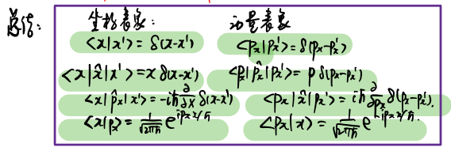
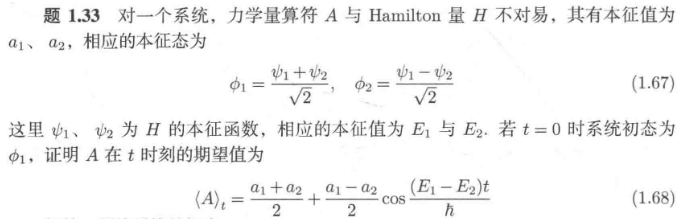
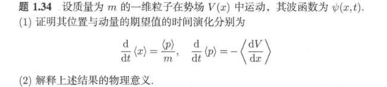
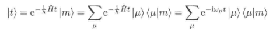
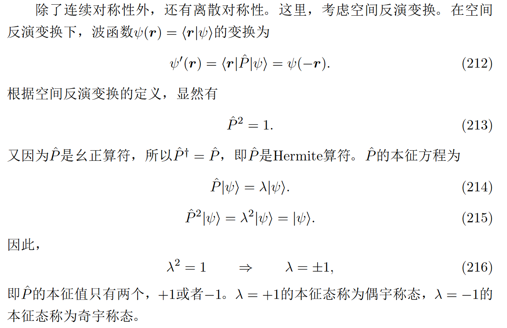
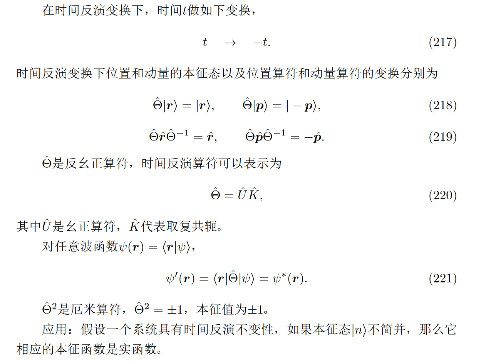

# 1 基本假设 数学工具 形式理论（1）

## 4.5 表象和表象变换

### 考点7：表象变换

- 连续谱问题

    

    只需要记一个：

    $$
    \langle x|p\rangle=\frac1{\sqrt{2\pi\hbar}}e^{ipx/\hbar}.
    $$

    1. 由坐标分布求动量分布

    2. 由动量分布求坐标分布

    3. 由动量分布求能量分布

    4. 动量表象下的薛定谔方程，算符计算

- 分立谱问题 + 矩阵问题

---

4.1 第一句话，波函数有三种表示方法。之前用抽象的符号表示波函数，十分便于计算关系的表述。如果要描述具体波函数，就像力学中用相空间、坐标空间描述系统状态一样，可以选用不同的标准基来表示 (1) 。
{ .annotate }

1.  :man_raising_hand: 这句话的意思是，波函数可以通过不同的方式来表示，类似于经典力学中使用不同的空
    间（如相 空间或坐标空间）来描述物理系统的状态。具体来说：

    - 抽象符号表示：在量子力学中，波函数最常见的表示方式是用抽象的数学符号表示。例如，使用态矢量 \( |\psi\rangle \) 来表示一个量子态，这种表示方法便于研究和计算，尤其是在操作符和态之间的关系式表述上（例如，计算期望值或算符作用等）。

    - 标准基表示：如果需要描述波函数的具体形式，通常需要选择合适的基底。例如，在坐标空间中，波函数可以通过 \( \psi(x) \) 表示，其中 \( x \) 是位置坐标；在动量空间中，波函数可以通过 \( \phi(p) \) 表示，其中 \( p \) 是动量坐标。这些具体的波函数表示方法帮助我们描述量子系统在不同表象下的状态。

    - 不同的标准基：这意味着可以根据需要选择不同的基底来表示波函数。比如，在位置表象下，波函数是位置的函数；而在动量表象下，波函数是动量的函数。通过变换这些表象，我们可以得到不同的描述方式，方便在不同情境下的计算和分析。

    总结起来，这句话是强调波函数可以有不同的表示方式，取决于我们选择的基底或表象。而这种多种表示方式使得量子力学在理论和计算上都具有很大的灵活性。

### 1 什么是表象

在量子力学中，表象通常可以分为两大类：**动力学表象** 和 **算符表象**。而在这两大类下，我们可以选择不同的组合方式来描述量子态和物理量。具体来说：

1. **坐标表象** 与 **动量表象** 是一组表示量子态的方式，属于 **算符表象**。您可以在这两种表象下描述量子态（波函数）：

    - **坐标表象（Position Representation）** 下，波函数 \(\psi(x,t)\) 是位置 \(x\) 的函数。

        （1）在坐标表象中，**位置算符** \(\hat{x}\) 和 **动量算符** \(\hat{p}\) 的表示分别为：

        $$
        \hat{x} = x
        $$

        $$
        \hat{p} = -i\hbar \frac{\partial}{\partial x}
        $$
    
        （1）量子态 \(|\psi\rangle\) 在坐标表象下由波函数表示：

        $$
        \psi(x,t) = \langle x | \psi \rangle
        $$

    - **动量表象（Momentum Representation）** 下，波函数 \(\phi(p,t)\) 是动量 \(p\) 的函数。

        （1）在动量表象中，**动量算符** \(\hat{p}\) 和 **位置算符** \(\hat{x}\) 的表示分别为：

        $$
        \hat{p} = p
        $$

        $$
        \hat{x} = i\hbar \frac{\partial}{\partial p}
        $$
    
        （2）量子态 \(|\psi\rangle\) 在动量表象下由波函数表示：

        $$
        \phi(p,t) = \langle p | \psi \rangle
        $$

    - **坐标与动量表象的关系**

        **Fourier变换** 可以用来将坐标表象和动量表象之间的波函数相互转换。具体地，坐标表象的波函数和动量表象的波函数之间的关系是：

        $$
        \psi(x,t) = \frac{1}{\sqrt{2\pi\hbar}} \int_{-\infty}^{\infty} \phi(p,t) e^{i \frac{p x}{\hbar}} \, dp
        $$

        $$
        \phi(p,t) = \frac{1}{\sqrt{2\pi\hbar}} \int_{-\infty}^{\infty} \psi(x,t) e^{-i \frac{p x}{\hbar}} \, dx
        $$

        这两种表象之间的转换反映了量子力学中位置和动量的对偶性。

2. **薛定谔表象** 和 **海森堡表象** 属于 **动力学表象**，它们描述的是量子态随时间的演化：

    - **薛定谔表象（Schrödinger Representation）** 下，量子态（波函数）随时间变化，而算符保持不变。

        （1）在薛定谔表象下，波函数 \(\psi(x, t)\) 由薛定谔方程给出：

        $$
        i\hbar \frac{\partial}{\partial t} \psi(x, t) = \hat{H} \psi(x,t)
        $$

        （2）量子态的时间演化通过哈密顿算符 \(\hat{H}\) 来控制，哈密顿算符通常包含粒子的动能和势能。

        （3）该表象的特征是量子态随时间变化，而物理量（如动量和位置）通过算符作用于波函数来计算。

    - **海森堡表象（Heisenberg Representation）** 下，量子态保持不变，而算符随时间变化。

        （1）在海森堡表象下，物理量（例如位置 \(\hat{x}(t)\) 和动量 \(\hat{p}(t)\)）随时间变化，而量子态不随时间变化。具体来说，海森堡表象下算符的时间演化由**海森堡方程**给出：

        $$
        \frac{d}{dt} \hat{A}(t) = \frac{i}{\hbar} [\hat{H}, \hat{A}(t)] + \left( \frac{\partial \hat{A}}{\partial t} \right)
        $$

        其中 \(\hat{A}(t)\) 是某个物理量的算符，\(\hat{H}\) 是哈密顿算符。

        （2）量子态在海森堡表象下通常保持不变，意味着如果在某个时刻的量子态为 \(|\psi(0)\rangle\)，则对于所有时间 \(t\)，量子态为 \(|\psi(t)\rangle = |\psi(0)\rangle\)。

        （3）海森堡表象的优点是，算符的时间演化通常较为简洁，特别是对于量子场论中的算符计算。

3. 定谔表象与坐标/动量表象的关系：

    - **薛定谔表象下的坐标表象**：量子态 \(\psi(x, t)\) 是位置 \(x\) 的函数，并且随时间变化。
    

    - **薛定谔表象下的动量表象**：量子态 \(\phi(p, t)\) 是动量 \(p\) 的函数，并且随时间变化。

所以，您可以在 **薛定谔表象** 下选择使用 **坐标表象**（波函数 \(\psi(x,t)\)）或 **动量表象**（波函数 \(\phi(p,t)\)），这取决于具体问题和所使用的方便性。两者都是在薛定谔表象框架下的不同方式来表示量子态。

### 2 态矢量的表示

#### 标准基

**标准基（Standard Basis）** 是一个在向量空间中用来表示任何向量的基底集合；具有正交性、完备性、归一性。

- 在 \(n\)-维空间中，有标准基：

    $$
    \{ \mathbf{e}_1, \mathbf{e}_2, \dots, \mathbf{e}_n \}
    $$

    具有正交归一性：

    $$
    \langle \mathbf{e}_i | \mathbf{e}_j \rangle = \delta_{ij}
    $$

    在 \( \mathbb{R}^n \) 或 \( \mathbb{C}^n \) 空间中，标准基的矩阵表示：

    $$
    \mathbf{e}_1 = \begin{pmatrix} 1 \\ 0 \\ 0 \end{pmatrix}, \quad
    \mathbf{e}_2 = \begin{pmatrix} 0 \\ 1 \\ 0 \end{pmatrix}, \quad
    \mathbf{e}_3 = \begin{pmatrix} 0 \\ 0 \\ 1 \end{pmatrix}
    $$

- 在 离散 Hilbert 空间中：

    可以选定厄米算符的本征态作为一组标准基（正交完备且归一）。选择可观测量 A 的本征态 $\{|n\rangle\}$ 作为标准基：

    $$
    |1\rangle\ = \begin{pmatrix} 1 \\ 0 \\ 0 \end{pmatrix}, \quad
    |2\rangle\ = \begin{pmatrix} 0 \\ 1 \\ 0 \end{pmatrix}, \quad
    |3\rangle\ = \begin{pmatrix} 0 \\ 0 \\ 1 \end{pmatrix}
    $$

- 在 连续 Hilbert 空间中：

    对于具有连续谱的厄米算符 $\hat{A}$，其本征态 $\{|a\rangle\}$ 满足本征方程：

    $$
    \hat{A} |a\rangle = a |a\rangle,
    $$

    其中 $a$ 是连续变量。此时，这些本征态构成了 Hilbert 空间的完备基矢，满足以下正交归一关系和完备性条件：

    1. **正交归一关系**：
    $$
    \langle a | a' \rangle = \delta(a - a'),
    $$

    其中 $\delta(a - a')$ 是狄拉克 $\delta$ 函数。

    2. **完备性条件**：
    $$
    \int_{-\infty}^\infty |a\rangle \langle a| \, da = \hat{I},
    $$

    这里 $\hat{I}$ 是单位算符。

    **补充：连续谱下的内积表示**

    在连续谱中，内积的定义是通过积分给出的：

    $$
    \langle \psi | \phi \rangle = \int_{-\infty}^\infty \psi^*(a) \phi(a) \, da.
    $$  

    这与离散谱中内积的求和形式相对应：

    $$
    \langle \psi | \phi \rangle = \sum_n \psi_n^* \phi_n.
    $$  

#### 离散谱

可以选择可观测量 $\hat A$ 的本征态 $\{|n\rangle\}$ 作为 Hilbert 空间的基矢（由厄米算符的完备性），可以将任意态矢量 $|\psi\rangle$ 表示基矢的线性组合：

$$
|\psi\rangle=\sum_{n}\psi_{n}|n\rangle,
$$

#### 连续谱

任意态矢量 $|\psi\rangle$ 可以用连续谱厄米算符的本征态作为基矢展开成线性组合（积分形式）：

$$
|\psi\rangle = \int_{-\infty}^\infty \psi(a) |a\rangle \, da,
$$

其中 $\psi(a) = \langle a | \psi \rangle$ 是态矢量 $|\psi\rangle$ 在基矢 $|a\rangle$ 上的投影（称为 $|\psi\rangle$ 在 $\hat{A}$ 的本征态表象下的波函数）。

### 3 算符的表示

在量子力学中，算符 $\hat{A}$ 的表示形式取决于所选基矢的性质，具体可分为 **离散谱** 和 **连续谱** 两种情况。

#### 离散谱

对于具有离散谱的算符 $\hat{A}$，其本征态 $\{|n\rangle\}$ 构成完备正交基，可以用这些基矢表示任意算符 $\hat{A}$。具体来说，算符的矩阵元定义为：

$$
A_{mn} = \langle m | \hat{A} | n \rangle,
$$

其中 $A_{mn}$ 是算符 $\hat{A}$ 在基矢 $\{|n\rangle\}$ 下的矩阵表示。

算符 $\hat{A}$ 可以用其矩阵元的形式写为：

$$
\hat{A} = \sum_{m,n} A_{mn} |m\rangle \langle n|.
$$

1. **厄米算符**：如果 $\hat{A}$ 是厄米算符，则有 $A_{mn} = A_{nm}^*$，即矩阵为厄米矩阵。

2. **对角化**：如果 $\hat{A}$ 可对角化，则在其本征态 $\{|n\rangle\}$ 下：

   $$
   A_{mn} = \langle m | \hat{A} | n \rangle = a_n \delta_{mn},
   $$

   其中 $a_n$ 是 $\hat{A}$ 的本征值。

3. **例子**

    - 在简谐振子的能量本征态 $\{|n\rangle\}$ 下，哈密顿算符 $\hat{H}$ 的矩阵表示为对角形式：

    $$
    H_{mn} = \langle m | \hat{H} | n \rangle = \hbar\omega \left(n + \frac{1}{2}\right) \delta_{mn}.
    $$

    - 算符 $\hat{x}$ 或 $\hat{p}$ 在离散基矢下通常是非对角的。

#### 连续谱

对于具有连续谱的算符 $\hat{A}$，其本征态 $\{|a\rangle\}$ 满足正交归一关系 $\langle a | a' \rangle = \delta(a - a')$。在这种情况下，算符 $\hat{A}$ 的表示形式由其在连续本征态下的矩阵元（核）决定：

$$
A(a, a') = \langle a | \hat{A} | a' \rangle.
$$

算符 $\hat{A}$ 的完整形式可以写为：

$$
\hat{A} = \int_{-\infty}^\infty \int_{-\infty}^\infty A(a, a') |a\rangle \langle a'| \, da \, da'.
$$

1. **厄米算符**：如果 $\hat{A}$ 是厄米的，则有 $A(a, a') = A^*(a', a)$。

2. **对角形式**：如果 $\hat{A}$ 可对角化，则在其本征态 $\{|a\rangle\}$ 下：

   $$
   A(a, a') = a \delta(a - a'),
   $$

   其中 $a$ 是 $\hat{A}$ 的本征值。

3. **例子**

    - 在坐标表象下，位置算符 $\hat{x}$ 的矩阵元为：

    $$
    \langle x | \hat{x} | x' \rangle = x \delta(x - x').
    $$

    - 动量算符 $\hat{p}$ 在坐标表象下的矩阵元为：

    $$
    \langle x | \hat{p} | x' \rangle = -i\hbar \frac{\partial}{\partial x} \delta(x - x').
    $$

### 4 表象变换

表象变换描述的是在不同基矢（表象）之间对量子态和算符的重新表达。在量子力学中，这种变换通常通过一个 **酉变换**（单位ary变换）来实现，保持量子力学的基本结构不变。

#### 态矢量

态矢量的表象变换通常指在不同基矢下重新表示同一个态矢量。设当前基为 \(\{|n\rangle\}\)，变换后的新基为 \(\{|\tilde{n}\rangle\}\)，且两组基之间通过酉变换 \(U\) 相关：

$$
|\tilde{n}\rangle = U |n\rangle.
$$

在这种情况下，态矢量 \(|\psi\rangle\) 的新表示为：

$$
|\tilde{\psi}\rangle = U |\psi\rangle.
$$

1. 离散谱

    对于离散谱中的态矢量 \(|\psi\rangle\)，原本在基 \(\{|n\rangle\}\) 下的表示为：

    $$
    |\psi\rangle = \sum_n \psi_n |n\rangle,
    $$

    其中 \(\psi_n = \langle n|\psi\rangle\) 是态矢量在基 \(\{|n\rangle\}\) 下的分量。

    表象变换后，在新基 \(\{|\tilde{n}\rangle\}\) 下的表示为：

    $$
    |\psi\rangle = \sum_n \tilde{\psi}_n |\tilde{n}\rangle,
    $$

    其中 \(\tilde{\psi}_n = \langle \tilde{n} | \psi \rangle\)。通过酉变换 \(U\)，分量之间的关系为：

    $$
    \tilde{\psi}_n = \sum_m U_{nm} \psi_m,
    $$

    其中 \(U_{nm} = \langle \tilde{n} | n \rangle\) 是变换矩阵的元素。

2. 连续谱

    对于具有连续谱的态矢量 \(|\psi\rangle\)，原本在基 \(\{|a\rangle\}\) 下的表示为：

    $$
    |\psi\rangle = \int \psi(a) |a\rangle \, da,
    $$

    其中 \(\psi(a) = \langle a|\psi\rangle\) 是态矢量在基 \(\{|a\rangle\}\) 下的分量。

    表象变换后，在新基 \(\{|\tilde{a}\rangle\}\) 下的表示为：

    $$
    |\psi\rangle = \int \tilde{\psi}(a) |\tilde{a}\rangle \, da,
    $$

    其中 \(\tilde{\psi}(a) = \langle \tilde{a}|\psi\rangle\)。通过酉变换 \(U\)，分量之间的关系为：

    $$
    \tilde{\psi}(a) = \int U(a, a') \psi(a') \, da',
    $$

    其中 \(U(a, a') = \langle \tilde{a} | a' \rangle\) 是变换核。

#### 算符

算符的表象变换涉及在新基下重新表示同一个算符。设原本的基为 \(\{|n\rangle\}\)，变换后的新基为 \(\{|\tilde{n}\rangle\}\)，两组基之间通过酉变换 \(U\) 相关：

$$
|\tilde{n}\rangle = U |n\rangle.
$$

算符 \(\hat{A}\) 在新基下的表示 \(\tilde{A}_{mn}\) 与旧基下的表示 \(A_{ij}\) 之间的关系为：

$$
\tilde{A}_{mn} = \sum_{i,j} U_{mi} A_{ij} U_{jn}^*,
$$

其中 \(U_{mi} = \langle \tilde{m} | i \rangle\) 是变换矩阵的元素。

1. 离散谱

    在离散谱中，算符 \(\hat{A}\) 原本在基 \(\{|n\rangle\}\) 下的表示为：

    $$
    \hat{A} = \sum_{m,n} A_{mn} |m\rangle \langle n|,
    $$

    经过表象变换后，在新基 \(\{|\tilde{n}\rangle\}\) 下的表示为：

    $$
    \hat{A} = \sum_{m,n} \tilde{A}_{mn} |\tilde{m}\rangle \langle \tilde{n}|,
    $$

    其中：

    $$
    \tilde{A}_{mn} = \sum_{i,j} U_{mi} A_{ij} U_{jn}^*.
    $$

2. 连续谱

    在连续谱中，算符 \(\hat{A}\) 原本在基 \(\{|a\rangle\}\) 下的表示为：

    $$
    \hat{A} = \int \int A(a, a') |a\rangle \langle a'| \, da \, da',
    $$

    经过表象变换后，在新基 \(\{|\tilde{a}\rangle\}\) 下的表示为：

    $$
    \hat{A} = \int \int \tilde{A}(a, a') |\tilde{a}\rangle \langle \tilde{a}'| \, da \, da',
    $$

    其中：

    $$
    \tilde{A}(a, a') = \int \int U(a, b) A(b, b') U^*(a', b') \, db \, db'.
    $$

## 4.6 矩阵力学

### 0 线性代数基础

1. 矢量

    $$
    |\alpha\rangle\to\mathbf{a}=\begin{pmatrix}a_1\\\\a_2\\\vdots\\\\a_N\end{pmatrix}.
    $$

2. 矩阵（算符）

    $$
    A = \begin{pmatrix}
    A_{11} & A_{12} & A_{13} \\
    A_{21} & A_{22} & A_{23} \\
    A_{31} & A_{32} & A_{33}
    \end{pmatrix}.
    $$

3. 矩阵运算

    - 复共轭

        $$
        \mathbf{A}^* = \begin{pmatrix}
        A_{11}^* & A_{12}^* & A_{13}^* \\
        A_{21}^* & A_{22}^* & A_{23}^* \\
        A_{31}^* & A_{32}^* & A_{33}^*
        \end{pmatrix}.
        $$

    - 转置

        $$
        \mathbf{A}^T = \begin{pmatrix}
        A_{11} & A_{21} & A_{31} \\
        A_{12} & A_{22} & A_{32} \\
        A_{13} & A_{23} & A_{33}
        \end{pmatrix}.
        $$

    - 厄米共轭

        $$
        \mathbf{A}^\dagger = (\mathbf{A}^*)^T = \begin{pmatrix}
        A_{11}^* & A_{21}^* & A_{31}^* \\
        A_{12}^* & A_{22}^* & A_{32}^* \\
        A_{13}^* & A_{23}^* & A_{33}^*
        \end{pmatrix}.
        $$

    - 内积

        态矢量 \(|\psi\rangle\) 和 \(|\phi\rangle\) 的内积在矩阵形式下表示为行向量与列向量的乘积：

        $$
        \langle \phi | \psi \rangle = \begin{pmatrix} \phi_1^* & \phi_2^* & \cdots & \phi_N^* \end{pmatrix}
        \begin{pmatrix} \psi_1 \\ \psi_2 \\ \vdots \\ \psi_N \end{pmatrix}.
        $$

        结果是一个标量：

        $$
        \langle \phi | \psi \rangle = \sum_{i=1}^N \phi_i^* \psi_i.
        $$

    - 外积

        态矢量 \(|\psi\rangle\) 和 \(|\phi\rangle\) 的外积生成一个矩阵：

        $$
        |\psi\rangle \langle \phi| = \begin{pmatrix} \psi_1 \\ \psi_2 \\ \vdots \\ \psi_N \end{pmatrix}
        \begin{pmatrix} \phi_1^* & \phi_2^* & \cdots & \phi_N^* \end{pmatrix}.
        $$

        结果是一个 \(N \times N\) 的矩阵：

        $$
        |\psi\rangle \langle \phi| =
        \begin{pmatrix}
        \psi_1 \phi_1^* & \psi_1 \phi_2^* & \cdots & \psi_1 \phi_N^* \\
        \psi_2 \phi_1^* & \psi_2 \phi_2^* & \cdots & \psi_2 \phi_N^* \\
        \vdots & \vdots & \ddots & \vdots \\
        \psi_N \phi_1^* & \psi_N \phi_2^* & \cdots & \psi_N \phi_N^*
        \end{pmatrix}.
        $$

    - 投影算符

        假设态矢量 \(|\alpha\rangle\) 在 Hilbert 空间中表示为：

        $$
        |\alpha\rangle =
        \begin{pmatrix}
        \alpha_1 \\ \alpha_2 \\ \vdots \\ \alpha_N
        \end{pmatrix}.
        $$

        那么投影算符的矩阵形式为外积：

        $$
        \hat{P}_\alpha = |\alpha\rangle \langle \alpha| =
        \begin{pmatrix}
        \alpha_1 \\ \alpha_2 \\ \vdots \\ \alpha_N
        \end{pmatrix}
        \begin{pmatrix}
        \alpha_1^* & \alpha_2^* & \cdots & \alpha_N^*
        \end{pmatrix}.
        $$

        展开后为：

        $$
        \hat{P}_\alpha =
        \begin{pmatrix}
        |\alpha_1|^2 & \alpha_1 \alpha_2^* & \cdots & \alpha_1 \alpha_N^* \\
        \alpha_2 \alpha_1^* & |\alpha_2|^2 & \cdots & \alpha_2 \alpha_N^* \\
        \vdots & \vdots & \ddots & \vdots \\
        \alpha_N \alpha_1^* & \alpha_N \alpha_2^* & \cdots & |\alpha_N|^2
        \end{pmatrix}.
        $$

4. 外积的运用

    - 左右矢地位相同 - 表示两个态的重叠

        $$
        \langle \phi | \psi \rangle = \int \phi^*(x) \psi(x) dx.
        $$

        应用：正交性

    - 地位不同

        （1）离散谱

        $$
        \langle n | \psi \rangle = c_n,
        $$

        或者展开

        $$
        |\psi\rangle = \sum_m \langle m | \psi \rangle |m\rangle 
        $$

        （2）连续谱

        $$
        \langle x | k \rangle = \frac{1}{\sqrt{2\pi\hbar}} e^{i k x / \hbar},
        $$

        表示态 \(|k\rangle\) 在位置表象 \(|x\rangle\) 下的波函数形式。

        $$
        |\psi\rangle = \int_{-\infty}^\infty \psi(a) |a\rangle \, da,
        $$

        应用：完备性、完备性展开、统计诠释与期望

4. 内积的运用

    假设 \( \{|m\rangle\} \) 是一个正交归一的基集合：

    （1）由完备性：

    $$
    |\psi\rangle = \sum_m \langle m | \psi \rangle |m\rangle = \sum_m |m\rangle \langle m| \psi \rangle.
    $$

    （2）内积

    由于

    $$
    (|m\rangle \langle n|)_{ij} = \langle i | m \rangle \langle n | j \rangle. = \delta_{im} \delta_{nj}.
    $$

    因此

    $$
    |m\rangle \langle n| = \begin{pmatrix}
    0 & \cdots & 0 & \cdots & 0 \\
    \vdots & \ddots & \vdots & \ddots & \vdots \\
    0 & \cdots & 1 & \cdots & 0 \\
    \vdots & \ddots & \vdots & \ddots & \vdots \\
    0 & \cdots & 0 & \cdots & 0
    \end{pmatrix}
    $$

    其中，第𝑚行、第𝑛列的位置的元素是 1，其余的元素均为 0。

5. 求矩阵本征

    1. **矩阵表示与特征方程**

        已知 \( A \) 的矩阵表示 \( M_A \)，求本征向量的问题可以归结为解以下方程：

        $$
        M_A \vec{v} = \lambda \vec{v}
        $$

        其中：

        - \( \vec{v} \) 是 \( A \) 的本征向量（需要求解）。

        - \( \lambda \) 是 \( A \) 的本征值（通过矩阵特征方程确定）。

    2. **特征值的求解**

        首先，解特征值问题：

        $$
        \det(M_A - \lambda I) = 0
        $$

        这是一元 \( n \) 次方程，其中 \( n \) 是矩阵的维数。解出所有特征值 \( \lambda_i \)（可能有重根）。

    3. **特征向量的求解**

        对于每个特征值 \( \lambda_i \)：

        1. 代入方程 \( (M_A - \lambda_i I) \vec{v}_i = 0 \)。

        2. 解出 \( \vec{v}_i \) 的解空间（线性方程组）。

        3. 归一化 \( \vec{v}_i \) 使其满足：

        $$
        \langle \vec{v}_i | \vec{v}_i \rangle = 1
        $$

        如果特征值有重数，解空间的维度可能大于 1，需要找到一组正交归一的向量。

    4. **例子**

        假设 \( A \) 的矩阵表示为：

        $$
        M_A = \begin{pmatrix}
        2 & 1 \\
        1 & 2
        \end{pmatrix}
        $$

        (1) 求特征值

        特征方程为：

        $$
        \det(M_A - \lambda I) = \det\begin{pmatrix}
        2-\lambda & 1 \\
        1 & 2-\lambda
        \end{pmatrix} = (2-\lambda)^2 - 1 = 0
        $$

        展开得到：

        $$
        \lambda^2 - 4\lambda + 3 = 0
        $$

        解得特征值：

        $$
        \lambda_1 = 3, \quad \lambda_2 = 1
        $$

        (2) 求特征向量

        对于 \( \lambda_1 = 3 \)，求解：

        $$
        (M_A - 3I) \vec{v}_1 = 0
        $$

        即：

        $$
        \begin{pmatrix}
        -1 & 1 \\
        1 & -1
        \end{pmatrix} \begin{pmatrix}
        x_1 \\
        x_2
        \end{pmatrix} = 0
        $$

        解得 \( x_1 = x_2 \)，因此本征向量为：

        $$
        \vec{v}_1 = \begin{pmatrix}
        1 \\
        1
        \end{pmatrix} \quad \text{归一化为：} \quad \frac{1}{\sqrt{2}}\begin{pmatrix}
        1 \\
        1
        \end{pmatrix}
        $$

        对于 \( \lambda_2 = 1 \)，类似地求解：

        $$
        (M_A - I) \vec{v}_2 = 0
        $$

        即：

        $$
        \begin{pmatrix}
        1 & 1 \\
        1 & 1
        \end{pmatrix} \begin{pmatrix}
        x_1 \\
        x_2
        \end{pmatrix} = 0
        $$

        解得 \( x_1 = -x_2 \)，因此本征向量为：

        $$
        \vec{v}_2 = \begin{pmatrix}
        1 \\
        -1
        \end{pmatrix} \quad \text{归一化为：} \quad \frac{1}{\sqrt{2}}\begin{pmatrix}
        1 \\
        -1
        \end{pmatrix}
        $$

        （3）最终结果

        矩阵 \( M_A \) 的本征向量是：

        $$
        \vec{v}_1 = \frac{1}{\sqrt{2}} \begin{pmatrix}
        1 \\
        1
        \end{pmatrix}, \quad
        \vec{v}_2 = \frac{1}{\sqrt{2}} \begin{pmatrix}
        1 \\
        -1
        \end{pmatrix}
        $$

        这些本征向量构成了 \( A \) 表象下的一组正交归一基。

### 1 矩阵表示

1. 标准基

    - 离散谱

        选择可观测量 A 的本征态 $\{|n\rangle\}$ 作为标准基：

        $$
        |1\rangle\ = \begin{pmatrix} 1 \\ 0 \\ 0 \end{pmatrix}, \quad
        |2\rangle\ = \begin{pmatrix} 0 \\ 1 \\ 0 \end{pmatrix}, \quad
        |3\rangle\ = \begin{pmatrix} 0 \\ 0 \\ 1 \end{pmatrix}
        $$

    - 连续谱

        选择连续谱厄米算符 $\hat{A}$ 的本征态 $\{|a\rangle\}$ 作为标准基，这里无法写出矩阵形式

2. 态矢量的表示

    - 离散谱

        选择可观测量 A 的本征态 $\{|n\rangle\}$ 作为标准基，将任意态矢量 $|\psi\rangle$ 表示基矢的线性组合：

        $$
        |\psi\rangle=\sum_{n}\psi_{n}|n\rangle,
        $$

        矩阵形式：

        $$
        |\psi\rangle = \begin{pmatrix} \psi_1 \\ \psi_2 \\ \vdots \\ \psi_N \end{pmatrix}.
        $$

        其中：

        $$
        \psi_1 = \langle 1 | \psi \rangle, \quad
        \psi_2 = \langle 2 | \psi \rangle, \quad
        \psi_n = \langle n | \psi \rangle.
        $$

    - 连续谱

        选择连续谱厄米算符 $\hat{A}$ 的本征态 $\{|a\rangle\}$ 作为标准基，这里无法写出矩阵形式。

        将任意态矢量 $|\psi\rangle$ 表示基矢的线性组合：

        $$
        |\psi\rangle = \int_{-\infty}^\infty \psi(a) |a\rangle \, da,
        $$

        其中 \(\psi(a) = \langle a | \psi \rangle\) 是态矢量在本征态 \(|a\rangle\) 上的投影（对应于波函数）

        矩阵形式，态矢量在连续谱中的矩阵形式可以理解为一种泛函描述，它的表示类似于无穷维列向量

        $$
        |\psi\rangle = 
        \begin{pmatrix}
        \psi(a_1) \\
        \psi(a_2) \\
        \vdots \\
        \psi(a)
        \end{pmatrix}.
        $$

        或者，用分布函数的形式更加严格地表达为：  

        $$
        |\psi\rangle = 
        \begin{pmatrix}
        \psi(a) \, \text{(a continuous function of $a$)} 
        \end{pmatrix}.
        $$  

        在这种情况下，\(\psi(a)\) 类似于连续基矢 \(|a\rangle\) 的分量，包含了态矢量在每个连续本征值 \(a\) 上的分布信息。

3. 算符的表示

    - 离散谱

        $$
        \hat{A} = \sum_{m,n} A_{mn} |m\rangle \langle n|.
        $$

        矩阵元：

        $$
        A_{mn} = \langle m | \hat{A} | n \rangle,
        $$

        矩阵形式：

        $$
        \hat{A}=\left(\begin{array}{cccc}\langle1|\hat{A}|1\rangle&\langle1|\hat{A}|2\rangle&\cdots&\langle1|\hat{A}|N\rangle\\\langle2|\hat{A}|1\rangle&\langle2|\hat{A}|1\rangle&\cdots&\langle2|\hat{A}|N\rangle\\\vdots&\vdots&\cdots&\vdots\\\langle N|\hat{A}|1\rangle&\langle N|\hat{A}|2\rangle&\cdots&\langle N|\hat{A}|N\rangle\end{array}\right).
        $$

        补充说明：

        - **Hilbert空间**：对于一个有限维 \(N\)-维 Hilbert 空间，矩阵 \(\hat{A}\) 是一个 \(N \times N\) 的矩阵。

        - **厄米算符的矩阵性质**：

            （1）本征值为实数，本征态正交

            （2）厄米算符一定可对角化，且在其本征态构成的基底中是一个对角矩阵

            （3）共轭对称性：如果算符 \(\hat{A}\) 是厄米算符（如可观测量），则矩阵 \(\hat{A}\) 满足共轭对称性：

            $$
            A_{mn} = A_{nm}^*.
            $$

            因此厄米矩阵的复共轭等于自身的转置

            $$
            \hat A^* = \hat A^T.
            $$

            （4）$\hat A$ 是一个厄米矩阵，且满足 $\hat A^2 = a$：本征值是实数，且满足 \( \lambda = \pm \sqrt{a} \)

            （5）迹为实数：

            $$
            \text{Tr}(M_A) = \sum_{i} (M_A)_{ii}.
            $$

            （6）特征值和矩阵的幺正变换不变性：厄米矩阵的本征值不因幺正变换改变。即如果对厄米矩阵 \( M_A \) 进行幺正变换：

            $$
            M_A' = U M_A U^\dagger,
            $$

            其中 \( U \) 为酉矩阵，则 \( M_A' \) 的特征值与 \( M_A \) 的特征值相同

        - **A表象下**：以 $\hat A$ 为表象的含义：选取 $\hat A$ 的特征向量 \( |n\rangle \) 作为标准基。若以 $\hat A$ 作为表象，$\hat A$ 的矩阵形式一定是一个对角矩阵：

            $$
            A = \begin{pmatrix}
            \lambda_1 & 0 & \cdots & 0 \\
            0 & \lambda_2 & \cdots & 0 \\
            \vdots & \vdots & \ddots & \vdots \\
            0 & 0 & \cdots & \lambda_n
            \end{pmatrix}
            $$

            每一个特征值 \( \lambda_i \) 对应着一个特征向量 \( |\psi_i\rangle \)

            本征方程

            $$
            \hat{A} |n\rangle = \lambda_n |n\rangle,
            $$

    - 连续谱

        $$
        \hat{A} = \int_{-\infty}^\infty \int_{-\infty}^\infty A(a, a') |a\rangle \langle a'| \, da \, da'.
        $$

        矩阵核：

        $$
        A(a, a') = \langle a | \hat{A} | a' \rangle.
        $$

        补充说明：

        1. **Hilbert空间**：

            对于无限维 Hilbert 空间，算符的矩阵形式不再是一个有限维的矩阵。相反，矩阵可以理解为一个连续的函数或者在连续谱的基下表示为积分形式。例如，连续谱的算符矩阵元是通过积分而非求和给出的。

        2. **厄米算符的矩阵性质**（对于连续谱）：

            - **本征值为实数**：与离散谱一样，连续谱的本征值也是实数，但是它们是连续分布的，而不是离散的。
            
            - **本征态正交**：连续谱的本征态是正交的，但在连续谱的情况下，正交性以“狄拉克 delta 函数”的形式给出：
                $$
                \langle a | a' \rangle = \delta(a - a').
                $$

            - **厄米算符的对角化**：对于连续谱，厄米算符依然是可对角化的，但其对角化形式是在无限维基中表现为积分。例如，算符 \(\hat{A}\) 可以表示为：
                $$
                \hat{A} = \int_{-\infty}^{\infty} a |a\rangle \langle a| \, da,
                $$
                其中 \(a\) 是本征值，\(|a\rangle\) 是对应的本征态。

            - **共轭对称性**：同样，若 \(\hat{A}\) 是厄米算符，矩阵元仍然满足：
                $$
                A(a,a') = A^*(a',a),
                $$
                即 \(\hat{A}\) 在连续谱下的矩阵元也满足复共轭对称性。

            - **迹为实数**：对于连续谱，由于迹是本征值的和，在连续谱下无法像离散谱那样直接计算。通常我们会通过积分的形式来表示期望值或矩阵元：
                $$
                \text{Tr}(\hat{A}) = \int_{-\infty}^\infty a \langle a | \hat{A} | a \rangle \, da.
                $$

            - **特征值和矩阵的幺正变换不变性**：对于连续谱，幺正变换的性质类似于离散谱，连续谱算符的特征值同样不受幺正变换的影响。

        3. **A表象下**：

            - **选择本征态作为标准基**：如果选择连续谱算符 \(\hat{A}\) 的本征态 \(\{|a\rangle\}\) 作为标准基，则任何态矢量都可以表示为这些本征态的线性组合。例如，任意态矢量 \(|\psi\rangle\) 可以表示为：

                $$
                |\psi\rangle = \int_{-\infty}^\infty \psi(a) |a\rangle \, da.
                $$
            
            - **矩阵形式**：在连续谱下，算符 \(\hat{A}\) 的矩阵形式通常不再是一个简单的矩阵，而是一个通过积分给出的算符。对于厄米算符，它的矩阵形式可以表示为：

                $$
                \hat{A} = \int_{-\infty}^\infty a |a\rangle \langle a| \, da,
                $$
                其中 \(a\) 是算符的本征值，\(|a\rangle\) 是本征态。

        这些补充说明的变化主要体现在如何处理连续谱的本征值和本征态，以及如何将算符的矩阵形式从离散谱转化为连续谱的形式。在连续谱中，算符的表示依赖于积分而非求和，且本征值是连续分布的。

### 2 表象变换

1. 态表象变换

    已知A表象的标准基 $|n\rangle$ 和B表象的标准基 $|\tilde{n}\rangle$，两组标准基的变换：

    $$
    |\tilde{n}\rangle = U |n\rangle.
    $$

    通过展开 \( |\tilde{n}\rangle \) 的定义，我们有：

    $$
    |\tilde{n}\rangle = \sum_{m} U_{mn} |m\rangle,
    $$

    $$
    U_{mn} = \langle m | \tilde{n} \rangle.
    $$

    \( U \) 将 **A 表象中的矢量表示变换为 B 表象中的矢量表示**，即 **A 表象到 B 表象的变换矩阵**。

    反之，若要从 B 表象切换回 A 表象，需要用 \( U^\dagger \)

    酉变换 \(U\) 的矩阵表示：

    $$
    \hat{U}=\begin{pmatrix}&\langle1|1^{\prime}\rangle&\langle1|2^{\prime}\rangle&\cdots&\langle1|N^{\prime}\rangle\\&\langle2|1^{\prime}\rangle&\langle2|2^{\prime}\rangle&\cdots&\langle2|N^{\prime}\rangle\\&\vdots&\vdots&\ddots&\vdots\\&\langle N|1^{\prime}\rangle&\langle N|2^{\prime}\rangle&\cdots&\langle N|N^{\prime}\rangle\end{pmatrix}.
    $$

    实际计算中，在同一个表象下进行运算

    ---

    补充说明：

    1. U是一个幺正矩阵

        $$
        U^\dagger U = U U^\dagger = I,
        $$

2. 算符表象变换

    对于算符的表象变换，若算符 \(\hat{A}\) 在标准基 \(\{|n\rangle\}\) 下有矩阵形式：

    $$
    \hat{A} = \sum_{m,n} A_{mn} |m\rangle \langle n|.
    $$

    $$
    A_{mn} = \langle m | \hat{A} | n \rangle,
    $$

    $$
    \hat{A}=\left(\begin{array}{cccc}\langle1|\hat{A}|1\rangle&\langle1|\hat{A}|2\rangle&\cdots&\langle1|\hat{A}|N\rangle\\\langle2|\hat{A}|1\rangle&\langle2|\hat{A}|1\rangle&\cdots&\langle2|\hat{A}|N\rangle\\\vdots&\vdots&\cdots&\vdots\\\langle N|\hat{A}|1\rangle&\langle N|\hat{A}|2\rangle&\cdots&\langle N|\hat{A}|N\rangle\end{array}\right).
    $$

    算符\(\hat{A}\) 在标准基 \(\{|n'\rangle\}\) 下有矩阵形式

    $$
    \tilde{\hat{A}} = \sum_{m',n'} A_{m'n'} |m'\rangle \langle n'|.
    $$

    $$
    \tilde{A}_{m'n'} = \langle m' | \tilde{\hat{A}} | n' \rangle = \sum_{m,n} \langle m' | U | m \rangle \langle m | \hat{A} | n \rangle \langle n | U^\dagger | n' \rangle. = \langle m' | \tilde{\hat{A}} | n' \rangle
    $$

    变换矩阵为：

    $$
    \tilde{\hat{A}} = U \hat{A} U^\dagger.
    $$

    $$
    \tilde{A}_{m'n'} = \sum_{m,n} \langle m' | U | m \rangle A_{mn} \langle n | U^\dagger | n' \rangle.
    $$

    例如，

    $$
    \tilde{A}_{11} = U_{11} A_{11} U_{11}^* + U_{12} A_{21} U_{12}^* + U_{13} A_{31} U_{13}^* + U_{11} A_{12} U_{21}^* + U_{12} A_{22} U_{22}^* + U_{13} A_{32} U_{32}^* + \cdots.
    $$

    因此，新表象下的矩阵元 \(\tilde{A}_{m'n'}\) 是通过原始算符矩阵元 \(A_{mn}\) 与变换矩阵 \(U\) 的元素之间的关系给出的。

    ---

    补充说明：

    1. 如果算符 \(\hat{A}\) 是厄米的，即 \(\hat{A}^\dagger = \hat{A}\)，则其在变换后的表象下依然是厄米的。

    2. 对于幺正变换，算符的本征值不变，但是本征态会发生变化。

## 4.6 时间演化 运动方程 守恒量与对称性

### 考点9：时间演化

1. 态随时间演化

    

    一道例题

    
    

2. 力学量期望值随时间演化

    

    一道例题

    
    

3. 测量值a的机率分布随时间演化

4. 可能状态的几率随时间演化

---

如果知道t=0系统的状态，需要用时间演化来推演任意t时刻的状态。这个思路下，推导出能够描述波矢随时间变化的方程：运动方程，也就是薛定谔方程。随时间不变的量叫做守恒量，而随时间演化相同的变换叫做对称性，我们发现守恒量与对称性之间有函数关系。

### 1 时间演化算符 运动方程 薛定谔方程

这一节不重要，只是介绍怎么提出的这个算符

**定义：** 时间演化算符

$$
|\psi(t')\rangle=\hat{U}(t',t)|\psi(t)\rangle.
$$

1. 时间演化算符是线性算符

2. 时间演化算符是幺正算符: $\langle\psi(t)|\hat{U}^\dagger(t',t)\hat{U}(t',t)|\psi(t)\rangle=1.$

**证明：** 由时间演化算符可以推导出薛定谔方程

考虑微分：

$$
\hat{U}(t+\delta t,t)=1+\delta t\hat{\alpha}(t),
$$

$$
\begin{aligned}
\frac{\partial}{\partial t}|\psi(t)\rangle & =\lim_{\delta t\to0}\frac{|\psi(t+\delta t)\rangle-|\psi(t)\rangle}{\delta t} \\
&=\lim_{\delta t\to0}\frac{\hat{U}(t+\delta t,t)-1}{\delta t}|\psi(t)\rangle=\hat{\alpha}(t)|\psi(t)\rangle.
\end{aligned}
$$

**算符 $i\hbar\hat{\alpha}(t)$ 是Hermite算符且具有能量量纲** 。方程两边都乘 $i\hbar$ : 

$$
i\hbar\frac{\partial}{\partial t}|\psi(t)\rangle=\hat{H}|\psi(t)\rangle.
$$

得到一个运动方程，类似于牛顿第二定律。这就是 **薛定谔方程**。

可以写成矩阵形式：

$$
i\hbar\frac{\partial}{\partial t}\left(\begin{array}{c}c_1(t)\\c_2(t)\\\vdots\\c_n(t)\end{array}\right)=\left(\begin{array}{cccc}H_{11}&H_{12}&\cdots&H_{1n}\\H_{21}&H_{22}&\cdots&H_{2n}\\\vdots&\vdots&\cdots&\vdots\\H_{n1}&H_{n2}&\cdots&H_{nn}\end{array}\right)\left(\begin{array}{c}c_1(t)\\c_2(t)\\\vdots\\c_n(t)\end{array}\right)
$$

### 2 定态

不含时哈密顿算符的本征态（能量算符本征态）称为定态。**在定态下。所有不含时的可观测量（力学量）的期待值和可测量值的几率分布不随时间变化。**

注意两个条件：$\hat H$ **不含时** ； 需要处于 $\hat H$ 的 **本征态** 下。

$$
|\psi(t)\rangle = e^{-\frac{i}{\hbar}\hat H t} |n\rangle = e^{-i h_n t / \hbar} |n\rangle
$$

其中 \(h_n\) 是 \(|n\rangle\) 对应的哈密顿量本征值，即 \(\hat{H} |n\rangle = h_n |n\rangle\)。这种情况下，将算符$\hat H$化为本征值，非常好算

举一个例子来说明：考虑一个简单的谐振子系统，其Hamiltonian为 $H = \frac{p^2}{2m} + \frac{1}{2}m\omega^2 x^2$，其中 $p$ 为动量，$m$ 为质量，$\omega$ 为振动频率。系统的能量本征态为谐振子的能级，每个能级对应一个确定的能量值。如果系统处于某个能级的能量本征态中，那么系统的能量将保持不变，不会随时间变化。因此，在这个能级上，谐振子的位置、动量等可观测量的期望值和测量结果的概率分布也将保持不变，不会随时间变化。

### 3 力学量期待值的时间演化

1. 第一种情况：H 不含时

    - 首先求t时刻的波函数嘛

        $$U(t, t_0) = e^{-\frac{i}{\hbar}H(t-t_0)}$$

        $$
        |\psi(t)\rangle = e^{-\frac{i}{\hbar}Ht} |\psi(0)\rangle
        $$
    
    - 然后再由统计诠释求期待值嘛，这里需要讨论：力学量 $A$ 与 $H$ 是否对易。A的期望值随时间的变化由以下公式给出：

        $$
        \langle \hat{A}(t) \rangle = \langle \psi(t) | \hat{A} | \psi(t) \rangle
        $$

        $$
        \langle \hat{A}(t) \rangle = \langle \psi(0) | e^{\frac{i}{\hbar} \hat{H} t} \hat{A} e^{-\frac{i}{\hbar} \hat{H} t} | \psi(0) \rangle
        $$

        为了进一步简化，定义算符的 **时间演化**：

        $$
        \hat{A}(t) = e^{\frac{i}{\hbar} \hat{H} t} \hat{A} e^{-\frac{i}{\hbar} \hat{H} t}
        $$

        因此，力学量的期望值随时间的变化可以写成：

        $$
        \langle \hat{A}(t) \rangle = \langle \psi(0) | \hat{A}(t) | \psi(0) \rangle
        $$

    - 费曼-普朗克公式

        有时候我们还需要用到一个叫做 **费曼-普朗克公式** 的公式，它通过计算可观测量的时间导数来进一步描述期望值的时间演化。费曼-普朗克公式给出时间演化的微分表达式：

        $$
        \left.\frac{d\left\langle A\right\rangle}{dt}=\left\{\begin{array}{ll}\frac{1}{i\hbar}\left\langle\left[\hat{A},\hat{H}\right]\right\rangle&\hat{A}\text{与时间无关}\\\frac{1}{i\hbar}\left\langle\left[\hat{A},\hat{H}\right]\right\rangle+\left\langle\frac{\partial\hat{A}}{\partial t}\right\rangle&\hat{A}\text{与时间有关}\end{array}\right.\right.
        $$

        其中 \([ \hat{H}, \hat{A} ] = \hat{H} \hat{A} - \hat{A} \hat{H}\) 是哈密顿量和可观测量算符的对易子。

    - 总结

        因此，力学量期望值随时间的变化可以通过以下步骤求解：

        1. 确定系统的状态 \(|\psi(t)\rangle\) 和可观测量算符 \(\hat{A}\)。
        2. 计算时间演化后的可观测量算符 \(\hat{A}(t) = e^{\frac{i}{\hbar} \hat{H} t} \hat{A} e^{-\frac{i}{\hbar} \hat{H} t}\)。
        3. 计算期望值 \(\langle \hat{A}(t) \rangle = \langle \psi(0) | \hat{A}(t) | \psi(0) \rangle\)。

        或者，也可以通过费曼-普朗克公式来求取期望值的时间导数（推荐）： 

        $$
        \frac{d}{dt} \langle \hat{A}(t) \rangle = \frac{i}{\hbar} \langle [\hat{H}, \hat{A}] \rangle
        $$

    - 再求一下力学量A得到测量值a的机率分布随时间演化

        如果我们测量 \(\hat{A}\)，则可以得到一组本征值 \(\{a_n\}\) 和对应的本征态 \(\{|\psi_n\rangle\}\)。那么，在任意时刻 \(t\)，测量 \(\hat{A}\) 得到本征值 \(a_n\) 的概率为：

        $$
        P(a_n, t) = |\langle \psi_n | \psi(t) \rangle|^2 = |\langle \psi_n | e^{-\frac{i}{\hbar} \hat{H} t} |\psi(0)\rangle |^2
        $$

        这个表达式给出了测量得到 \(a_n\) 的概率分布 \(P(a_n, t)\)，其随时间的演化反映了量子态的变化。

        - 如果 \(\hat{A}\) 和 \(\hat{H}\) 对易（即 \([\hat{A}, \hat{H}] = 0\)），那么系统的态在时间演化下保持在同一个本征子空间内。在这种情况下，测量 \(\hat{A}\) 的结果 \(a_m\) 的概率 \(P(a_m, t)\) 将是恒定的，不随时间变化。

        - 如果 \(\hat{A}\) 和 \(\hat{H}\) 不对易，那么系统的态将在不同的本征态之间混合，概率分布 \(P(a_m, t)\) 将随时间变化。可以通过计算系统的时间演化来得到这个概率分布随时间的演化。

            这个时候就可以投影到哈密顿算符的本征函数上进行运算了：

            

2. 第二种情况：H 含时

    $$U(t, t_0) = \mathcal{T} \exp\left(-\frac{i}{\hbar} \int_{t_0}^{t} H(t') dt'\right)$$

    $$
    |\psi(t)\rangle=\hat{U}(t,t_0)|\psi(t_0)\rangle.
    $$

    $$
    |\psi(t)\rangle=\hat{U}(t,0)|\psi(0)\rangle.
    $$

一道例题

### 4 守恒量

**推导**：力学量的期待值随时间的演化方程

在任意态下：

$$
\frac{d}{dt}\langle\psi|\hat{F}|\psi\rangle=\left(\frac{\partial}{\partial t}\langle\psi|\right)\hat{F}|\psi\rangle+\langle\psi|\hat{F}\left(\frac{\partial}{\partial t}|\psi\rangle\right)+\langle\psi|\left(\frac{\partial}{\partial t}\hat{F}\right)|\psi\rangle.
$$

假定$H$不含时

$$
\frac{d}{dt}\langle\psi|\hat{F}|\psi\rangle=\frac{1}{i\hbar}\langle\psi|[\hat{F},\hat{H}]|\psi\rangle+\langle\psi|\left(\frac{\partial}{\partial t}\hat{F}\right)|\psi\rangle 
$$

得到 **守恒量的定义**。如果满足：

$$
[\hat{F},\hat{H}]=0
$$

**则在任何状态下 $\hat F$的期待值不随时间变化**。即

$$
<\hat F> = \langle\psi|\hat{F}|\psi\rangle = Const.
$$

---

如果$\hat{A}$不显含时间，并且$[\hat{A},\hat{H}]=0$

$$\frac{d\left\langle A\right\rangle}{dt}=0,$$

$\langle A\rangle$不随时间变化

$$\frac d{dt}\left|c_n(t)\right|^2=0,$$

几率分布不随时间变化

力学量A是个守恒量

1. $\hat{A} = \hat{H}$, 且$\hat{H}$不显含时间，$d\langle H\rangle/dt=0,\rightarrow$能量守恒；

2. $\left [ \hat{p},\hat{H}\right ]=0$,且$\hat{\hat{p}}$不显含时间$,d\langle\vec{p}\rangle/dt=0,\to$动量守恒； 

3. $\left [ \hat{\vec{L} } , \hat{\vec{H} } \right ] = 0$, $\hat{\vec{L} }$不显含时间，$d\langle \vec{L} \rangle / dt= 0$, $\to$ 角动量守恒；

### 5 对称性 对称性与守恒量的关系

**对称性**：在对称变换 $\hat Q$ 下，系统的量子态 $|\psi\rangle$ 和 $|\psi'\rangle$ 遵从相同的时间演化规律。

满足 **$\hat Q$ 变换下具有对称性的条件**:

$$
\hat{Q}\hat{H}\hat{Q}^{-1}=\hat{H},\quad 即 \quad[\hat{Q},\hat{H}]=0
$$

 

**Wiagner定理:对称变换Q一定是一个幺正算符或反幺正算符**

 

---

**对称性与守恒量的关系：**

$\hat Q$ 是一个对称变换；$\hat F$是一个守恒量。它们满足：

$$
\boxed{
\hat{Q}=e^{i\eta\hat{F}}
}
$$

---

变换：时空的 **平移，旋转，反演**

- 空间平移对称性 动量守恒

    $$
    \hat{T}(x) = e^{-ix\hat{p}_{x}/\hbar}.
    $$

    （空间平移算符与动量算符的关系）

- 空间旋转对称性 角动量守恒

    $$
    \hat{R}_n(\phi)=e^{-i\phi \vec L\cdot \vec n/\hbar}
    $$

    （旋转算符与角动量算符）

- 空间反演对称性 宇称守恒

    {:height="70%" width="70%"}

- 时间反演对称性 能量守恒

    {:height="70%" width="70%"}

## 4.7 动力学表象

我们不能总是局限于薛定谔表象来描述量子系统。对于某些特定的系统，选择适当的表象不仅可以使问题得到简化，还能揭示新的物理特性。以下是三种主要的表象及其特点：

### 1 薛定谔表象 (Schrödinger Picture)

1. **特点：**

    - **态矢量随时间演化**，算符是时间无关的。

    - 态的演化由 **薛定谔方程** 描述：

        $$
        i\hbar \frac{\partial}{\partial t} |\psi(t)\rangle = \hat{H} |\psi(t)\rangle,
        $$

        其中 \( \hat{H} \) 是系统的哈密顿量。
    
    - 态矢量形式：

        $$
        |\psi(t)\rangle = e^{-i\hat{H}t/\hbar} |\psi(0)\rangle.
        $$

    - 算符期望值：

        $$
        \langle \hat{A} \rangle_t = \langle \psi(t) | \hat{A} | \psi(t) \rangle.
        $$

2. **适用场景：** 简单系统的时间演化问题，例如无外力或时间独立哈密顿量的系统。

### 2 海森堡表象 (Heisenberg Picture)

1. **特点：**

    - **态矢量不随时间变化**，时间演化由 **算符** 负责。

    - 算符的演化由 **海森堡方程** 描述：

        $$
        \frac{d\hat{A}_H(t)}{dt} = \frac{i}{\hbar} [\hat{H}, \hat{A}_H(t)] + \left(\frac{\partial \hat{A}}{\partial t}\right)_H,
        $$

        其中 \( \hat{H} \) 是哈密顿量，括号中的项表示显式的时间依赖性。

    - 态矢量形式：

        $$
        |\psi_H\rangle = |\psi(0)\rangle.
        $$

    - 算符形式：

        $$
        \hat{A}_H(t) = e^{i\hat{H}t/\hbar} \hat{A} e^{-i\hat{H}t/\hbar}.
        $$

    - 算符期望值：

        $$
        \langle \hat{A}_H(t) \rangle = \langle \psi_H | \hat{A}_H(t) | \psi_H \rangle.
        $$

2. **适用场景：**

    - 研究守恒量（例如动量、角动量等）或算符的动力学性质。

    - 在量子场论中常用。

### 3 相互作用表象 (Interaction Picture)

1. **特点：**

    - 态矢量和算符均随时间变化，各自承担一部分时间演化。

    - 常用于处理**微扰理论**问题，尤其是时间依赖哈密顿量的情况。

1. **定义：**

    - 哈密顿量分为两部分：

        $$
        \hat{H} = \hat{H}_0 + \hat{H}_I,
        $$

        其中 \( \hat{H}_0 \) 是自由哈密顿量，\( \hat{H}_I \) 是相互作用部分。

    - 态矢量演化由相互作用哈密顿量控制：

        $$
        i\hbar \frac{\partial}{\partial t} |\psi_I(t)\rangle = \hat{H}_I^I(t) |\psi_I(t)\rangle,
        $$
        其中 \( \hat{H}_I^I(t) = e^{i\hat{H}_0t/\hbar} \hat{H}_I e^{-i\hat{H}_0t/\hbar} \)。

    - 算符演化由自由哈密顿量控制：

        $$
        \hat{A}_I(t) = e^{i\hat{H}_0t/\hbar} \hat{A} e^{-i\hat{H}_0t/\hbar}.
        $$

1. **期望值：**

    - 系统的期望值不随表象变化：

    $$
    \langle \psi(t) | \hat{A} | \psi(t) \rangle = \langle \psi_I(t) | \hat{A}_I(t) | \psi_I(t) \rangle.
    $$

1. **适用场景：**

    - 微扰理论，例如求解时间相关微扰。

    - 量子电动力学和散射问题中常用。

---

表象之间的关系：

1. **薛定谔表象**：

    态矢量演化

    $$
    |\psi(t)\rangle = e^{-i\hat{H}t/\hbar} |\psi(0)\rangle,
    $$

    算符演化  

    $$
    \hat{A}_S = \hat{A}.
    $$

2. **海森堡表象**：

    态矢量演化

    $$
    |\psi_H\rangle = |\psi(0)\rangle.
    $$

    算符演化

    $$
    \hat{A}_H(t) = e^{i\hat{H}t/\hbar} \hat{A} e^{-i\hat{H}t/\hbar}.
    $$

3. **相互作用表象**：

    态矢量演化

    $$
    |\psi_I(t)\rangle = e^{i\hat{H}_0t/\hbar} |\psi_S(t)\rangle.
    $$

    算符演化

    $$
    \hat{A}_I(t) = e^{i\hat{H}_0t/\hbar} \hat{A} e^{-i\hat{H}_0t/\hbar}.
    $$

### 4 示例与应用

1. **薛定谔表象**：时间独立势 \( V(x) \) 下的粒子运动

    - 问题：

        考虑粒子在一维势场 \( V(x) = \frac{1}{2}m\omega^2x^2 \) 中的运动（谐振子）。

    - 方法：

        1. **态矢量随时间演化**：

        - 使用薛定谔方程：

            $$
            i\hbar \frac{\partial}{\partial t} |\psi_S(t)\rangle = \hat{H} |\psi_S(t)\rangle, \quad \hat{H} = \frac{\hat{p}^2}{2m} + \frac{1}{2}m\omega^2\hat{x}^2.
            $$

        - 解得态矢量：

            $$
            |\psi_S(t)\rangle = e^{-i\hat{H}t/\hbar} |\psi_S(0)\rangle.
            $$

        2. **算符不随时间变化**：

        - 动量算符 \( \hat{p}_S \) 和位置算符 \( \hat{x}_S \) 保持不变：

            $$
            \hat{x}_S = \hat{x}, \quad \hat{p}_S = \hat{p}.
            $$

        3. **期望值计算**：

        $$
        \langle \hat{x}(t) \rangle = \langle \psi_S(t) | \hat{x} | \psi_S(t) \rangle.
        $$

2. **海森堡表象**：谐振子的能量守恒与算符时间演化

    - 问题：

        分析谐振子中算符的时间演化以及系统的守恒量。

    - 方法：

        1. **态矢量保持不变**：

        $$
        |\psi_H\rangle = |\psi_S(0)\rangle.
        $$

        2. **算符随时间演化**：

        使用海森堡方程：

        $$
        \frac{d\hat{A}_H(t)}{dt} = \frac{i}{\hbar}[\hat{H}, \hat{A}_H(t)] + \frac{\partial \hat{A}_H(t)}{\partial t}.
        $$

        - 对于谐振子的动量算符 \( \hat{p} \) 和位置算符 \( \hat{x} \)：

            $$
            \frac{d\hat{x}_H}{dt} = \frac{\hat{p}_H}{m}, \quad \frac{d\hat{p}_H}{dt} = -m\omega^2 \hat{x}_H.
            $$

        - 得到：

            $$
            \hat{x}_H(t) = \hat{x}_0\cos(\omega t) + \frac{\hat{p}_0}{m\omega}\sin(\omega t),
            $$

            $$
            \hat{p}_H(t) = \hat{p}_0\cos(\omega t) - m\omega\hat{x}_0\sin(\omega t).
            $$

        3. **能量守恒**：

        哈密顿量 \( \hat{H}_H \) 不随时间变化：

        $$
        \hat{H}_H = \frac{\hat{p}_H^2(t)}{2m} + \frac{1}{2}m\omega^2\hat{x}_H^2(t).
        $$

3. **相互作用表象**：电磁场与原子系统的动力学

    - 问题：

        考虑一个原子与外部电磁场的相互作用，哈密顿量为：
        $$
        \hat{H} = \hat{H}_0 + \hat{V}(t),
        $$
        其中 \( \hat{H}_0 \) 是原子的自由哈密顿量，\( \hat{V}(t) \) 描述电磁场与原子的相互作用。

    - 方法：

        1. **分离时间演化**：
        - 系统的时间演化分为自由部分和相互作用部分：
            $$
            |\psi_I(t)\rangle = e^{i\hat{H}_0t/\hbar} |\psi_S(t)\rangle.
            $$
        - 作用在算符上的时间演化：
            $$
            \hat{A}_I(t) = e^{i\hat{H}_0t/\hbar} \hat{A}_S e^{-i\hat{H}_0t/\hbar}.
            $$

        2. **演化方程**：
        在相互作用表象中，态矢量的时间演化由相互作用哈密顿量 \( \hat{V}_I(t) \) 控制：
        $$
        i\hbar \frac{\partial}{\partial t} |\psi_I(t)\rangle = \hat{V}_I(t) |\psi_I(t)\rangle.
        $$
        - 微扰方法可用于求解：
            $$
            |\psi_I(t)\rangle = |\psi_I(0)\rangle - \frac{i}{\hbar} \int_0^t \hat{V}_I(t') |\psi_I(t')\rangle \, dt'.
            $$

        3. **光吸收或发射的概率**：
        用相互作用表象计算光子吸收或发射的跃迁概率：
        $$
        P_{i \to f} = \left| \langle f | \psi_I(t) \rangle \right|^2.
        $$

1. 联系与区别：

    - **联系**：三种表象的期望值结果一致，物理量不依赖表象的选择。

    - **区别**：

        - **薛定谔表象** 聚焦于态矢量的时间演化，适合求解波函数。

        - **海森堡表象** 将时间依赖性移到算符上，研究守恒量或算符的动力学。

        - **相互作用表象** 结合两者，处理自由部分和相互作用部分的复杂时间演化，常用于微扰和散射问题。

## 4.8 全同粒子

之前研究的都是一个粒子的体系。如果体系中含有两个及以上的粒子，就需要构造新的粒子态来描述系统状态；对于这个构造出的粒子态，前面的形式理论仍然适用。

### 1 两粒子体系

**系统状态波函数：**

$$
\psi(\mathbf{r}_{1},\mathbf{r}_{2}, \mathrm{t})
$$

**哈密顿量（考虑粒子间的相互作用）：**

$$
H=-\frac{\hbar^{2}}{2m_{1}}\nabla_{1}^{2}-\frac{\hbar^{2}}{2m_{2}}\nabla_{2}^{2}+V(\mathbf{r}_{1},\mathbf{r}_{2},t)
$$

**薛定谔方程：**

$$
i\hbar\frac{\partial\psi}{\partial t}=H\psi 
$$

**统计诠释：**

$$
P = \left|\psi\left(\mathbf{r}_1,\mathbf{r}_2, \mathrm{t}\right)\right|^2\mathrm{d}^3\mathbf{r}_1\mathrm{d}^3\mathbf{r}_2
$$

**归一化：**

$$
\int\left|\psi\left(\mathbf{r}_1,\mathbf{r}_2, \mathbf{t}\right)\right|^2\mathrm{d}^3\mathbf{r}_1\mathrm{d}^3\mathbf{r}_2=1
$$

**力学量均值：**

$$
\langle A \rangle = \langle\psi|\hat{F}|\psi\rangle
$$

对于多粒子体系，可以类推

### 2 玻色子和费米子 泡利不相容原理

不希望直接解二元偏微分方程。现在考虑如何构造系统状态 $\psi(\mathbf{r}_{1},\mathbf{r}_{2}, \mathrm{t})$。对于两粒子体系，假定粒子1处于单粒子态 $|k\rangle$，2处于单粒子态 $|k'\rangle$，两粒子态写为：

$$
|k\rangle|k^{\prime}\rangle.
$$

也可写为不等价的：

$$
|k'\rangle|k\rangle,
$$

写不出第三种。利用上面两态构造一个态满足粒子全同性的要求，定义 **交换算符**：

$$
\hat{P}|k\rangle|k'\rangle=|k'\rangle|k\rangle.
$$

全同粒子态是在$\hat P$作用下不变的态，即$\hat P$的本征态。显然，$\hat P^2=1$,因此，$\hat P$的实本征值为±1。根据$\hat{P}$的不同本征值，有两种方式构造这种满足全同性的两粒子态：

$$
|\psi_{\pm}\rangle=\frac{1}{\sqrt{2}}(|k\rangle|k'\rangle\pm|k'\rangle|k\rangle),
$$

它们在交换作用下分别满足对称(本征值+1)和反对称(本征值-1)。因此， 有两类全同粒子：Bose子(整数自旋),满足交换对称；Fermi子（半整数自旋），满足交换反对称。

    
<strong>所有自旋为 ℏ 的整数倍的粒子为玻色子</strong>：光子、介子

    
<strong>所有自旋为 ℏ 的半整数倍的粒子为费米子</strong>：质子、电子

可以直接推出 **泡利不相容原理**：对于费米子，如果 $|k\rangle = |k'\rangle$，那么 $|\psi_{\pm}\rangle=0$。

---

对于多粒子体系：根据泡利不相容原理，N个费米子必须占据N个单粒子态。$N$个Fermi子系统的波函数可以写为Slater行列式的形式，

$$
\Psi_{(x_1,x_2,\cdots,x_n)}=\frac{1}{\sqrt{N!}}\begin{vmatrix}\chi_{i(x_1)}&\chi_{j(x_1)}&\cdots&\chi_{k(x_1)}\\\chi_{i(x_2)}&\chi_{j(x_2)}&\cdots&\chi_{k(x_2)}\\\vdots&\vdots&\ddots&\vdots\\\chi_{i(x_n)}&\chi_{j(x_n)}&\cdots&\chi_{k(x_n)}\end{vmatrix}
$$

Bose子，可以任意多个占据同一个单粒子态。考虑$N$个Bose子占据$m$个单粒子态，单粒子态上的粒子数分别为$n_1,n_2,\cdots,n_m$,满足$n_1+n_2+\cdots+n_m=$ $N$, 因此多粒子态为

$$
|\psi\rangle=\sqrt{\frac{\prod_{i=1}^mn_i!}{N!}}\sum_{P}\hat{P}(|1\rangle\cdots|m\rangle)
$$

!!! note "区分粒子-经典与量子的区别(Griffth)"
    当然，这假定了我们可以把不同的粒子区分开来—否则粒子1 处于态$\psi_a(\mathbf{r})$,粒子2 处于$\psi_b(\mathbf{r})$的说法就没有任何意义；我们只能说一个粒子处于态$\psi_a(\mathbf{r})$,另一个粒子处于态$\psi_b(\mathbf{r})$,而并不知道到底哪个是哪个。如果我们此时所讨论的是经典力学，这将是一个很愚蠢的话题：原则上，你总可以将粒子区分开来一只要将一个涂成红色，另一个涂成蓝色，或者在粒子上贴上编码，再或者雇用私家侦探跟踪它们。但是，在量子力学中，情况将有本质上的不同：你不可能将某个电子涂成红色，或在它上面贴上标签，并且侦探的侦查将不可避免且无法预测地改变电子的状态，因而导致“两个电子会不会已经调换位置？”之类的疑问。事实是，所有的电子都是完全相同的，而这种性质也是经典物体绝对不会有的。这并不仅仅是我们恰巧不知道哪个电子是哪个；上帝也不会知道的，而因为根本就不存在“这个”电子或“那个”电子这样的说法；我们唯一合理的说法只有“一个”电子这样的话。

    量子力学巧妙地适应了在原则上不可分辨粒子的存在：我们可以简单的构造一个波函数，这个
    皮函数并不给出哪个粒子是处于哪个态。有两种不同的构造方法：

    $$
    \psi_{_+}(\mathbf{r}_{_1},\mathbf{r}_{_2})=A[\psi_{_a}(\mathbf{r}_{_1})\psi_{_b}(\mathbf{r}_{_2})\pm\psi_{_b}(\mathbf{r}_{_1})\psi_{_a}(\mathbf{r}_{_2})].
    $$

    于是
    
    $$
    \psi_{_a}(\mathbf{r}_{_1}) = |1\rangle，\psi_{_a}(\mathbf{r}_{_2}) = |1\rangle
    $$

    粒子的状态与$r_1 r_2$的选择无关

---

对于全同粒子，交换两个粒子Hamiltonian必须保持不变，

$$
[\hat{P},\hat{H}]=0
$$

$\hat{P}$和$\hat{H}$有共同本征态，即$\hat{H}$的本征态具有确定的交换对称性。

例题 5.1 假设我们有两个没有相互作用—它们相处在一起运动......不要深究这个在现实中到底会
不会发生一的粒子，质量都为 m,处于无限深方势阱。

如果粒子是可分辨的，#1 粒子在态 $n_{_1}$上，#2 在态 $n_{_2}$上，完整的波函数为简单积：

$$\psi_{n_1n_2}(x_1,x_2)=\psi_{n_1}(x_1)\psi_{n_2}(x_2),\quad E_{n_1n_2}=(n_1^2+n_2^2)K.$$

例如，基态为

$$\psi_{11}=\frac2a\sin(\frac{\pi x_1}a)\sin(\frac{\pi x_2}a),\quad E_{11}=2K;$$

第一激发态是双重简并：

$$\psi_{12}=\dfrac{2}{a}\sin(\dfrac{\pi\:x_1}{a})\sin(\dfrac{2\pi\:x_2}{a}),\quad E_{12}=5K,$$

$$\psi_{_{21}}=\frac{2}{a}\sin(\frac{2\pi\:x_1}{a})\sin(\frac{\pi\:x_2}{a}),\quad E_{_{21}}=5\:K;$$

等等，以此类推。

如果两粒子为全同波色子，基态保持不变，但第一激发态变成非简并的

$$\frac{\sqrt{2}}{a}[\sin(\frac{\pi x_{{_{1}}}}{a})\sin(\frac{2\pi x_{{_{2}}}}{a})+\frac{2}{a}\sin(\frac{2\pi x_{{_{1}}}}{a})\sin(\frac{\pi x_{{_{2}}}}{a})]$$

(能量仍然为 5K)。

如果两粒子为全同费米子，能量为 2K 的态不存在；基态为：

$$\frac{\sqrt{2}}{a}[\sin(\frac{\pi x_1}{a})\sin(\frac{2\pi x_2}{a})-\frac{2}{a}\sin(\frac{2\pi x_1}{a})\sin(\frac{\pi x_2}{a})]\:,$$

其能量为5K。

### 3 交换力

当波函数出现一定程度的重叠时将会出现一些有趣的现象。整个系统好像受到外力的作用：对全同波色子，这个力是吸引力，把粒子拉近；对全同费米子，这个力是排斥力，让粒子相互远离(再次提醒一下，我们此时的讨论都是不计及自旋的)。我们把这个力称为交换力，虽然事实上并不存在这样的一个力(因为并没有任何施力物存在并作用于粒子);它仅仅是对称性要求导致的一个几何结果。它也是一个严格的量子力学的现象，在经典力学当中并没有对应。然而，它却导致了一些意义深远的结果。比如：考虑氢分子(H_2)。粗略来说，它的基态由一个处于原子基态且以原子核 1 为中心的电子和一个同样处于原子基态但以原子核 2 为中心的电子组成。如果电子是波色子，对称性要求(或者说“交换力”)将趋向于聚拢电子到两质子连线的中心位置(图5.1(a)), 而这种负电荷的积累将导致质子受到向内的吸引力，这正是共价键的来源。$^{6}$可惜的是，电子并不是波色子，它们是费米子，这就意味着在现实中，负电荷不是向中间聚集而是向外分散开来，进而导致分子被撕裂。

但是等等，我们不是一直没有考虑自旋吗？完整的电子状态不仅包含它的空间位置波函数，还包括一个用来描述电子自旋指向的旋量：

$$\psi(\mathbf{r})\chi(\mathbf{s}).$$

当我们把它们都考虑在内时，就是这个整体决定系统的状态，而不仅仅是空间的部分。整个系统应满足交换反对称。现在，回顾之前提到的两电子的自旋合成态(方程 4.177 和 4.178)可以发现， 自旋单态是反对称的(因此它需要乘上一个对称的空间波函数),而自旋三态为对称态(因此需要乘上一个反对称的空间波函数)。很显然，自旋单态为成键态，自旋三态为反成键态。这样，我们就可以理解为什么化学家告诉我们共价键要求两个由子占据总自施为零的白旋单态。

### 4 原子 元素周期表

#### 氦原子

#### 元素周期表

### 5 固体

#### 自由电子气体

#### 价带结构

### 6 量子统计

1. 什么是量子统计？

    **量子统计**是量子力学与统计力学的结合，用于描述大量粒子组成的系统在量子力学条件下的统计行为。与经典统计力学不同，量子统计需要考虑粒子的**不可分辨性**以及**量子态的占据方式**。它在研究固体、气体、等离子体、光场以及宇宙学等领域中起到了重要作用。

    根据粒子的自旋性质，量子统计分为两类：

    1. **玻色-爱因斯坦统计（Bose-Einstein Statistics）：**
    - 适用于整数自旋粒子（玻色子）。
    - 玻色子可以占据同一量子态（满足玻色子对称性）。
    - 例子：光子（光场）、声子、玻色-爱因斯坦凝聚（BEC）。

    2. **费米-狄拉克统计（Fermi-Dirac Statistics）：**
    - 适用于半整数自旋粒子（费米子）。
    - 费米子遵循泡利不相容原理：同一量子态最多只能被一个粒子占据。
    - 例子：电子、质子、中子。

2. 关键公式

    - **量子统计的基本分布函数**

    量子统计的核心是粒子在平衡态下的分布函数，它描述了某一能级 \( \epsilon \) 的平均占据数 \( \langle n \rangle \)。这一函数取决于系统的温度 \( T \) 和化学势 \( \mu \)。

    1. **玻色-爱因斯坦分布：**

    $$
    \langle n \rangle = \frac{1}{e^{(\epsilon - \mu) / k_B T} - 1},
    $$

    - \( \langle n \rangle \) 为平均占据数。

    - \( \epsilon \) 为单粒子能量。

    - \( \mu \) 为化学势。

    - \( k_B \) 为玻尔兹曼常数，\( T \) 为绝对温度。

    2. **费米-狄拉克分布：**

    $$
    \langle n \rangle = \frac{1}{e^{(\epsilon - \mu) / k_B T} + 1}.
    $$

    3. **经典极限：**

    当 \( (\epsilon - \mu) \gg k_B T \) 时，两种分布都趋近于经典极限，表现为**麦克斯韦-玻尔兹曼分布**：

    $$
    \langle n \rangle = e^{-(\epsilon - \mu) / k_B T}.
    $$

    2. **配分函数**

        配分函数是量子统计的核心工具，用于计算系统的宏观性质。

        1. **单粒子配分函数：**
        $$
        Z_1 = \sum_i e^{-\epsilon_i / k_B T},
        $$
        其中 \( \epsilon_i \) 是粒子的能量本征值。

        2. **多粒子配分函数：**
        根据粒子类型有所不同：
        - 玻色子系统：
            $$
            Z = \prod_i \frac{1}{1 - e^{-\epsilon_i / k_B T}}.
            $$
        - 费米子系统：
            $$
            Z = \prod_i \left( 1 + e^{-\epsilon_i / k_B T} \right).
            $$

    3. **能量与其他热力学量**

        利用配分函数，可以导出系统的其他热力学量。

        1. **平均能量：**

        $$
        \langle E \rangle = -\frac{\partial}{\partial \beta} \ln Z,
        $$

        其中 \( \beta = 1 / k_B T \)。

        2. **压力：**

        $$
        P = -\left( \frac{\partial F}{\partial V} \right)_T,
        $$

        其中 \( F \) 是亥姆霍兹自由能，\( V \) 是体积。

        3. **粒子数：**

        $$
        N = \sum_i \langle n_i \rangle = \sum_i \frac{1}{e^{(\epsilon_i - \mu) / k_B T} \pm 1}.
        $$

    4. 玻色-爱因斯坦和费米-狄拉克统计的物理意义

        1. **玻色-爱因斯坦统计：**
        - 在低温下，当粒子数密度足够高时，部分玻色子会凝聚到基态，形成**玻色-爱因斯坦凝聚**。

        - 这是量子统计中宏观量子现象的典型例子。

        2. **费米-狄拉克统计：**

        - 在绝对零度下，费米子填充到费米能级（化学势）以下的所有能级。

        - 对于电子等费米子系统，这导致了金属的电子行为、费米气体模型等重要理论。
