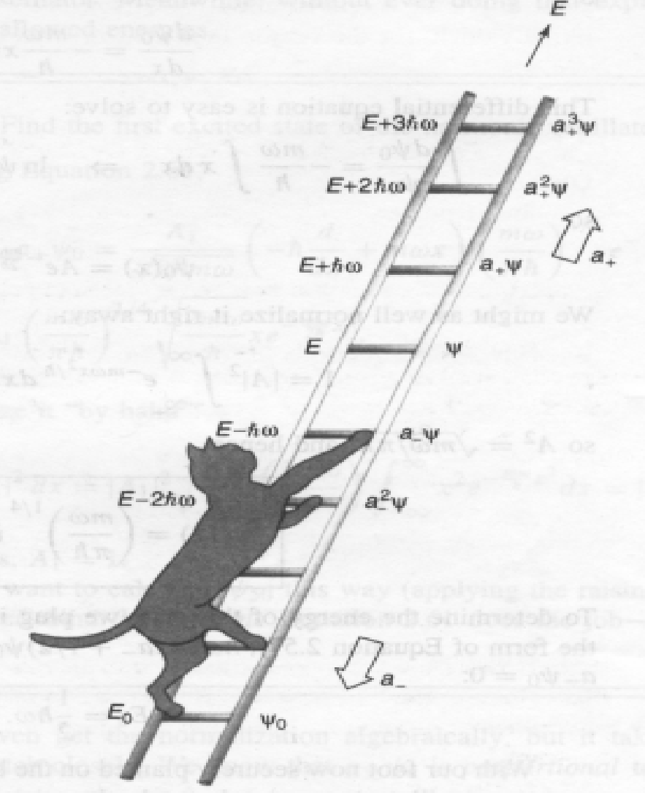
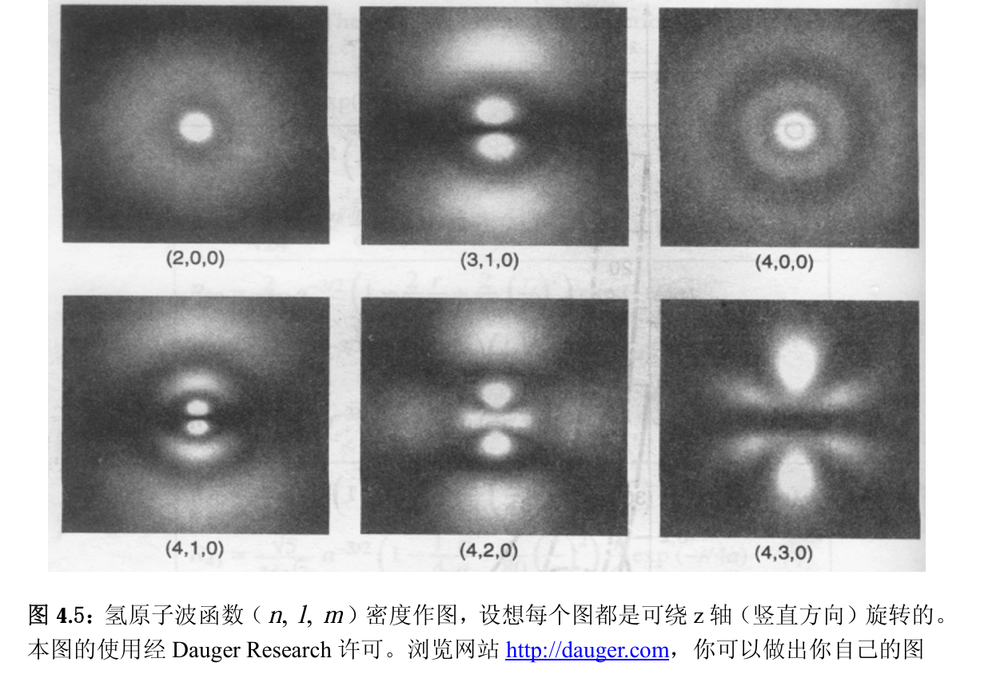
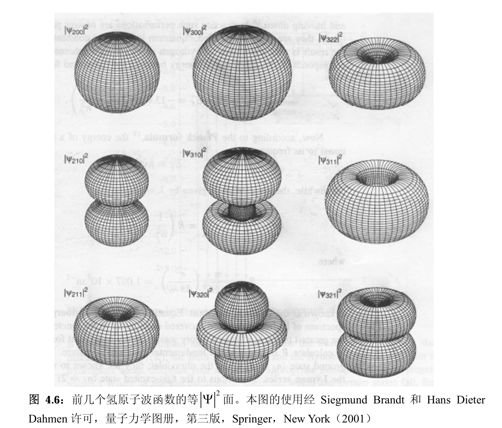
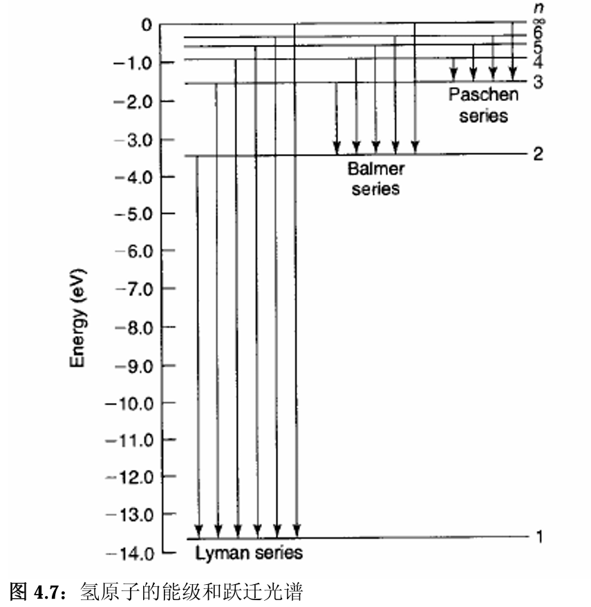
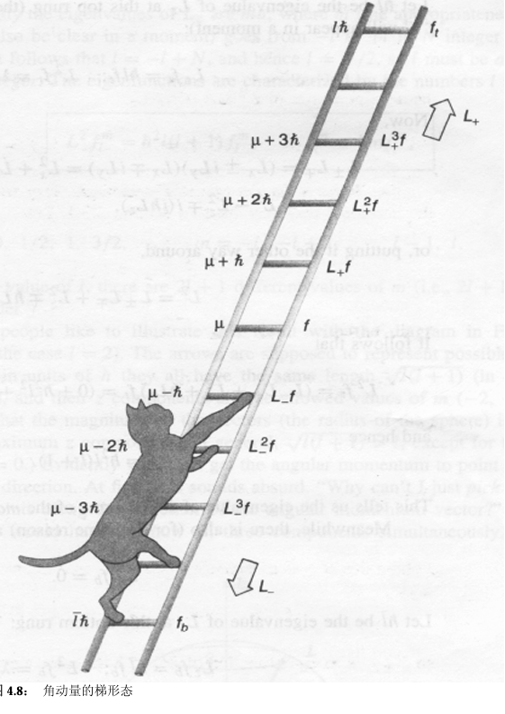
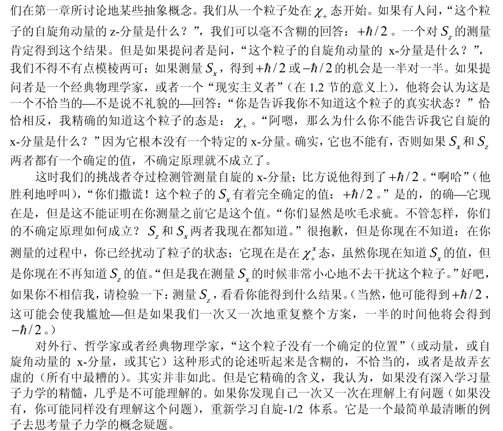

# 5 五大基本应用

我们首先将这一套形式理论应用于经典问题中最熟悉的谐振子：弹簧模型。然后是同样熟悉的中心力场：万有引力；只不过这里讨论的是小得多的球体-原子。从近代物理（原子物理）中，我们探究了原子的角动量-轨道角动量与''角动量，就发现问题，直到引入了自旋。因此我们讨论角动量与自旋。最后，研究一下带电粒子在电磁场中的运动。力、热、光、电中的经典模型，都可以用量子的形式理论重新讨论一遍，我们发现讨论结果的差异最终只取决于--尺度。尺度接近经典范围，则结果与经典无异。

运动方程：

$$
\boxed{\quad i\hbar\frac{\partial\Psi}{\partial t}=-\frac{\hbar^2}{2m}\nabla^2\Psi+V\Psi\quad}
$$

定态薛定谔方程：

$$
\boxed{E\psi = -\frac{\hbar^2}{2m}\nabla^2\psi+V\psi,}
$$

$$
\boxed{
\Psi(x,t)=\psi(x)e^{-iEt/\hbar.}
}
$$

## 5.1 一维谐振子

- 经典谐振子

$$
F=-kx=m\frac{d^2x}{dt^2}
$$

$$
V(x)=\frac12kx^2
$$

$$
x(t)=A\sin(\omega t)+B\cos(\omega t)
$$

$$
\omega\equiv\sqrt{\frac km}
$$

这样就解出来了

- 任意势

在平衡点$x_0$进行泰勒展开：

$$
V(x)=V(x_0)+V^{\prime}(x_0)(x-x_0)+\frac12V^{\prime\prime}(x_0)(x-x_0)^2+\cdots,
$$

由于平衡点 $V^\prime(x_0)=0$，忽略高次项(只要(x-x_0)很小就可以忽略),得到

$$V(x)\cong\frac12V^{\prime\prime}(x_0)(x-x_0)^2$$

所以任何振动，只要振幅足够小，都可以近似看作简谐振动

### 1 谐振子薛定谔方程

很多教材将坐标量写作 $q$，因此之后的讨论中 $ x = q $，$q = x$

$$
V(x)=\frac12\omega^2x^2
$$

$$
\hat{H}=\frac1{2m}\hat{p}^2+\frac12m\omega^2\hat{q}^2,
$$

$$
\frac1{2m}{\left[\hat p^2+(m\omega \hat x)^2\right]}\psi=E\psi,
$$

### 2 代数法

- 算符

$$
H=\frac1{2m}[\hat p^2+(m\omega \hat x)^2].
$$

由于

$$
u^2+\nu^2=(iu+\nu)(-iu+\nu)
$$

定义升降算符：

$$
\boxed{\begin{array}{c}\hat a_\pm=\frac1{\sqrt{2\hbar m\omega}}(\mp i \hat p+m\omega \hat x)\end{array}}
$$

于是($[x,p]=i\hbar$)

$$
\hat a_-\hat a_+=\frac1{2\hbar m\omega}[\hat p^2+(m\omega \hat x)^2]-\frac i{2\hbar}[\hat x,\hat p] =\frac1{\hbar\omega}\hat H+\frac12
$$

$$
\hat a_+\hat a_-=\frac1{\hbar\omega}\hat H-\frac12.
$$

因此

$$
[\hat a_-,\hat a_+]=1.
$$

$$
\hat H=\hbar\omega\Bigg(\hat a_+\hat a_-+\frac12\Bigg).
$$

薛定谔方程

$$
\boxed{
    \hbar\omega{\left(\hat a_\pm \hat a_\mp\pm\frac12\right)}\psi=E\psi.
}
$$

现在，下面是关键步骤：我断言如果$\psi$能够满足能量为$E$的薛定谔方程(即$\hat H\psi=E\psi$ ),则$\hat a_+\psi$ 满足能量为$(E+\hbar\omega)$的薛定谔方程：$\hat H(\alpha_+\psi)=(E+\hbar\omega)(\hat a_+\psi)$。$\hat a_-\psi$ 满足能量为$(E-\hbar\omega)$的薛定谔方程：$\hat H(\alpha_-\psi)=(E-\hbar\omega)(\hat a_-\psi)。$证明一个：

$$\begin{aligned}H(a_{+}\psi)&=\hbar\omega\biggl(a_+a_-+\frac12\biggr)(a_+\psi)=\hbar\omega\biggl(a_+a_-a_++\frac12a_+\biggr)\psi\\&=\hbar\omega a_+\biggl(a_-a_++\frac12\biggr)\psi=a_+\biggl[\hbar\omega\biggl(a_+a_-+1+\frac12\biggr)\psi\biggr]\\&=a_+(H+\hbar\omega)\psi=a_+(E+\hbar\omega)\psi=(E+\hbar\omega)(a_+\psi).\end{aligned}$$

所以这是一种生成新解的极好方法，如果我们得到了一个解，通过升降能量就可以得到其它的解。我们把$\hat a_\pm$叫作 **阶梯算符（升降算符）** ，因为它们能使我们升降能级；$\hat a_+$是 **升阶算符** ，$\hat a_-$是 **降阶算符** 。下图说明了这样的能态“梯子”。

现在求这个阶梯的底部。很明显（其实是由归一化原理）：

$$
\hat a_-\psi_0=0.
$$

$$
\frac1{\sqrt{2\hbar m\omega}}\Bigg(\hbar\frac d{dx}+m\omega x\Bigg)\psi_0=0,
$$

解得

$$
\psi_0(x)=Ae^{-\frac{m\omega}{2\hbar}x^2}.
$$

归一化：

$$
\boxed{
    \psi_0(x)=\left(\frac{m\omega}{\pi\hbar}\right)^{1/4}e^{-\frac{m\omega}{2\hbar}x^2}.
}
$$

我们把它代入薛定谔方程以确定相应的能量 $\hbar\omega(a_+a_-+1/2)\psi_0=E_0\psi_0$,利用$a_-\psi_0=0$,有：

$$E_0=\frac12\hbar\omega $$

因此求解了

$$
\boxed{\psi_n(x)=A_n(a_+)^n\psi_0(x),\quad E_n=\left(n+\frac12\right)\hbar\omega}
$$

对归一化系数进行讨论：(证明过程忽略)

$$
a_+\psi_n=c_n\psi_{n+1},\quad a_-\psi_n=d_n\psi_{n-1}
$$

$$
\boxed{\begin{array}{cc}a_+\psi_n=\sqrt{n+1}\psi_{n+1},&a_-\psi_n=\sqrt{n}\psi_{n-1}.\end{array}}
$$

得到不需要计算归一化系数的通解

$$
\boxed{
    \psi_n=\frac1{\sqrt{n!}}(a_+)^n\psi_0
}
$$

至此，谐振子求解完毕

- 谐振子算符运算关系

$$
\hat{H}=\frac1{2m}\hat{p}^2+\frac12m\omega^2\hat{q}^2,
$$

升降算符使用两种方式都行：$\hat{a}^{\dagger}$ 、 $a_-$ （书面体与手写体）

$$
\begin{aligned}
\hat{a}=\frac{1}{\sqrt{2m\hbar\omega}}(i\hat{p}+m\omega\hat{q}),\\\hat{a}^{\dagger}=\frac{1}{\sqrt{2m\hbar\omega}}(-i\hat{p}+m\omega\hat{q}).\end{aligned}
$$

$$
\hat{H}=\hbar\omega(\hat{a}^\dagger\hat{a}+\frac12).
$$

$$
[\hat{a},\hat{a}^\dagger]=1.
$$

$$
\begin{aligned}
\hat{p}=i\sqrt{\frac{m\hbar\omega}2}(\hat{a}^\dagger-\hat{a}),\\\hat{q}=\sqrt{\frac\hbar{2m\omega}}(\hat{a}^\dagger+\hat{a}).\end{aligned}
$$

$$
[\hat{a},\hat{H}]=\hbar\omega\hat{a},
$$

$$
[\hat{a}^\dagger,\hat{H}]=-\hbar\omega\hat{a}^\dagger.
$$

$$
\hat{a}|n\rangle=\sqrt{n}|n-1\rangle,
$$

$$
\hat{a}^\dagger|n\rangle=\sqrt{n+1}|n+1\rangle.
$$

### 3 解析法

- 递推

- Hamilton 本征值

- Hamilton 本征函数

## 5.2 中心力场

如果系统的受力与势能具有中心对称的性质，在球坐标系中求解更简单。我们将其分离变量为角动量方程与径向方程。角动量方程是统一解，解叫做球谐函数；所以我们只需要将势场带入求径向方程。

### 1 球坐标系中的薛定谔方程

薛定谔方程通用形式

$$
\boxed{\quad i\hbar\frac{\partial\Psi}{\partial t}=-\frac{\hbar^2}{2m}\nabla^2\Psi+V\Psi\quad}
$$

定态薛定谔方程

$$
\boxed{-\frac{\hbar^2}{2m}\nabla^2\psi+V\psi=E\psi,}
$$

直角坐标系

$$
\nabla^2\equiv\frac{\partial^2}{\partial x^2}+\frac{\partial^2}{\partial y^2}+\frac{\partial^2}{\partial z^2}
$$

球坐标系

$$
\nabla^2=\frac1{r^2}\frac\partial{\partial r}\Bigg(r^2\frac\partial{\partial r}\Bigg)+\frac1{r^2}\frac1{\sin\theta}\frac\partial{\partial\theta}\Bigg(\sin\theta\frac\partial{\partial\theta}\Bigg)+\frac1{r^2}\frac1{\sin^2\theta}\frac\partial{\partial\theta}\Bigg(\frac{\partial^2}{\partial\phi^2}\Bigg).
$$

球坐标微分：

$$
d^3\mathbf{r}=r^2\sin\theta drd\theta d\phi,
$$

球坐标中的归一化条件：

$$
\int\left|\psi\right|^2r^2\sin\theta drd\theta d\phi=\int\left|R\right|^2r^2dr\int\left|Y\right|^2\sin\theta d\theta d\phi=1.
$$

简化为

$$
\int_0^\infty\left|R\right|^2r^2dr=1\quad\text{和}\int_0^{2\pi}\int_0^\pi\left|Y\right|^2\sin\theta d\theta d\phi=1.
$$

('球谐函数'$Y$的定义见后面)

### 2 分离变量

定态薛定谔方程

$$
\begin{aligned}-\frac{\hbar^2}{2m}\Bigg[\frac{1}{r^2}\frac{\partial}{\partial r}\Bigg(r^2\frac{\partial\psi}{\partial r}\Bigg)+\frac{1}{r^2}\frac{1}{\sin\theta}\frac{\partial}{\partial\theta}\Bigg(\sin\theta\frac{\partial\psi}{\partial\theta}\Bigg)+\frac{1}{r^2}\frac{1}{\sin^2\theta}\frac{\partial}{\partial\theta}\Bigg(\frac{\partial^2\psi}{\partial\phi^2}\Bigg)\Bigg]+V\psi=E\psi.\end{aligned}
$$

分离变量

$$
\psi(r,\theta,\phi)=R(r)Y(\theta,\phi).
$$

两边同时除以 $RY$ 和乘以$-2mr^2/\hbar^2:$

$$\begin{aligned}&\left\{\frac{1}{R}\frac{d}{dr}\Bigg(\:r^{2}\frac{dR}{dr}\Bigg)-\frac{2mr^{2}}{\hbar^{2}}\Bigg[\:V\big(r\big)-E\Bigg]\right\}\\&+\frac{1}{Y}\Bigg\{\frac{1}{\sin\theta}\frac{\partial}{\partial\theta}\Bigg(\sin\theta\frac{\partial Y}{\partial\theta}\Bigg)+\frac{1}{\sin\theta^{2}}\frac{\partial^{2}Y}{\partial\phi^{2}}\Bigg\}=0.\end{aligned}$$

上式第一个大括号里的项仅与$r$有关，而其它的仅与$\theta$和$\phi$有关；所以，每项必须为一个常数。我将把这个分离常数写作 $l(l+1):$

$$
\begin{aligned}
\frac{1}{R}\frac{d}{dr}\biggl(r^{2}\frac{dR}{dr}\biggr)-\frac{2mr^{2}}{\hbar^{2}}\biggl[V\bigl(r\bigr)-E\biggr]=l(l+1);\\\frac{1}{Y}\biggl\{\frac{1}{\sin\theta}\frac{\partial}{\partial\theta}\biggl(\sin\theta\frac{\partial Y}{\partial\theta}\biggr)+\frac{1}{\sin\theta^{2}}\frac{\partial^{2}Y}{\partial\phi^{2}}\biggr\}=-l(l+1).\end{aligned}
$$

这就是分离变量之后的径向方程与角动量方程。

### 3 角动量方程

对于中心力场，

两边乘以$Y\sin^2\theta$它成为：

$$\sin\theta\frac\partial{\partial\theta}\biggl(\sin\theta\frac{\partial Y}{\partial\theta}\biggr)+\frac{\partial^2Y}{\partial\phi^2}=-l(l+1)\sin^2\theta Y.$$

分离变量： $\mathrm{Y}(\theta,\phi)=\Theta(\theta)\Phi(\phi).$

$$
\left\{\frac{1}{\Theta}\bigg[\sin\theta\frac{d}{d\theta}\bigg(\sin\theta\frac{d\Theta}{d\theta}\bigg)\bigg]+l(l+1)\sin\theta^2\bigg\}+\frac{1}{\Phi}\frac{\mathrm{d}^2\Phi}{\mathrm{d}\phi^2}=0.\right.
$$

第一项仅是$\theta$的函数，第二项仅是$\phi$的函数，所以每一项必须是一个常数。这次，我称它为为分离常数$m^2:$

$$
\begin{aligned}
m^2 &= \frac1\Theta\biggl[\sin\theta\frac d{d\theta}\biggl(\sin\theta\frac{d\Theta}{d\theta}\biggr)\biggr]+l(l+1)\sin\theta^2\\ -m^2 &= \frac1\Phi\frac{d^2\Phi}{d\phi^2}.\end{aligned}
$$

- 关于$\phi$的方程非常简单：

$$
\boxed{
\frac{d^2\Phi}{d\phi^2}=-m^2\:\Rightarrow\:\Phi(\phi)=e^{im\phi}.
}
$$

边界条件

$$
\Phi(\phi+2\pi)=\Phi(\phi).
$$

得到 $m$ 的束缚：

$$
m=0,\pm1,\pm2,...
$$

- $\theta$ 的方程

$$
\sin\theta\frac d{d\theta}\biggl(\sin\theta\frac{d\Theta}{d\theta}\biggr)+\biggl[l(l+1)\sin\theta^2-m^2\biggr]\Theta=0
$$

勒让德方程，直接带入通解吧：

$$
\boxed{
    \Theta(\theta)=AP_l^m(\cos\theta)
}
$$

$$
P_l^m(x)\equiv(1-x^2)^{|m|/2}\Bigg(\frac d{dx}\Bigg)^{|m|}P_l(x),
$$

其中，l为非负数。且 $|m| \leqslant l$

$$
\boxed{
    l=0,1,2,...;\quad m=-l,-l+1,\ldots,-1,0,1,\ldots,l-1,l.
}
$$

- 归一化的角波函数称为球谐函数：

$$
\boxed{
    Y_l^m(\theta,\phi)=\epsilon\sqrt{\frac{(2l-1)(l-|m|)!}{4\pi(l+|m|)!}}e^{im\phi}P_l^m(\cos\theta)
    }
$$

其中当$m{\geq}0$时$\epsilon=\left(-1\right)^m$,当$m{\leq}0$时$\epsilon=1$。我们将在后面证明它们是自动正交的，所以：

$$\int_0^{2\pi}\int_0^\pi\left[Y_l^m\left(\theta,\phi\right)\right]^*\left[Y_{l'}^{m'}\left(\theta,\phi\right)\right]\sin\theta d\theta d\phi=\delta_{l^{\prime}}\delta_{mm^{\prime}},$$

由于历史原因$l$称为角量子数，$m$ 称为磁量子数。

### 4 径向方程

$$
\frac d{dr}\biggl(r^2\frac{dR}{dr}\biggr)-\frac{2mr^2}{\hbar^2}\biggl[V\bigl(r\bigr)-E\biggr]R=l\bigl(l+1\bigr)R.
$$

令 $u(r)\equiv rR(r)$：

$$
\boxed{-\frac{\hbar^2}{2m}\frac{d^2u}{dr^2}+\left[V+\frac{\hbar^2}{2m}\frac{l\left(l+1\right)}{r^2}\right]u=Eu.}
$$

这就是径向方程。归一化条件变为：

$$
\int_0^\infty\lvert u\rvert^2dr=1.
$$

### 5 球方势阱

$$
V\big(r\big)=\begin{cases}0,&\quad r<a;\\[1ex]\infty,&\quad r>a.\end{cases}
$$

求其波函数和允许的能量值。

径向方程：

$$
\frac{d^2u}{dr^2}=\Bigg[\frac{l\big(l+1\big)}{r^2}-k^2\Bigg]u,
$$

$l=0$ 边界条件带入：

$$
E_{n0}=\frac{n^2\pi^2\hbar^2}{2ma^2},\quad(n=1,2,3,....),
$$

$$
\psi_{n00}=\frac1{\sqrt{2a\pi}}\frac{\sin\left(n\pi r/a\right)}r.
$$

径向方程为一个球贝塞尔方程，直接带通解：

$$
u(r)=Arj_l(kr)+Brn_l(kr)
$$

解得

$$
E_{nl}=\frac{\hbar^2}{2ma^2}\beta^2{}_{nl},
$$

这里 $\beta_{nl}$ 是$l$阶球 Bessel 函数的第 $n$ 个零点。

$$\psi_{nlm}(r,\theta,\phi)=A_{nl}j_l(\beta_{nl}r/a)Y_l^m(\theta,\phi)$$

### 6 氢原子

$$
V(r)=-\frac{e^2}{4\pi\varepsilon_0}\frac1r
$$

径向方程：

$$
-\frac{\hbar^2}{2m}\frac{d^2u}{dr^2}+\left[-\frac{e^2}{4\pi\varepsilon_0}\frac1r+\frac{\hbar^2}{2m}\frac{l(l+1)}{r^2}\right]u=uE.
$$

库仑势允许有描述电子-质子散射的连续态（散射态） $E>0$ ，以及表示氢原子的分立束缚态。我们讨论束缚态。

---

首先疯狂化简到看得懂的形式：

令（对于束缚态E是负的，因此$kappa$为实数）

$$
\kappa\equiv\frac{\sqrt{-2mE}}\hbar.
$$

$$
\frac1{\kappa^2}\frac{d^2u}{dr^2}=\Bigg[1-\frac{me^2}{2\pi\varepsilon_0\hbar^2\kappa}\frac1{\left(\kappa r\right)}+\frac{l(l+1)}{\left(\kappa r\right)^2}\Bigg]u.
$$

引入

$$
\rho\equiv\kappa r,\quad\text{和}\quad\rho_0\equiv\frac{me^2}{2\pi\varepsilon_0\hbar^2\kappa},
$$

$$
\frac{d^2u}{d\rho^2}=\left[1-\frac{\rho_0}\rho+\frac{l(l+1)}{\rho^2}\right]u.
$$

---
考察解的渐进形式，继续化简

- 当$\rho\to\infty$时:

$$
\frac{d^2u}{d\rho^2}=u.
$$

一般解为：

$$
u(\rho)=Ae^{-\rho}+Be^\rho
$$

取收敛解

$$
u(\rho)\sim Ae^{-\rho}.
$$

- 当 $\rho\to0$ 时：

$$
\frac{d^2u}{d\rho^2}=\frac{l(l+1)}{\rho^2}u.
$$

它的一般解为(验证它！)

$$
u(\rho)=C\rho^{l+1}+D\rho^{-l},
$$

收敛解

$$
u(\rho)\sim C\rho^{l+1}.
$$

根据奇妙的物理直觉，设解具有这种形式

$$
u(\rho)=\rho^{l+1}e^{-\rho}v(\rho),
$$

径向方程变为（难道化繁了？）

$$
2\left(l+1-\rho\right)\frac{dv}{d\rho}+\rho\frac{d^2v}{d\rho^2}+\left[\rho_0-2\left(l+1\right)\right]v=0.
$$

幂级数展开：

$$
v(\rho)=\sum_{j=0}^\infty c_j\rho^j.
$$

带入径向方程：

$$
c_{j+1}=\left\{\frac{2\left(j+1+1\right)-\rho_0}{\left(j+1\right)\left(j+2l+2\right)}\right\}c_j.
$$

---

接下来是讨论求解时刻

$j$ 很大时：

$$
c_{j+1}\cong\frac{2j}{\left(j+1\right)j}c_j=\frac2{j+1}c_j.
$$

$$
c_j=\frac{2^j}{j!}c_0,
$$

$$
v(\rho)=c_0\sum_{j=0}^\infty\frac{2^j}{j!}\rho^j=c_0e^{2\rho},
$$

$$
u(\rho)=c_0\rho^{l+1}e^\rho,
$$

这样在$\rho$趋于无穷大时$u(\rho)$趋于无穷大。这个正的指数因子正是我们所不希望的 4.57 式所展示的渐进行为。(它在这里又一次出现不是偶然的；,毕竟它代表着径向方程某些解的渐进形式—由于不可归一化，它们仅是我们不感兴趣的解。)仅有一种途径可以解决这种困境： 级数必须在某处中断。对某个最大的整数，$j_m$ ,必须有

$$
c_{j_m + 1}=0
$$

(在这个系数之后的所有的系数自动为零)。带入之前的递推公式：

$$2\left(j_m+l+1\right)-\rho_0=0.$$

于是得到了解。定义 **主量子数**

$$
n \equiv j_m + l + 1
$$

$$
\rho_0=2n.
$$

$\rho_0$决定了能量$E$：

$$E=-\frac{\hbar^2\kappa^2}{2m}=-\frac{me^4}{8\pi^2\varepsilon_0^2\hbar^2\rho_0^2},$$

所以允许的能量是

$$
\boxed{\quad E=-\Bigg[\frac m{2\hbar^2}\Bigg(\frac{e^2}{4\pi\varepsilon_0}\Bigg)^2\Bigg]\frac1{n^2}=\frac{E_1}{n^2},\quad n=1,2,3,...}
$$

这就是著名的 **玻尔公式** - 量子力学中最重要的结果。

$$
\kappa=-\Bigg(\frac{me^2}{4\pi\varepsilon_0\hbar^2}\Bigg)\frac1n=\frac1{an},
$$

于是得到了 **玻尔半径**：

$$
\boxed{a=\frac{4\pi\varepsilon_0\hbar^2}{me^2}=0.529\times10^{-10}m}
$$

$$
\rho=\frac r{an}
$$

---

氢原子的完整解

$$
\psi_{nlm}(r,\theta,\phi)=R_{nl}(r)Y_l^m(\theta,\phi),
$$

$$
R_{nl}\left(r\right)=\frac1r\rho^{l+1}e^{-\rho}v(\rho),
$$

$$
v(\rho)=L_{n-l-1}^{2l+1}(2\rho),
$$

这是 **缔合勒盖尔(Laguerre)多项式**。

归一化的氢原子波函数：

$$
\boxed{\Psi_{nlm}=\sqrt{\left(\frac2{na}\right)^3\frac{(n-l-1)!}{2n\left[(n+l)!\right]^3}}e^{-r/na}\left(\frac{2r}{na}\right)^l[L_{n-l-1}^{2l+1}(2r/na)]Y_l^m(\theta,\phi).}
$$

这看起来有点复杂，但是不要抱怨⎯这可是能够严格解出的少数几个实际系统之一。注意虽然波函数依赖所有三个量子数，但是能量仅由n决定。这仅是库仑势所特有的，
在球势阱情况下我们知道能量还依赖于l。以上波函数是相互正交的。

氢原子的基态：

$$
\boxed{\quad E_1=-\Bigg[\frac m{2\hbar^2}\Bigg(\frac{e^2}{4\pi\varepsilon_0}\Bigg)^2\Bigg]=-13.6eV.}
$$

知道了基态能量，其他状态能量也知道了。

$$
\boxed{\psi_{{_{100}}}(r,\theta,\phi)=\frac{1}{\sqrt{\pi a^{3}}}e^{-r/a}.}
$$

---

想象氢原子的波函数形状并不容易。化学家喜欢用“密度图”来画出它们，在这种方
法中电子云的亮度与$\left|\Psi\right|^2$成比例(图 1)。一种更定量的方法(但是也许更难理解)是用等几率面(图 2)。

### 7 氢原子光谱

原则上，如果把一个氢原子放到某个定态$\Psi_{nlm}$,那么它将永远处于这个态上。然而，如果给它轻微的扰动(比如说，用另一个原子碰撞或用光照射),电子就有可能跃迁到其它的定态—吸收能量跃迁到较高能量的态，或者释放能量(通常以电磁辐射的方式)跃迁到较低能量的态。$^{18}$事实上这样的扰动总是存在；跃迁(有时也称作量子跃迁)经常发生，其结果是含氢的容器发出光(光子)来，光子的能量对应着初态和终态的能量之差：

$$E_{\gamma}=E_{i}-E_{f}=-13.6eV\Bigg(\frac{1}{n_{i}^{2}}-\frac{1}{n_{f}^{2}}\Bigg).$$

由普朗克(Planck)公式，光子的能量和它的频率成正比：

$$E_{\gamma}=hv.$$

同时，波长由公式$\lambda=c/v$给出，所以

$$\frac1\lambda=R(\frac1{n_f^2}-\frac1{n_i^2}),$$

式中

$$
R\equiv\frac{m}{4\pi c\hbar^3}\Bigg(\frac{e^2}{4\pi\varepsilon_0}\Bigg)=1.097\times10^7 \mathrm{m}^{-1}
$$

称为里德伯常数。

跃迁到基态($n_f=1$)的谱线处在紫外区；就是光谱学家们熟知的 Lyman 系；跃迁到第一激发态($n_f=2$)的谱线处在可见光区为 Balmer 系；跃迁到$n_f=3$(Paschen 系)激发态的谱线处于红外区；等等(见图)。(在室温下，大多数氢原子处于基态；为了得到发射光谱，必须先获得各种激发态；通常的做法是让电火花穿过气体。)

### 8 类氢原子

类氢原子：由原子核与一个电子组成（碱金属）。这次我们考虑一下原子核的运动（氢原子的求解中没有考虑）。

$$
V(\vec{r}_1-\vec{r}_2)=V(|\vec{r}_1-\vec{r}_2|)=-\frac{Ze^2}{4\pi\epsilon_0}\frac1{|\vec{r}_1-\vec{r}_2|}
$$

其中 $\vec{r_1}$和$\vec{r_2}$是原子核和电子的坐标，$Z$是原子核电荷数。

$$
\hat{H}=-\frac{\hbar^2}{2m_1}\nabla_1^2-\frac{\hbar^2}{2m_2}\nabla_2^2+V(|\vec{r}_1-\vec{r}_2|)
$$

$m_1$和$m_2$分别是原子核和电子的质量。

质心代换：

$$
\vec{R}=\frac{m_1\vec{r}_1+m_2\vec{r}_2}{m_1+m_2},\quad\vec{r}=\vec{r}_1-\vec{r}_2;
$$

$$
m=m_1+m_2,\quad\mu=\frac{m_1m_2}{m_1+m_2}.
$$

$$
-\frac{\hbar^2}{2m_1}\nabla_1^2-\frac{\hbar^2}{2m_2}\nabla_2^2=-\frac{\hbar^2}{2m}\nabla_R^2-\frac{\hbar^2}{2\mu}\nabla^2,
$$

$$
\hat{H}=-\frac{\hbar^2}{2m}\nabla_R^2-\frac{\hbar^2}{2\mu}\nabla^2-\frac{Ze^2}{4\pi\epsilon_0}\frac1r.
$$

本征函数

$$
\Psi(R,r)=\phi(R)\psi(r).
$$

质心运动本征方程

$$
-\frac{\hbar^{2}}{2m}\nabla_{R}^{2}\phi(\vec{R})=E_{c}\phi(\vec{R})
$$

相对运动本征方程

$$
[-\frac{\hbar^2}{2\mu}\nabla^2-\frac{Ze^2}{4\pi\epsilon_0}\frac1r]\psi(\vec{r})=(E_t-E_c)\psi(\vec{r})=E\psi(\vec{r}),
$$

其中$E_t$是总能量。但是我们只关注相对运动的束缚态:（求解过程见氢原子）

$$
E_n=-\frac1{4\pi\epsilon_0}\frac{Z^2e^2}{2a}\frac1{n^2},\quad n=1,2,3,\cdots,
$$

$$
a=\frac{4\pi\epsilon_0\hbar^2}{\mu e^2}.
$$

$$
\psi_{nlm}(r,\theta,\phi)=R_{nl}(r)Y_{lm}(\theta,\phi),
$$

对于给定的$n$,$l$的可能取值为

$$l=0,1,2,\cdots,n-1.$$

## 5.3 角动量

在中心力场的中，我们已经用分离变量法求解了角动量方程的本征函数（没有讨论算符的本征值）。现在我们用对易关系式（格里菲斯叫这个方法为代数方法）来求解球坐标系中的共同本征函数和各个算符的本征值。

我们已经知道氢原子的定态是由三个量子数：$n,l$,和$m$来标记的。主量子数($n$)确定态的能量;而$l$和 $m$ 与轨道角动量有关。在中心力场的经典理论中能量和角动量是基本守恒量，这就不用奇怪角动量在量子理论中起着显著(事实上，甚至更重要)的作用。

经典上，一个粒子的角动量(相对于原点)由下式给出

$$\mathbf{L=r\times p},$$

其分量形式为， $L_x= yp_z- zp_y$, $L_y= zp_x- xp_z$, $L_z= xp_y- yp_x.$ 对应的量子算符由标准方法 $p_x\to-i\hbar\partial/\partial x,p_y\to-i\hbar\partial/\partial y,p_z\to-i\hbar\partial/\partial z$ 得到。

### 1 本征值

算符 $L_x$和$L_y$不对易；事实上：

$$
\boxed{[L_x, L_y]=i\hbar L_z;\quad[L_y, L_z]=i\hbar L_x;\quad[L_z, L_x]=i\hbar L_y.}
$$

这就是角动量的基本对易关系。

由对易式的物理意义，$L_x,L_y$和$L_z$是不相容的可观测量。由推广的不确定原理

$$\sigma_{L_x}^2\sigma_{L_y}^2\geq(\frac1{2i}\langle i\hbar L_z\rangle)^2=\frac{\hbar^2}4\langle L_z\rangle,$$

或

$$\sigma_{L_x}\sigma_{L_y}\geq\frac\hbar2|\langle L_z\rangle|.$$

因此寻求$L_x$和$L_y$的共同本征函数是徒劳的。另一方面，总角动量的平方：

$$L^2=L_x^2+L_y^2+L_z^2,$$

和$L_x, L_y, L_z$对易：

$$
[L^2,L_x]=0, [L^2, L_y]=0, [L^2, L_z]=0
$$

于是我们选取 $\hat L^2, L_z$ 作为一组力学量完全集，期望可以找到它们的共同本征态：

$$
\hat L^2f=\lambda f\quad 和 \quad \hat L_zf=\mu f.
$$

为了联系上 $L_x L_y$，构造了升降算符：

$$
\boxed{\begin{array}{c}\hat L_\pm\equiv \hat L_x\pm i\hat L_y\end{array}}
$$

$$
[\hat L_{z},\hat L_{\pm}]=\pm\hbar \hat L_{\pm}.
$$

$$
[\hat L^2,\hat L_\pm]=0.
$$

为什么构造这个算符：因为如果 $f$ 是$\hat L^2$ 和 $\hat L_z$的本征函数，那么$\hat L_\pm f$ 也是：

$$\hat L^2(\hat L_\pm\:f)=\hat L_\pm(\hat L^2\:f)=\hat L_\pm(\lambda\:f)=\lambda(\hat L_\pm\:f),$$

$$
\hat L_{z}(\hat L_{\pm}f)=(\hat L_{z}\hat L_{\pm}-\hat L_{\pm}\hat L_{z}) f+\hat L_{\pm}\hat L_{z} f=\pm\hbar \hat L_{\pm} f+\hat L_{\pm}(\mu f)=(\mu\pm\hbar)(\hat L_{\pm}f)
$$

---

因此，如果$|\lambda\rangle$是$\hat{L}^2$和$\hat{L}_z$的共同本征态(之前用的函数形式$f$表示)，那么$\hat{L}_\pm|\lambda\rangle$是$\hat{L}^2$具有相同本征值$\mu$的本征态，是$\hat{L}_z$本征值为$\nu\pm\hbar$的本征态。对于一个给定的$\mu$,我们可以得到一系列状态，它们都是$\hat{L}_z$的本征态，每一个都与它的最近邻相差一个$\hbar$。存在一个$\hat{L}_z$取最大本征值的状态，满足

$$\hat{L}_+|\lambda_t\rangle=0.$$

设$l\hbar$是$\hat{L}_z$的最大本征值，则

$$\hat{L}_z|\lambda_t\rangle=l\hbar|\lambda_t\rangle,\quad\hat{L}^2|\lambda_t\rangle=\mu|\lambda_t\rangle.$$

容易证明

$$\hat{L}^2=\hat{L}_\pm\hat{L}_\mp+\hat{L}_z^2\mp\hbar\hat{L}_z.$$

于是，

$$\hat L^2|\lambda_t\rangle=(\hat{L}_-\hat{L}_++\hat{L}_z^2+\hbar\hat{L}_z)|\lambda_t\rangle=l(l+1)\hbar^2|\lambda_t\rangle,$$

因此，$\mu=l(l+1)\hbar^{2}$。还存在一个$\hat{L}_z$取最小本征值的状态，满足

$$\hat{L}_-|\lambda_b\rangle=0.$$

设$\bar{l}\hbar$是$\hat{L}_z$的最小本征值，则

$$\hat L^2|\lambda_b\rangle=(\hat{L}_+\hat{L}_-+\hat{L}_z^2-\hbar\hat{L}_z)|\lambda_b\rangle=\overline{l}(\overline{l}-1)\hbar^2|\lambda_b\rangle,$$

于是，$\mu=\bar{l}(\bar{l}-1)\hbar^2$。因此，我们有

$$l(l+1)=\overline{l}(\overline{l}-1).$$

我们可以求得$\bar{l}=l+1$(不合理),或者

$$
\bar{l}=-l.
$$

这就舒服了：

我们令$\hat{L}_z$的本征值为$m\hbar$,其中$m$取值从$-l$经过$N$步“上升算符”的作用到+$l$,相邻两个相差1。因此，$l=-l+N$,即$l=N/2$,所以$l$必须是整数或者半整数。于是，

$$\hat L^2|l,m\rangle=l(l+1)\hbar^2|l,m\rangle,\quad\hat{L}_z|l,m\rangle=m\hbar|l,m\rangle,$$

其中$l=0,1,2,\cdots$(或$l=1/2,3/2,5/2,\cdots$),$m=-l,-l+1,\cdots,l-1,l$。

注意，$m$表征的本征值，$l$表征的最大本征值（本征值范围）。

$$
\hat{L}_\pm|l,m\rangle=\sqrt{l(l+1)-m(m\pm1)}\hbar|l,m\pm1\rangle.
$$

> 求解 上面系数是怎么来的？ $\sqrt{l(l+1)-m(m\pm1)}$

### 2 本征函数

$$
\begin{gathered}
L_{_X} =\frac{\hbar}{i}\Bigg(-\sin\phi\frac{\partial}{\partial\theta}-\cos\phi\cot\theta\frac{\partial}{\partial\phi}\Bigg), \\
L_{y} =\frac{\hbar}{i}\Bigg(+\cos\phi\frac{\partial}{\partial\theta}-\sin\phi\cot\theta\frac{\partial}{\partial\phi}\Bigg), \\
\boxed{\begin{array}{c}L_z=\frac{\hbar}{i}\frac{\partial}{\partial\phi}.\\\hline\end{array}} 
\end{gathered}
$$

$$
\boxed{\quad L^2=-\hbar^2\biggl[\frac{1}{\sin\theta}\frac{\partial}{\partial\theta}\biggl(\sin\theta\frac{\partial}{\partial\theta}\biggr)+\frac{1}{\sin^2\theta}\frac{\partial^2}{\partial\phi^2}\biggr].}
$$

在坐标表象下，角动量的本征函数为球谐函数$Y_lm(\theta,\phi)$,它的完整形式为

$$Y_{lm}(\theta,\phi)=(-1)^m\sqrt{\frac{2l+1}{4\pi}\frac{(l-m)!}{(l+m)!}}P_l^m(\cos\theta)e^{im\phi},$$

其中$P_l^m(\cos\theta)$是连带Legendre多项式。

对这部分内容还有一个难以理解最后疑问，对角动量的代数理论，允许的$l$值(因此$m$ 值)可以是半整数(格里菲斯称作代数求解，我喜欢叫对易关系式求解),然而分离变量求解仅为整数值。你们也许会认为半整数的解是不合逻辑的，但是会发现其实它们非常重要，这就是自旋的产生。

### 3 角动量算符的运算关系

## 5.4 自旋

在经典力学中，一个刚性物体有两种角动量：轨道角动量($\mathbf{L}=\mathbf{r}\times\mathbf{p}$),它是物体质心相对原点的运动，自旋($\mathbf{S}=I\vec{\omega}$),它是物体绕质心的运动。例如地球的轨道角动量是地球每年绕太阳的公转的运动，而自旋角动量是地球每天绕自身南北极轴的运动。在经典力学中这种区分很大程度上只是为了方便，当你理解后，S其实就是所有组成地球的岩石尘粒等绕极轴的“轨道”角动量的总和。但是当类似的术语在量子力学中出现时，却有着本质的区别。除了(例如氢原子)电子绕原子核的运动产生的轨道角动量(由球谐函数描写)外，电子还具有另外一种角动量，这种角动量与空间的运动没有任何关系 (因此，也不可能由坐标变量$r,\theta,\phi$描述),但是在某些意义上，它与经典的自旋有类似之处(因此，我们还用自旋这个词)。但是也不要对这个类比印象太深：(就目前我们所知)电子是一个无内部结构的点粒子， 它的自旋角动量是不能分解为组成它的成分的轨道角动量(见习题 4.25)。现在我们只需说除了“外在”的角动量(L)基本粒子还有内禀的角动量(S)就足够了。

### 1 自旋的表示

类比角动量，由基本对易关系：

$$
\left[S_{x}, S_{y}\right] = i \hbar S_{z}, \quad\left[S_{y}, S_{z}\right] = i \hbar S_{x}, \quad\left[S_{z}, S_{x}\right] = i \hbar S_{y} .
$$

$$
S^2\left|s,m\right\rangle=\hbar^2s(s+1)\left|s,m\right\rangle;\quad\quad S_z\left|s,m\right\rangle=\hbar m\mid s,m\rangle;
$$

$$
\left.\left.S_\pm\right|s,m\right>=\hbar\sqrt{s(s+1)-m(m\pm1)}\big|s,m\pm1\big>,
$$

其中$S_\pm\equiv S_x\pm iS_y$。但是现在本征矢不再是球谐函数(它们根本不是$\theta$和$\phi$的函数),我们也没有一个既定的理由把$s$和$m$的半整数值排除在外：

$$s=0,\:\frac12,\:1,\:\frac32,\:...\:;\quad m=-s,\:-s+1,\:...\:,\:s-1,\:s.$$

十分巧合的是每一种基本粒子都有一个特定的永远不变的$s$,我们称它为该种粒子的自旋。$\pi$介子的自旋为零；电子的自旋是 1/2;光子的自旋为 1; $\Delta$粒子的为 3/2;引力子的为2;等等。对比而言，轨道角动量量子数$l$(比如，氢原子中的电子)可以取任何(正整) 数，而且当体系受到扰动时会从一个值变为另一个值。但是，对于任何粒子，它的自旋 s是不变的，这使的自旋的理论相对简单一些。

### 2 1/2 自旋

$s=1/2$是最重要的情况，因为它是构成普通物质的粒子(质子、中子和电子)的自旋，以及所有夸克和所有轻子的自旋。另外，一旦你掌握了自旋 1/2,理解高自旋就非常容易了。对$s=1/2$,$S^2$和$S_z$仅有两个本征态：$\left|\frac12,\frac12\right\rangle$,它被称为上自旋态(经常用$\uparrow$),和$\left|\frac12,-\frac12\right\rangle$ 它被称为下自旋态($\downarrow$)。

!!! note "理解：Hilbert 空间"
    （From Griffths）的确，在数学的意义上，自旋 1/2 是最简单的非平庸可能量子体系，因为它仅许可两个基本状态。取代错综复杂的无限维 **希耳波特空间**，我们现在研究的是一个普通的 2-维空间；取代不熟悉的微分方程和繁杂的函数，我们面对的是$2\times2$的矩阵和 2-分量的矢量。正是由于这个原因，某些作者由学习自旋开始介绍量子力学。(一个很好的例子是 John S. Townsend 所著，量子力学的现代探讨，大学教材，Sausalito,CA,2000。) 但是简洁数学的代价是概念的抽象，我不打算采用这种方法。

但是我们不采用通常的记号，这里使用这个记号：

$$
\left.|\uparrow\rangle=\left(\begin{array}{c}1\\0\end{array}\right.\right)\quad|\downarrow\rangle=\left(\begin{array}{c}0\\1\end{array}\right).
$$

---

现在给出每一个算符的矩阵形式。由 n 维 Hilbert 空间，算符可表示为 n*n 的矩阵：

$$
\hat A=\Bigg(\begin{array}{cc}c&d\\e&f\end{array}\Bigg),
$$

则可以由本征方程与本征值（在 1 自旋的表示中写出），计算出算符形式。于是：

$$
\left.\hat{s}_z=\frac{1}{2}\hbar\left(\begin{array}{cc}1&0\\0&-1\end{array}\right.\right).
$$

$$
\left.\hat{s}_x=\frac{1}{2}\hbar\left(\begin{array}{cc}0&1\\1&0\end{array}\right.\right).
$$

$$
\left.\hat{s}_y=\frac{1}{2}\hbar\left(\begin{array}{cc}0&-i\\i&0\end{array}\right.\right).
$$

$$
\hat S^2=\frac{3}{4}\hbar^2\begin{pmatrix}1&0\\0&1\end{pmatrix}.
$$

我们通常将自旋算符写成如下形式：

$$
\hat s =\frac{1}{2}\hbar\hat \sigma,
$$

其中$\hat \sigma =(\hat{\sigma}_x,\hat{\sigma}_y,\hat{\sigma}_z)$分别为

$$\hat{\sigma}_x=\left(\begin{array}{cc}0&1\\1&0\end{array}\right),\quad\hat{\sigma}_y=\left(\begin{array}{cc}0&-i\\i&0\end{array}\right),\quad\hat{\sigma}_z=\left(\begin{array}{cc}1&0\\0&-1\end{array}\right)$$

这三个矩阵称为Pauli矩阵。

### 3 对形式理论的检验

注意$\mathcal{S}_x$、$\mathcal{S}_y$、$\mathcal{S}_z$和$\mathbf{S}^2$都是厄密矩阵(它们也应当是，因为它们都表示可观测量)。另一方面，$\mathbf{S}_+$和$\mathbf{S}_-$不是厄密的一它们显然不是可观测量量。
$\mathbf{S}_z$的本征旋量是(当然应该是)

$$\chi_+=\begin{pmatrix}1\\0\end{pmatrix},\quad\Bigg(本征值为\frac{\hbar}{2}\Bigg);\quad\chi_-=\Bigg(\begin{matrix}0\\1\end{matrix}\Bigg),\quad\Bigg(本征值为-\frac{\hbar}{2}\Bigg).$$

如果对一个粒子的一般态 $\chi=\begin{pmatrix}a\\b\end{pmatrix}=a\chi_++b\chi_-$ ,测量其$S_z$,得到+$\hbar/2$ 的几率为$\left|a\right|^2$,得到$-\hbar/2$ 的几率为$\left|b\right|^2$。既然这两个几率是仅有的几率，应有

$$\left|a\right|^2+\left|b\right|^2=1$$

(即旋量必须是归一化的)。

但是，如果测量$S_x$,可能值是什么？几率是多少？按照广义的统计诠释，我们需要知道$\mathbf{S}_x$的本征值和本征旋量。久期方程是

$$\begin{vmatrix}-\lambda&\hbar/2\\\hbar/2&-\lambda\end{vmatrix}=0\implies\lambda^2=\left(\frac\hbar2\right)^2\implies\lambda=\pm\frac\hbar2.$$

无需惊讶，$S_x$的可能值同$S_z$的是一样的。用通常的方法可以获得本征旋量：

$$\frac{\hbar}{2}\binom{0}{1}\quad0\binom{\alpha}{\beta}=\pm\frac{\hbar}{2}\binom{\alpha}{\beta}\:\Rightarrow\:\binom{\beta}{\alpha}=\pm\binom{\alpha}{\beta},$$

所以$\beta=\pm\alpha$ 。显然，$\mathbf{S_x}$(归一化的)本征旋量是

$$\chi_+^{(x)}=\begin{pmatrix}1/\sqrt{2}\\1/\sqrt{2}\end{pmatrix},\quad\left(\text{本征值为}+\frac\hbar2\right);\quad\chi_-^{(x)}=\begin{pmatrix}1/\sqrt{2}\\-1/\sqrt{2}\end{pmatrix},\quad\left(\text{本征值为}-\frac\hbar2\right).$$

作为厄密矩阵的本征矢量，它们张成空间；一般的旋量$\chi$(4.139 式)可以表示成它们的线性迭加：

$$\chi=\left(\frac{a+b}{\sqrt{2}}\right)\chi_+^{(x)}+\left(\frac{a-b}{\sqrt{2}}\right)\chi_-^{(x)}.$$

如果测量$S_x$,得到+$\hbar/2$ 的几率是$(1/2)|a+b|^2$,得到$-\hbar$/2 的几率是$(1/2)|a-b|^2$。(你自己应当检验一下几率之和为1。)

对易、可测量量的物理意义验证：

### 4 单个粒子自耦合：自旋轨道耦合和总角动量

自旋和轨道角动量的相互作用，

$$\hat{H}_{\mathrm{so}}=\lambda\hat{s}\cdot\hat{L}.$$

总角动量 $J = L+s$

$[\hat{L},\hat{s}\cdot\hat{L}]\neq0$ 和 $[\hat{s},\hat{s}\cdot\hat{L}]\neq0$,然而，总角动量$J=L+s$满足

$$[ \hat J,\hat{s}\cdot\hat{L}]=0$$

$J$ 满足与$L$和$s$一样的对易关系，即

$$[\hat{J}_x,\hat{J}_y]=i\hbar\hat{J}_z,\quad[\hat{J}_y,\hat{J}_z]=i\hbar\hat{J}_x,\quad[\hat{J}_z,\hat{J}_x]=i\hbar\hat{J}_y,$$

**总角动量的Hilbert空间**可以表示成轨道角动量和自旋的Hilbert字间的直积，新Hilbert空间的基矢可以写为:

$$|lm\rangle|\uparrow\rangle$$

$$|lm\rangle|\downarrow\rangle$$

由于

$$
[\hat{L}^2,\hat{J}^2]=0,\quad[\hat{L}^2,\hat{J}_z]=0.
$$

所以对于给定的$l,\hat{J}^2$和$\hat{J}_z$的共同本征态可以写为

$$|j,j_z\rangle=\sum\limits_{m=-l}^l(c_{lm\uparrow}|lm\rangle|\uparrow\rangle+c_{lm\downarrow}|lm\rangle|\downarrow\rangle).$$

可以进一步简化为

$$|j,j_z\rangle=c_{lm\uparrow}|lm\rangle|\uparrow\rangle+c_{l,m+1,\downarrow}|l,m+1\rangle|\downarrow\rangle $$

$$
j_{z}=m+1/2。
$$

$$
\left.\hat J^2=\left(\begin{array}{cc}l(l+1)+m+\frac{3}{4}&\sqrt{l(l+1)-m(m+1)}\\\sqrt{l(l+1)-m(m+1)}&l(l+1)-(m+1)+\frac{3}{4}\end{array}\right.\right).
$$

$$
\hat J^2|\psi\rangle=j(j+1)\hbar^2|\psi\rangle,
$$

### 5 两个自旋电子耦合：单重态和三重态

两个电子自旋$(s=\frac12)$的耦合

总自旋$S=s_1+s_2,s_1-s_2=1,0$

自旋单态$(S=0)$,自旋部分交换反对称：$|\chi_00\rangle=\frac1{\sqrt2}(|\uparrow\downarrow\rangle-|\downarrow\uparrow\rangle)$

自旋三重态$(S=1)$,自旋部分交换对称：

$$|\chi_{11}\rangle=|\uparrow\uparrow\rangle,\quad|\chi_{10}\rangle=\frac{1}{\sqrt{2}}(|\uparrow\downarrow\rangle+|\downarrow\uparrow\rangle),\quad|\chi_{1\bar{1}}\rangle=|\downarrow\downarrow\rangle $$

$$S^2=(\mathbf{s}_1+\mathbf{s}_2)^2=s_1^2+s_2^2+2\mathbf{s}_1\cdot\mathbf{s}_2$$

$$\mathbf{s}_1\cdot\mathbf{s}_2=s_1^zs_2^z+s_1^xs_2^x+s_1^ys_2^y=s_1^zs_2^z+\frac12(s_1^+s_2^-+s_1^-s_2^+)$$

### 6 Kramers 简并

Kramers简并是指在量子力学中，当系统的哈密顿量具有某种对称性时，会导致能量本征态出现简并现象。简单来说，Kramers简并是指由于系统的对称性导致的能级简并。

以自旋1/2为例，自旋1/2的系统具有两个可能的自旋投影量子数：$m_s = \pm \frac{1}{2}$。如果系统的哈密顿量具有时间反演对称性，即$[H, T] = 0$，其中$T$是时间反演算符，那么根据Kramers定理，系统的能级会出现简并。这意味着系统的两个能级（对应于$m_s = \pm \frac{1}{2}$）具有相同的能量。

Kramers简并在自旋1/2系统中的一个重要应用是在自旋系统的量子比特中。由于Kramers简并导致了能级的简并，这种简并可以用来实现量子比特的保护，从而减少量子比特受到外界噪声的影响。

## 5.5 带电粒子在电磁场中的运动

### 1 规范变换

### 2 塞曼效应

### 3 朗道能级

### 4 磁AB效应