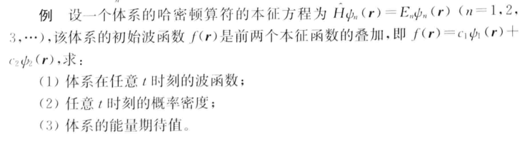

# Summary

## 1 波粒二象性：量子力学的基础

### 波粒二象性

一切物质同时具有波的特质（频率、波长、叠加原理->干涉衍射）和粒子的特质（动量、能量、动量守恒->碰撞）。

### 实验表征

- 波动派典型

光的粒子性：**光电效应、普朗克散射**

光的波动性：光的干涉与衍射

- 粒子派典型

电子的粒子性：碰撞动量守恒

电子的波动性：**电子干涉实验**

- 波的粒子性

波的波动性：显然

波的粒子性：能量量子化

- 粒子的波动性

粒子的粒子性：显然

粒子的波动性：德布罗意波

### 公式表示

$$
E=hv,\vec{p}=\hbar\vec{R}=\frac n\lambda\vec{e}_p
$$

> 波动性和粒子性不能同时被测量

## 2 波函数：如何确定一个粒子的特性

### 形式性质

- 归一化：

$$
\int_{-\infty}^{\infty}|\bar{\Psi}(x,t)|^{2}dx=1
$$

### 概率

- 概率密度

- 概率流密度

### 力学量平均值

### 波函数性质

- 有限性

- 连续性

- 单值性

### 一般自由粒子的波函数

## 3 薛定谔方程 一维定态问题

### 自由粒子

### 有限深方势阱

### 无限深方势阱

### Delta函数势

### 组合势

## 4 数学工具 理论基础

### 左矢、右矢 Hilbert空间

### 线性算符

### 测量与可观测量

### 表象和表象变换

### 定态 时间演化

## 5 守恒量和对称性

## 6 三大基本应用

### 一维谐振子

### 角动量

### 自旋

## 7 中心力场

## 8 带电粒子在电磁场中的运动——量子力学解

## 9 全同粒子

## 10 微扰

### 不含时微扰

#### 非简并微扰

#### 简并微扰

### 含时微扰

## 11 变分法

## 12 散射问题

## 13 绝热近似

## 14 海森堡表象与相互作用表象