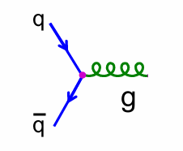
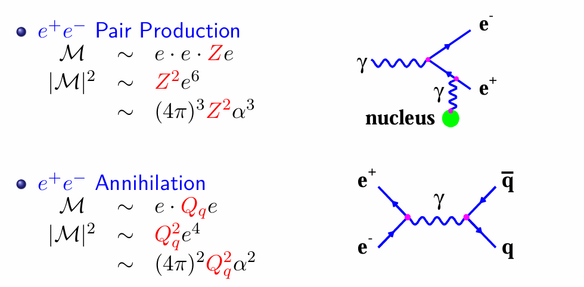
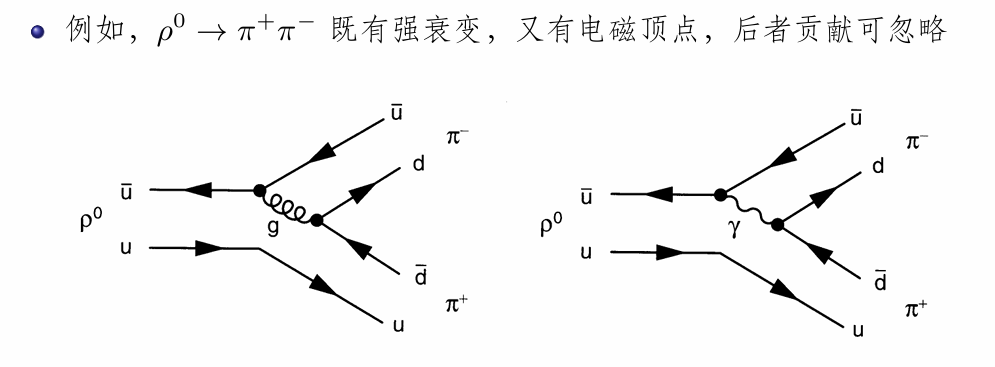

# 粒子物理

## 1 课程目的

1. 常见粒子基本性质

2. 对称性与守恒定律

3. 简单计算

    相对论性运动学、粒子的衰变率（不算）、反应截面（不算）

4. 相互作用机制，很多重要结论

    规范理论、自发的对称性破缺、Higgs机制

## 2 粒子物理概述

1. 研究什么

    物质基本组分的性质及其相互作用

    研究物质、能量、空间、时间

## Lecture 01 粒子物理发展史（1）

1. 粒子

2. 场：由麦克斯韦方程组导出真空电磁波

3. 天然放射性

    X射线、α射线、β射线、γ射线

4. 电子的发现（$e^-$）

    阴极射线在磁场中偏转、测量核质比

5. 光子的发现（$\gamma$）

6. 波粒二象性

7. 原子结构模型

    - 汤姆逊原子模型

    - 行星模型

    - 玻尔模型

    - 电子云模型

8. 散射实验（碰撞试验）

    - 非弹性散射

        （1）粒子数目发生变化

        （2）粒子类型变化

    - 弹性散射：数目类型都不变

    - 散射实验观测量

        （1）形状因子（固体物理）

        （2）散射粒子能谱和微分散射截面（能量分布、角分布）

9. 细致平衡

    - 原子激发

    - 原子退激

    - 细致平衡原理

        正方向能进行，反方向也能进行

10. **费曼图**

    - 横轴代表时间，纵轴代表空间
    
    - 电子用带箭头实线表示，光子用波浪线表示

    - 线连接点表示相互作用点，称为顶点

        （1）顶点处能量、动量、电荷守恒

        （2）相互作用强度称为 **耦合常数**，也就是相互作用的 **荷**，电磁作用的荷是：电荷e

        （3）相互作用过程发生概率正比于顶点数，每个电磁顶点贡献：$\alpha$（精细结构常数）

    - 线条某一端自由的线称为外线

11. 自旋

12. 质子的发现（p）

13. 中子的发现（n）

14. 核子

15. 核力和强相互作用

    作用强，距离短，认为是强相互作用的剩余力

16. 电子与核的散射 电磁形状因子 电荷密度分布

17. 负能量、反粒子

    相对论中，一定动量的粒子可以有正负两个能量值

    所有基本粒子都有反粒子。基本粒子：费米子+玻色子

18. 交叉对称原理 电磁作用8个基本顶点

    

19. 最低阶电磁作用过程

    

    - 内线:线条的两端都是相互作用顶点。内线代表了中间反映过程，称为传播子/媒介子

    - 电磁相互作用费曼图

        类似树一样的图，称为树图

20. 物质的基本组分 - 量子场

## Lecture 02 粒子物理发展历史

A brief history of particle physics

1. β衰变

    - 衰变方程

    - 电子能量确定

    - 电子能谱连续

    - 实验：衰变过程能量不守恒（为中微子提出奠定基础）

2. 中微子

    - β衰变方程（真实）

    - 中微子特征：不带电，比电子重

    - 中微子发现/探测

        

3. 弱相互作用

    - β衰变过程是由于新的相互作用引起

    - 弱相互作用特征：

        （1）相互作用比电磁作用弱，比万有引力强

        （2）力程极短

        （3）不能把参与作用的粒子束缚在一起，只存在于粒子发生衰变的瞬间

4. 介子场理论

    - 类比：电磁力是带电粒子之间通过 光子 媒介子传递的相互作用

    - 核力是核子之间通过 $\pai$ 介子 传递的相互作用

    - $\pai$ 介子的性质：质量介乎电子和质量之间，可以带电，也可以不带电。由于在 pp, pn, nn 之间传递核力，分为： $\pai^+, \pai^-, \pai^0$

5. $\pai$ 介子的发现

    - $\miu$ 子的发现

    - $\pai$ 子衰变为 $\miu$ 子

    - $\pai$ 子质量约电子的273倍，$\miu$ 子质量约电子207倍

6. 宇宙线

    - 定义：由外空间射向地球的能使气体电离的射线

    - 分类：原初宇宙线、次级宇宙线

7. 同位旋

    

8. 四种相互作用

    

9. 粒子分类：按照粒子参与的相互作用

    

10. 守恒定律

    

11. 奇异粒子

    - 性质：

        （1）通过强作用协同产生（加速器实验）

        （2）通过弱作用衰变

    - 分类

        （1）重介子（奇异介子）：比 $\pai$ 介子更重的介子

        （2）超子：比核子更重的重子

        

    - 奇异数

        

        > 反粒子有些是 + 变 -，有些是加一横杠。前者很少比较特殊，需要知道。不要混淆（考）

    - 奇异粒子的同位旋

        

    - 量子数经验关系，超荷

        

12. 粒子加速器和探测器

    - 现代粒子物理实验三要素：粒子源、粒子探测器、数据处理

    - 粒子源

        （1）宇宙射线：低流强，能量范围大，但有能量极高的粒子

        （2）粒子加速器：高流强，能量限制

        1. 回旋、直线、同步辐射...

        2. 电子、质子、离子

        3. 对撞机：正负电子、电子质子、质子反质子、电子离子

13. 共振态

    - $\delta$ 同位旋四重态

    - 产生实验和形成实验

14. 总结：各种“基本粒子”的发现时间轴

    

15. 总结分类：强子谱（强子 = 重子+介子）

    

    

16. 八重法和强子超多重态

    

    > 考试

17. 夸克模型

    

    强子的组成：

    

18. 味、色、色量子数、胶子、色荷

    

19. 用夸克理论解释散射现象、散射过程的相互作用机制

    

20. 强子的结构

    - 强子内含有点状物

    - 强子内从来没有独立的夸克

        高能电子轰击质子：喷注（jet）

21. 第二类中微子 $v_\miu$

    

    > 解释：第一类和第二类中微子的不同（重点在于轻子数守恒）

22. 三代轻子 - $\tao$ 轻子

    - 性质：质量很大，质子的两倍

    - 存在与之对应的中微子

    - 六种轻子总结：

        

23. 第四种夸克、三代夸克

    六种夸克总结：

    

24. 弱作用媒介子

    - 媒介子

        电磁作用媒介子：光子

        强作用媒介子：胶子

        弱作用媒介子：带电的中间矢量玻色子。传递带电弱作用的媒介子称为 $W^+ , W^-$

25. 电弱统一理论

    电中性的矢量玻色子 $Z$

26. Higgs 玻色子

    Higgs 机制：规范玻色子和基本费米子的质量源自于 Higgs 玻色子和这些粒子的相互作用。

27. 标准模型

    

        
<strong>总结：基本粒子</strong>

        
[基本粒子](https://zhuanlan.zhihu.com/p/150411702)

    

## Lecture 03 费曼图进阶

1. 基本组分

    - 自旋 1/2 的点状费米子

        

    - 正、反费米子，各3代12种味道

        

        

2. 相互作用

    

3. 强子

    

4. 相互作用基本顶点

    - 规范玻色子与费米子的耦合过程：SM相互作用基本顶点（三大类，4小类）

        

        味道不变：指反映前后粒子的种类不变。

        区分：味道/颜色

    - 电磁作用过程（QED）

        1. 参与粒子：夸克 q 与 带电轻子 l

        2. 电磁作用过程基本费曼图：

            

            共有8种基本顶点（非物理），顶点处带电粒子味道不变

        3. 领头阶物理过程：

            

        4. 高阶电磁作用过程：

            箱图与圈图

            

        5. 四种产生光子的湮灭过程：

            $H \to \gamma+\gamma$

            $D^0 \to \gamma+\gamma$

            $u+\bar{u}\to\gamma+\gamma$

            $\pi^0\to\gamma+\gamma$

            问题1：画出费曼图

            问题2：它们的区别

    - 强作用过程（QCD）

        1. 参与粒子：夸克 q

        2. 基本费曼图：

            

            由于每种夸克3种颜色，一共有8种基本顶点/8种胶子（非物理）。顶点处夸克味道不变。

            > 哪种味道不行？

        3. 关于胶子

            - 电荷只有一种，但是因为夸克有3种颜色。故胶子有8种，且是双色的。反应前后夸克颜色可变可不变。

            - 胶子耦合

                （1）存在/只存在3、4胶子顶点

                

                （2）考虑 q $\bar{q}$ 强作用湮灭：

                
                
                q 和 $\bar{q}$ 不能自同一个色单态强子，否则顶点处色荷不守恒

    - 弱作用过程

        1. 参与粒子：所有夸克 q 和 轻子 l,v。弱作用分为中性和带电

        2. 中性弱作用

            

            （1）通过中性玻色子Z传递

            （2）顶点处费米子味道不变

            （3）基本顶点可以是物理的

            

            （4）2个及以上的中性弱作用基本顶点可以构成通过Z传递的物理过程

            $\nu_\mu p\to\nu_\mu p$ ：

            

            （5）如果相互作用可以通过 $\gamma$ 传递，则也可以通过Z传递（相反则错误）

            

        3. 带电弱作用

            

            （1）通过带电玻色子 $W^+,W^-$ 传递

            （2）顶点处费米子味道一定改变（唯一味道改变的）

            （3）基本顶点可以是物理的

            

            （4）特殊：

            

            （5）特殊：

            

        4. Cabibbo 系数

            

5. 耦合常数、反应概率

    - 耦合常数

        三种相互作用，三个耦合常数

    - 反应概率

        对于一个反应过程，一个顶点贡献一个耦合常数因子。特殊：弱相互作用要乘Cabibbo系数

        $g$ 和 $\alpha^2$相对

        

    - 以电磁相互作用为例

        

        

        

6. 衰变 粒子寿命

    - 粒子寿命图

        

    - 衰变动力学

        （1）粒子衰变概率 = 衰变过程基本作用反应概率

        （2）粒子衰变快慢 = 原始粒子与衰变产物的质量差。质量差越大，衰变越快，粒子寿命越短

        （3）如果存在不同的基本作用过程：按照 强作用 - 电磁作用 - 弱作用 进行主导性排序

        

## Lecture 04 自然单位制

## Lecture 05 相对论

1. 洛伦兹变换

    - 时空描述

        

    - 时空不变性

        

    - 洛伦兹变换

        

    - 自然单位制 矩阵形式

        

    - 洛伦兹逆变换

        

2. 四矢量（一般形式理论）

    - 逆变四矢量

    - 协变四矢量

    - 宇称变换

    - 标量积守恒量

    - 洛伦兹矢量

        

    - 洛伦兹标量

        

    - 四维动量

    - 根据标量乘积：类时、类空、类光矢量

    - 质量不变量

    - Mandelstam Variables

    - 粒子对撞

## Lecture 06 量子力学

## Lecture 07 粒子性质

1. 量子数总论

    

2. 量子数具体1：Mass

    - 相对论中的质量

        $$m^2=E^2-p^2$$

    - 量子力学中的质量

        $$i\hbar\frac\partial{\partial t}\psi(\mathbf{x},t)=\Big(-\frac{\hbar^2}{2m}\nabla^2+V(\mathbf{x})\Big)\psi(\mathbf{x},t)$$

    - 相对性Dirac方程中的质量

        $$(-i\gamma^\mu\partial_\mu+m)\psi(x)=0$$

    - 标准模型中的质量：Higgs场中的耦合

        $$G_\psi\overline{\psi}\psi H$$

    - 稳定粒子质量与不稳定粒子质量的表示

        

2. 量子数具体2：Spin

    - 粒子自旋态与粒子态的描述

        

        （J = L + S）

3. 交换算符与全同粒子

    - 交换算符与费米子、玻色子（单粒子态）

        

    - 全同粒子的交换算符（双粒子态）

        

        

4. 其他量子数

    - 螺旋度：Helicity

        

    - 电荷：Electric Charge

    - 同位旋：Isospin

        同位旋计算题：

        

    - 夸克味道：quark flavors

    - 奇偶性：parity inversion

## Lecture 08 对称性

1. classificatuion of symmetries

    

    变换与量子数

    

2. 对称性与守恒定律

    - 连续变换
    
        对称性 -> 对称算符的生成源算符有守恒性

    - 分立变换

        对称算符自身是守恒量

    > 可以证明。关键：厄米算符

## Lecture 09 群论基础

1. 群的基本性质

    - 封闭性

    - 单位元素

    - 逆元素

    - $a(bc) = (ab)c$

2. U(n)群和SU(n)群

    - 定义与性质

    - 应用

        

3. 群的矩阵表示

    - trivial rep and fundamental rep

    - SU(2)

    - SU(3)

## Lecture 10 夸克模型

1. 双味道模型：只考虑 u,d 夸克

    - 对称性

    - 自旋三重态

    - 重子

2. 三味道模型：只考虑 u,d 夸克

    - 8重态

    - 重子

    - 波函数

3. u,d夸克介子

4. 考虑 u,d,s 夸克模型

    - 矩阵表示

    - 介子构造

    - 重子构造

## 问题

1. 任何粒子都有反粒子吗？任何方程式都能细致平衡吗？

2. 四种相互作用的强度量级是怎么求出来的

    两个基本粒子相距 1 fm 时的相对强度

3. 八重法和强子超多重态

4. 电子、轻子也有味道？

5. 粒子、对应反粒子是属于同种味道吗？

    

    这个搞懂

6. 什么时候物理，什么时候非物理

7. 衰变速率/例子寿命图的解释：质量差越大，衰变越快的理论失效？

8. 是否有所有重子的衰变费曼图、寿命表，进行学习